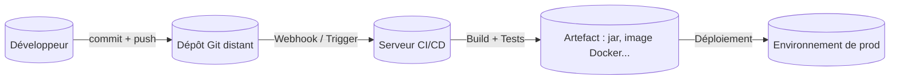
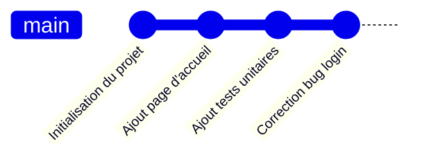
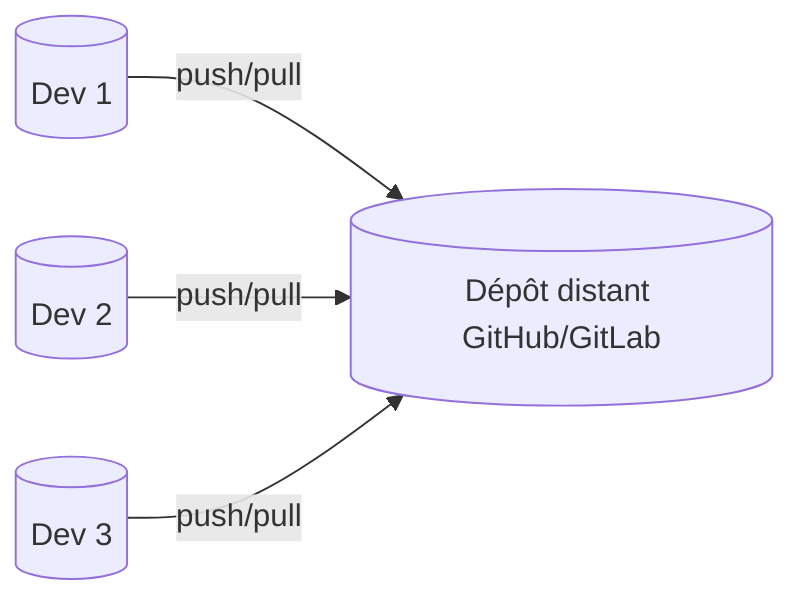
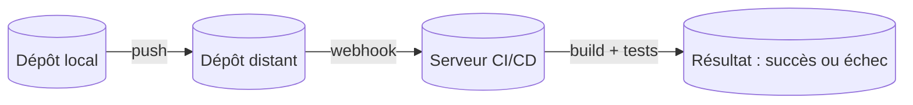
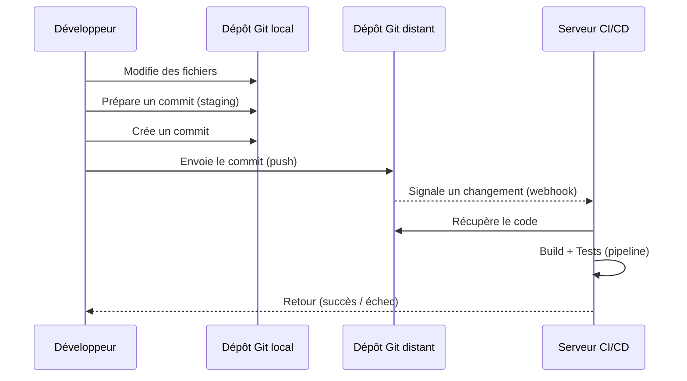

# Introduction à Git (pour DevOps & CI/CD)

---

## 0. Objectifs du chapitre

À la fin de ce chapitre, tu dois être capable de :

* Dire simplement **ce qu’est Git** et à quoi ça sert.
* Expliquer la différence entre :

  * **dépôt local** (sur ton PC)
  * et **dépôt distant** (GitHub, GitLab, etc.).
* Expliquer ce qu’est :

  * un **commit**
  * l’**historique**.
* Comprendre le lien entre **Git** et un **pipeline CI/CD** (Jenkins, GitHub Actions, GitLab CI, etc.).
* Savoir qu’il existe des commandes Git (qu’on verra **en pratique plus tard**) → elles sont en **annexe**.

---

## 1. C’est quoi Git, en vrai ?

Git est un **logiciel qui garde l’historique d’un projet** (souvent du code, mais pas seulement).

Sans Git :

* On finit avec des dossiers du genre :
  `projet_final_v2_bis_version_OK_definitive3/`
* On ne sait plus :

  * quelle version marche,
  * qui a fait quoi,
  * quand un bug est apparu.

Avec Git :

* Le projet est dans un **dépôt (repository)**.
* Chaque changement important est enregistré dans un **commit**.
* On peut :

  * revenir en arrière,
  * voir l’historique,
  * travailler à plusieurs sans tout casser.

---

## 2. Git et DevOps / CI/CD : le lien important

En DevOps / CI/CD, Git est le **point de départ** :

* Tu modifies du code.
* Tu enregistres ton travail dans Git (**commit**).
* Tu envoies ce travail sur un serveur Git (**push**).
* À partir de là, un **pipeline CI/CD** peut se déclencher automatiquement.

Schéma (simplifié) :



> Idée clé : **sans Git, pas de CI/CD moderne.**

---

## 3. Trois mots à retenir : dépôt, commit, historique

### 3.1 Dépôt (repository)

Un **dépôt Git** c’est un dossier de projet + une partie cachée `.git` où Git stocke tout l’historique.

On a deux types de dépôts :

* **Dépôt local** : sur ta machine (ton “laboratoire”).
* **Dépôt distant** : sur un serveur (GitHub, GitLab, Azure DevOps, etc.) → le point de vérité partagé.

### 3.2 Commit

Un **commit**, c’est comme un **checkpoint** dans un jeu vidéo :

* Tu prends une “photo” de ton projet à un instant T.
* Tu lui donnes un message (ex : `Ajoute page de login`).
* Git lui donne un identifiant unique (un hash).

### 3.3 Historique

L’**historique** est la liste de tous les commits, dans l’ordre où ils ont été créés.

On peut le voir comme une ligne du temps :



En CI/CD, cet historique permet de dire :

* “La release 1.2.0 correspond au commit X.”
* “C’est entre tel et tel commit que le bug est apparu.”

---

## 4. Dépôt local : ce que tu as sur ton poste

Imagine ton dépôt local comme ceci :

```mermaid
flowchart LR
    WD[Working Directory<br>(fichiers sur ton disque)] 
      --> IDX[Index / Staging<br>(zone de préparation)]
      --> HIST[Historique Git<br>(commits dans .git)]
```

* **Working Directory** : les fichiers que tu vois dans VS Code / IntelliJ / autre.
* **Index (staging)** : ce que tu prépares pour ton prochain commit.
* **Historique** : les commits déjà enregistrés.

Flux logique :

1. Tu modifies des fichiers → Working Directory.
2. Tu sélectionnes ce que tu veux enregistrer → Index.
3. Tu crées un commit → Historique.

On détaillera les commandes plus tard (annexe).

---

## 5. Dépôt distant : GitHub, GitLab, etc.

### 5.1 Pourquoi un dépôt distant ?

Le dépôt distant sert à :

* **Partager** le code avec l’équipe.
* **Centraliser** la version “officielle” du projet.
* Servir de **point de départ** au serveur CI/CD.

Schéma :



### 5.2 Lien avec la CI/CD

Quand tu envoies tes commits sur le dépôt distant, on peut configurer :

* Jenkins, GitHub Actions, GitLab CI, etc. pour réagir automatiquement aux changements.



> Résumé :
>
> * **Local** = tu travailles.
> * **Distant** = on collabore + on déclenche la CI/CD.

---

## 6. Le cycle Git dans un projet DevOps

Voici un scénario typique dans un projet DevOps / CI/CD :



En mots simples :

1. Tu changes du code sur ton PC.
2. Tu crées un **commit**.
3. Tu envoies ton travail sur le dépôt distant.
4. Le serveur CI/CD voit qu’il y a du nouveau code.
5. Il construit, teste, et parfois déploie l’application.
6. Tu reçois le résultat (pipeline vert ou rouge).

---

## 7. Pourquoi Git est si important pour CI/CD ?

Avec 30 ans d’expérience derrière, je peux te dire ceci :

* Un pipeline CI/CD **sans Git maîtrisé**, c’est comme une autoroute sans marquage : ça roule vite… jusqu’au jour où ça se plante.

Git apporte :

1. **Traçabilité**

   * Qui a fait quoi ?
   * Quand ?
   * Pourquoi (message de commit) ?

2. **Reproductibilité**

   * Déployer “la version de mardi 14h” = déployer un commit précis.

3. **Collaboration structurée**

   * Branches pour les features, les correctifs, les releases.
   * Revue de code avant de fusionner.

4. **Intégration directe avec la CI/CD**

   * Triggers sur push, pull request, tags.
   * Historique et tags utilisés pour nommer les versions et les artefacts.

---

## 8. Bonnes pratiques Git (spécial CI/CD)

Quelques règles simples qui font une énorme différence :

### 8.1 Commits petits et clairs

* Un commit = un changement logique.
* Message clair, par exemple :

  * `Ajoute tests unitaires sur service utilisateur`
  * `Corrige bug de validation email (#42)`
  * `Ajoute pipeline GitHub Actions pour build`

Évite les commits du style : `update`, `test`, `fix`, `truc`.

### 8.2 Ne pas tout envoyer dans Git

* On **ne met pas** dans Git :

  * les fichiers générés (build, logs, etc.),
  * les secrets (mots de passe, clés API).
* On utilise un fichier `.gitignore` (on verra plus tard).

### 8.3 Intégration fréquente

* On évite de garder une branche en local pendant 3 semaines sans pousser.
* On pousse régulièrement vers le dépôt distant :

  * ça alimente la CI,
  * ça permet à l’équipe de voir l’avancement.

---

## 9. Résumé simple

* **Git** : outil qui garde l’historique de ton projet.
* **Dépôt local** : là où tu travailles, sur ton poste.
* **Dépôt distant** : là où l’équipe se synchronise (GitHub, GitLab…).
* **Commit** : un “checkpoint” de ton travail avec un message.
* **Historique** : tous les commits dans l’ordre.

Et pour DevOps / CI/CD :

* Chaque **push** sur le dépôt distant peut déclencher un **pipeline**.
* Le pipeline :

  * construit,
  * teste,
  * parfois déploie,
  * et s’appuie toujours sur un **commit Git** précis.

---

## ANNEXE – Commandes de base (aperçu, pour plus tard)

> **Important :** tu n’es pas obligé de tout retenir maintenant.
> On les utilisera en labo. Ici c’est juste pour que tu voies *à quoi ça ressemble*.

### A.1 Configuration initiale

```bash
git config --global user.name "Ton Nom"
git config --global user.email "ton.email@example.com"
git config --global init.defaultBranch main
```

### A.2 Créer un dépôt local

```bash
mkdir mon-projet
cd mon-projet
git init
```

### A.3 Cycle de base

```bash
git status          # voir l'état du dépôt
git add fichier     # préparer un fichier pour le prochain commit
git commit -m "Message clair"   # créer un commit
```

### A.4 Lier à un dépôt distant

```bash
git remote add origin https://github.com/ton-compte/mon-projet.git
git push -u origin main
```

### A.5 Récupérer un projet existant

```bash
git clone https://github.com/ton-compte/mon-projet.git
```


