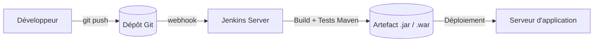

# 1. C’est quoi Jenkins ?

Jenkins est un **serveur d’intégration continue (CI)** et de **déploiement continu (CD)**.  
Il permet d’automatiser les tâches suivantes :

- Compilation du code (ex. Maven, Gradle).
- Exécution des tests (unitaires, d’intégration).
- Génération d’artefacts (JAR, WAR, Docker image…).
- Déploiement automatique (serveur de test, prod, etc.).
- Planification de jobs (builds planifiés, jobs déclenchés par un push Git, etc.).

En résumé : **au lieu de lancer les commandes à la main**, on les confie à Jenkins qui les exécute à chaque changement de code.





Le schéma suivant montre le rôle de Jenkins dans une chaîne CI/CD très simple :


# 2. Architecture très simple

- **Jenkins Server (Master/Controller)**  
  Machine où Jenkins tourne (Windows, Linux, VM, Docker…).  
- **Agents (slaves)** – optionnel au début  
  Machines sur lesquelles Jenkins exécute les builds si on veut répartir la charge.

Pour ce cours, on commence avec **un seul serveur Jenkins tout-en-un**.


```mermaid
graph TB
    Dev[Développeur] --> Repo[(Dépôt Git)]

    Repo --> J[Jenkins Controller   (Serveur Jenkins)]

    subgraph Agents_de_build
        A1[Agent Linux]
        A2[Agent Windows]
    end

    J --> A1
    J --> A2

```

Idée : un serveur Jenkins + plusieurs agents possibles


# 3. Installation de Jenkins sur Windows

## 3.1. Prérequis

- Java (JDK ou JRE) installé (Jenkins LTS supporte généralement Java 11 ou 17).
- Accès administrateur sur la machine Windows.

## 3.2. Étapes d’installation

1. Aller sur le site officiel Jenkins → section **LTS**.  
2. Télécharger l’installateur **Windows (.msi)**.
3. Lancer le `.msi` et suivre l’assistant :
   - Accepter la licence.
   - Laisser le port par défaut `8080` (ou le modifier si déjà utilisé).
   - Laisser Jenkins comme **service Windows**.
4. À la fin, l’installateur ouvre normalement le navigateur sur :


[http://localhost:8080](http://localhost:8080)


5. Récupérer le mot de passe initial :
- Aller dans le fichier :
  `C:\Program Files\Jenkins\secrets\initialAdminPassword`
- Copier le mot de passe et le coller dans l’interface web.
6. Créer un **compte administrateur Jenkins**.
7. Choisir **“Install suggested plugins”** (plugins recommandés) pour un premier essai.

Jenkins est maintenant installé comme **service Windows** et démarre automatiquement avec la machine.


# 4. Installation de Jenkins sur Linux (Ubuntu/Debian)

## 4.1. Prérequis

- Une machine Ubuntu/Debian avec accès `sudo`.
- Java (JDK 11 ou 17) installé.

Exemple pour installer OpenJDK 17 :

```bash
sudo apt update
sudo apt install -y fontconfig openjdk-17-jre
java -version
````

## 4.2. Installation via dépôt officiel Jenkins (recommandé)

1. Ajouter la clé et le dépôt Jenkins :

```bash
curl -fsSL https://pkg.jenkins.io/debian-stable/jenkins.io-2023.key | sudo tee \
  /usr/share/keyrings/jenkins-keyring.asc > /dev/null

echo deb [signed-by=/usr/share/keyrings/jenkins-keyring.asc] \
  https://pkg.jenkins.io/debian-stable binary/ | sudo tee \
  /etc/apt/sources.list.d/jenkins.list > /dev/null
```

2. Installer Jenkins :

```bash
sudo apt update
sudo apt install -y jenkins
```

3. Démarrer et activer Jenkins au boot :

```bash
sudo systemctl start jenkins
sudo systemctl status jenkins   # vérifier que le service est "active (running)"
sudo systemctl enable jenkins   # démarrage automatique
```

4. Accéder à Jenkins dans le navigateur :

```text
http://<adresse-de-la-machine>:8080
```

5. Récupérer le mot de passe initial :

```bash
sudo cat /var/lib/jenkins/secrets/initialAdminPassword
```

6. Copier ce mot de passe dans l’interface web, créer l’admin, installer les plugins suggérés.


# 5. Installation de Jenkins dans une machine virtuelle (VM)

Ici, l’idée est **pédagogique** :
on garde sa machine principale propre et on installe Jenkins dans un environnement isolé.

## 5.1. Principe

1. Installer un hyperviseur sur votre machine :

   * **VirtualBox** (gratuit) ou VMware.
2. Créer une **VM Linux** (Ubuntu Server recommandé).
3. Installer Jenkins dans cette VM avec la procédure Linux ci-dessus.

## 5.2. Étapes détaillées (exemple VirtualBox + Ubuntu)

1. Télécharger **VirtualBox** et l’installer sur votre OS.
2. Télécharger l’ISO de **Ubuntu Server** (ou Desktop).
3. Créer une nouvelle VM :

   * Type : Linux, Ubuntu (64-bit)
   * RAM : ex. 2 Go
   * Disque : ex. 20 Go
4. Démarrer la VM avec l’ISO et installer Ubuntu.
5. Une fois Ubuntu installé, se connecter en SSH ou dans la console et suivre les étapes de la section **4. Installation sur Linux**.
6. Configurer le réseau de la VM :

   * Mode **Bridge** (pour que la VM soit sur le même réseau que la machine hôte) ou
   * Mode **NAT + port forwarding** (rediriger le port 8080 de l’hôte vers la VM).
7. Accéder à Jenkins depuis la machine hôte :

   ```text
   http://<ip-de-la-vm>:8080
   ```

## 5.3. Avantages pédagogiques de la VM

* On peut **casser** la configuration sans toucher à la machine principale.
* Facile à **sauvegarder** (snapshot) et **revenir en arrière**.
* On reproduit une situation proche d’un **serveur réel** en entreprise.


# 6. Résumé des 3 méthodes

| Méthode             | OS hôte   | Difficulté | Cas d’usage                                     |
| ------------------- | --------- | ---------: | ----------------------------------------------- |
| Installateur MSI    | Windows   |     Facile | Démo rapide, poste personnel, lab simple        |
| Paquet Debian/apt   | Linux     |      Moyen | Serveur Jenkins “sérieux” (prod/test)           |
| Jenkins dans une VM | Linux/Win |     Moyen+ | Cours, TP, environnement isolé et reproductible |


## Choix entre les 3 méthodes d’installation

Le diagramme suivant résume les 3 scénarios classiques d’installation de Jenkins que nous utilisons dans ce cours :

```mermaid
flowchart TD
    Start([Installer Jenkins]) --> OS{Système d'exploitation / Contexte ?}

    OS -->|Poste perso Windows| Win[Installateur Jenkins .msi<br/>Service Windows]
    OS -->|Serveur Linux| Lin[Installation via dépôt apt<br/>jenkins.io (Debian/Ubuntu)]
    OS -->|Environnement pédagogique| VM[Créer une VM Linux<br/>puis installer Jenkins]

    VM --> Lin
```


