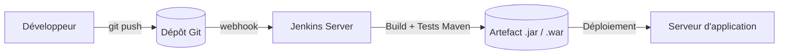
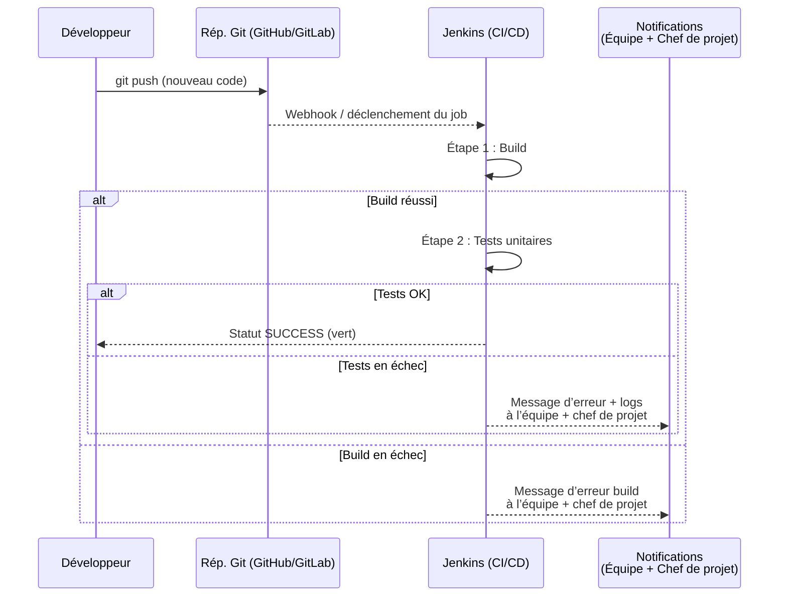
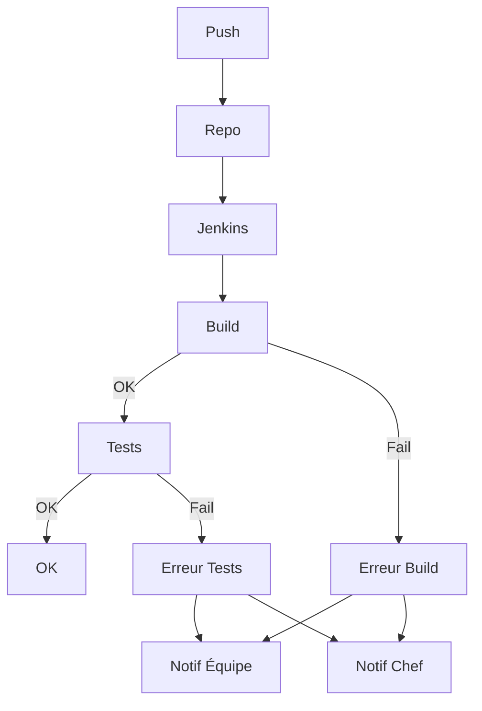
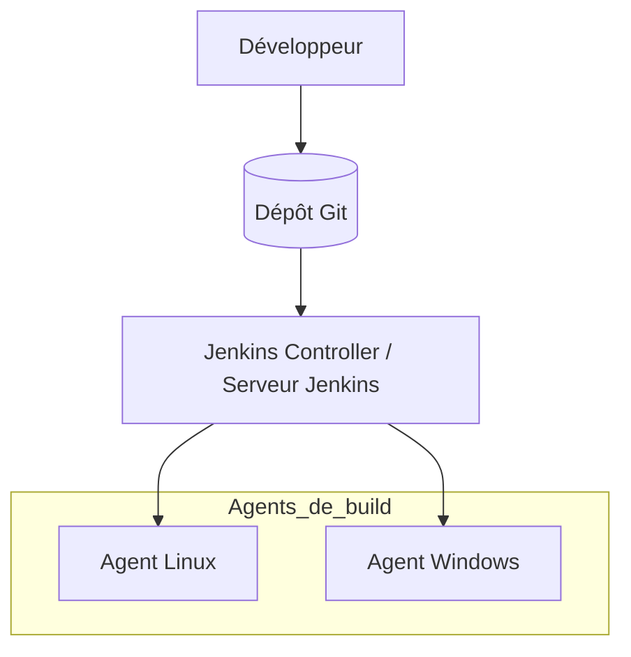

# 1. C’est quoi Jenkins ?

Jenkins est un **serveur d’intégration continue (CI)** et de **déploiement continu (CD)**.  
Il permet d’automatiser les tâches suivantes :

- Compilation du code (ex. Maven, Gradle).
- Exécution des tests (unitaires, d’intégration).
- Génération d’artefacts (JAR, WAR, Docker image…).
- Déploiement automatique (serveur de test, prod, etc.).
- Planification de jobs (builds planifiés, jobs déclenchés par un push Git, etc.).

En résumé : **au lieu de lancer les commandes à la main**, on les confie à Jenkins qui les exécute à chaque changement de code.





Le schéma suivant montre le rôle de Jenkins dans une chaîne CI/CD très simple :





## Scénario :




# 2. Architecture très simple

- **Jenkins Server (Master/Controller)**  
  Machine où Jenkins tourne (Windows, Linux, VM, Docker…).  
- **Agents (slaves)** – optionnel au début  
  Machines sur lesquelles Jenkins exécute les builds si on veut répartir la charge.

Pour ce cours, on commence avec **un seul serveur Jenkins tout-en-un**.




Idée : un serveur Jenkins + plusieurs agents possibles


1. Le développeur envoie son code vers un dépôt Git, qui sert de point central pour le projet.
2. Dès qu’un changement est poussé dans le dépôt, Jenkins Controller (le serveur Jenkins) peut être déclenché.
3. Jenkins Controller ne fait pas forcément les builds lui-même : il orchestre et pilote les agents de build.
4. Les agents (par exemple un agent Linux et un agent Windows) sont des machines sur lesquelles le code est réellement compilé et testé.
5. Cette architecture permet de répartir la charge, de tester sur plusieurs environnements et de garder un Jenkins Controller léger et dédié à la coordination.


# 3. Installation de Jenkins sur Windows

## 3.1. Prérequis

- Java (JDK ou JRE) installé (Jenkins LTS supporte généralement Java 11 ou 17).
- Accès administrateur sur la machine Windows.

## 3.2. Étapes d’installation

1. Aller sur le site officiel Jenkins → section **LTS**.  
2. Télécharger l’installateur **Windows (.msi)**.
3. Lancer le `.msi` et suivre l’assistant :
   - Accepter la licence.
   - Laisser le port par défaut `8080` (ou le modifier si déjà utilisé).
   - Laisser Jenkins comme **service Windows**.
4. À la fin, l’installateur ouvre normalement le navigateur sur :


[http://localhost:8080](http://localhost:8080)


5. Récupérer le mot de passe initial :
- Aller dans le fichier :
  `C:\Program Files\Jenkins\secrets\initialAdminPassword`
- Copier le mot de passe et le coller dans l’interface web.
6. Créer un **compte administrateur Jenkins**.
7. Choisir **“Install suggested plugins”** (plugins recommandés) pour un premier essai.

Jenkins est maintenant installé comme **service Windows** et démarre automatiquement avec la machine.


# 4. Installation de Jenkins sur Linux (Ubuntu/Debian)

## 4.1. Prérequis

- Une machine Ubuntu/Debian avec accès `sudo`.
- Java (JDK 11 ou 17) installé.

Exemple pour installer OpenJDK 17 :

```bash
sudo apt update
sudo apt install -y fontconfig openjdk-17-jre
java -version
````

## 4.2. Installation via dépôt officiel Jenkins (recommandé)

1. Ajouter la clé et le dépôt Jenkins :

```bash
curl -fsSL https://pkg.jenkins.io/debian-stable/jenkins.io-2023.key | sudo tee \
  /usr/share/keyrings/jenkins-keyring.asc > /dev/null

echo deb [signed-by=/usr/share/keyrings/jenkins-keyring.asc] \
  https://pkg.jenkins.io/debian-stable binary/ | sudo tee \
  /etc/apt/sources.list.d/jenkins.list > /dev/null
```

2. Installer Jenkins :

```bash
sudo apt update
sudo apt install -y jenkins
```

3. Démarrer et activer Jenkins au boot :

```bash
sudo systemctl start jenkins
sudo systemctl status jenkins   # vérifier que le service est "active (running)"
sudo systemctl enable jenkins   # démarrage automatique
```

4. Accéder à Jenkins dans le navigateur :

```text
http://<adresse-de-la-machine>:8080
```

5. Récupérer le mot de passe initial :

```bash
sudo cat /var/lib/jenkins/secrets/initialAdminPassword
```

6. Copier ce mot de passe dans l’interface web, créer l’admin, installer les plugins suggérés.


# 5. Installation de Jenkins dans une machine virtuelle (VM)

Ici, l’idée est **pédagogique** :
on garde sa machine principale propre et on installe Jenkins dans un environnement isolé.

## 5.1. Principe

1. Installer un hyperviseur sur votre machine :

   * **VirtualBox** (gratuit) ou VMware.
2. Créer une **VM Linux** (Ubuntu Server recommandé).
3. Installer Jenkins dans cette VM avec la procédure Linux ci-dessus.

## 5.2. Étapes détaillées (exemple VirtualBox + Ubuntu)

1. Télécharger **VirtualBox** et l’installer sur votre OS.
2. Télécharger l’ISO de **Ubuntu Server** (ou Desktop).
3. Créer une nouvelle VM :

   * Type : Linux, Ubuntu (64-bit)
   * RAM : ex. 2 Go
   * Disque : ex. 20 Go
4. Démarrer la VM avec l’ISO et installer Ubuntu.
5. Une fois Ubuntu installé, se connecter en SSH ou dans la console et suivre les étapes de la section **4. Installation sur Linux**.
6. Configurer le réseau de la VM :

   * Mode **Bridge** (pour que la VM soit sur le même réseau que la machine hôte) ou
   * Mode **NAT + port forwarding** (rediriger le port 8080 de l’hôte vers la VM).
7. Accéder à Jenkins depuis la machine hôte :

   ```text
   http://<ip-de-la-vm>:8080
   ```

## 5.3. Avantages pédagogiques de la VM

* On peut **casser** la configuration sans toucher à la machine principale.
* Facile à **sauvegarder** (snapshot) et **revenir en arrière**.
* On reproduit une situation proche d’un **serveur réel** en entreprise.


# 6. Résumé des 3 méthodes

| Méthode             | OS hôte   | Difficulté | Cas d’usage                                     |
| ------------------- | --------- | ---------: | ----------------------------------------------- |
| Installateur MSI    | Windows   |     Facile | Démo rapide, poste personnel, lab simple        |
| Paquet Debian/apt   | Linux     |      Moyen | Serveur Jenkins “sérieux” (prod/test)           |
| Jenkins dans une VM | Linux/Win |     Moyen+ | Cours, TP, environnement isolé et reproductible |


<br/­>

# Annexe 1 - Installation de JAVA sur Ubuntu 24.04


## Annexe 1.1. Mettre le système à jour

```bash
sudo apt update
sudo apt upgrade
```


## Annexe 1.2. Choisir la version de Java

Sur Ubuntu 24.04, les choix classiques sont :

* **OpenJDK 17** → version LTS stable
* **OpenJDK 21** → LTS plus récente, recommandée pour les nouveaux projets

Tu peux installer l’une ou l’autre (ou les deux).

### Option A – Installer OpenJDK 17

```bash
sudo apt install openjdk-17-jdk
```

### Option B – Installer OpenJDK 21

```bash
sudo apt install openjdk-21-jdk
```


## Annexe 1.3. Vérifier l’installation

```bash
java -version
javac -version
```

Tu dois obtenir quelque chose comme :

```text
openjdk version "21.0.x"  ou  "17.0.x"
```


## Annexe 1.4. Choisir la version par défaut (si plusieurs JDK installés)

Si tu as installé plusieurs versions :

```bash
sudo update-alternatives --config java
sudo update-alternatives --config javac
```

Puis sélectionne le numéro de la version que tu veux utiliser par défaut (17 ou 21).


## Annexe 1.5. Configurer la variable d’environnement `JAVA_HOME`

1. Trouver le chemin de Java :

   ```bash
   readlink -f $(which java)
   ```

   Exemple de résultat :

   ```text
   /usr/lib/jvm/java-21-openjdk-amd64/bin/java
   ```

2. Le `JAVA_HOME` correspond au dossier **juste au-dessus de** `bin`, donc ici :

   ```text
   /usr/lib/jvm/java-21-openjdk-amd64
   ```

3. Ajouter `JAVA_HOME` dans ton `~/.bashrc` :

   ```bash
   echo 'export JAVA_HOME=/usr/lib/jvm/java-21-openjdk-amd64' >> ~/.bashrc
   echo 'export PATH=$JAVA_HOME/bin:$PATH' >> ~/.bashrc
   source ~/.bashrc
   ```

4. Vérifier :

   ```bash
   echo $JAVA_HOME
   which java
   java -version
   ```


## Annexe 1.6. (Optionnel) Gérer plusieurs JDK avec SDKMAN!

Si tu joues avec plusieurs versions (11, 17, 21, etc.), **SDKMAN!** est très pratique :

```bash
curl -s "https://get.sdkman.io" | bash
source "$HOME/.sdkman/bin/sdkman-init.sh"
sdk list java          # liste des versions disponibles
sdk install java 21.0.5-tem
sdk default java 21.0.5-tem
```

SDKMAN! s’occupe aussi de `JAVA_HOME`.


<br/­>

# Annexe 2 - Installer Jenkins sur Ubuntu 24.04


## 1. Mettre le système à jour

```bash
sudo apt update && sudo apt upgrade -y
```

(Installe aussi `wget` si besoin 🙂

```bash
sudo apt install wget curl -y
```

([Hostperl][1])


## 2. Ajouter la clé GPG officielle de Jenkins

```bash
sudo wget -O /usr/share/keyrings/jenkins-keyring.asc \
  https://pkg.jenkins.io/debian-stable/jenkins.io-2023.key
```

([RoseHosting][2])


## 3. Ajouter le dépôt Jenkins pour Ubuntu 24.04

```bash
echo "deb [signed-by=/usr/share/keyrings/jenkins-keyring.asc] \
https://pkg.jenkins.io/debian-stable binary/" | sudo tee \
/etc/apt/sources.list.d/jenkins.list > /dev/null
```

Puis mettre à jour la liste des paquets :

```bash
sudo apt update
```

([FOSS TechNix][3])

---

## 4. Installer Jenkins

```bash
sudo apt install jenkins -y
```

([RoseHosting][2])


## 5. Démarrer et activer le service Jenkins

```bash
sudo systemctl start jenkins
sudo systemctl enable jenkins
sudo systemctl status jenkins
```

Le statut doit afficher `active (running)`. ([RoseHosting][2])


## 6. Ouvrir le port 8080 (si tu as un firewall)

Avec **ufw** :

```bash
sudo ufw allow 8080
sudo ufw reload
sudo ufw status
```

([cherryservers.com][4])


## 7. Accéder à l’interface Web Jenkins

Sur ton navigateur :

```text
http://ton-serveur:8080
```

* Si tu es sur la même machine : `http://localhost:8080`

Jenkins demande un **mot de passe initial**.

Récupère-le avec :

```bash
sudo cat /var/lib/jenkins/secrets/initialAdminPassword
```

Copie-colle ce mot de passe dans la page Jenkins. ([RoseHosting][2])


## 8. Premier démarrage (plugins + admin)

Sur l’interface :

1. Choisis **“Install suggested plugins”** (plugins recommandés).
2. Crée ton **utilisateur administrateur** (login / mot de passe).
3. Valide l’URL de Jenkins (en général `http://ton-serveur:8080`).
4. Clique sur **“Start using Jenkins”**.

À partir de là, tu peux créer ton premier **Pipeline déclaratif**, ou un **Freestyle Job**.


- [1]: https://hostperl.com/kb/tutorials/how-to-install-jenkins-on-ubuntu-2404?utm_source=chatgpt.com "How to Install Jenkins on Ubuntu 24.04"
- [2]: https://www.rosehosting.com/blog/how-to-install-jenkins-on-ubuntu-24-04/?srsltid=AfmBOoqp8J_-XqIUdHehml17eUYlG7HOqrrlAVyqxvdOTj_6tJELCc9P&utm_source=chatgpt.com "How to Install Jenkins on Ubuntu 24.04"
- [3]: https://www.fosstechnix.com/how-to-install-jenkins-on-ubuntu-24-04-lts/?utm_source=chatgpt.com "How to Install Jenkins on Ubuntu 24.04 LTS"
- [4]: https://www.cherryservers.com/blog/install-jenkins-ubuntu?utm_source=chatgpt.com "How to Install Jenkins on Ubuntu 24.04: Step-by-Step"


