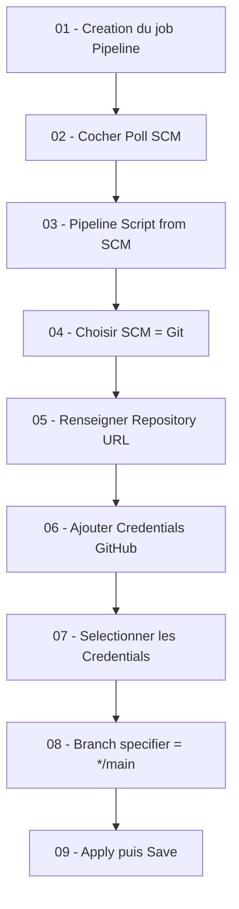
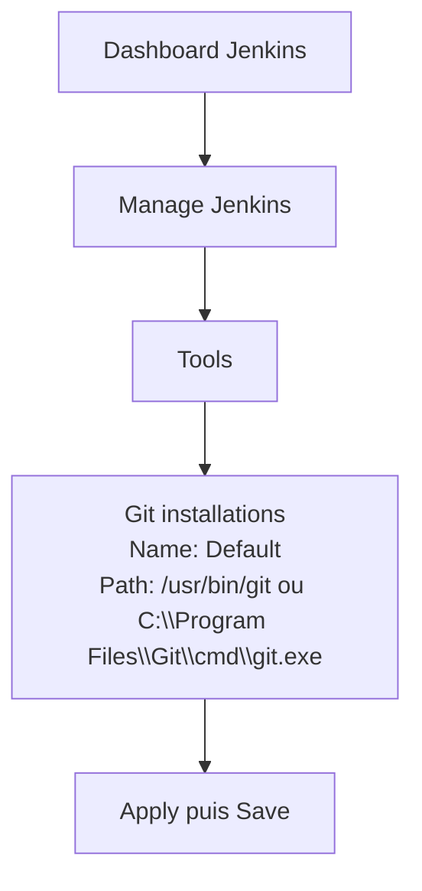
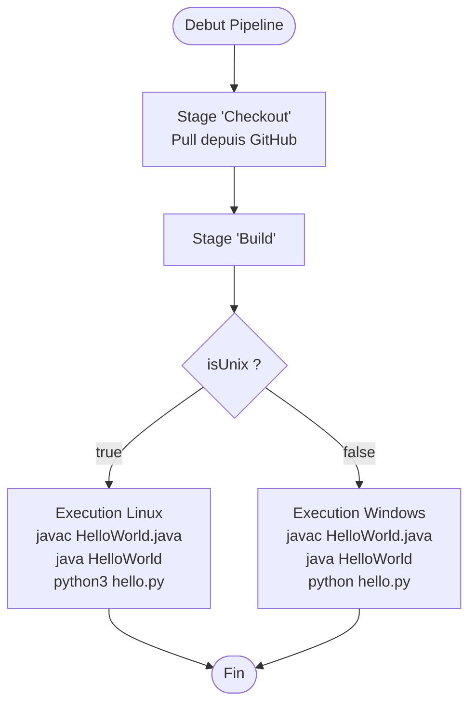

# Dépôt GitHub et Pipeline Jenkins – Vue d’ensemble

La première étape consiste à créer votre dépôt sur GitHub avec les fichiers suivants :
(1) fichier `HelloWorld.java`
(2) `hello.py`
(3) `Jenkinsfile` (sans extension)

Le contenu de ces fichiers se trouve dans l’annexe 1.

Le diagramme suivant illustre la relation entre GitHub, Jenkins et votre pipeline :

```mermaid
flowchart LR
    Dev[Developpeur] --> Repo[Depot GitHub\n(HelloWorld.java, hello.py, Jenkinsfile)]
    Repo --> Jenkins[Jenkins Server]
    Jenkins --> Pipeline[Execution du Jenkinsfile]
    Pipeline --> Resultats[Sorties Java et Python]
```

---

# Étapes de configuration Jenkins

À suivre exactement dans l’ordre.



---

01 - Création de la pipeline : choisir le nom, le type (pipeline), puis cliquer sur OK.
02 - Sélection de **Poll SCM**.
03 - Choisir **Pipeline Script from SCM**.
04 - SCM = **GIT**.
05 - Indiquer l’URL du repository (exemple : `https://github.com/hrhouma/hello-python.git`).
06 (*) - Aller dans **Add → Jenkins → Username with password**
  Login : votre identifiant GitHub
  Password : **votre jeton GitHub**
07 - Sélectionner votre credentials créé (on oublie souvent cette étape).
08 (*) - Dans **Branch Specifier**, remplacer `*/master` par `*/main` si votre branche s’appelle main.
09 - Cliquer sur **Apply**, puis **Save**.

---

# Configuration de Git dans Jenkins



10 (*) - Revenir à Dashboard → Manage Jenkins → Tools → Git installations
  Name : Default
  Path to git executable :
   Linux : `/usr/bin/git`
   Windows : `C:\Program Files\Git\cmd\git.exe`

Commande utile pour trouver Git sous Ubuntu :

```
which git
```

Commande utile sous Windows :

```
for %i in (git.exe) do @echo. %~$PATH:i
```

11 - Cliquer sur Apply, ensuite Save.

12 (*) - Ne pas utiliser Environment variables sous Global properties → System
  (Les variables seront gérées dans le Jenkinsfile).

13 (*) - Consulter l’annexe 1.

---

# Remarque sur Groovy

Dans un Jenkinsfile, on n’utilise **pas** :

```
git clone ...
```

La syntaxe correcte est :

```
git branch: 'main', url: 'https://github.com/hrhouma/hello-python.git'
```

---

# Annexe 1 – Contenus des fichiers

## 1 — Jenkinsfile

```groovy
pipeline {
    agent any
    environment {
        PATH = "${env.PATH}:/usr/bin/python3"
    }
    stages {
        stage('Checkout') {
            steps {
               git branch: 'main', url: 'https://github.com/hrhouma/hello-python.git'
            }
        }
        stage('Build') {
            steps {
                script {
                    if (isUnix()) {
                        sh 'echo "Running on Unix"'
                    } else {
                        bat 'echo "Running on Windows"'
                    }
                }
            }
        }
    }
}
```

---

## 2 — hello.py

```python
print("Hello, World from Jenkins Pipeline!")
```

---

## 3 — HelloWorld.java

```java
public class HelloWorld {
    public static void main(String[] args) {
        System.out.println("Hello, World from Jenkins Pipeline!");
    }
}
```

---

# Annexe 2 – Exécution Java + Python via Jenkinsfile



---

Dans cette section, plusieurs versions de Jenkinsfile sont fournies :

* Version Windows
* Version Linux (2 variantes)
* Version mixte Linux + Windows (2 en 1)

Elles permettent d’exécuter :

* `javac HelloWorld.java`
* `java HelloWorld`
* `python hello.py` ou `python3 hello.py`

en fonction du système d’exploitation.

---

# Annexe 3 – Détermination des PATH Java/Python

Linux :

```
which java
which javac
which python
which python3
```

Windows :

```
for %i in (java.exe) do @echo.   %~$PATH:i
for %i in (python.exe) do @echo. %~$PATH:i
for %i in (python3.exe) do @echo. %~$PATH:i
```

