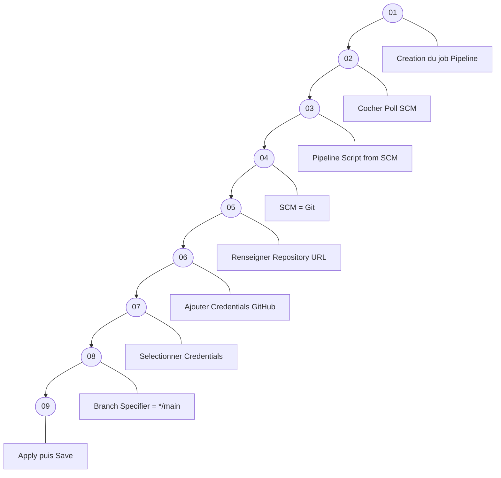
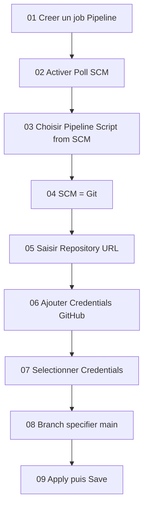
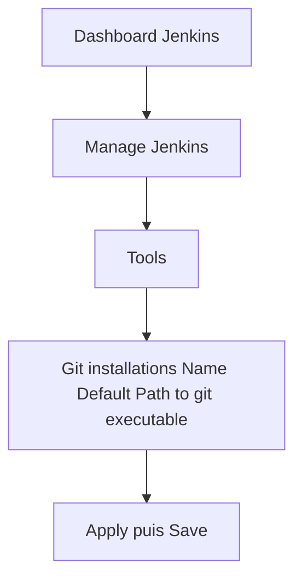
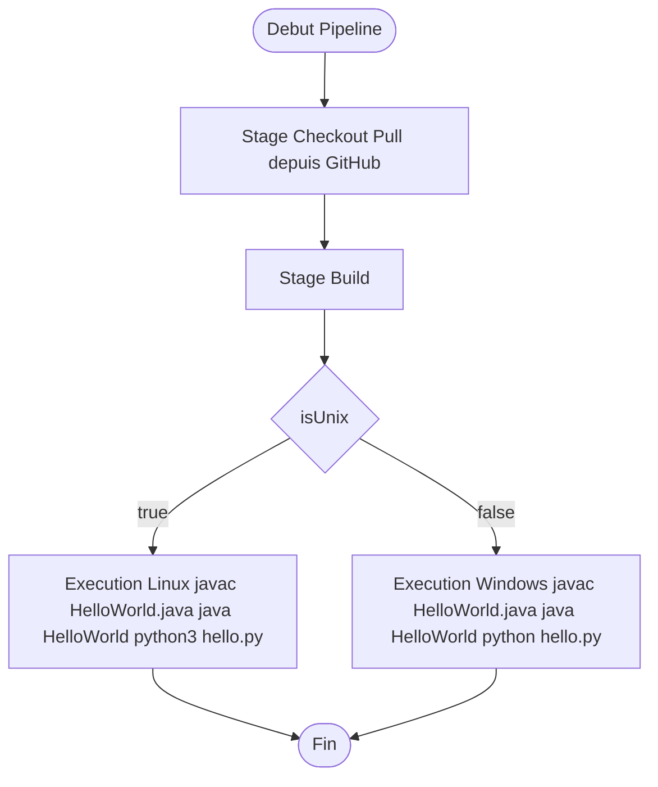

# Cours : Dépôt GitHub et Pipeline Jenkins – Introduction complète

Ce premier laboratoire a un objectif simple :
**créer un dépôt GitHub**, y placer trois fichiers, puis **configurer une pipeline Jenkins** capable de cloner le projet et d’exécuter des commandes selon le système d’exploitation.

Ce laboratoire constitue la base de tout ce qui suivra dans Jenkins (Maven, Agents, CI/CD complet).

---

# 1. Création du dépôt GitHub

Créez un nouveau dépôt GitHub contenant exactement trois fichiers :

1. `HelloWorld.java`
2. `hello.py`
3. `Jenkinsfile` (sans extension)

Les contenus se trouvent dans l’Annexe 1.

---

# 2. Architecture générale : GitHub → Jenkins → Pipeline





### ▣ 01 — Création du job Pipeline

Créez un nouveau job Jenkins → type **Pipeline** → cliquez sur **OK**.


### ▣ 02 — Activer Poll SCM

Cochez **Poll SCM** (cela permet à Jenkins de vérifier les changements dans GitHub).


### ▣ 03 — Choisir Pipeline Script from SCM

Dans la section Pipeline, sélectionnez **Pipeline Script from SCM**.


### ▣ 04 — Choisir SCM = Git

SCM = **Git**.


### ▣ 05 — Renseigner l’URL du dépôt

Indiquez votre dépôt GitHub :

```
https://github.com/votre_user/votre_repo.git
```


### ▣ 06 — Ajouter vos Credentials GitHub

Cliquez sur :
**Add → Jenkins → Username with password**

```
Username : votre identifiant GitHub
Password : votre token GitHub
```


### ▣ 07 — Sélectionner les credentials

Sélectionnez le credentials que vous venez de créer (étape souvent oubliée).


### ▣ 08 — Branch Specifier

Remplacer :

```
*/master
```

par :

```
*/main
```

(si votre dépôt utilise `main`, ce qui est le cas aujourd’hui par défaut).


### ▣ 09 — Apply puis Save

Cliquez sur **Apply**, puis **Save** pour enregistrer le job.


```
[01]  Creation du job Pipeline
[02]  Activer Poll SCM
[03]  Pipeline Script from SCM
[04]  SCM = Git
[05]  Entrer l’URL du repository
[06]  Ajouter Credentials (Username + Token GitHub)
[07]  Selectionner les Credentials
[08]  Branch Specifier = */main
[09]  Apply puis Save
```


# 3. Configuration d’un Job Pipeline dans Jenkins

Suivez les étapes **dans cet ordre exact**, sans sauter de point.



### Explications détaillées

01 — Créez un nouveau job Jenkins → type **Pipeline** → OK.
02 — Cochez **Poll SCM** (permet d’interroger le dépôt).
03 — Choisissez **Pipeline Script from SCM**.
04 — SCM = **Git**.
05 — Entrez l’URL de votre dépôt GitHub :
`https://github.com/votre_user/votre_repo.git`
06 — Cliquez sur **Add → Jenkins → Username with password**

* Username : votre identifiant GitHub
* Password : votre **token GitHub**

07 — Sélectionnez le credentials fraîchement créé.
08 — Dans **Branch Specifier**, utilisez :
`*/main`
(surtout pas `*/master` si votre dépôt utilise main).
09 — Cliquez sur **Apply**, puis **Save**.

---

# 4. Configuration de Git dans Jenkins

Git doit être correctement déclaré dans les outils Jenkins.



### Chemins à renseigner

* Linux : `/usr/bin/git`
* Windows : (ne pas mettre dans Mermaid)
  `C:\Program Files\Git\cmd\git.exe`

### Trouver Git automatiquement

Sous Ubuntu :

```
which git
```

Sous Windows :

```
for %i in (git.exe) do @echo. %~$PATH:i
```

---

# 5. Remarque fondamentale sur Groovy

Dans un Jenkinsfile, **on n’utilise jamais** :

```
git clone ...
```

La syntaxe correcte est :

```
git branch: 'main', url: 'https://github.com/...'
```

---

# Annexe 1 – Contenus des fichiers

## 1 — Jenkinsfile minimal

```groovy
pipeline {
    agent any
    environment {
        PATH = "${env.PATH}:/usr/bin/python3"
    }
    stages {
        stage('Checkout') {
            steps {
                git branch: 'main', url: 'https://github.com/hrhouma/hello-python.git'
            }
        }
        stage('Build') {
            steps {
                script {
                    if (isUnix()) {
                        sh 'echo "Running on Unix"'
                    } else {
                        bat 'echo "Running on Windows"'
                    }
                }
            }
        }
    }
}
```

---

## 2 — hello.py

```python
print("Hello, World from Jenkins Pipeline!")
```

---

## 3 — HelloWorld.java

```java
public class HelloWorld {
    public static void main(String[] args) {
        System.out.println("Hello, World from Jenkins Pipeline!");
    }
}
```

---

# Annexe 2 – Pipeline exécutant Java + Python

Ce diagramme illustre le fonctionnement dynamique de la pipeline.



Les différentes versions du Jenkinsfile fournies permettent d’exécuter les deux fichiers sur :

* Windows
* Linux
* Ou une version hybride Linux/Windows (2 en 1)

---

# Annexe 3 – Trouver les chemins Java / Python

Sous Linux :

```
which java
which javac
which python
which python3
```

Sous Windows :

```
for %i in (java.exe) do @echo. %~$PATH:i
for %i in (python.exe) do @echo. %~$PATH:i
for %i in (python3.exe) do @echo. %~$PATH:i
```


