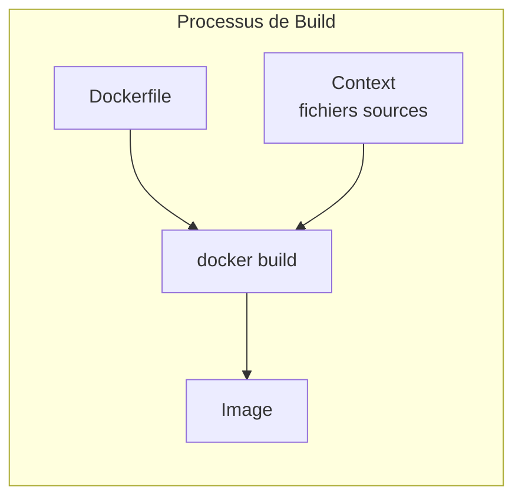
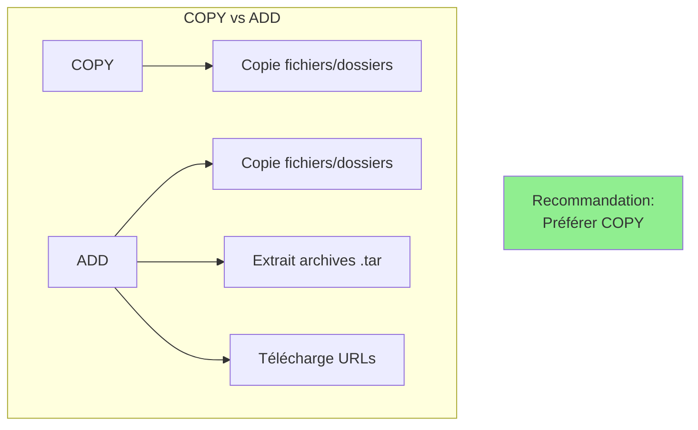
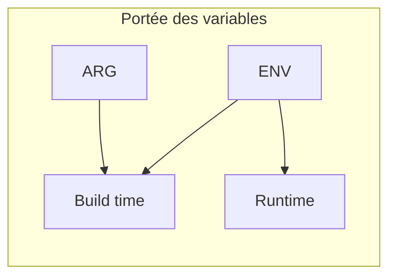
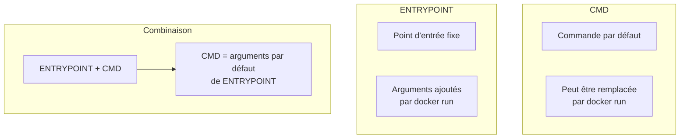
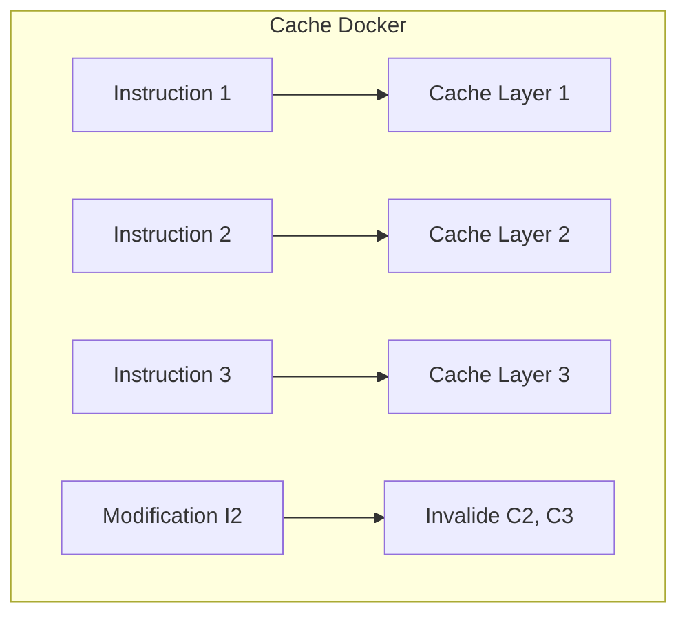
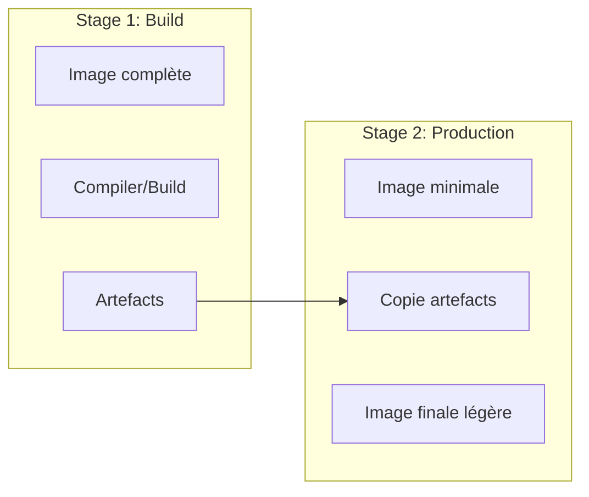
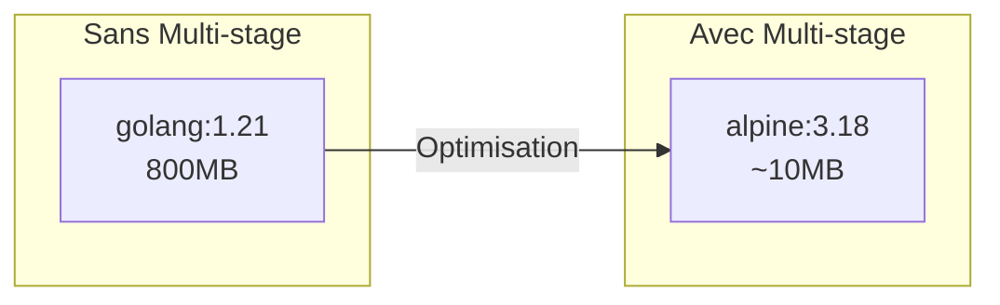
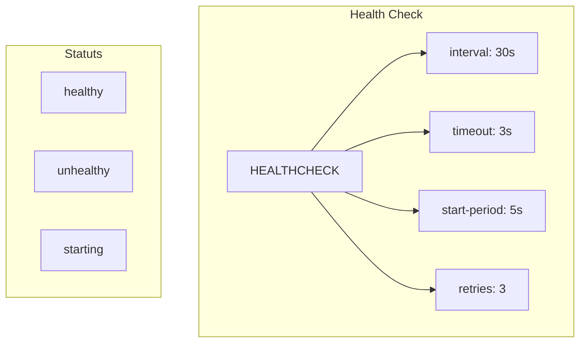

# Module 2 : Dockerfile et Construction d'Images

## Objectifs du module

- Comprendre la syntaxe et les instructions Dockerfile
- Savoir construire des images optimisées
- Maîtriser le multi-stage build
- Appliquer les bonnes pratiques de sécurité

---

## 2.1 Introduction au Dockerfile

### Pourquoi créer ses propres images ?

Les images officielles (nginx, python, node) sont des bases, mais votre application a besoin de :
- Votre code source
- Vos dépendances spécifiques
- Votre configuration

Le **Dockerfile** est la recette qui transforme tout cela en une image personnalisée.

### Qu'est-ce qu'un Dockerfile ?

Un **Dockerfile** est un fichier texte (sans extension) contenant les instructions pour construire une image Docker. 

**Analogie :** C'est comme une recette de cuisine. Chaque instruction est une étape (prendre la farine, ajouter les oeufs, mélanger...). À la fin, vous obtenez un plat (l'image).

### Principe des couches (layers)

Chaque instruction dans un Dockerfile crée une **nouvelle couche**. Docker met ces couches en cache pour accélérer les builds suivants.

**Exemple :**
```
Layer 1: FROM ubuntu        [200 MB]
Layer 2: RUN apt-get...     [50 MB]
Layer 3: COPY app/          [5 MB]
Layer 4: CMD ["./app"]      [0 MB]
------------------------
Total image:                [255 MB]
```

Si vous modifiez seulement votre code (Layer 3), Docker réutilise les layers 1 et 2 du cache. Le build est donc très rapide !



### Structure de base

```dockerfile
# Image de base
FROM ubuntu:22.04

# Métadonnées
LABEL maintainer="dev@example.com"
LABEL version="1.0"

# Variables d'environnement
ENV APP_HOME=/app
ENV NODE_ENV=production

# Répertoire de travail
WORKDIR $APP_HOME

# Copier des fichiers
COPY . .

# Exécuter des commandes
RUN apt-get update && apt-get install -y curl

# Port exposé (documentation)
EXPOSE 3000

# Commande par défaut
CMD ["node", "server.js"]
```

---

## 2.2 Instructions Dockerfile

### Vue d'ensemble des instructions

| Instruction | Rôle | Exemple |
|-------------|------|---------|
| `FROM` | Image de base | `FROM python:3.11` |
| `WORKDIR` | Répertoire de travail | `WORKDIR /app` |
| `COPY` | Copier des fichiers locaux | `COPY . .` |
| `RUN` | Exécuter une commande (build) | `RUN pip install -r requirements.txt` |
| `ENV` | Variable d'environnement | `ENV NODE_ENV=production` |
| `EXPOSE` | Documenter un port | `EXPOSE 3000` |
| `CMD` | Commande par défaut | `CMD ["python", "app.py"]` |
| `ENTRYPOINT` | Point d'entrée fixe | `ENTRYPOINT ["nginx"]` |

### FROM - Image de base

La première instruction de tout Dockerfile. Elle définit l'image sur laquelle vous construisez.

**Choix courants :**
- `alpine` : Ultra-légère (~5MB), basée sur Alpine Linux
- `slim` : Version allégée de Debian (~100MB)
- `bookworm/bullseye` : Debian complète (~200MB)

```dockerfile
# Utiliser une image officielle
FROM node:20-alpine

# Utiliser une version spécifique
FROM python:3.11.5-slim-bookworm

# Image vide (pour binaires statiques)
FROM scratch
```

### WORKDIR - Répertoire de travail

```dockerfile
# Définit le répertoire de travail pour les instructions suivantes
WORKDIR /app

# Peut être utilisé plusieurs fois
WORKDIR /app/src
```

### COPY vs ADD

```dockerfile
# COPY - Copie simple (recommandé)
COPY package.json .
COPY src/ ./src/

# ADD - Fonctionnalités supplémentaires
# Extraction automatique d'archives
ADD archive.tar.gz /app/
# Téléchargement depuis URL (déconseillé)
ADD https://example.com/file.txt /app/
```



### RUN - Exécuter des commandes

```dockerfile
# Forme shell
RUN apt-get update && apt-get install -y curl

# Forme exec (recommandée pour les commandes complexes)
RUN ["apt-get", "update"]

# Bonnes pratiques : chaîner les commandes
RUN apt-get update \
    && apt-get install -y --no-install-recommends \
        curl \
        ca-certificates \
    && rm -rf /var/lib/apt/lists/*
```

### ENV vs ARG

```dockerfile
# ARG - Variable de build uniquement
ARG VERSION=1.0
ARG BUILD_DATE

# ENV - Variable d'environnement (runtime)
ENV APP_VERSION=$VERSION
ENV NODE_ENV=production
```



---

## Exercice 1 (15 minutes)

### Créer un Dockerfile simple

Créez un Dockerfile pour une application Node.js simple :

1. Créez un dossier `exercice-dockerfile`
2. Créez un fichier `app.js` :
   ```javascript
   const http = require('http');
   const server = http.createServer((req, res) => {
     res.writeHead(200, {'Content-Type': 'text/plain'});
     res.end('Hello Docker!\n');
   });
   server.listen(3000, () => {
     console.log('Server running on port 3000');
   });
   ```

3. Créez un `Dockerfile` :
   ```dockerfile
   FROM node:20-alpine
   WORKDIR /app
   COPY app.js .
   EXPOSE 3000
   CMD ["node", "app.js"]
   ```

4. Construisez et testez :
   ```bash
   docker build -t mon-app:1.0 .
   docker run -d -p 3000:3000 --name test-app mon-app:1.0
   curl http://localhost:3000
   docker rm -f test-app
   ```

---

## 2.3 CMD vs ENTRYPOINT

### La question qui revient toujours

CMD et ENTRYPOINT semblent faire la même chose : définir ce qui s'exécute quand le container démarre. Mais il y a une différence importante !

**CMD :** Commande par défaut, facilement remplaçable
**ENTRYPOINT :** Point d'entrée fixe, les arguments sont ajoutés



### Exemples

```dockerfile
# CMD seul - peut être remplacé
FROM ubuntu
CMD ["echo", "Hello"]
# docker run image           -> "Hello"
# docker run image echo World -> "World"

# ENTRYPOINT seul - toujours exécuté
FROM ubuntu
ENTRYPOINT ["echo"]
# docker run image           -> ""
# docker run image Hello     -> "Hello"

# Combinaison recommandée
FROM ubuntu
ENTRYPOINT ["echo"]
CMD ["Hello"]
# docker run image           -> "Hello"
# docker run image World     -> "World"
```

### Cas d'usage typique

```dockerfile
# Application avec configuration
FROM python:3.11-slim
WORKDIR /app
COPY . .
RUN pip install -r requirements.txt

ENTRYPOINT ["python", "app.py"]
CMD ["--port", "8000"]
```

---

## 2.4 Optimisation des images

### Pourquoi optimiser ?

Une image non optimisée peut poser plusieurs problèmes :
- **Taille** : Images de plusieurs GB au lieu de quelques centaines de MB
- **Sécurité** : Plus de composants = plus de vulnérabilités potentielles
- **Build lent** : Reconstruction complète à chaque modification
- **Déploiement lent** : Plus de données à transférer

### Le cache Docker : votre meilleur ami

Docker garde en cache chaque layer. Si une instruction n'a pas changé, Docker réutilise le cache.

**Règle d'or :** Mettez les instructions qui changent rarement EN PREMIER, et celles qui changent souvent EN DERNIER.

### Ordre des instructions



### Mauvais exemple

```dockerfile
FROM node:20-alpine
WORKDIR /app
# Copie tout - invalide le cache à chaque modification
COPY . .
RUN npm install
CMD ["npm", "start"]
```

### Bon exemple

```dockerfile
FROM node:20-alpine
WORKDIR /app

# Copie d'abord les fichiers de dépendances
COPY package*.json ./

# Installation des dépendances (cache si package.json inchangé)
RUN npm ci --only=production

# Copie du code source ensuite
COPY . .

CMD ["npm", "start"]
```

---

## Exercice 2 (15 minutes)

### Optimiser un Dockerfile

Voici un Dockerfile non optimisé :

```dockerfile
FROM ubuntu:22.04
RUN apt-get update
RUN apt-get install -y python3
RUN apt-get install -y python3-pip
COPY . /app
WORKDIR /app
RUN pip3 install flask
RUN pip3 install requests
RUN pip3 install redis
CMD ["python3", "app.py"]
```

Optimisez-le en :
1. Utilisant une image Python officielle
2. Chaînant les commandes RUN
3. Utilisant un fichier requirements.txt
4. Ordonnant correctement les instructions

**Solution attendue :**

```dockerfile
FROM python:3.11-slim

WORKDIR /app

COPY requirements.txt .
RUN pip install --no-cache-dir -r requirements.txt

COPY . .

CMD ["python", "app.py"]
```

---

## 2.5 Multi-stage Build

### Le problème

Pour construire une application, vous avez besoin d'outils :
- Compilateurs (gcc, javac, tsc...)
- Gestionnaires de packages (npm, pip, maven...)
- Outils de build (webpack, gradle...)

Ces outils sont nécessaires pour CONSTRUIRE mais PAS pour EXÉCUTER l'application.

**Exemple :** Pour une app Go :
- Image avec outils de compilation : ~800 MB
- Application compilée finale : ~10 MB

### La solution : Multi-stage Build

Le **multi-stage build** utilise plusieurs `FROM` dans un seul Dockerfile :
1. **Stage 1 (builder)** : Image complète avec tous les outils → compile l'application
2. **Stage 2 (production)** : Image minimale → copie seulement l'exécutable

Le résultat : des images production très légères !



### Exemple Go

```dockerfile
# Stage 1: Build
FROM golang:1.21-alpine AS builder

WORKDIR /app
COPY go.mod go.sum ./
RUN go mod download

COPY . .
RUN CGO_ENABLED=0 GOOS=linux go build -o main .

# Stage 2: Production
FROM alpine:3.18

WORKDIR /app
COPY --from=builder /app/main .

EXPOSE 8080
CMD ["./main"]
```

### Exemple Node.js avec TypeScript

```dockerfile
# Stage 1: Build
FROM node:20-alpine AS builder

WORKDIR /app
COPY package*.json ./
RUN npm ci

COPY . .
RUN npm run build

# Stage 2: Production
FROM node:20-alpine

WORKDIR /app
COPY package*.json ./
RUN npm ci --only=production

COPY --from=builder /app/dist ./dist

USER node
EXPOSE 3000
CMD ["node", "dist/index.js"]
```

### Comparaison des tailles



---

## Exercice 3 (15 minutes)

### Multi-stage Build pratique

Créez un multi-stage Dockerfile pour une application React :

Structure du projet :
```
my-react-app/
  package.json
  src/
    index.js
  public/
    index.html
```

1. Stage 1 : Build avec Node.js
2. Stage 2 : Servir avec Nginx

**Solution :**

```dockerfile
# Stage 1: Build
FROM node:20-alpine AS builder

WORKDIR /app
COPY package*.json ./
RUN npm ci

COPY . .
RUN npm run build

# Stage 2: Production avec Nginx
FROM nginx:alpine

COPY --from=builder /app/build /usr/share/nginx/html
COPY nginx.conf /etc/nginx/conf.d/default.conf

EXPOSE 80
CMD ["nginx", "-g", "daemon off;"]
```

---

## 2.6 Sécurité et bonnes pratiques

### Utilisateur non-root

```dockerfile
FROM node:20-alpine

# Créer un utilisateur non-root
RUN addgroup -S appgroup && adduser -S appuser -G appgroup

WORKDIR /app
COPY --chown=appuser:appgroup . .

# Passer à l'utilisateur non-root
USER appuser

CMD ["node", "app.js"]
```

### Fichier .dockerignore

```plaintext
# .dockerignore
node_modules
npm-debug.log
Dockerfile
.dockerignore
.git
.gitignore
README.md
.env
*.test.js
coverage/
```

### Health checks

```dockerfile
FROM nginx:alpine

COPY index.html /usr/share/nginx/html/

HEALTHCHECK --interval=30s --timeout=3s --start-period=5s --retries=3 \
    CMD curl -f http://localhost/ || exit 1

EXPOSE 80
CMD ["nginx", "-g", "daemon off;"]
```



---

## 2.7 Commandes de build

```bash
# Build simple
docker build -t mon-image:1.0 .

# Build avec un Dockerfile différent
docker build -f Dockerfile.prod -t mon-image:prod .

# Build avec arguments
docker build --build-arg VERSION=2.0 -t mon-image:2.0 .

# Build sans cache
docker build --no-cache -t mon-image:1.0 .

# Build avec target (multi-stage)
docker build --target builder -t mon-image:builder .

# Voir les étapes de build
docker build --progress=plain -t mon-image:1.0 .
```

---

## Résumé du module

```mermaid
mindmap
  root((Dockerfile))
    Instructions
      FROM
      WORKDIR
      COPY/ADD
      RUN
      ENV/ARG
      CMD/ENTRYPOINT
      EXPOSE
      USER
      HEALTHCHECK
    Optimisation
      Ordre des instructions
      Cache des layers
      Multi-stage build
      .dockerignore
    Sécurité
      Utilisateur non-root
      Images minimales
      Scan de vulnérabilités
      Versions fixes
```

---

## Quiz de validation

1. Quelle est la différence entre COPY et ADD ?
2. Pourquoi faut-il copier package.json avant le code source ?
3. Quelle est la différence entre CMD et ENTRYPOINT ?
4. À quoi sert le multi-stage build ?
5. Pourquoi utiliser un utilisateur non-root dans un container ?

