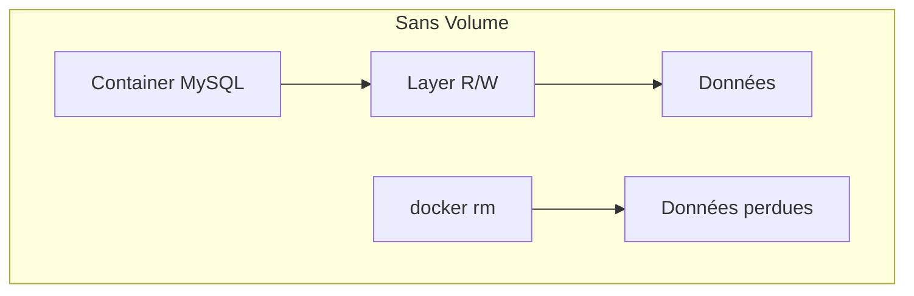
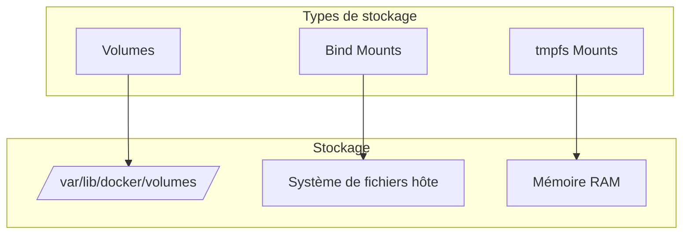
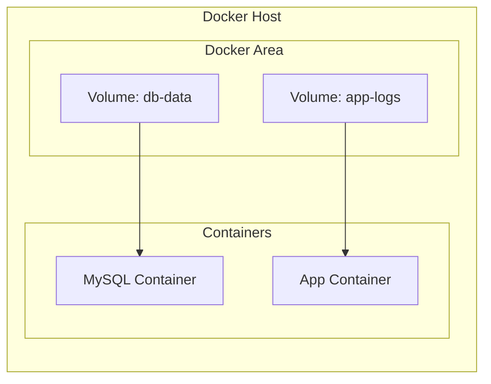
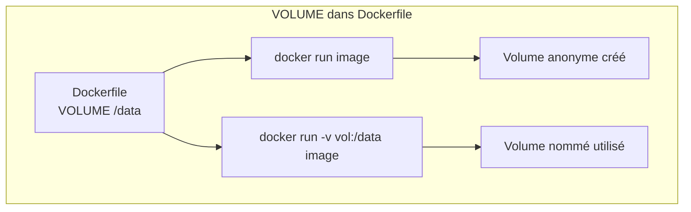
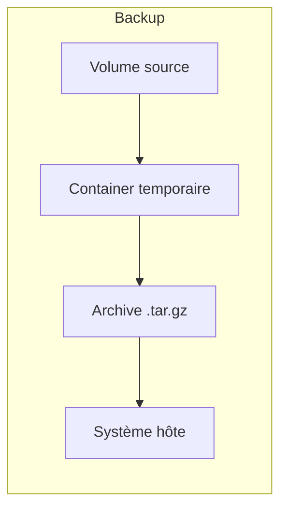
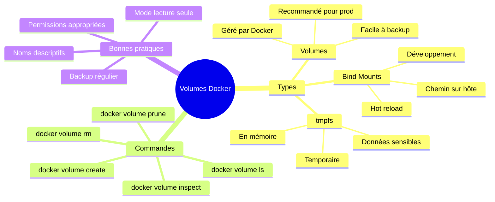

# Module 3 : Volumes et Persistance des Données

## Objectifs du module

- Comprendre pourquoi les données des containers sont éphémères
- Maîtriser les différents types de volumes Docker
- Savoir choisir le bon type de stockage selon le cas d'usage
- Gérer les volumes en production

---

## 3.1 Problème de la persistance

### Le problème fondamental

Les containers sont conçus pour être **éphémères** (temporaires). Vous pouvez les créer, les détruire, les recréer à volonté. C'est leur force, mais aussi un défi.

**Question :** Si un container MySQL est supprimé et recréé, que deviennent les données de la base ?

**Sans volume :** Les données sont perdues ! Chaque container neuf repart de zéro.
**Avec volume :** Les données survivent, le nouveau container retrouve les données.

### Pourquoi les données sont-elles perdues ?

Quand Docker lance un container, il ajoute une **couche d'écriture** (writable layer) au-dessus des couches de l'image (read-only).

- Tout ce que le container écrit va dans cette couche
- Quand le container est supprimé, cette couche est supprimée aussi
- Donc toutes les données écrites disparaissent

Par défaut, les données écrites dans un container sont perdues quand le container est supprimé.



### Démonstration

```bash
# Créer un container et écrire des données
docker run -d --name test-data alpine sh -c "echo 'Important data' > /data.txt && sleep 3600"

# Vérifier que les données existent
docker exec test-data cat /data.txt

# Supprimer le container
docker rm -f test-data

# Recréer le container
docker run -d --name test-data alpine sh -c "cat /data.txt 2>/dev/null || echo 'Data not found' && sleep 3600"

# Les données ont disparu
docker exec test-data cat /data.txt
```

---

## 3.2 Types de stockage Docker



| Type | Emplacement | Cas d'usage |
|------|-------------|-------------|
| Volume | Géré par Docker | Bases de données, données persistantes |
| Bind Mount | Chemin sur l'hôte | Développement, configuration |
| tmpfs | Mémoire RAM | Données sensibles temporaires |

---

## 3.3 Volumes Docker

### Pourquoi les volumes sont recommandés ?

| Avantage | Explication |
|----------|-------------|
| **Indépendants** | Existent même si aucun container ne les utilise |
| **Portables** | Faciles à sauvegarder et migrer |
| **Sécurisés** | Isolés du système de fichiers de l'hôte |
| **Performants** | Optimisés par Docker selon le système |
| **Partageables** | Plusieurs containers peuvent utiliser le même volume |

Les volumes sont la méthode recommandée pour persister les données.



### Création et gestion des volumes

```bash
# Créer un volume
docker volume create my-data

# Lister les volumes
docker volume ls

# Inspecter un volume
docker volume inspect my-data

# Supprimer un volume
docker volume rm my-data

# Supprimer les volumes non utilisés
docker volume prune
```

### Utiliser un volume avec un container

```bash
# Syntaxe --mount (recommandée)
docker run -d \
    --name mysql-db \
    --mount source=mysql-data,target=/var/lib/mysql \
    -e MYSQL_ROOT_PASSWORD=secret \
    mysql:8.0

# Syntaxe -v (plus courte)
docker run -d \
    --name mysql-db \
    -v mysql-data:/var/lib/mysql \
    -e MYSQL_ROOT_PASSWORD=secret \
    mysql:8.0
```

---

## Exercice 1 (15 minutes)

### Persistance avec volumes

1. Créez un volume nommé `postgres-data`

2. Lancez un container PostgreSQL utilisant ce volume :
   ```bash
   docker run -d \
       --name postgres-db \
       -v postgres-data:/var/lib/postgresql/data \
       -e POSTGRES_PASSWORD=mysecret \
       postgres:15-alpine
   ```

3. Créez une base de données :
   ```bash
   docker exec -it postgres-db psql -U postgres -c "CREATE DATABASE testdb;"
   docker exec -it postgres-db psql -U postgres -c "\l"
   ```

4. Supprimez le container :
   ```bash
   docker rm -f postgres-db
   ```

5. Recréez le container avec le même volume et vérifiez que la base existe toujours

**Question :** Pourquoi les données sont-elles toujours présentes ?

---

## 3.4 Bind Mounts

Les bind mounts lient un répertoire de l'hôte directement au container.

```mermaid
graph LR
    subgraph "Host"
        DIR[/home/user/project/]
        CONFIG[/etc/app/config.yml]
    end
    
    subgraph "Container"
        APP[/app/]
        CONF[/config/config.yml]
    end
    
    DIR <--> APP
    CONFIG <--> CONF
```

### Syntaxe

```bash
# Syntaxe --mount
docker run -d \
    --name web-dev \
    --mount type=bind,source=/home/user/project,target=/app \
    node:20-alpine npm start

# Syntaxe -v
docker run -d \
    --name web-dev \
    -v /home/user/project:/app \
    node:20-alpine npm start

# Mode lecture seule
docker run -d \
    --name web \
    -v /home/user/config:/etc/nginx/conf.d:ro \
    nginx:alpine
```

### Cas d'usage en développement

```bash
# Hot reload pour le développement
docker run -d \
    --name react-dev \
    -v $(pwd):/app \
    -v /app/node_modules \
    -p 3000:3000 \
    node:20-alpine \
    sh -c "cd /app && npm install && npm start"
```

```mermaid
graph TB
    subgraph "Développement avec Bind Mount"
        IDE[IDE/Éditeur]
        SRC[Code source<br/>/home/user/project]
        CONT[Container]
        APP[/app dans container]
        
        IDE --> SRC
        SRC <--> APP
        APP --> CONT
    end
```

---

## Exercice 2 (15 minutes)

### Bind mount en développement

1. Créez un dossier de projet :
   ```bash
   mkdir ~/docker-dev-test
   cd ~/docker-dev-test
   ```

2. Créez un fichier `index.html` :
   ```html
   <!DOCTYPE html>
   <html>
   <head><title>Test</title></head>
   <body><h1>Version 1</h1></body>
   </html>
   ```

3. Lancez un container nginx avec bind mount :
   ```bash
   docker run -d \
       --name nginx-dev \
       -v $(pwd):/usr/share/nginx/html:ro \
       -p 8080:80 \
       nginx:alpine
   ```

4. Accédez à http://localhost:8080

5. Modifiez `index.html` (changez "Version 1" en "Version 2")

6. Rafraîchissez la page - les changements sont immédiats

7. Nettoyez :
   ```bash
   docker rm -f nginx-dev
   ```

---

## 3.5 tmpfs Mounts

Les tmpfs mounts stockent les données en mémoire RAM. Les données disparaissent quand le container s'arrête.

```mermaid
graph TB
    subgraph "tmpfs Mount"
        RAM[Mémoire RAM]
        CONT[Container]
        TMP[/app/temp]
        
        RAM --> TMP
        TMP --> CONT
    end
    
    NOTE[Données non écrites sur disque<br/>Sécurité pour données sensibles]
```

### Utilisation

```bash
# Créer un tmpfs mount
docker run -d \
    --name secure-app \
    --tmpfs /app/secrets:rw,size=64m \
    alpine sleep 3600

# Avec --mount
docker run -d \
    --name secure-app \
    --mount type=tmpfs,destination=/app/secrets,tmpfs-size=67108864 \
    alpine sleep 3600
```

---

## 3.6 Volumes dans Dockerfile

```dockerfile
FROM mysql:8.0

# Déclare un point de montage
VOLUME /var/lib/mysql

# Docker créera automatiquement un volume anonyme
# si aucun volume n'est spécifié au runtime
```



---

## Exercice 3 (15 minutes)

### Comparaison des types de stockage

Créez trois containers pour comparer les différents types :

1. **Container avec volume :**
   ```bash
   docker run -d --name vol-test \
       -v test-vol:/data \
       alpine sh -c "echo 'Volume data' > /data/file.txt && sleep 3600"
   ```

2. **Container avec bind mount :**
   ```bash
   mkdir -p ~/bind-test
   docker run -d --name bind-test \
       -v ~/bind-test:/data \
       alpine sh -c "echo 'Bind data' > /data/file.txt && sleep 3600"
   ```

3. **Container avec tmpfs :**
   ```bash
   docker run -d --name tmpfs-test \
       --tmpfs /data \
       alpine sh -c "echo 'Tmpfs data' > /data/file.txt && sleep 3600"
   ```

4. Vérifiez les données dans chaque container

5. Redémarrez chaque container et vérifiez les données

6. Supprimez et recréez chaque container - quelles données persistent ?

**Tableau de résultats attendus :**

| Type | Après restart | Après rm + run |
|------|--------------|----------------|
| Volume | Oui | Oui |
| Bind Mount | Oui | Oui |
| tmpfs | Non | Non |

---

## 3.7 Bonnes pratiques

### Nommage des volumes

```bash
# Utiliser des noms descriptifs
docker volume create project-name_service-name_data-type

# Exemples
docker volume create myapp_postgres_data
docker volume create myapp_redis_cache
docker volume create myapp_uploads_files
```

### Backup et restauration

```bash
# Backup d'un volume
docker run --rm \
    -v myapp_postgres_data:/data:ro \
    -v $(pwd):/backup \
    alpine tar czf /backup/postgres-backup.tar.gz -C /data .

# Restauration
docker run --rm \
    -v myapp_postgres_data:/data \
    -v $(pwd):/backup:ro \
    alpine tar xzf /backup/postgres-backup.tar.gz -C /data
```



### Sécurité des volumes

```bash
# Lecture seule quand possible
docker run -v config:/etc/app:ro nginx

# Limiter les permissions
docker run -v data:/app/data:rw,uid=1000,gid=1000 myapp
```

---

## 3.8 Volumes avec Docker Compose

Aperçu de l'utilisation dans Docker Compose (détaillé dans les modules suivants) :

```yaml
version: '3.8'

services:
  db:
    image: postgres:15
    volumes:
      - postgres_data:/var/lib/postgresql/data
      - ./init.sql:/docker-entrypoint-initdb.d/init.sql:ro
    environment:
      POSTGRES_PASSWORD: secret

  app:
    build: .
    volumes:
      - ./src:/app/src
      - app_logs:/app/logs
    depends_on:
      - db

volumes:
  postgres_data:
  app_logs:
```

---

## Résumé du module



---

## Quiz de validation

1. Pourquoi les données d'un container sont-elles perdues par défaut ?
2. Quelle est la différence entre un volume et un bind mount ?
3. Quand utiliser un tmpfs mount ?
4. Comment faire un backup d'un volume Docker ?
5. Quel mode utiliser pour monter un fichier de configuration en lecture seule ?

