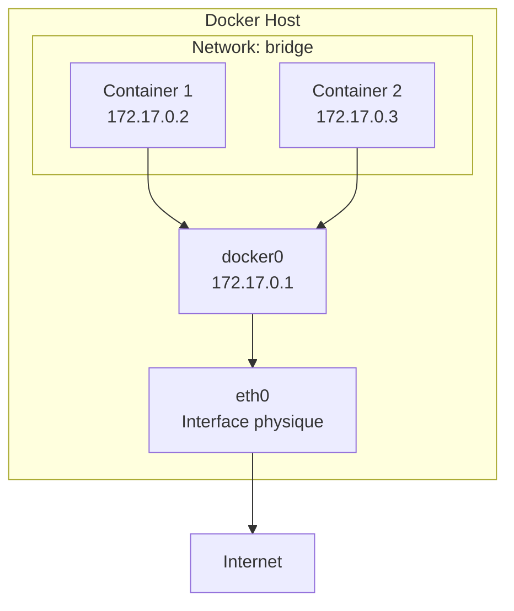
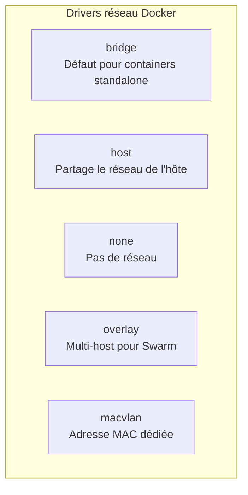
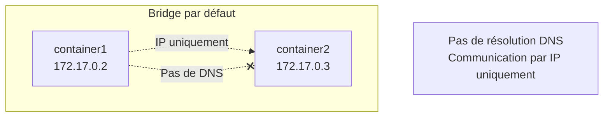
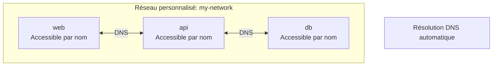
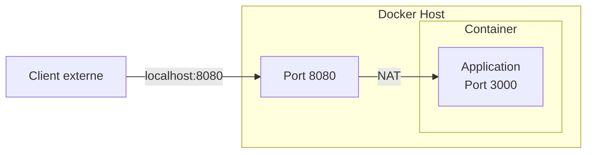
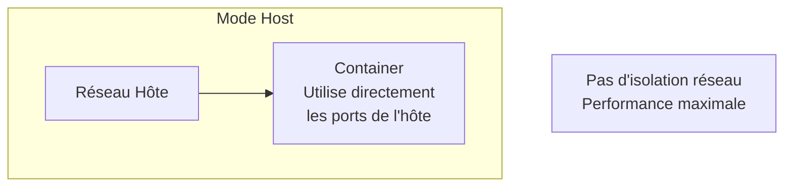
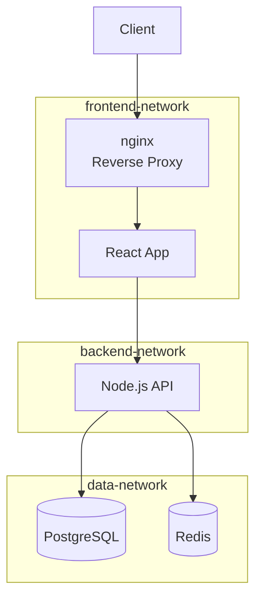
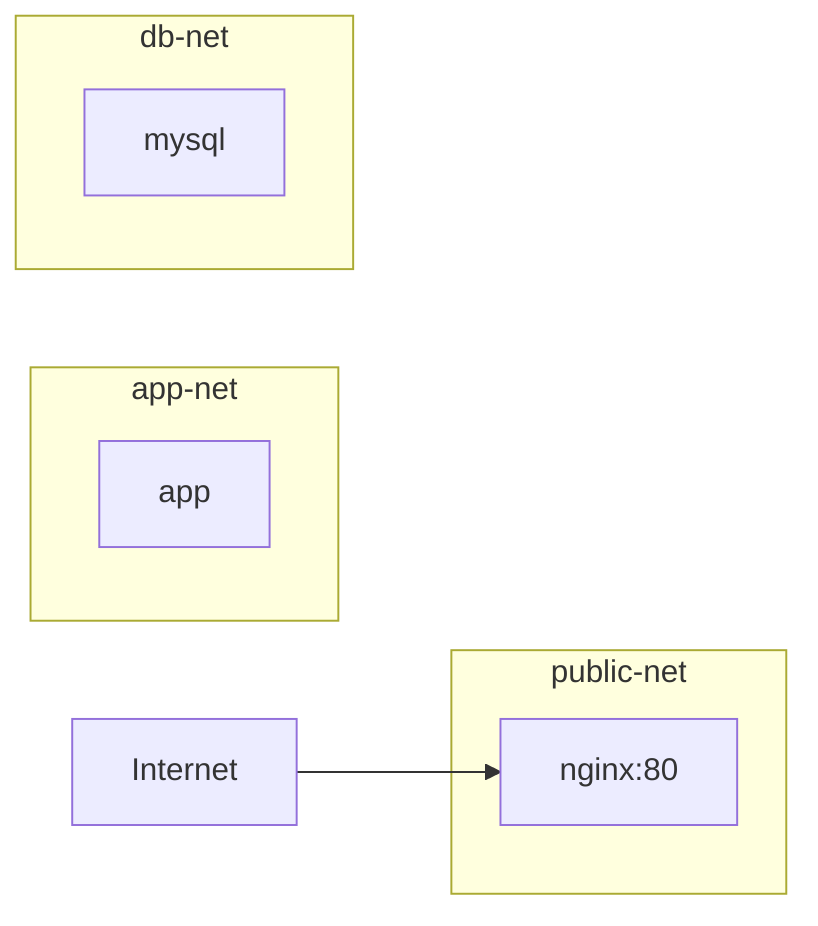
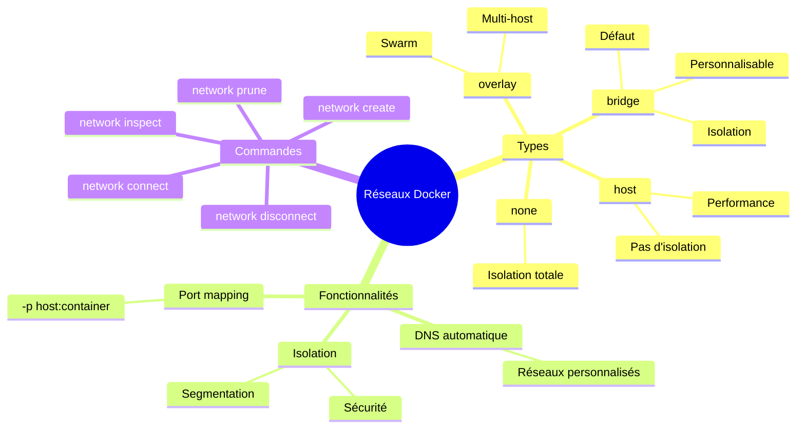

# Module 4 : Réseaux Docker

## Objectifs du module

- Comprendre les différents types de réseaux Docker
- Savoir faire communiquer des containers entre eux
- Maîtriser l'isolation réseau
- Configurer des réseaux personnalisés

---

## 4.1 Introduction aux réseaux Docker

### Pourquoi les réseaux Docker ?

Dans une architecture microservices, plusieurs containers doivent communiquer :
- Le frontend doit parler à l'API
- L'API doit parler à la base de données
- etc.

Docker fournit un système de réseau virtuel qui permet :
- La **communication** entre containers
- L'**isolation** (certains containers ne peuvent pas se parler)
- La **découverte** par nom (pas besoin de connaître les IPs)

### Concepts clés

| Concept | Explication |
|---------|-------------|
| **Réseau Docker** | Réseau virtuel géré par Docker |
| **Driver** | Type de réseau (bridge, host, overlay...) |
| **DNS interne** | Résolution de noms entre containers |
| **Port mapping** | Exposer un port du container vers l'hôte |

Docker crée une couche d'abstraction réseau qui permet aux containers de communiquer entre eux et avec l'extérieur.



---

## 4.2 Types de réseaux

### Vue d'ensemble



| Driver | Isolation | Communication | Cas d'usage |
|--------|-----------|---------------|-------------|
| bridge | Oui | Entre containers du même réseau | Applications multi-containers |
| host | Non | Direct avec l'hôte | Performance maximale |
| none | Totale | Aucune | Sécurité maximale |
| overlay | Oui | Entre hosts Swarm | Clusters Docker |
| macvlan | Oui | Apparaît comme device physique | Legacy, IoT |

---

## 4.3 Réseau Bridge par défaut

Tous les containers sont connectés au réseau bridge par défaut si aucun réseau n'est spécifié.

```bash
# Lister les réseaux
docker network ls

# Inspecter le réseau bridge
docker network inspect bridge
```

### Limitations du bridge par défaut



```bash
# Démonstration
docker run -d --name web nginx:alpine
docker run -d --name app alpine sleep 3600

# Ping par IP fonctionne
docker exec app ping -c 2 172.17.0.2

# Ping par nom échoue
docker exec app ping -c 2 web
# ping: bad address 'web'
```

---

## Exercice 1 (15 minutes)

### Explorer le réseau bridge par défaut

1. Créez deux containers sur le réseau par défaut :
   ```bash
   docker run -d --name server1 nginx:alpine
   docker run -d --name server2 alpine sleep 3600
   ```

2. Trouvez l'adresse IP de server1 :
   ```bash
   docker inspect server1 | grep IPAddress
   ```

3. Depuis server2, testez la connectivité :
   ```bash
   # Par IP
   docker exec server2 ping -c 2 <IP_DE_SERVER1>
   
   # Par nom (échoue)
   docker exec server2 ping -c 2 server1
   ```

4. Listez les containers sur le réseau bridge :
   ```bash
   docker network inspect bridge
   ```

5. Nettoyez :
   ```bash
   docker rm -f server1 server2
   ```

---

## 4.4 Réseaux Bridge personnalisés

Les réseaux personnalisés offrent la résolution DNS automatique entre containers.



### Création et utilisation

```bash
# Créer un réseau personnalisé
docker network create my-network

# Créer avec options
docker network create \
    --driver bridge \
    --subnet 192.168.100.0/24 \
    --gateway 192.168.100.1 \
    my-custom-network

# Lancer des containers sur ce réseau
docker run -d --name web --network my-network nginx:alpine
docker run -d --name api --network my-network node:alpine sleep 3600

# La résolution DNS fonctionne
docker exec api ping -c 2 web
```

### Connecter un container existant

```bash
# Connecter à un réseau
docker network connect my-network existing-container

# Déconnecter d'un réseau
docker network disconnect bridge existing-container
```

---

## Exercice 2 (15 minutes)

### Communication entre containers avec DNS

1. Créez un réseau personnalisé :
   ```bash
   docker network create app-network
   ```

2. Lancez une base de données Redis :
   ```bash
   docker run -d --name redis --network app-network redis:alpine
   ```

3. Lancez un container de test :
   ```bash
   docker run -it --rm --network app-network redis:alpine redis-cli -h redis
   ```

4. Dans le client Redis, testez la connexion :
   ```
   PING
   SET test "Hello from Docker network"
   GET test
   ```

5. Vérifiez la résolution DNS :
   ```bash
   docker run --rm --network app-network alpine nslookup redis
   ```

6. Nettoyez :
   ```bash
   docker rm -f redis
   docker network rm app-network
   ```

---

## 4.5 Exposition des ports



### Syntaxe de mapping

```bash
# Format: -p HOST_PORT:CONTAINER_PORT
docker run -d -p 8080:80 nginx:alpine

# Bind sur une interface spécifique
docker run -d -p 127.0.0.1:8080:80 nginx:alpine

# Port aléatoire sur l'hôte
docker run -d -p 80 nginx:alpine

# Plusieurs ports
docker run -d -p 8080:80 -p 8443:443 nginx:alpine

# Range de ports
docker run -d -p 8000-8010:8000-8010 myapp
```

### Voir les ports exposés

```bash
# Lister les mappings
docker port container-name

# Exemple de sortie
# 80/tcp -> 0.0.0.0:8080
```

---

## 4.6 Réseau Host

Le container partage directement le réseau de l'hôte (Linux uniquement).



```bash
# Utiliser le réseau host
docker run -d --network host nginx:alpine

# Le container écoute directement sur le port 80 de l'hôte
curl http://localhost:80
```

---

## 4.7 Architecture multi-containers

### Exemple d'application web complète



### Configuration

```bash
# Créer les réseaux
docker network create frontend-net
docker network create backend-net
docker network create data-net

# Lancer les containers avec les bons réseaux
docker run -d --name db --network data-net postgres:15-alpine

docker run -d --name redis --network data-net redis:alpine

docker run -d --name api \
    --network backend-net \
    node:alpine sleep 3600
docker network connect data-net api

docker run -d --name frontend \
    --network frontend-net \
    node:alpine sleep 3600
docker network connect backend-net frontend

docker run -d --name nginx \
    --network frontend-net \
    -p 80:80 \
    nginx:alpine
```

---

## Exercice 3 (15 minutes)

### Architecture avec isolation réseau

Créez une architecture isolée :



1. Créez les réseaux :
   ```bash
   docker network create public-net
   docker network create app-net
   docker network create db-net
   ```

2. Lancez MySQL (réseau db-net uniquement) :
   ```bash
   docker run -d --name db \
       --network db-net \
       -e MYSQL_ROOT_PASSWORD=secret \
       mysql:8.0
   ```

3. Lancez l'application (app-net + db-net) :
   ```bash
   docker run -d --name app \
       --network app-net \
       alpine sleep 3600
   docker network connect db-net app
   ```

4. Lancez nginx (public-net + app-net) :
   ```bash
   docker run -d --name web \
       --network public-net \
       -p 8080:80 \
       nginx:alpine
   docker network connect app-net web
   ```

5. Vérifiez l'isolation :
   ```bash
   # web peut atteindre app
   docker exec web ping -c 2 app
   
   # web ne peut PAS atteindre db
   docker exec web ping -c 2 db
   
   # app peut atteindre db
   docker exec app ping -c 2 db
   ```

6. Nettoyez tout :
   ```bash
   docker rm -f web app db
   docker network rm public-net app-net db-net
   ```

---

## 4.8 Commandes réseau essentielles

```bash
# Lister les réseaux
docker network ls

# Créer un réseau
docker network create [OPTIONS] NETWORK

# Inspecter un réseau
docker network inspect NETWORK

# Connecter un container
docker network connect NETWORK CONTAINER

# Déconnecter un container
docker network disconnect NETWORK CONTAINER

# Supprimer un réseau
docker network rm NETWORK

# Supprimer les réseaux non utilisés
docker network prune
```

---

## Résumé du module



---

## Quiz de validation

1. Quelle est la différence entre le réseau bridge par défaut et un réseau personnalisé ?
2. Comment faire communiquer deux containers par leur nom ?
3. Quelle commande permet d'exposer le port 3000 d'un container sur le port 8080 de l'hôte ?
4. Comment isoler une base de données pour qu'elle ne soit accessible que par l'application ?
5. Quand utiliser le mode réseau `host` ?

