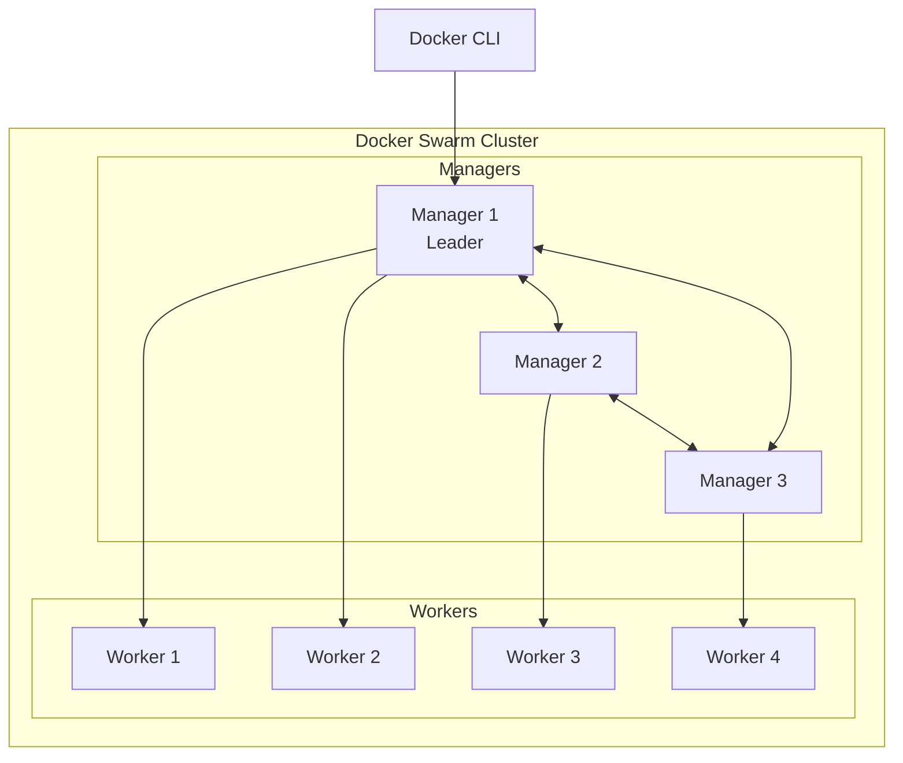
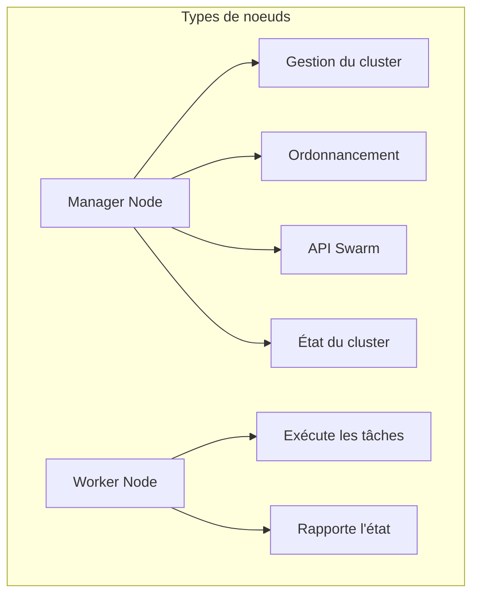
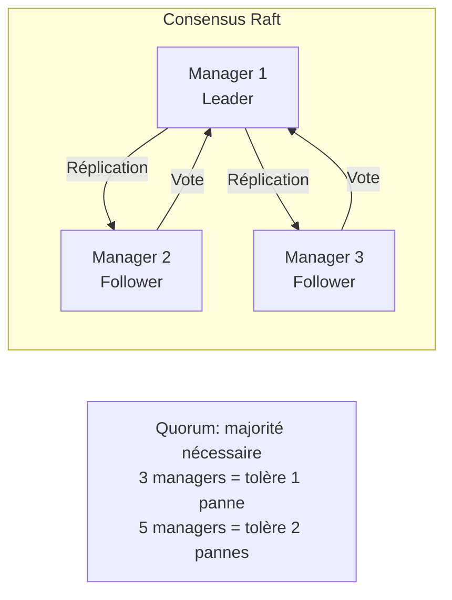
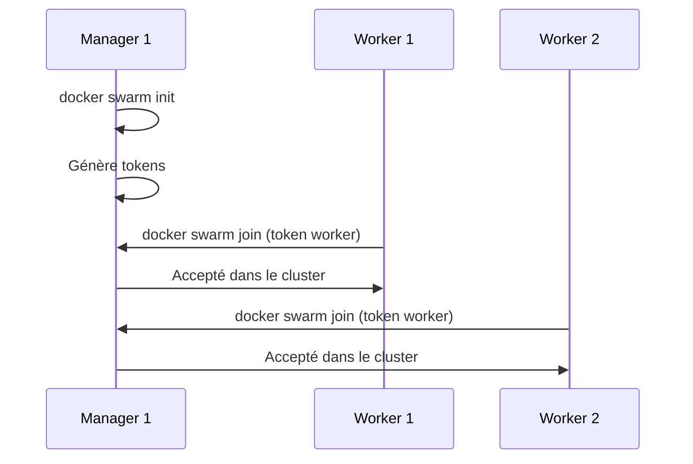
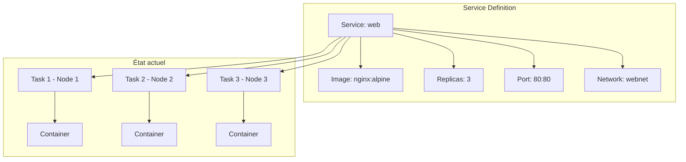
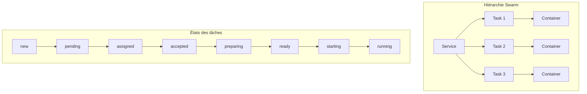
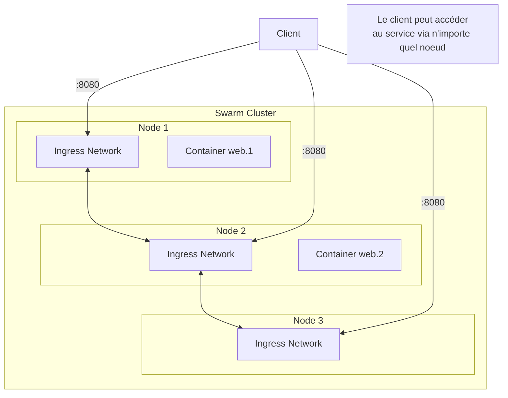
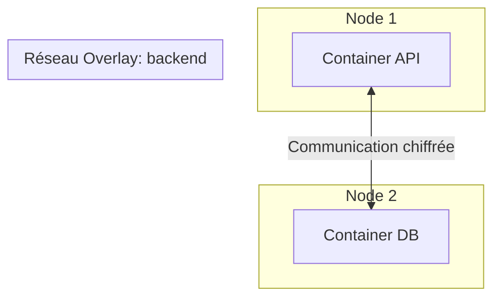
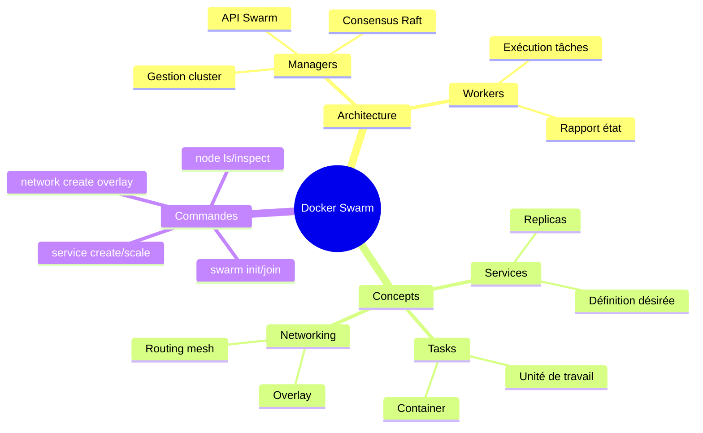

# Module 5 : Introduction à Docker Swarm

## Objectifs du module

- Comprendre les concepts fondamentaux de Docker Swarm
- Savoir initialiser et configurer un cluster Swarm
- Maîtriser l'architecture manager/worker
- Déployer des premiers services

---

## 5.1 Qu'est-ce que Docker Swarm ?

### Le problème : gérer plusieurs serveurs

Jusqu'ici, vous avez lancé des containers sur une seule machine. Mais que se passe-t-il quand :
- Votre application a besoin de plus de ressources qu'une seule machine ?
- Vous voulez que votre application continue de fonctionner si un serveur tombe en panne ?
- Vous devez mettre à jour sans interruption de service ?

**La solution : l'orchestration de containers**

### Définition simple

**Docker Swarm** est l'outil d'orchestration natif de Docker. Il transforme plusieurs machines Docker en un seul "super-ordinateur" virtuel.

**Analogie :** Imaginez une équipe de cuisiniers (les serveurs). Sans chef (orchestrateur), chacun fait ce qu'il veut. Avec un chef (Swarm), il y a une coordination : les plats sont répartis, si un cuisinier est absent, les autres compensent.

### Ce que Swarm fait pour vous

| Fonctionnalité | Sans Swarm | Avec Swarm |
|----------------|------------|------------|
| Déploiement | Manuel sur chaque serveur | Automatique sur le cluster |
| Équilibrage de charge | À configurer séparément | Intégré automatiquement |
| Haute disponibilité | Très complexe à gérer | Automatique |
| Mise à jour | Arrêt du service | Sans interruption (rolling update) |
| Scaling | Connexion manuelle à chaque serveur | Une seule commande |

### Docker Swarm vs Kubernetes

| Aspect | Docker Swarm | Kubernetes |
|--------|--------------|------------|
| Complexité | Simple, facile à apprendre | Complexe, courbe d'apprentissage raide |
| Installation | Intégré à Docker | Installation séparée |
| Fonctionnalités | Essentielles | Très riches |
| Cas d'usage | Petites/moyennes applications | Grandes applications, multi-cloud |



---

## 5.2 Concepts clés

### Qu'est-ce qu'un Cluster ?

Un **cluster** est un groupe de machines (physiques ou virtuelles) qui travaillent ensemble comme une seule unité. Dans Swarm, ce groupe est composé de **noeuds** (nodes).

### Noeuds (Nodes)

Un **noeud** est simplement une machine (serveur) sur laquelle Docker est installé et qui participe au cluster Swarm. Il existe deux types de noeuds :



| Type | Rôle | Nombre recommandé |
|------|------|-------------------|
| Manager | Gestion, ordonnancement, décisions | 3 ou 5 (impair) |
| Worker | Exécution des containers | Selon la charge |

**Manager Node (le cerveau) :**
- Prend les décisions : où placer les containers, combien en lancer
- Maintient l'état du cluster (quels services tournent, où)
- Expose l'API Swarm (reçoit vos commandes `docker service`)
- Un manager peut aussi exécuter des containers (double casquette)

**Worker Node (les bras) :**
- Exécute les containers qu'on lui assigne
- Rapporte son état au manager ("je suis en vie", "le container X tourne")
- Ne prend aucune décision, obéit aux ordres

### Consensus Raft (pour les curieux)

**Pourquoi plusieurs managers ?**
Si vous n'avez qu'un manager et qu'il tombe en panne, tout le cluster est perdu. Avec plusieurs managers, le cluster survit.

**Comment ça fonctionne ?**
Les managers utilisent l'algorithme **Raft** pour se mettre d'accord sur l'état du cluster. C'est comme un vote démocratique.

**Le Quorum :** Pour prendre une décision, il faut la majorité des managers. C'est pourquoi on recommande un nombre **impair** :
- 3 managers : majorité = 2, tolère 1 panne
- 5 managers : majorité = 3, tolère 2 pannes
- 7 managers : majorité = 4, tolère 3 pannes (rarement nécessaire)



---

## 5.3 Initialisation d'un Swarm

### Mode single-node (développement)

```bash
# Initialiser le swarm
docker swarm init

# Sortie:
# Swarm initialized: current node (xxx) is now a manager.
# To add a worker to this swarm, run the following command:
#     docker swarm join --token SWMTKN-xxx 192.168.1.10:2377
```

### Mode multi-node

```bash
# Sur le premier manager
docker swarm init --advertise-addr 192.168.1.10

# Obtenir le token worker
docker swarm join-token worker

# Obtenir le token manager
docker swarm join-token manager

# Sur les workers
docker swarm join --token SWMTKN-xxx 192.168.1.10:2377

# Sur les autres managers
docker swarm join --token SWMTKN-xxx-manager 192.168.1.10:2377
```



---

## Exercice 1 (15 minutes)

### Initialiser un Swarm local

1. Vérifiez que Docker est en mode standalone :
   ```bash
   docker info | grep Swarm
   # Swarm: inactive
   ```

2. Initialisez le Swarm :
   ```bash
   docker swarm init
   ```

3. Vérifiez l'état :
   ```bash
   docker info | grep Swarm
   # Swarm: active
   
   docker node ls
   ```

4. Explorez les informations du noeud :
   ```bash
   docker node inspect self --pretty
   ```

5. Notez les tokens (pour référence) :
   ```bash
   docker swarm join-token worker
   docker swarm join-token manager
   ```

---

## 5.4 Services Swarm

### Différence entre Container et Service

| Concept | Container | Service |
|---------|-----------|---------|
| Portée | Une seule machine | Tout le cluster |
| Commande | `docker run` | `docker service create` |
| Réplication | Manuelle | Automatique |
| Haute dispo | Non | Oui (redémarrage auto) |
| Scaling | Manuel | `docker service scale` |

### Qu'est-ce qu'un Service ?

Un **service** est la définition de ce que vous voulez exécuter dans le cluster. Vous décrivez l'**état désiré** (je veux 3 instances de nginx) et Swarm s'assure que cet état est maintenu.

**Analogie :** C'est comme commander au restaurant. Vous dites "je veux 3 pizzas" (état désiré). Le restaurant (Swarm) s'occupe de les préparer et de les remplacer si l'une tombe par terre.



### Créer un service

```bash
# Service basique
docker service create --name web nginx:alpine

# Service avec replicas et port
docker service create \
    --name web \
    --replicas 3 \
    --publish 80:80 \
    nginx:alpine

# Service avec contraintes
docker service create \
    --name api \
    --replicas 2 \
    --constraint 'node.role==worker' \
    node:alpine
```

### Gestion des services

```bash
# Lister les services
docker service ls

# Détails d'un service
docker service ps web

# Inspecter un service
docker service inspect web --pretty

# Logs d'un service
docker service logs web
docker service logs -f web

# Supprimer un service
docker service rm web
```

---

## 5.5 Tâches et containers

### La hiérarchie Swarm

Pour comprendre Swarm, il faut connaître ces 3 niveaux :

1. **Service** : Ce que vous voulez (ex: "3 instances nginx")
2. **Task (Tâche)** : Une unité de travail assignée à un noeud
3. **Container** : L'exécution réelle de la tâche

```
Service "web" (replicas: 3)
    ├── Task web.1 → Container sur Node 1
    ├── Task web.2 → Container sur Node 2
    └── Task web.3 → Container sur Node 1
```

### Pourquoi cette distinction ?

Quand un container plante :
1. La **Task** est marquée comme échouée
2. Swarm crée une **nouvelle Task** pour remplacer l'ancienne
3. Un **nouveau Container** est démarré
4. Le **Service** reste intact avec ses 3 replicas



### Cycle de vie d'une tâche

```bash
# Observer les tâches
docker service ps web

# Sortie typique:
# ID            NAME    IMAGE         NODE      STATE
# abc123        web.1   nginx:alpine  node1     Running
# def456        web.2   nginx:alpine  node2     Running
# ghi789        web.3   nginx:alpine  node1     Running
```

---

## Exercice 2 (15 minutes)

### Créer et gérer des services

1. Créez un service nginx avec 3 replicas :
   ```bash
   docker service create \
       --name web \
       --replicas 3 \
       --publish 8080:80 \
       nginx:alpine
   ```

2. Vérifiez le service :
   ```bash
   docker service ls
   docker service ps web
   ```

3. Accédez au service :
   ```bash
   curl http://localhost:8080
   ```

4. Consultez les logs :
   ```bash
   docker service logs web
   ```

5. Inspectez le service :
   ```bash
   docker service inspect web --pretty
   ```

6. Nettoyez :
   ```bash
   docker service rm web
   ```

---

## 5.6 Routing Mesh

### Le problème

Imaginez un cluster de 3 noeuds. Votre service web tourne sur les noeuds 1 et 2, mais pas sur le noeud 3. Un client envoie une requête au noeud 3... que se passe-t-il ?

**Sans Routing Mesh :** Erreur - le noeud 3 ne sait pas quoi faire.
**Avec Routing Mesh :** Le noeud 3 redirige automatiquement vers un noeud qui a le service.

### Définition

Le **Routing Mesh** est un réseau virtuel qui permet d'accéder à un service depuis **n'importe quel noeud** du cluster, même si le container ne tourne pas sur ce noeud.



### Fonctionnement

```bash
# Le port publié est disponible sur TOUS les noeuds
docker service create \
    --name web \
    --replicas 2 \
    --publish 8080:80 \
    nginx:alpine

# Même si Node 3 n'a pas de container web,
# curl http://node3:8080 fonctionne
```

---

## 5.7 Réseaux Overlay

### Le problème des réseaux Docker classiques

Les réseaux Docker "bridge" que vous connaissez ne fonctionnent que sur une seule machine. Deux containers sur deux machines différentes ne peuvent pas se parler via un réseau bridge.

### La solution : les réseaux Overlay

Un **réseau Overlay** crée un réseau virtuel qui s'étend sur plusieurs machines. Les containers sur différents noeuds peuvent communiquer comme s'ils étaient sur la même machine.

**Analogie :** C'est comme un VPN d'entreprise. Les employés à Paris et Lyon peuvent accéder aux mêmes ressources comme s'ils étaient dans le même bureau.

### Avantages des réseaux Overlay

- **Communication multi-noeud** : Containers sur différentes machines peuvent se parler
- **Isolation** : Chaque réseau overlay est isolé des autres
- **Chiffrement** : Option pour chiffrer le trafic entre noeuds
- **DNS intégré** : Les services sont accessibles par leur nom



### Création et utilisation

```bash
# Créer un réseau overlay
docker network create --driver overlay backend

# Utiliser avec un service
docker service create \
    --name api \
    --network backend \
    --replicas 3 \
    myapi:latest

docker service create \
    --name db \
    --network backend \
    postgres:15
```

---

## Exercice 3 (15 minutes)

### Services avec réseau overlay

1. Créez un réseau overlay :
   ```bash
   docker network create --driver overlay app-network
   ```

2. Déployez Redis sur ce réseau :
   ```bash
   docker service create \
       --name redis \
       --network app-network \
       redis:alpine
   ```

3. Déployez un service de test :
   ```bash
   docker service create \
       --name test-app \
       --network app-network \
       alpine sleep 3600
   ```

4. Testez la connectivité DNS :
   ```bash
   # Trouver l'ID du container
   docker ps --filter "name=test-app"
   
   # Tester la résolution DNS
   docker exec <CONTAINER_ID> ping -c 3 redis
   ```

5. Vérifiez le réseau :
   ```bash
   docker network inspect app-network
   ```

6. Nettoyez :
   ```bash
   docker service rm redis test-app
   docker network rm app-network
   ```

---

## 5.8 Commandes essentielles Swarm

```bash
# Gestion du cluster
docker swarm init
docker swarm join
docker swarm leave
docker swarm join-token [worker|manager]

# Gestion des noeuds
docker node ls
docker node inspect NODE
docker node update NODE
docker node rm NODE
docker node promote NODE
docker node demote NODE

# Gestion des services
docker service create
docker service ls
docker service ps SERVICE
docker service logs SERVICE
docker service inspect SERVICE
docker service update SERVICE
docker service scale SERVICE=N
docker service rm SERVICE
```

---

## Résumé du module



---

## Quiz de validation

1. Quelle est la différence entre un manager et un worker dans Swarm ?
2. Pourquoi recommande-t-on un nombre impair de managers ?
3. Qu'est-ce qu'un service dans Docker Swarm ?
4. Comment fonctionne le routing mesh ?
5. À quoi sert un réseau overlay ?
