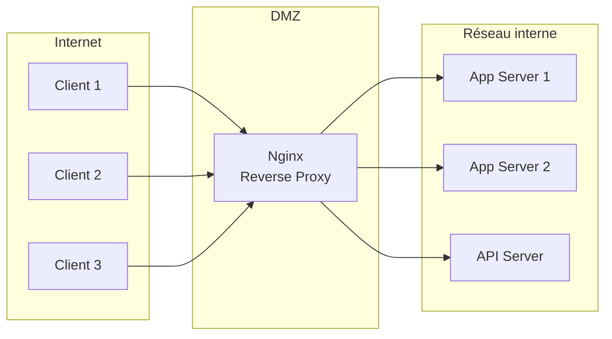
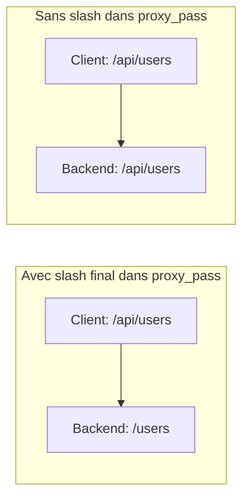
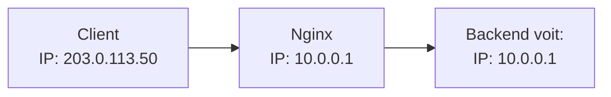
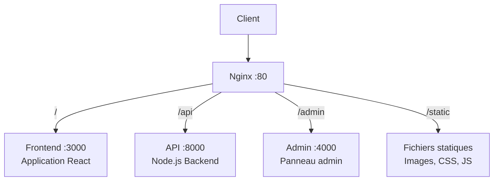
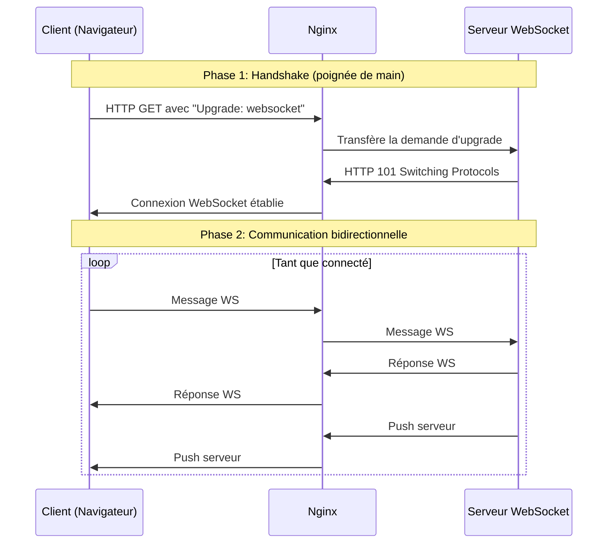
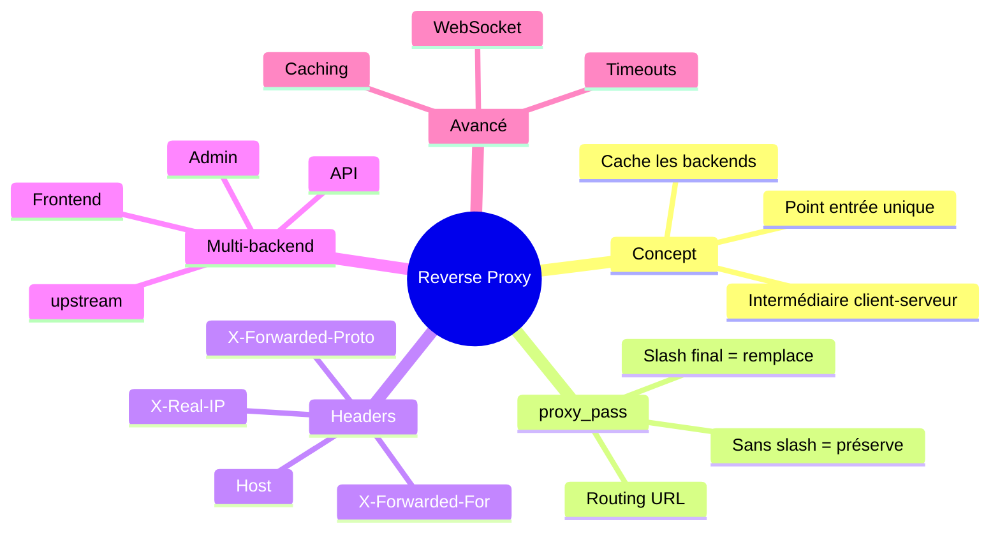

# Module 9 : Nginx comme Reverse Proxy

## Objectifs du module

- Comprendre le concept de reverse proxy
- Configurer Nginx pour router vers des backends
- Gérer les headers HTTP
- Router vers plusieurs services (frontend/backend)

---

## 9.1 Qu'est-ce qu'un Reverse Proxy ?

### Définition simple

Un **reverse proxy** est un serveur intermédiaire qui se place entre les clients (navigateurs web) et vos serveurs backend. Au lieu que les clients communiquent directement avec vos applications, ils passent par le reverse proxy qui relaie les requêtes.

**Analogie :** Imaginez un réceptionniste d'hôtel. Les visiteurs (clients) ne vont pas directement dans les chambres (serveurs). Ils passent par le réceptionniste (reverse proxy) qui les dirige vers la bonne destination.

### Différence entre Proxy et Reverse Proxy

| Type | Direction | Utilisation |
|------|-----------|-------------|
| **Proxy (forward)** | Client → Proxy → Internet | Cacher l'identité du client |
| **Reverse Proxy** | Internet → Proxy → Serveurs | Cacher et protéger les serveurs |



### Pourquoi utiliser un Reverse Proxy ?

| Avantage | Explication détaillée |
|----------|----------------------|
| **Sécurité** | Les serveurs backend ne sont jamais exposés directement à Internet. Seul le reverse proxy est visible. Si un attaquant veut atteindre vos serveurs, il doit d'abord passer par Nginx. |
| **SSL/TLS centralisé** | Au lieu de configurer HTTPS sur chaque serveur, vous le configurez une seule fois sur Nginx. Les communications internes peuvent rester en HTTP simple. |
| **Cache** | Nginx peut mémoriser les réponses fréquentes et les servir directement sans solliciter le backend, ce qui accélère le site. |
| **Compression** | Nginx compresse automatiquement les réponses (gzip) pour réduire la bande passante. |
| **Load balancing** | Distribue le trafic entre plusieurs serveurs pour éviter la surcharge. |
| **Point d'entrée unique** | Un seul port (80/443) pour accéder à tous vos services. |

---

## 9.2 Configuration proxy_pass

### Qu'est-ce que proxy_pass ?

La directive `proxy_pass` indique à Nginx de transférer la requête vers un autre serveur. C'est la directive fondamentale du reverse proxy.

### Syntaxe de base

```nginx
server {
    listen 80;                    # Nginx écoute sur le port 80
    server_name example.com;      # Pour les requêtes vers example.com
    
    location / {
        proxy_pass http://backend:3000;  # Transfère vers le backend sur le port 3000
    }
}
```

**Explication ligne par ligne :**
1. `listen 80` : Nginx accepte les connexions sur le port 80 (HTTP standard)
2. `server_name` : Filtre les requêtes par nom de domaine
3. `location /` : Correspond à toutes les URLs commençant par /
4. `proxy_pass` : URL du serveur destination (peut être une IP, un nom DNS, ou un nom de container Docker)

### Le comportement du slash final (très important !)

La présence ou l'absence d'un slash (`/`) à la fin de l'URL dans `proxy_pass` change complètement le comportement :

```nginx
# AVEC slash final - Le chemin /api/ est REMPLACÉ
location /api/ {
    proxy_pass http://backend:3000/;
    # Requête: /api/users → Backend reçoit: /users
    # Le "/api/" est retiré !
}

# SANS slash - Le chemin /api/ est PRÉSERVÉ  
location /api/ {
    proxy_pass http://backend:3000;
    # Requête: /api/users → Backend reçoit: /api/users
    # Le chemin complet est gardé
}
```



**Règle simple à retenir :**
- Slash final = "remplace le préfixe"
- Pas de slash = "garde tout le chemin"

---

## 9.3 Headers du proxy

### Pourquoi les headers sont-ils importants ?

Quand Nginx fait le proxy, le serveur backend ne voit plus le vrai client. Il voit Nginx comme client. Les headers permettent de transmettre les informations originales du client.

### Le problème sans headers



Le backend pense que toutes les requêtes viennent de Nginx (10.0.0.1) !

### La solution : les headers X-Forwarded

```nginx
location / {
    proxy_pass http://backend:3000;
    
    # Transmet l'IP réelle du client
    proxy_set_header X-Real-IP $remote_addr;
    
    # Liste de toutes les IPs traversées (client + proxies)
    proxy_set_header X-Forwarded-For $proxy_add_x_forwarded_for;
    
    # Transmet le nom d'hôte original demandé par le client
    proxy_set_header Host $host;
    
    # Indique si la requête originale était en HTTP ou HTTPS
    proxy_set_header X-Forwarded-Proto $scheme;
    
    # Transmet le port original
    proxy_set_header X-Forwarded-Port $server_port;
}
```

### Explication de chaque header

| Header | Variable Nginx | Utilité |
|--------|----------------|---------|
| `X-Real-IP` | `$remote_addr` | IP du client direct (dernier proxy ou client) |
| `X-Forwarded-For` | `$proxy_add_x_forwarded_for` | Chaîne d'IPs : client, proxy1, proxy2... |
| `Host` | `$host` | Le domaine demandé (ex: www.example.com) |
| `X-Forwarded-Proto` | `$scheme` | http ou https |

### Configuration des timeouts

Les timeouts définissent combien de temps Nginx attend avant d'abandonner une connexion :

```nginx
location / {
    proxy_pass http://backend:3000;
    
    # Temps max pour établir la connexion avec le backend
    proxy_connect_timeout 60s;
    
    # Temps max pour envoyer une requête au backend
    proxy_send_timeout 60s;
    
    # Temps max pour recevoir une réponse du backend
    proxy_read_timeout 60s;
    
    # Taille des buffers pour stocker les réponses
    proxy_buffer_size 4k;
    proxy_buffers 8 4k;
}
```

**Conseil :** Augmentez `proxy_read_timeout` pour les opérations longues (uploads, rapports, etc.)

---

## Exercice 1 (15 minutes)

### Configurer un reverse proxy simple

1. Créez un réseau Docker :
   ```bash
   docker network create proxy-net
   ```

2. Lancez une application backend :
   ```bash
   docker run -d --name backend \
       --network proxy-net \
       hashicorp/http-echo -text="Hello from backend"
   ```

3. Créez la configuration Nginx :
   ```bash
   mkdir ~/proxy-demo && cd ~/proxy-demo
   
   cat > nginx.conf << 'EOF'
   events { worker_connections 1024; }
   
   http {
       server {
           listen 80;
           
           location / {
               proxy_pass http://backend:5678;
               proxy_set_header Host $host;
               proxy_set_header X-Real-IP $remote_addr;
               proxy_set_header X-Forwarded-For $proxy_add_x_forwarded_for;
           }
       }
   }
   EOF
   ```

4. Lancez Nginx :
   ```bash
   docker run -d --name proxy \
       --network proxy-net \
       -p 8080:80 \
       -v $(pwd)/nginx.conf:/etc/nginx/nginx.conf:ro \
       nginx:alpine
   ```

5. Testez :
   ```bash
   curl http://localhost:8080
   curl -v http://localhost:8080
   ```

6. Nettoyez :
   ```bash
   docker rm -f proxy backend
   docker network rm proxy-net
   cd ~ && rm -rf ~/proxy-demo
   ```

---

## 9.4 Routage vers plusieurs backends

### Cas d'usage typique

Dans une application moderne, vous avez souvent plusieurs services :
- Un **frontend** (React, Vue, Angular) sur le port 3000
- Une **API backend** (Node.js, Python, Java) sur le port 8000
- Un **panneau d'administration** sur le port 4000
- Des **fichiers statiques** (images, CSS, JS)

Le reverse proxy permet d'exposer tout cela sur un seul domaine avec des chemins différents.



### La directive upstream

`upstream` définit un groupe de serveurs backend. Cela permet :
- De donner un nom logique à vos backends
- De configurer le load balancing
- De gérer les serveurs de secours

```nginx
http {
    # Définition des groupes de serveurs
    upstream frontend {
        server frontend:3000;    # Container Docker "frontend"
    }
    
    upstream api {
        server api:8000;         # Container Docker "api"
    }
    
    upstream admin {
        server admin:4000;       # Container Docker "admin"
    }
    
    server {
        listen 80;
        
        # Page d'accueil → Frontend (SPA React/Vue)
        location / {
            proxy_pass http://frontend;
            proxy_set_header Host $host;
            proxy_set_header X-Real-IP $remote_addr;
        }
        
        # Routes /api/* → Backend API
        location /api/ {
            proxy_pass http://api/;  # Slash final : /api/users → /users
            proxy_set_header Host $host;
            proxy_set_header X-Real-IP $remote_addr;
            proxy_set_header X-Forwarded-For $proxy_add_x_forwarded_for;
            proxy_set_header X-Forwarded-Proto $scheme;
        }
        
        # Routes /admin/* → Panneau d'administration
        location /admin/ {
            proxy_pass http://admin/;
            proxy_set_header Host $host;
        }
        
        # Fichiers statiques servis directement par Nginx (plus rapide)
        location /static/ {
            alias /var/www/static/;
            expires 30d;  # Cache navigateur de 30 jours
            add_header Cache-Control "public, immutable";
        }
    }
}
```

---

## Exercice 2 (15 minutes)

### Multi-backend avec frontend et API

1. Préparez l'environnement :
   ```bash
   mkdir ~/multi-backend && cd ~/multi-backend
   docker network create app-net
   ```

2. Lancez le "frontend" :
   ```bash
   docker run -d --name frontend \
       --network app-net \
       hashicorp/http-echo -text="Frontend Response"
   ```

3. Lancez l'"API" :
   ```bash
   docker run -d --name api \
       --network app-net \
       hashicorp/http-echo -text="API Response" -listen=:5679
   ```

4. Configuration Nginx :
   ```bash
   cat > nginx.conf << 'EOF'
   events { worker_connections 1024; }
   
   http {
       upstream frontend {
           server frontend:5678;
       }
       
       upstream api {
           server api:5679;
       }
       
       server {
           listen 80;
           
           location / {
               proxy_pass http://frontend;
               proxy_set_header Host $host;
           }
           
           location /api/ {
               proxy_pass http://api/;
               proxy_set_header Host $host;
               proxy_set_header X-Real-IP $remote_addr;
           }
       }
   }
   EOF
   ```

5. Lancez le proxy :
   ```bash
   docker run -d --name nginx-proxy \
       --network app-net \
       -p 8080:80 \
       -v $(pwd)/nginx.conf:/etc/nginx/nginx.conf:ro \
       nginx:alpine
   ```

6. Testez les routes :
   ```bash
   echo "Frontend:" && curl http://localhost:8080/
   echo "API:" && curl http://localhost:8080/api/
   echo "API endpoint:" && curl http://localhost:8080/api/users
   ```

7. Nettoyez :
   ```bash
   docker rm -f nginx-proxy frontend api
   docker network rm app-net
   cd ~ && rm -rf ~/multi-backend
   ```

---

## 9.5 WebSocket Proxy

### Qu'est-ce qu'un WebSocket ?

**HTTP classique** fonctionne en requête-réponse : le client demande, le serveur répond, puis la connexion se ferme. C'est comme envoyer une lettre et attendre la réponse.

**WebSocket** est un protocole qui maintient une connexion permanente bidirectionnelle entre le client et le serveur. C'est comme un appel téléphonique : une fois connecté, les deux parties peuvent parler à tout moment.

### Cas d'utilisation des WebSockets

| Application | Pourquoi WebSocket ? |
|-------------|---------------------|
| Chat en temps réel | Messages instantanés sans rafraîchir |
| Jeux multijoueurs | Synchronisation en temps réel |
| Trading/Bourse | Prix mis à jour en continu |
| Notifications push | Alertes instantanées |
| Collaboration (Google Docs) | Voir les modifications des autres en direct |

### Comment fonctionne la connexion WebSocket ?



### Configuration Nginx pour WebSocket

```nginx
http {
    # Cette directive "map" crée une variable conditionnelle
    # Si le header "Upgrade" contient quelque chose → "upgrade"
    # Sinon → "close"
    map $http_upgrade $connection_upgrade {
        default upgrade;
        '' close;
    }
    
    server {
        listen 80;
        
        # Endpoint WebSocket
        location /ws/ {
            proxy_pass http://websocket-server:8080;
            
            # OBLIGATOIRE pour WebSocket : utiliser HTTP/1.1
            proxy_http_version 1.1;
            
            # Ces headers permettent l'upgrade de HTTP vers WebSocket
            proxy_set_header Upgrade $http_upgrade;
            proxy_set_header Connection $connection_upgrade;
            
            proxy_set_header Host $host;
            
            # Timeout long car la connexion reste ouverte
            # 86400 secondes = 24 heures
            proxy_read_timeout 86400;
        }
    }
}
```

### Explication des directives WebSocket

| Directive | Explication |
|-----------|-------------|
| `proxy_http_version 1.1` | WebSocket nécessite HTTP/1.1 (pas HTTP/1.0) |
| `Upgrade $http_upgrade` | Transmet le header "Upgrade: websocket" |
| `Connection $connection_upgrade` | Indique que la connexion doit être maintenue |
| `proxy_read_timeout 86400` | Garde la connexion ouverte 24h sans activité |

---

## 9.6 Caching (Mise en cache)

### Qu'est-ce que le cache proxy ?

Le cache permet à Nginx de sauvegarder les réponses du backend et de les resservir directement sans interroger le backend à chaque fois.

**Sans cache :**
```
Client → Nginx → Backend → Base de données → Backend → Nginx → Client
(À chaque requête, tout ce chemin est parcouru)
```

**Avec cache :**
```
Requête 1: Client → Nginx → Backend → ... → Nginx (sauvegarde) → Client
Requête 2: Client → Nginx (répond depuis le cache) → Client
```

### Avantages du cache

- **Performance** : Réponses instantanées sans attendre le backend
- **Économie de ressources** : Moins de charge sur le backend et la BDD
- **Résilience** : Peut servir du contenu même si le backend est lent

### Configuration du cache

```nginx
http {
    # Définition de la zone de cache
    # /var/cache/nginx : dossier de stockage
    # levels=1:2 : structure des sous-dossiers
    # keys_zone=my_cache:10m : 10MB de mémoire pour les clés
    # max_size=1g : maximum 1GB sur disque
    # inactive=60m : supprime après 60min sans accès
    proxy_cache_path /var/cache/nginx 
                     levels=1:2 
                     keys_zone=my_cache:10m 
                     max_size=1g 
                     inactive=60m;
    
    server {
        listen 80;
        
        # Pages statiques : cache activé
        location / {
            proxy_pass http://backend;
            
            # Active le cache
            proxy_cache my_cache;
            
            # Durée de cache selon le code HTTP
            proxy_cache_valid 200 302 10m;  # Succès : 10 minutes
            proxy_cache_valid 404 1m;        # Erreur 404 : 1 minute
            
            # Header pour débugger (voir si cache HIT ou MISS)
            add_header X-Cache-Status $upstream_cache_status;
        }
        
        # API : PAS de cache (données dynamiques)
        location /api/ {
            proxy_pass http://api;
            proxy_cache off;  # Désactive explicitement le cache
        }
    }
}
```

### Valeurs de X-Cache-Status

| Valeur | Signification |
|--------|---------------|
| `HIT` | Réponse servie depuis le cache |
| `MISS` | Pas en cache, requête envoyée au backend |
| `EXPIRED` | Cache expiré, nouvelle requête au backend |
| `BYPASS` | Cache ignoré (ex: requête POST) |

---

## Exercice 3 (15 minutes)

### Proxy avec headers personnalisés

1. Préparez :
   ```bash
   mkdir ~/header-demo && cd ~/header-demo
   docker network create header-net
   ```

2. Backend qui affiche les headers :
   ```bash
   docker run -d --name header-backend \
       --network header-net \
       nginx:alpine
   
   docker exec header-backend sh -c 'cat > /etc/nginx/conf.d/default.conf << EOF
   server {
       listen 80;
       location / {
           return 200 "Headers reçus:\nHost: \$host\nX-Real-IP: \$http_x_real_ip\nX-Forwarded-For: \$http_x_forwarded_for\nX-Forwarded-Proto: \$http_x_forwarded_proto\n";
           add_header Content-Type text/plain;
       }
   }
   EOF'
   docker exec header-backend nginx -s reload
   ```

3. Configuration du proxy :
   ```bash
   cat > nginx.conf << 'EOF'
   events { worker_connections 1024; }
   
   http {
       server {
           listen 80;
           
           location / {
               proxy_pass http://header-backend;
               
               proxy_set_header Host $host;
               proxy_set_header X-Real-IP $remote_addr;
               proxy_set_header X-Forwarded-For $proxy_add_x_forwarded_for;
               proxy_set_header X-Forwarded-Proto $scheme;
               proxy_set_header X-Custom-Header "ValeurCustom";
           }
       }
   }
   EOF
   ```

4. Lancez et testez :
   ```bash
   docker run -d --name header-proxy \
       --network header-net \
       -p 8080:80 \
       -v $(pwd)/nginx.conf:/etc/nginx/nginx.conf:ro \
       nginx:alpine
   
   curl http://localhost:8080
   ```

5. Nettoyez :
   ```bash
   docker rm -f header-proxy header-backend
   docker network rm header-net
   cd ~ && rm -rf ~/header-demo
   ```

---

## Résumé du module



---

## Quiz de validation

1. Quelle est la différence entre proxy avec et sans slash final dans l'URL ?
2. Pourquoi est-il important de transmettre le header X-Real-IP ?
3. Comment configurer Nginx pour router /api vers un serveur et / vers un autre ?
4. Quels headers sont nécessaires pour proxyfier les WebSockets ?
5. Comment désactiver le cache pour certaines routes ?
