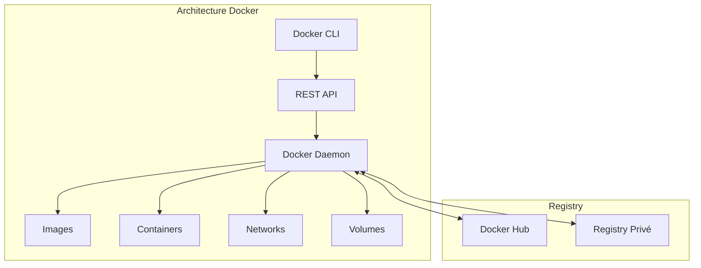
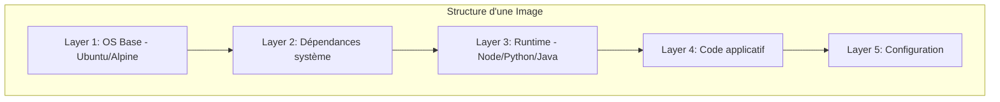
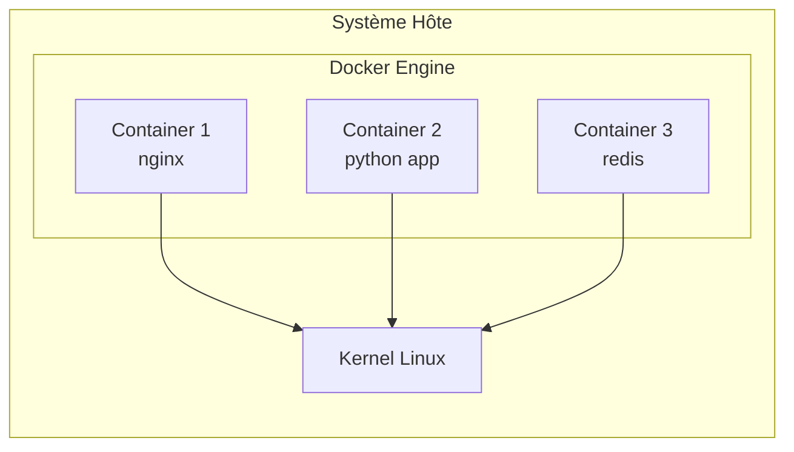
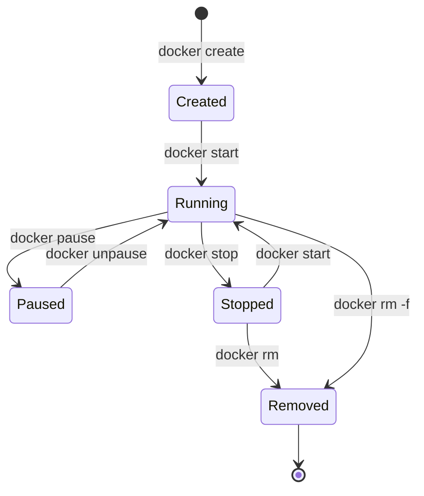
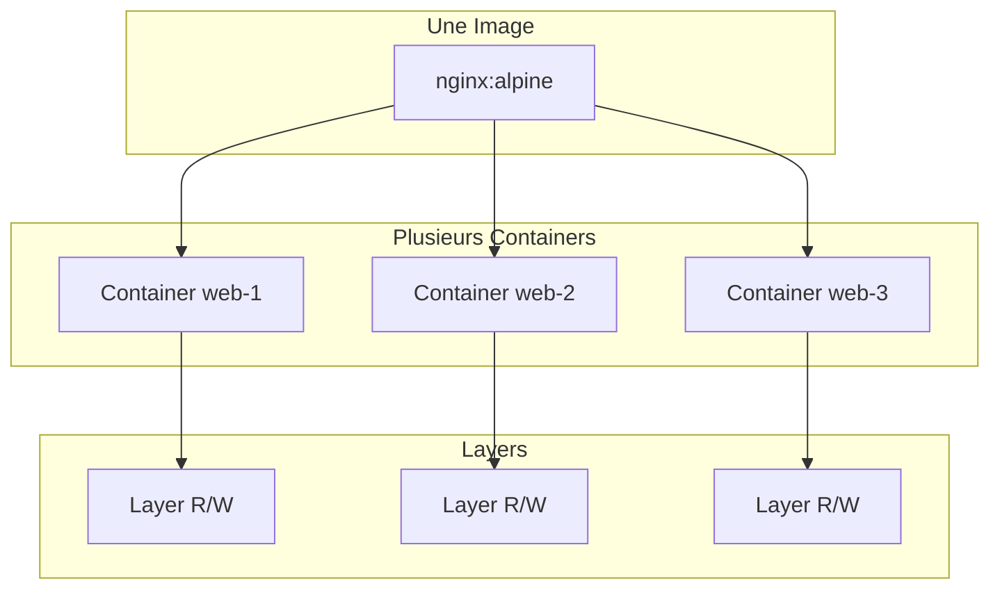
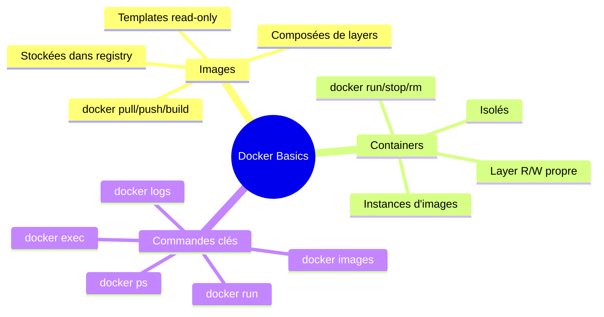

# Module 1 : Rappel Docker - Images et Containers

## Objectifs du module

- Comprendre la différence entre une image et un container
- Maîtriser les commandes de base Docker
- Savoir gérer le cycle de vie des containers

---

## 1.1 Architecture Docker

Docker utilise une architecture client-serveur. Le daemon Docker gère les objets Docker (images, containers, réseaux, volumes).



---

## 1.2 Images Docker

Une **image** est un template en lecture seule contenant les instructions pour créer un container. Elle est composée de plusieurs couches (layers).



### Commandes essentielles pour les images

```bash
# Lister les images locales
docker images
docker image ls

# Télécharger une image depuis le registry
docker pull nginx:latest
docker pull ubuntu:22.04

# Supprimer une image
docker rmi nginx:latest
docker image rm nginx:latest

# Inspecter une image
docker image inspect nginx:latest

# Historique des layers
docker history nginx:latest

# Rechercher une image sur Docker Hub
docker search nginx
```

---

## Exercice 1 (15 minutes)

### Manipulation des images

1. Téléchargez les images suivantes :
   - `nginx:alpine`
   - `python:3.11-slim`
   - `redis:7`

2. Listez toutes les images et notez leur taille

3. Affichez l'historique de l'image `nginx:alpine`

4. Supprimez l'image `redis:7`

**Commandes attendues :**

```bash
docker pull nginx:alpine
docker pull python:3.11-slim
docker pull redis:7
docker images
docker history nginx:alpine
docker rmi redis:7
```

---

## 1.3 Containers Docker

Un **container** est une instance exécutable d'une image. Il est isolé du système hôte et des autres containers.



### Cycle de vie d'un container



### Commandes essentielles pour les containers

```bash
# Créer et démarrer un container
docker run nginx:alpine

# Exécuter en arrière-plan (detached)
docker run -d nginx:alpine

# Nommer un container
docker run -d --name mon-nginx nginx:alpine

# Mapper un port
docker run -d -p 8080:80 --name web nginx:alpine

# Lister les containers en cours
docker ps

# Lister tous les containers (y compris arrêtés)
docker ps -a

# Arrêter un container
docker stop mon-nginx

# Démarrer un container arrêté
docker start mon-nginx

# Redémarrer un container
docker restart mon-nginx

# Supprimer un container
docker rm mon-nginx

# Supprimer un container en cours d'exécution
docker rm -f mon-nginx

# Voir les logs
docker logs mon-nginx
docker logs -f mon-nginx  # suivre en temps réel

# Exécuter une commande dans un container
docker exec -it mon-nginx /bin/sh
```

---

## Exercice 2 (15 minutes)

### Gestion des containers

1. Créez un container nginx nommé `web-test` exposé sur le port 8080

2. Vérifiez qu'il fonctionne en accédant à http://localhost:8080

3. Consultez les logs du container

4. Entrez dans le container et listez le contenu de `/usr/share/nginx/html`

5. Arrêtez et supprimez le container

**Solution :**

```bash
docker run -d -p 8080:80 --name web-test nginx:alpine
curl http://localhost:8080
docker logs web-test
docker exec -it web-test /bin/sh
# Dans le container: ls /usr/share/nginx/html
# exit
docker stop web-test
docker rm web-test
```

---

## 1.4 Différence Image vs Container

| Aspect | Image | Container |
|--------|-------|-----------|
| Nature | Template statique | Instance en exécution |
| Modification | Immuable (read-only) | Modifiable (layer R/W) |
| Stockage | Partagé entre containers | Propre à chaque instance |
| Création | `docker build` ou `docker pull` | `docker run` ou `docker create` |
| Persistance | Permanente | Temporaire (sauf volumes) |



---

## Exercice 3 (15 minutes)

### Comprendre la relation Image/Container

1. Créez 3 containers à partir de la même image `nginx:alpine` :
   - `web-1` sur le port 8081
   - `web-2` sur le port 8082
   - `web-3` sur le port 8083

2. Modifiez le fichier `index.html` dans `web-1` :
   ```bash
   docker exec -it web-1 /bin/sh
   echo "Container 1" > /usr/share/nginx/html/index.html
   exit
   ```

3. Vérifiez que les autres containers n'ont pas été modifiés

4. Nettoyez tous les containers

**Questions :**
- Pourquoi la modification de web-1 n'affecte pas web-2 et web-3 ?
- Que se passe-t-il si on supprime et recrée web-1 ?

---

## 1.5 Bonnes pratiques

### Tags et versions

Toujours spécifier une version précise en production :

```bash
# Mauvaise pratique
docker pull nginx
docker pull nginx:latest

# Bonne pratique
docker pull nginx:1.25.3-alpine
```

### Nettoyage régulier

```bash
# Supprimer les containers arrêtés
docker container prune

# Supprimer les images non utilisées
docker image prune

# Supprimer tout ce qui n'est pas utilisé
docker system prune

# Voir l'espace disque utilisé
docker system df
```

---

## Résumé du module



---

## Quiz de validation

1. Quelle est la différence principale entre une image et un container ?
2. Quelle commande permet d'exécuter une commande dans un container en cours d'exécution ?
3. Comment voir les logs d'un container en temps réel ?
4. Pourquoi est-il déconseillé d'utiliser le tag `latest` en production ?
5. Quelle commande nettoie les ressources Docker non utilisées ?

