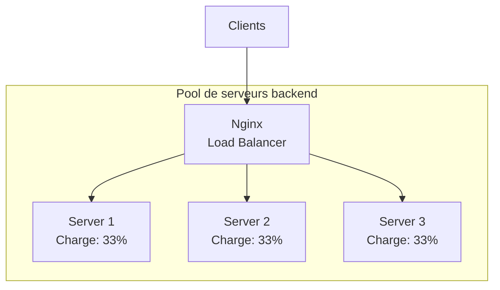
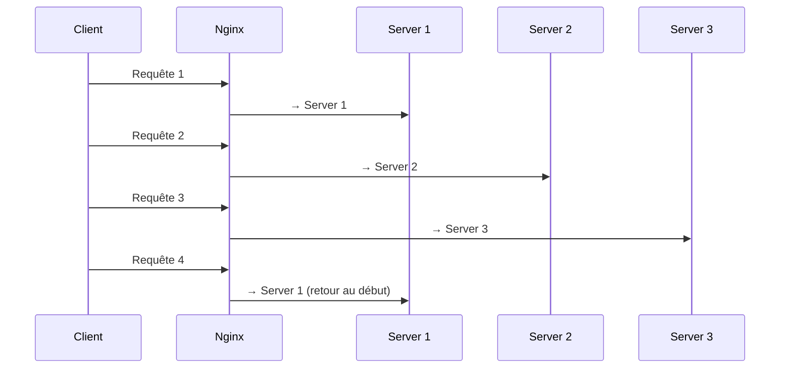
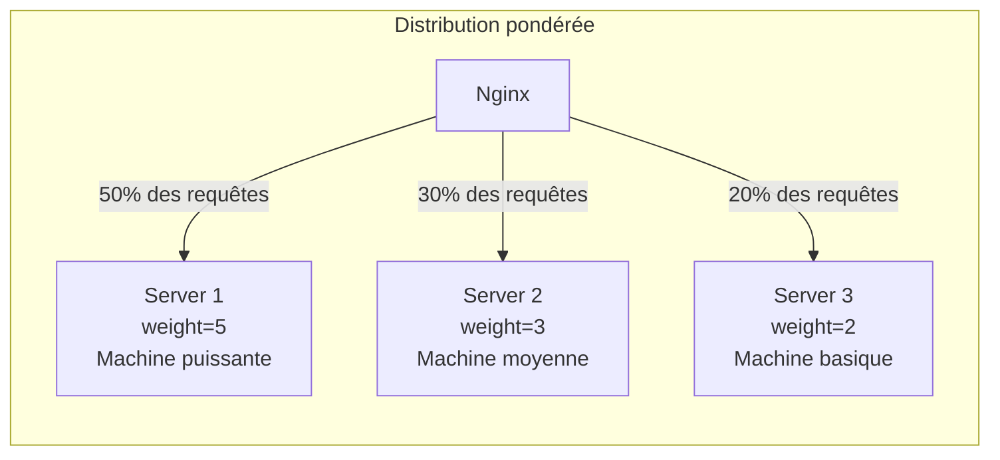
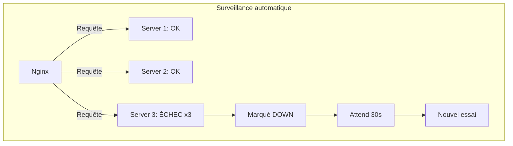
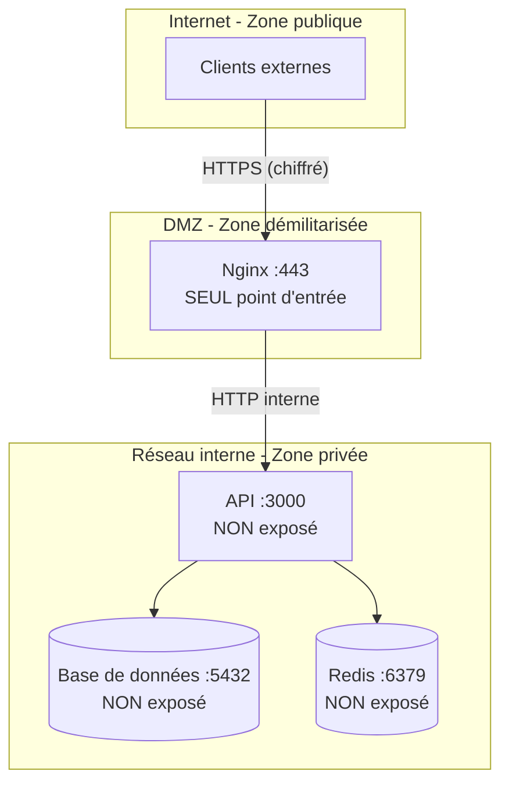
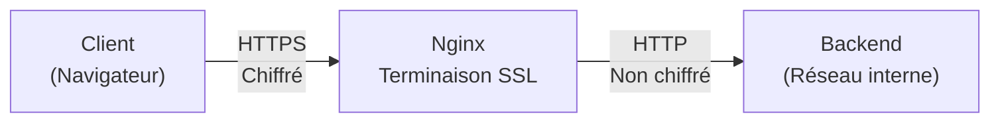
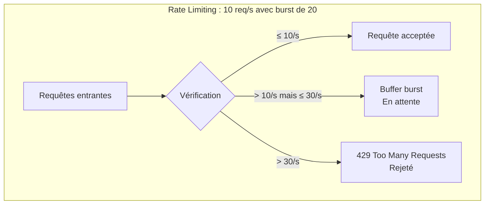
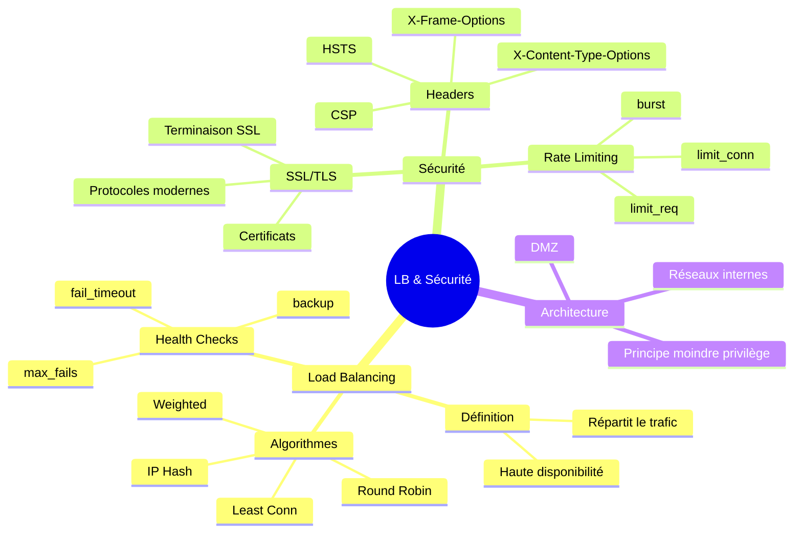

# Module 10 : Nginx Load Balancer et Sécurité

## Objectifs du module

- Configurer Nginx comme load balancer
- Maîtriser les algorithmes de distribution
- Sécuriser l'exposition des services
- Configurer SSL/TLS et les headers de sécurité

---

## 10.1 Load Balancing avec Nginx

### Qu'est-ce que le Load Balancing ?

Le **Load Balancing** (répartition de charge) est une technique qui distribue le trafic entrant entre plusieurs serveurs. Au lieu d'avoir un seul serveur qui gère toutes les requêtes, vous en avez plusieurs qui se partagent le travail.

**Analogie :** Imaginez une banque avec plusieurs guichets. Au lieu que tous les clients fassent la queue au même guichet, un agent les dirige vers différents guichets disponibles.

### Pourquoi faire du Load Balancing ?

| Avantage | Explication |
|----------|-------------|
| **Haute disponibilité** | Si un serveur tombe, les autres continuent de fonctionner |
| **Meilleure performance** | La charge est répartie, chaque serveur est moins sollicité |
| **Scalabilité** | Facile d'ajouter des serveurs quand le trafic augmente |
| **Maintenance sans interruption** | Vous pouvez mettre à jour un serveur pendant que les autres tournent |



### Configuration de base avec upstream

```nginx
http {
    # Définition du pool de serveurs
    # "backend" est le nom que vous donnez au groupe
    upstream backend {
        server backend1:8080;   # Premier serveur
        server backend2:8080;   # Deuxième serveur  
        server backend3:8080;   # Troisième serveur
    }
    
    server {
        listen 80;
        
        location / {
            # Nginx choisit automatiquement un serveur du pool
            proxy_pass http://backend;
        }
    }
}
```

---

## 10.2 Algorithmes de distribution

Nginx propose plusieurs algorithmes pour décider quel serveur recevra chaque requête.

### Round Robin (Défaut)

**Principe :** Chaque requête va au serveur suivant dans la liste, en boucle (1, 2, 3, 1, 2, 3...).

**Avantage :** Simple et équitable si tous les serveurs ont la même puissance.
**Inconvénient :** Ne tient pas compte de la charge actuelle des serveurs.

```nginx
upstream backend {
    # Round Robin par défaut (pas besoin de directive spéciale)
    server backend1:8080;
    server backend2:8080;
    server backend3:8080;
}
```



### Least Connections (Moins de connexions)

**Principe :** Envoie la requête au serveur qui a le moins de connexions actives.

**Avantage :** S'adapte à la charge réelle des serveurs.
**Quand l'utiliser :** Quand les requêtes ont des durées variables (certaines courtes, certaines longues).

```nginx
upstream backend {
    least_conn;  # Active l'algorithme "moins de connexions"
    server backend1:8080;
    server backend2:8080;
    server backend3:8080;
}
```

### IP Hash (Affinité de session)

**Principe :** Un client est toujours envoyé vers le même serveur (basé sur son IP).

**Avantage :** Utile si votre application stocke des données en session sur le serveur.
**Inconvénient :** Distribution moins équitable.

```nginx
upstream backend {
    ip_hash;  # Même IP = même serveur
    server backend1:8080;
    server backend2:8080;
    server backend3:8080;
}
```

**Exemple :** Un utilisateur se connecte, sa session est créée sur Server 1. Avec IP Hash, toutes ses requêtes suivantes iront vers Server 1 où se trouve sa session.

### Weighted (Pondéré)

**Principe :** Certains serveurs reçoivent plus de trafic que d'autres.

**Avantage :** Permet de diriger plus de trafic vers les serveurs plus puissants.

```nginx
upstream backend {
    server backend1:8080 weight=5;  # Reçoit 50% du trafic
    server backend2:8080 weight=3;  # Reçoit 30% du trafic
    server backend3:8080 weight=2;  # Reçoit 20% du trafic
}
```



### Comparatif des algorithmes

| Algorithme | Cas d'usage | Avantage | Inconvénient |
|------------|-------------|----------|--------------|
| Round Robin | Serveurs identiques | Simple | Ignore la charge |
| Least Conn | Requêtes longues | S'adapte | Plus de calculs |
| IP Hash | Sessions serveur | Affinité | Distribution inégale |
| Weighted | Serveurs hétérogènes | Flexible | Config manuelle |

---

## Exercice 1 (15 minutes)

### Load balancer avec plusieurs backends

1. Préparez :
   ```bash
   mkdir ~/lb-demo && cd ~/lb-demo
   docker network create lb-net
   ```

2. Lancez 3 backends identifiables :
   ```bash
   docker run -d --name backend1 --network lb-net \
       hashicorp/http-echo -text="Backend 1"
   docker run -d --name backend2 --network lb-net \
       hashicorp/http-echo -text="Backend 2"
   docker run -d --name backend3 --network lb-net \
       hashicorp/http-echo -text="Backend 3"
   ```

3. Configuration :
   ```bash
   cat > nginx.conf << 'EOF'
   events { worker_connections 1024; }
   
   http {
       upstream backends {
           server backend1:5678;
           server backend2:5678;
           server backend3:5678;
       }
       
       server {
           listen 80;
           
           location / {
               proxy_pass http://backends;
               proxy_set_header Host $host;
           }
       }
   }
   EOF
   ```

4. Lancez le load balancer :
   ```bash
   docker run -d --name lb \
       --network lb-net \
       -p 8080:80 \
       -v $(pwd)/nginx.conf:/etc/nginx/nginx.conf:ro \
       nginx:alpine
   ```

5. Testez la distribution (observez l'alternance) :
   ```bash
   for i in {1..9}; do curl -s http://localhost:8080; done
   ```

6. Nettoyez :
   ```bash
   docker rm -f lb backend1 backend2 backend3
   docker network rm lb-net
   cd ~ && rm -rf ~/lb-demo
   ```

---

## 10.3 Health Checks

### Qu'est-ce qu'un Health Check ?

Un **Health Check** est une vérification automatique de la santé des serveurs. Nginx surveille si les serveurs répondent correctement et retire automatiquement ceux qui sont en panne.

### Fonctionnement



### Configuration

```nginx
http {
    upstream backend {
        # max_fails : nombre d'échecs avant de marquer le serveur DOWN
        # fail_timeout : durée pendant laquelle le serveur reste DOWN
        server backend1:8080 max_fails=3 fail_timeout=30s;
        server backend2:8080 max_fails=3 fail_timeout=30s;
        
        # backup : n'est utilisé que si tous les autres sont DOWN
        server backend3:8080 backup;
    }
    
    server {
        listen 80;
        
        location / {
            proxy_pass http://backend;
            
            # Quand passer au serveur suivant
            # error : erreur de connexion
            # timeout : pas de réponse à temps
            # http_500, http_502, http_503 : erreurs serveur
            proxy_next_upstream error timeout http_500 http_502 http_503;
        }
    }
}
```

### Options importantes

| Option | Description | Exemple |
|--------|-------------|---------|
| `max_fails` | Nombre d'échecs avant exclusion | `max_fails=3` |
| `fail_timeout` | Durée d'exclusion | `fail_timeout=30s` |
| `backup` | Serveur de secours | `server x backup;` |
| `down` | Marque manuellement un serveur comme DOWN | `server x down;` |

---

## 10.4 Sécurité - Ports et Exposition

### Le principe de moindre privilège

**Règle d'or :** N'exposez à Internet que ce qui est strictement nécessaire.

Vos serveurs backend (API, base de données, cache) ne doivent jamais être accessibles directement depuis Internet. Seul Nginx doit être exposé.



### Configuration Docker sécurisée

```yaml
version: '3.8'

services:
  # Seul service exposé à l'extérieur
  nginx:
    image: nginx:alpine
    ports:
      - "80:80"      # HTTP exposé au monde
      - "443:443"    # HTTPS exposé au monde
    networks:
      - frontend     # Peut parler aux frontends
      - backend      # Peut parler aux backends

  # API - PAS de port exposé vers l'extérieur
  api:
    image: myapi
    # Remarquez : pas de section "ports" !
    networks:
      - backend      # Parle à Nginx et à la DB
      - database     # Parle à la base de données

  # Base de données - PAS de port exposé
  db:
    image: postgres
    # Pas de "ports" = invisible depuis Internet
    networks:
      - database     # Réseau isolé

networks:
  frontend:          # Réseau public (Nginx)
  backend:
    internal: true   # Réseau interne seulement !
  database:
    internal: true   # Réseau interne seulement !
```

### Pourquoi `internal: true` ?

Un réseau Docker marqué `internal: true` est complètement isolé d'Internet. Même si quelqu'un compromet un container, il ne peut pas sortir vers Internet depuis ce réseau.

---

## 10.5 Headers de sécurité

### Qu'est-ce que les headers de sécurité ?

Les headers HTTP de sécurité sont des instructions envoyées par le serveur au navigateur pour le protéger contre certaines attaques.

### Les attaques courantes et leurs protections

#### Clickjacking et X-Frame-Options

**L'attaque :** Un site malveillant intègre votre site dans une iframe invisible. L'utilisateur pense cliquer sur le site malveillant mais clique en réalité sur votre site (ex: bouton "Supprimer mon compte").

**La protection :**
```nginx
add_header X-Frame-Options "SAMEORIGIN" always;
```
- `DENY` : Jamais dans une iframe
- `SAMEORIGIN` : Seulement dans une iframe du même domaine

#### MIME Sniffing et X-Content-Type-Options

**L'attaque :** Le navigateur "devine" le type d'un fichier au lieu de faire confiance au serveur. Un fichier `.txt` contenant du JavaScript pourrait être exécuté.

**La protection :**
```nginx
add_header X-Content-Type-Options "nosniff" always;
```

#### XSS et X-XSS-Protection

**L'attaque (XSS) :** Un attaquant injecte du JavaScript malveillant dans votre page.

**La protection :**
```nginx
add_header X-XSS-Protection "1; mode=block" always;
```

#### Content Security Policy (CSP)

**L'attaque :** Scripts malveillants chargés depuis des sources externes.

**La protection :**
```nginx
add_header Content-Security-Policy "default-src 'self'; script-src 'self'; style-src 'self' 'unsafe-inline';" always;
```
- `default-src 'self'` : Par défaut, tout doit venir du même domaine
- `script-src 'self'` : JavaScript uniquement depuis votre domaine

### Configuration complète

```nginx
server {
    listen 80;
    
    # Empêche le clickjacking
    add_header X-Frame-Options "SAMEORIGIN" always;
    
    # Empêche le MIME sniffing
    add_header X-Content-Type-Options "nosniff" always;
    
    # Active la protection XSS du navigateur
    add_header X-XSS-Protection "1; mode=block" always;
    
    # Contrôle ce qui peut être envoyé comme referrer
    add_header Referrer-Policy "strict-origin-when-cross-origin" always;
    
    # Content Security Policy
    add_header Content-Security-Policy "default-src 'self';" always;
    
    # Cache la version de Nginx (sécurité par obscurité)
    server_tokens off;
    
    location / {
        proxy_pass http://backend;
    }
}
```

### Tableau récapitulatif

| Header | Protège contre | Valeur recommandée |
|--------|---------------|-------------------|
| `X-Frame-Options` | Clickjacking | `SAMEORIGIN` |
| `X-Content-Type-Options` | MIME sniffing | `nosniff` |
| `X-XSS-Protection` | XSS (ancien) | `1; mode=block` |
| `Content-Security-Policy` | XSS, injection | `default-src 'self'` |
| `Strict-Transport-Security` | Downgrade HTTPS | `max-age=31536000` |

---

## Exercice 2 (15 minutes)

### Headers de sécurité

1. Préparez :
   ```bash
   mkdir ~/secure-demo && cd ~/secure-demo
   docker network create secure-net
   
   docker run -d --name backend --network secure-net \
       hashicorp/http-echo -text="Secure Backend"
   ```

2. Configuration sécurisée :
   ```bash
   cat > nginx.conf << 'EOF'
   events { worker_connections 1024; }
   
   http {
       server_tokens off;
       
       server {
           listen 80;
           
           add_header X-Frame-Options "SAMEORIGIN" always;
           add_header X-Content-Type-Options "nosniff" always;
           add_header X-XSS-Protection "1; mode=block" always;
           add_header Referrer-Policy "strict-origin-when-cross-origin" always;
           
           location / {
               proxy_pass http://backend:5678;
               proxy_set_header Host $host;
               proxy_hide_header X-Powered-By;
           }
       }
   }
   EOF
   ```

3. Lancez :
   ```bash
   docker run -d --name secure-proxy \
       --network secure-net \
       -p 8080:80 \
       -v $(pwd)/nginx.conf:/etc/nginx/nginx.conf:ro \
       nginx:alpine
   ```

4. Vérifiez les headers (vous devriez voir les headers de sécurité) :
   ```bash
   curl -I http://localhost:8080
   ```

5. Nettoyez :
   ```bash
   docker rm -f secure-proxy backend
   docker network rm secure-net
   cd ~ && rm -rf ~/secure-demo
   ```

---

## 10.6 Configuration SSL/TLS

### Qu'est-ce que SSL/TLS ?

**SSL** (Secure Sockets Layer) et **TLS** (Transport Layer Security) sont des protocoles qui chiffrent les communications entre le client et le serveur.

- **HTTP** : Données en clair, peuvent être interceptées
- **HTTPS** : Données chiffrées grâce à SSL/TLS

### Pourquoi HTTPS est obligatoire aujourd'hui ?

1. **Confidentialité** : Personne ne peut lire les données en transit
2. **Intégrité** : Les données ne peuvent pas être modifiées
3. **Authentification** : Prouve que le serveur est bien celui qu'il prétend être
4. **SEO** : Google pénalise les sites non-HTTPS
5. **Confiance** : Le cadenas vert rassure les utilisateurs

### Terminaison SSL

**Terminaison SSL** signifie que Nginx gère le HTTPS et parle en HTTP simple avec les backends.



**Avantages :**
- Certificat géré à un seul endroit
- Backends plus simples (pas de config SSL)
- Meilleure performance (SSL est coûteux en CPU)

### Générer un certificat auto-signé (développement)

```bash
# Génère un certificat valide 365 jours
openssl req -x509 -nodes -days 365 -newkey rsa:2048 \
    -keyout server.key \        # Clé privée
    -out server.crt \            # Certificat
    -subj "/CN=localhost"        # Nom du domaine
```

**Note :** Les certificats auto-signés déclenchent un avertissement dans le navigateur. En production, utilisez Let's Encrypt (gratuit) ou un certificat commercial.

### Configuration HTTPS complète

```nginx
# Redirection HTTP vers HTTPS
server {
    listen 80;
    server_name example.com;
    
    # Toute requête HTTP est redirigée vers HTTPS
    return 301 https://$server_name$request_uri;
}

# Serveur HTTPS
server {
    listen 443 ssl http2;        # SSL + HTTP/2 pour la performance
    server_name example.com;
    
    # Chemin vers les fichiers du certificat
    ssl_certificate /etc/nginx/ssl/server.crt;
    ssl_certificate_key /etc/nginx/ssl/server.key;
    
    # Protocoles autorisés (désactive les vieux protocoles vulnérables)
    ssl_protocols TLSv1.2 TLSv1.3;
    
    # Algorithmes de chiffrement (les plus sécurisés)
    ssl_ciphers ECDHE-ECDSA-AES128-GCM-SHA256:ECDHE-RSA-AES128-GCM-SHA256;
    ssl_prefer_server_ciphers on;
    
    # Cache des sessions SSL (performance)
    ssl_session_cache shared:SSL:10m;
    ssl_session_timeout 10m;
    
    # HSTS : Force le navigateur à toujours utiliser HTTPS
    add_header Strict-Transport-Security "max-age=31536000; includeSubDomains" always;
    
    location / {
        proxy_pass http://backend;
    }
}
```

### HSTS expliqué

**HSTS** (HTTP Strict Transport Security) dit au navigateur : "Ne me contacte JAMAIS en HTTP, uniquement en HTTPS".

```nginx
add_header Strict-Transport-Security "max-age=31536000; includeSubDomains" always;
```

- `max-age=31536000` : Se souvenir pendant 1 an (en secondes)
- `includeSubDomains` : Applique aussi aux sous-domaines

---

## 10.7 Rate Limiting

### Qu'est-ce que le Rate Limiting ?

Le **Rate Limiting** limite le nombre de requêtes qu'un client peut faire dans un temps donné. Cela protège contre :

- **Attaques DDoS** : Inonder le serveur de requêtes
- **Brute force** : Essayer des milliers de mots de passe
- **Scraping abusif** : Aspirer tout le contenu du site
- **Abus d'API** : Surcharger l'API avec trop d'appels

### Fonctionnement



### Configuration

```nginx
http {
    # Définition des zones de limitation
    # $binary_remote_addr : identifie chaque client par son IP
    # zone=api_limit:10m : nom de la zone, 10MB de mémoire
    # rate=10r/s : 10 requêtes par seconde maximum
    limit_req_zone $binary_remote_addr zone=api_limit:10m rate=10r/s;
    
    # Zone pour limiter les connexions simultanées
    limit_conn_zone $binary_remote_addr zone=conn_limit:10m;
    
    server {
        listen 80;
        
        # Maximum 10 connexions simultanées par IP
        limit_conn conn_limit 10;
        
        location /api/ {
            # Applique la limite de requêtes
            # burst=20 : autorise 20 requêtes supplémentaires en "burst"
            # nodelay : traite les requêtes du burst immédiatement
            limit_req zone=api_limit burst=20 nodelay;
            
            proxy_pass http://api;
        }
        
        # Pas de limite pour les fichiers statiques
        location /static/ {
            alias /var/www/static/;
        }
    }
}
```

### Explication du burst

- **Sans burst** : Dès qu'on dépasse 10 req/s → rejet immédiat
- **Avec burst=20** : On peut temporairement aller jusqu'à 30 req/s, les 20 extra sont mises en file d'attente
- **nodelay** : Les requêtes en burst sont traitées immédiatement (sinon elles sont ralenties)

### Personnaliser le message d'erreur

```nginx
# Page d'erreur personnalisée pour le rate limiting
error_page 429 /rate_limit.html;

location = /rate_limit.html {
    internal;
    return 429 "Trop de requêtes. Réessayez dans quelques secondes.";
}
```

---

## Exercice 3 (15 minutes)

### Configuration complète avec Load Balancing et Sécurité

1. Préparez :
   ```bash
   mkdir ~/full-demo && cd ~/full-demo
   docker network create full-net
   ```

2. Lancez les backends :
   ```bash
   for i in 1 2 3; do
       docker run -d --name backend$i --network full-net \
           hashicorp/http-echo -text="Backend $i"
   done
   ```

3. Configuration complète :
   ```bash
   cat > nginx.conf << 'EOF'
   events { worker_connections 1024; }
   
   http {
       server_tokens off;
       limit_req_zone $binary_remote_addr zone=one:10m rate=5r/s;
       
       upstream backends {
           least_conn;
           server backend1:5678 max_fails=2 fail_timeout=10s;
           server backend2:5678 max_fails=2 fail_timeout=10s;
           server backend3:5678 max_fails=2 fail_timeout=10s;
       }
       
       server {
           listen 80;
           
           add_header X-Frame-Options "SAMEORIGIN" always;
           add_header X-Content-Type-Options "nosniff" always;
           
           location / {
               limit_req zone=one burst=10 nodelay;
               proxy_pass http://backends;
               proxy_set_header Host $host;
               proxy_set_header X-Real-IP $remote_addr;
               proxy_next_upstream error timeout http_500;
           }
           
           location /health {
               return 200 "OK\n";
               add_header Content-Type text/plain;
           }
       }
   }
   EOF
   ```

4. Lancez :
   ```bash
   docker run -d --name lb-secure \
       --network full-net \
       -p 8080:80 \
       -v $(pwd)/nginx.conf:/etc/nginx/nginx.conf:ro \
       nginx:alpine
   ```

5. Tests :
   ```bash
   # Test distribution (observez l'alternance)
   for i in {1..6}; do curl -s http://localhost:8080; done
   
   # Test health check
   curl http://localhost:8080/health
   
   # Test headers de sécurité
   curl -I http://localhost:8080
   
   # Test rate limiting (requêtes rapides)
   for i in {1..20}; do curl -s -o /dev/null -w "%{http_code}\n" http://localhost:8080; done
   ```

6. Nettoyez :
   ```bash
   docker rm -f lb-secure backend1 backend2 backend3
   docker network rm full-net
   cd ~ && rm -rf ~/full-demo
   ```

---

## Résumé du module



---

## Quiz de validation

1. Quelle est la différence entre Round Robin et Least Connections ?
2. Comment configurer un serveur de backup qui ne reçoit du trafic que si les autres sont down ?
3. À quoi sert le header X-Frame-Options ?
4. Comment forcer toutes les connexions en HTTPS ?
5. Que fait la directive `limit_req zone=one burst=10 nodelay` ?
