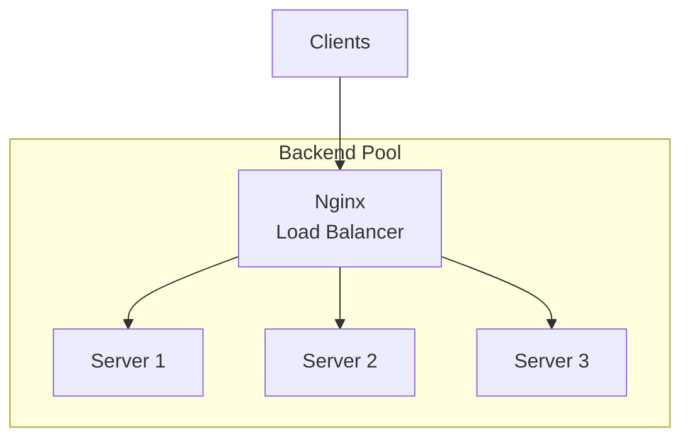
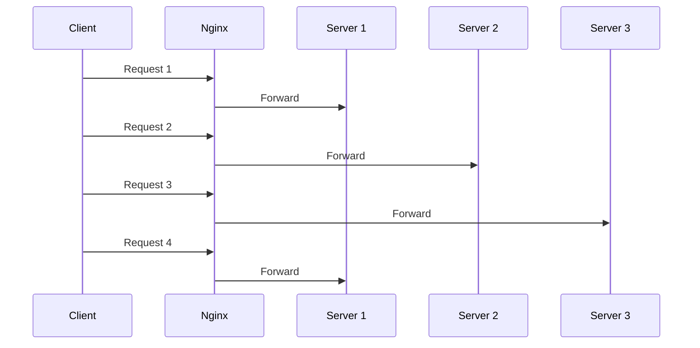
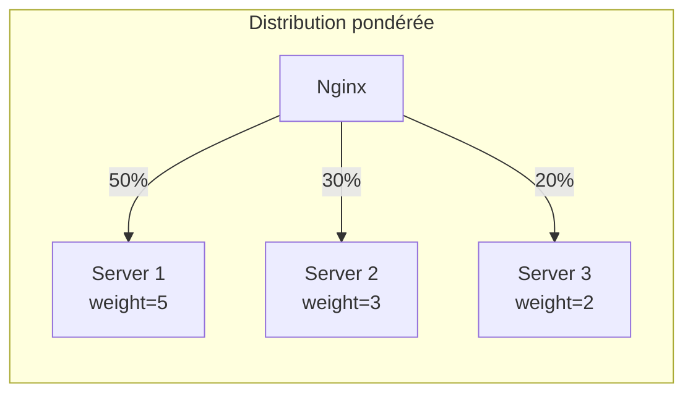
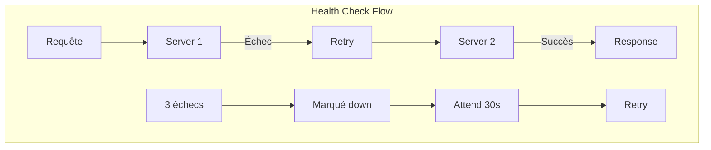
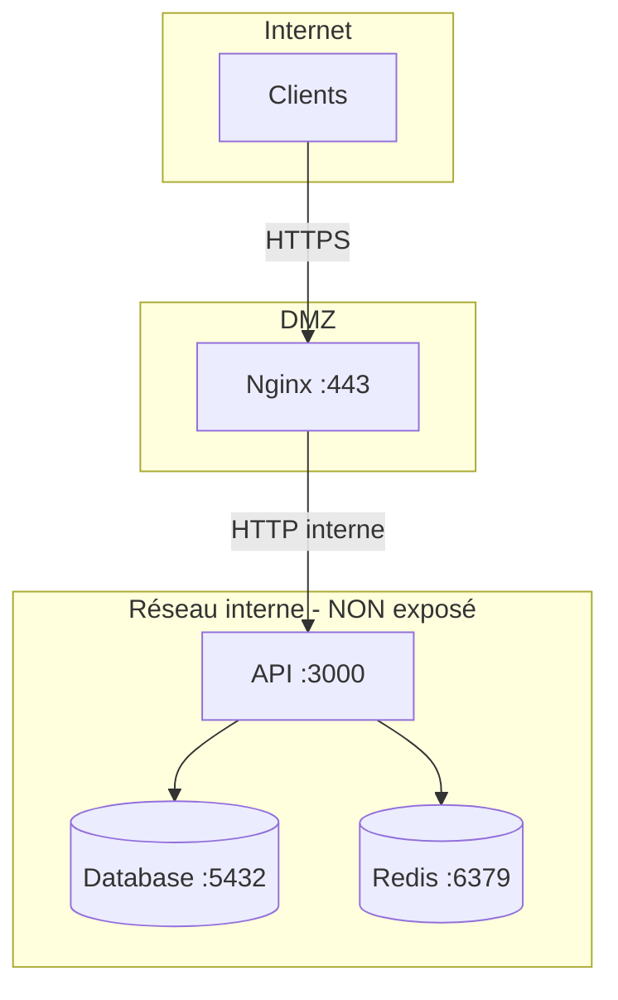
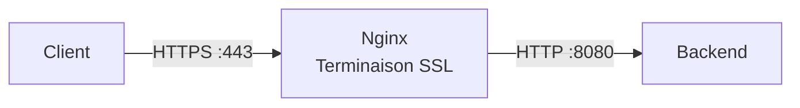
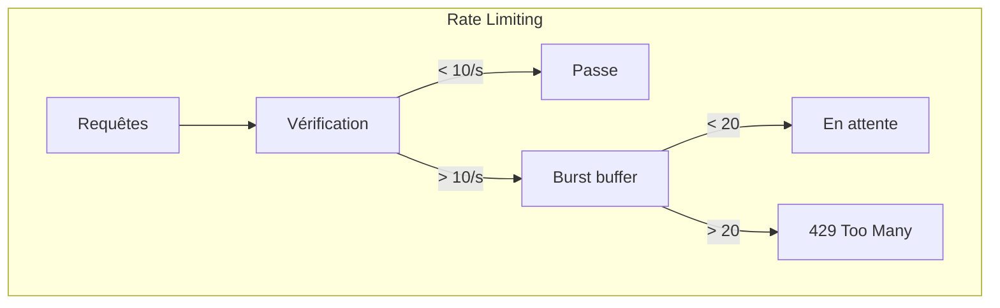
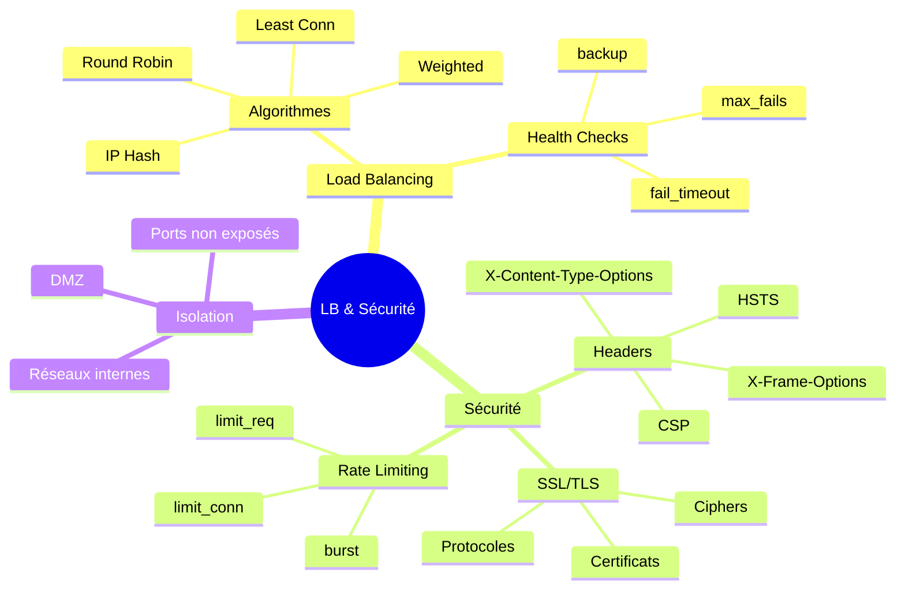

# Module 10 : Nginx Load Balancer et Sécurité

## Objectifs du module

- Configurer Nginx comme load balancer
- Maîtriser les algorithmes de distribution
- Sécuriser l'exposition des services
- Configurer SSL/TLS et les headers de sécurité

---

## 10.1 Load Balancing avec Nginx



### Configuration upstream

```nginx
http {
    # Définition du pool de serveurs
    upstream backend {
        server backend1:8080;
        server backend2:8080;
        server backend3:8080;
    }
    
    server {
        listen 80;
        
        location / {
            proxy_pass http://backend;
        }
    }
}
```

---

## 10.2 Algorithmes de distribution

### Round Robin (défaut)

```nginx
upstream backend {
    server backend1:8080;
    server backend2:8080;
    server backend3:8080;
}
```



### Least Connections

```nginx
upstream backend {
    least_conn;
    server backend1:8080;
    server backend2:8080;
    server backend3:8080;
}
```

### IP Hash (Session Affinity)

```nginx
upstream backend {
    ip_hash;
    server backend1:8080;
    server backend2:8080;
    server backend3:8080;
}
```

### Weighted

```nginx
upstream backend {
    server backend1:8080 weight=5;
    server backend2:8080 weight=3;
    server backend3:8080 weight=2;
}
```



---

## Exercice 1 (15 minutes)

### Load balancer avec plusieurs backends

1. Préparez :
   ```bash
   mkdir ~/lb-demo && cd ~/lb-demo
   docker network create lb-net
   ```

2. Lancez 3 backends identifiables :
   ```bash
   docker run -d --name backend1 --network lb-net \
       hashicorp/http-echo -text="Backend 1"
   docker run -d --name backend2 --network lb-net \
       hashicorp/http-echo -text="Backend 2"
   docker run -d --name backend3 --network lb-net \
       hashicorp/http-echo -text="Backend 3"
   ```

3. Configuration :
   ```bash
   cat > nginx.conf << 'EOF'
   events { worker_connections 1024; }
   
   http {
       upstream backends {
           server backend1:5678;
           server backend2:5678;
           server backend3:5678;
       }
       
       server {
           listen 80;
           
           location / {
               proxy_pass http://backends;
               proxy_set_header Host $host;
           }
       }
   }
   EOF
   ```

4. Lancez le load balancer :
   ```bash
   docker run -d --name lb \
       --network lb-net \
       -p 8080:80 \
       -v $(pwd)/nginx.conf:/etc/nginx/nginx.conf:ro \
       nginx:alpine
   ```

5. Testez la distribution :
   ```bash
   for i in {1..9}; do curl -s http://localhost:8080; done
   ```

6. Nettoyez :
   ```bash
   docker rm -f lb backend1 backend2 backend3
   docker network rm lb-net
   cd ~ && rm -rf ~/lb-demo
   ```

---

## 10.3 Health Checks

```nginx
http {
    upstream backend {
        server backend1:8080 max_fails=3 fail_timeout=30s;
        server backend2:8080 max_fails=3 fail_timeout=30s;
        server backend3:8080 backup;  # Serveur de secours
    }
    
    server {
        listen 80;
        
        location / {
            proxy_pass http://backend;
            proxy_next_upstream error timeout http_500 http_502 http_503;
        }
    }
}
```



---

## 10.4 Sécurité - Ports et Exposition

### Principe de moindre privilège



### Configuration Docker

```yaml
version: '3.8'

services:
  nginx:
    image: nginx:alpine
    ports:
      - "80:80"      # Exposé au monde
      - "443:443"
    networks:
      - frontend
      - backend

  api:
    image: myapi
    # PAS de ports exposés vers l'extérieur
    networks:
      - backend
      - database

  db:
    image: postgres
    # PAS de ports exposés
    networks:
      - database

networks:
  frontend:
  backend:
    internal: true  # Isolé d'internet
  database:
    internal: true
```

---

## 10.5 Headers de sécurité

```nginx
server {
    listen 80;
    
    # Empêche le clickjacking
    add_header X-Frame-Options "SAMEORIGIN" always;
    
    # Empêche le MIME sniffing
    add_header X-Content-Type-Options "nosniff" always;
    
    # Active la protection XSS
    add_header X-XSS-Protection "1; mode=block" always;
    
    # Politique de referrer
    add_header Referrer-Policy "strict-origin-when-cross-origin" always;
    
    # Content Security Policy
    add_header Content-Security-Policy "default-src 'self'; script-src 'self'; style-src 'self' 'unsafe-inline';" always;
    
    # Cache le serveur
    server_tokens off;
    
    # Supprime le header Server (avec module)
    # more_clear_headers Server;
    
    location / {
        proxy_pass http://backend;
    }
}
```

### Headers importants

| Header | Fonction |
|--------|----------|
| X-Frame-Options | Protège contre le clickjacking |
| X-Content-Type-Options | Empêche le MIME sniffing |
| X-XSS-Protection | Active le filtre XSS du navigateur |
| Content-Security-Policy | Contrôle les sources de contenu |
| Strict-Transport-Security | Force HTTPS |

---

## Exercice 2 (15 minutes)

### Headers de sécurité

1. Préparez :
   ```bash
   mkdir ~/secure-demo && cd ~/secure-demo
   docker network create secure-net
   
   docker run -d --name backend --network secure-net \
       hashicorp/http-echo -text="Secure Backend"
   ```

2. Configuration sécurisée :
   ```bash
   cat > nginx.conf << 'EOF'
   events { worker_connections 1024; }
   
   http {
       server_tokens off;
       
       server {
           listen 80;
           
           # Headers de sécurité
           add_header X-Frame-Options "SAMEORIGIN" always;
           add_header X-Content-Type-Options "nosniff" always;
           add_header X-XSS-Protection "1; mode=block" always;
           add_header Referrer-Policy "strict-origin-when-cross-origin" always;
           
           location / {
               proxy_pass http://backend:5678;
               proxy_set_header Host $host;
               
               # Cacher les infos du backend
               proxy_hide_header X-Powered-By;
           }
       }
   }
   EOF
   ```

3. Lancez :
   ```bash
   docker run -d --name secure-proxy \
       --network secure-net \
       -p 8080:80 \
       -v $(pwd)/nginx.conf:/etc/nginx/nginx.conf:ro \
       nginx:alpine
   ```

4. Vérifiez les headers :
   ```bash
   curl -I http://localhost:8080
   ```

5. Nettoyez :
   ```bash
   docker rm -f secure-proxy backend
   docker network rm secure-net
   cd ~ && rm -rf ~/secure-demo
   ```

---

## 10.6 Configuration SSL/TLS

### Certificats auto-signés (développement)

```bash
# Générer un certificat auto-signé
openssl req -x509 -nodes -days 365 -newkey rsa:2048 \
    -keyout server.key \
    -out server.crt \
    -subj "/CN=localhost"
```

### Configuration HTTPS

```nginx
server {
    listen 80;
    server_name example.com;
    return 301 https://$server_name$request_uri;
}

server {
    listen 443 ssl http2;
    server_name example.com;
    
    # Certificats
    ssl_certificate /etc/nginx/ssl/server.crt;
    ssl_certificate_key /etc/nginx/ssl/server.key;
    
    # Protocoles et ciphers modernes
    ssl_protocols TLSv1.2 TLSv1.3;
    ssl_ciphers ECDHE-ECDSA-AES128-GCM-SHA256:ECDHE-RSA-AES128-GCM-SHA256;
    ssl_prefer_server_ciphers on;
    
    # Session cache
    ssl_session_cache shared:SSL:10m;
    ssl_session_timeout 10m;
    
    # HSTS
    add_header Strict-Transport-Security "max-age=31536000; includeSubDomains" always;
    
    location / {
        proxy_pass http://backend;
    }
}
```



---

## 10.7 Rate Limiting

```nginx
http {
    # Zone de limitation (10MB, 10 req/s par IP)
    limit_req_zone $binary_remote_addr zone=api_limit:10m rate=10r/s;
    limit_conn_zone $binary_remote_addr zone=conn_limit:10m;
    
    server {
        listen 80;
        
        # Limite de connexions simultanées
        limit_conn conn_limit 10;
        
        location /api/ {
            # Limite de requêtes avec burst
            limit_req zone=api_limit burst=20 nodelay;
            
            proxy_pass http://api;
        }
    }
}
```



---

## Exercice 3 (15 minutes)

### Configuration complète avec Load Balancing et Sécurité

1. Préparez :
   ```bash
   mkdir ~/full-demo && cd ~/full-demo
   docker network create full-net
   ```

2. Lancez les backends :
   ```bash
   for i in 1 2 3; do
       docker run -d --name backend$i --network full-net \
           hashicorp/http-echo -text="Backend $i"
   done
   ```

3. Configuration complète :
   ```bash
   cat > nginx.conf << 'EOF'
   events { worker_connections 1024; }
   
   http {
       server_tokens off;
       
       # Rate limiting
       limit_req_zone $binary_remote_addr zone=one:10m rate=5r/s;
       
       # Upstream avec health check
       upstream backends {
           least_conn;
           server backend1:5678 max_fails=2 fail_timeout=10s;
           server backend2:5678 max_fails=2 fail_timeout=10s;
           server backend3:5678 max_fails=2 fail_timeout=10s;
       }
       
       server {
           listen 80;
           
           # Headers sécurité
           add_header X-Frame-Options "SAMEORIGIN" always;
           add_header X-Content-Type-Options "nosniff" always;
           
           location / {
               # Rate limiting
               limit_req zone=one burst=10 nodelay;
               
               proxy_pass http://backends;
               proxy_set_header Host $host;
               proxy_set_header X-Real-IP $remote_addr;
               proxy_next_upstream error timeout http_500;
           }
           
           location /health {
               return 200 "OK\n";
               add_header Content-Type text/plain;
           }
       }
   }
   EOF
   ```

4. Lancez :
   ```bash
   docker run -d --name lb-secure \
       --network full-net \
       -p 8080:80 \
       -v $(pwd)/nginx.conf:/etc/nginx/nginx.conf:ro \
       nginx:alpine
   ```

5. Tests :
   ```bash
   # Test distribution
   for i in {1..6}; do curl -s http://localhost:8080; done
   
   # Test health
   curl http://localhost:8080/health
   
   # Test headers
   curl -I http://localhost:8080
   
   # Test rate limiting (rapide)
   for i in {1..20}; do curl -s -o /dev/null -w "%{http_code}\n" http://localhost:8080; done
   ```

6. Nettoyez :
   ```bash
   docker rm -f lb-secure backend1 backend2 backend3
   docker network rm full-net
   cd ~ && rm -rf ~/full-demo
   ```

---

## Résumé du module



---

## Quiz de validation

1. Quelle est la différence entre round-robin et least-conn ?
2. Comment configurer un serveur de backup qui ne reçoit du trafic que si les autres sont down ?
3. À quoi sert le header X-Frame-Options ?
4. Comment forcer toutes les connexions en HTTPS ?
5. Que fait la directive `limit_req zone=one burst=10 nodelay` ?
