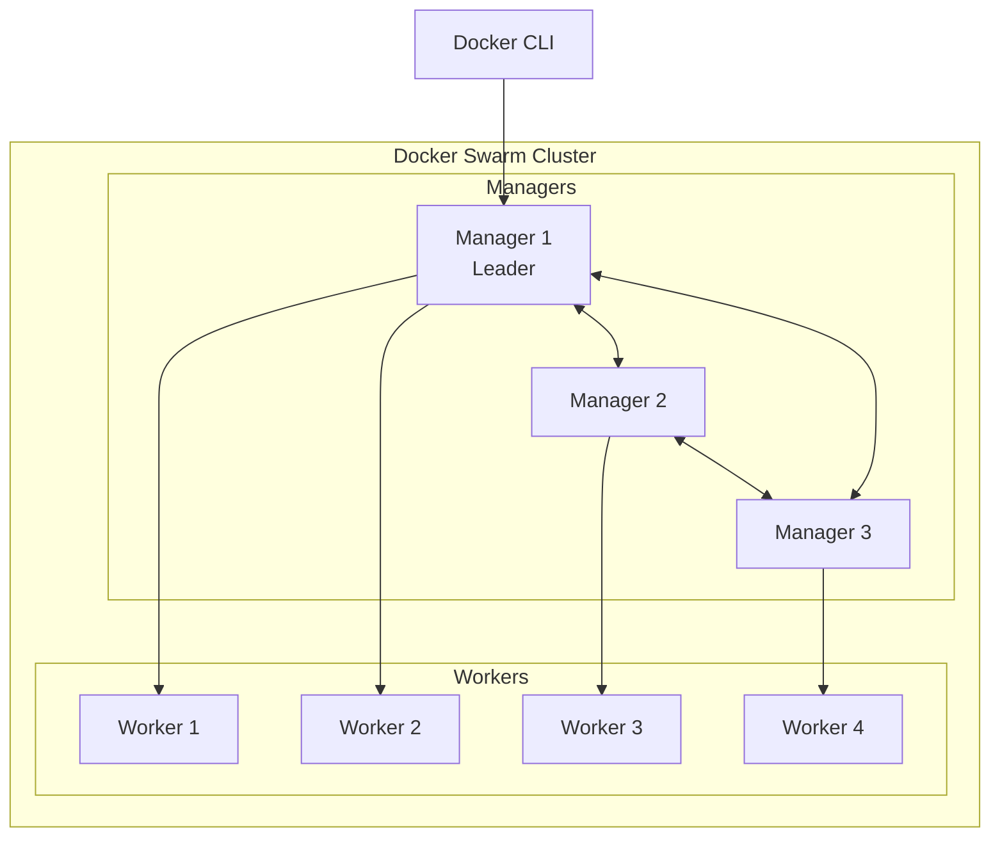
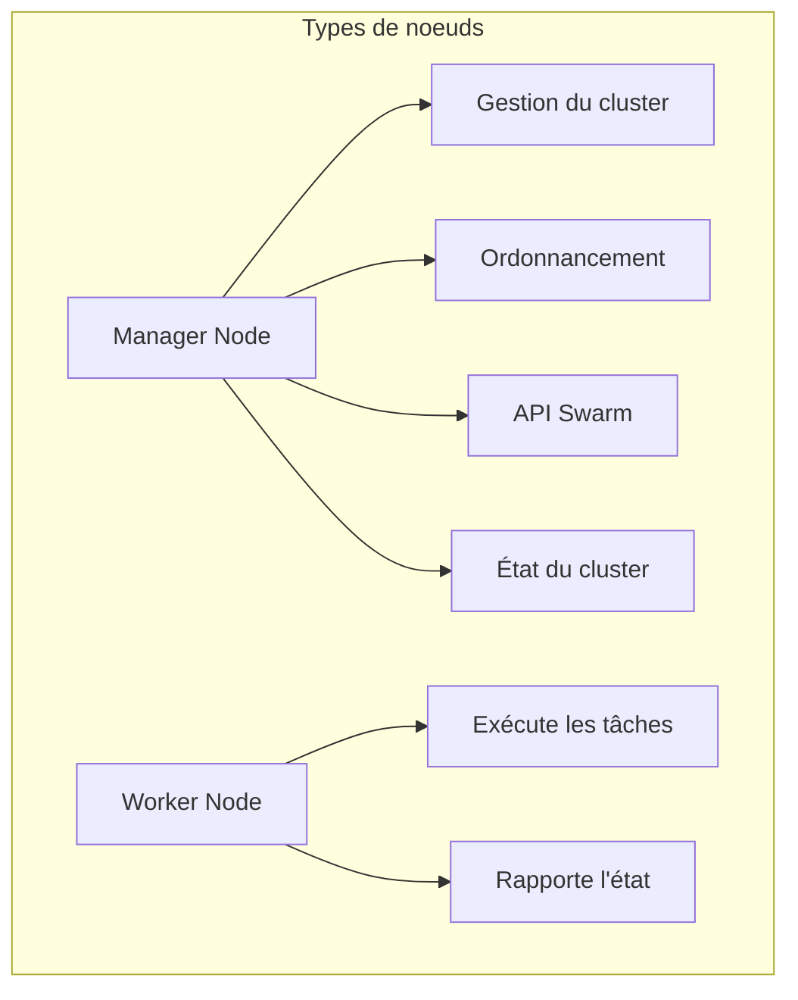
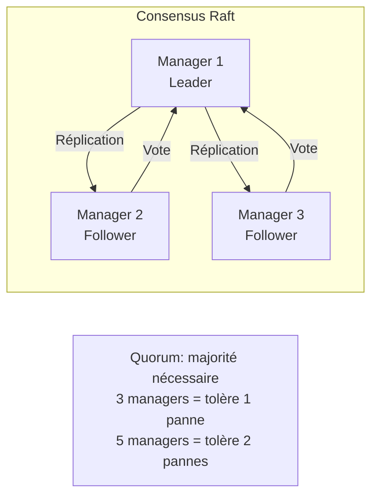
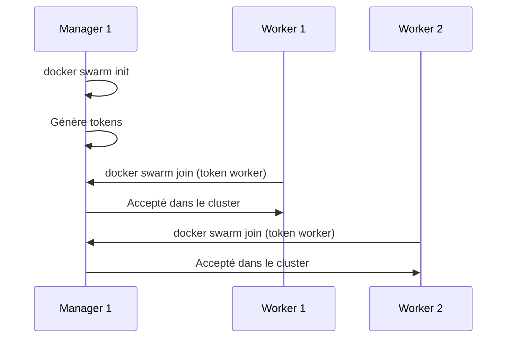
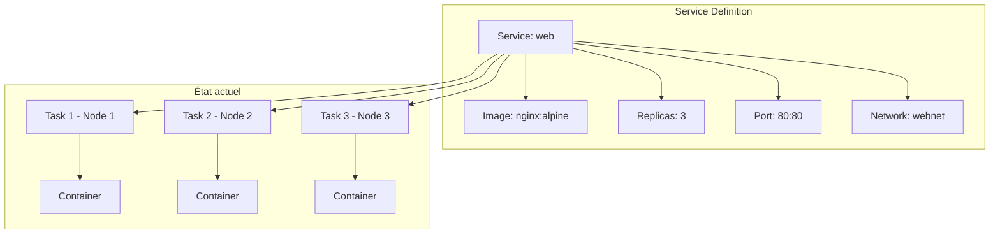
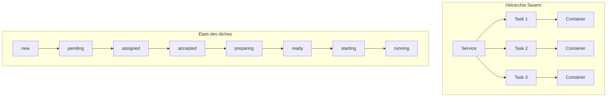
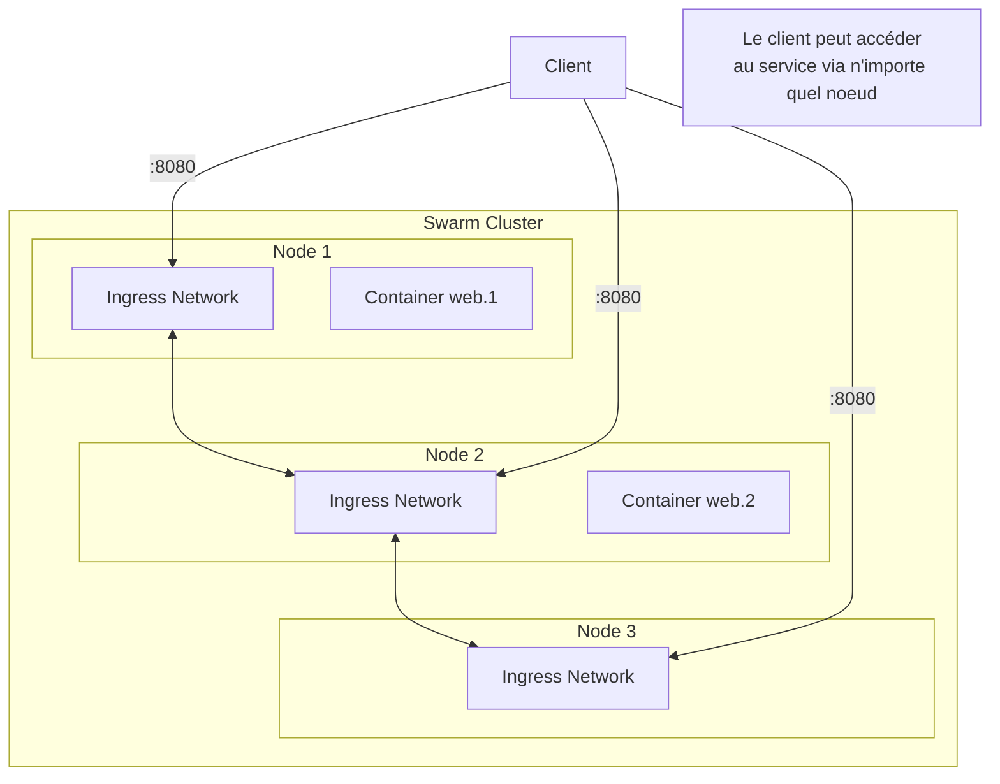
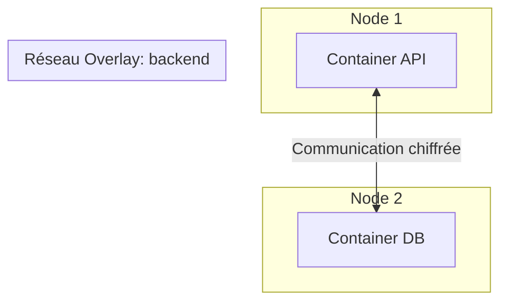
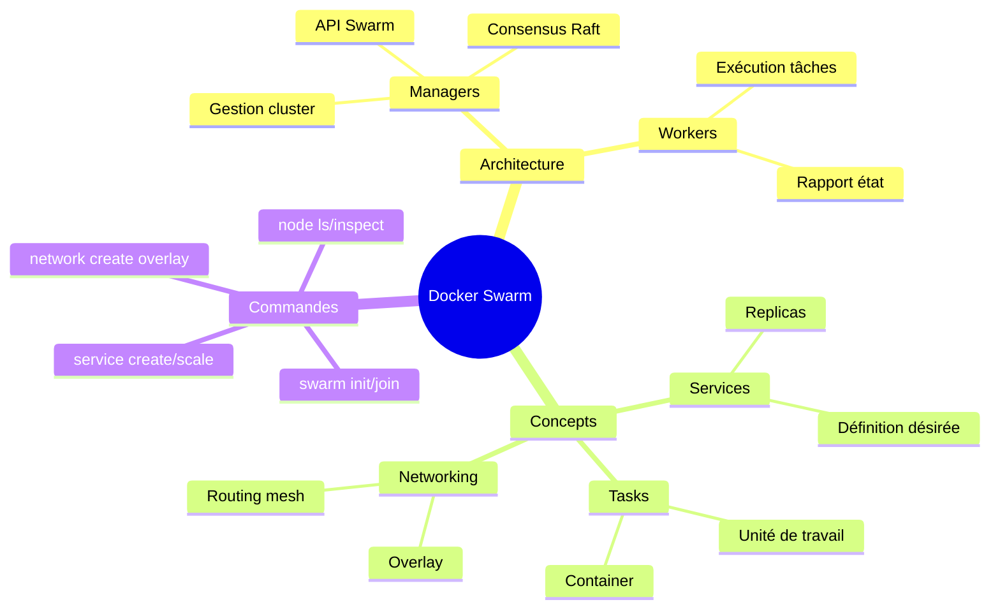

# Module 5 : Introduction à Docker Swarm

## Objectifs du module

- Comprendre les concepts fondamentaux de Docker Swarm
- Savoir initialiser et configurer un cluster Swarm
- Maîtriser l'architecture manager/worker
- Déployer des premiers services

---

## 5.1 Qu'est-ce que Docker Swarm ?

Docker Swarm est l'outil d'orchestration natif de Docker. Il permet de gérer un cluster de machines Docker comme une seule entité logique.



---

## 5.2 Concepts clés

### Noeuds (Nodes)



| Type | Rôle | Nombre recommandé |
|------|------|-------------------|
| Manager | Gestion, ordonnancement, décisions | 3 ou 5 (impair) |
| Worker | Exécution des containers | Selon la charge |

### Consensus Raft

Les managers utilisent l'algorithme Raft pour maintenir l'état du cluster.



---

## 5.3 Initialisation d'un Swarm

### Mode single-node (développement)

```bash
# Initialiser le swarm
docker swarm init

# Sortie:
# Swarm initialized: current node (xxx) is now a manager.
# To add a worker to this swarm, run the following command:
#     docker swarm join --token SWMTKN-xxx 192.168.1.10:2377
```

### Mode multi-node

```bash
# Sur le premier manager
docker swarm init --advertise-addr 192.168.1.10

# Obtenir le token worker
docker swarm join-token worker

# Obtenir le token manager
docker swarm join-token manager

# Sur les workers
docker swarm join --token SWMTKN-xxx 192.168.1.10:2377

# Sur les autres managers
docker swarm join --token SWMTKN-xxx-manager 192.168.1.10:2377
```



---

## Exercice 1 (15 minutes)

### Initialiser un Swarm local

1. Vérifiez que Docker est en mode standalone :
   ```bash
   docker info | grep Swarm
   # Swarm: inactive
   ```

2. Initialisez le Swarm :
   ```bash
   docker swarm init
   ```

3. Vérifiez l'état :
   ```bash
   docker info | grep Swarm
   # Swarm: active
   
   docker node ls
   ```

4. Explorez les informations du noeud :
   ```bash
   docker node inspect self --pretty
   ```

5. Notez les tokens (pour référence) :
   ```bash
   docker swarm join-token worker
   docker swarm join-token manager
   ```

---

## 5.4 Services Swarm

Un **service** est la définition de l'état désiré pour une application dans le cluster.



### Créer un service

```bash
# Service basique
docker service create --name web nginx:alpine

# Service avec replicas et port
docker service create \
    --name web \
    --replicas 3 \
    --publish 80:80 \
    nginx:alpine

# Service avec contraintes
docker service create \
    --name api \
    --replicas 2 \
    --constraint 'node.role==worker' \
    node:alpine
```

### Gestion des services

```bash
# Lister les services
docker service ls

# Détails d'un service
docker service ps web

# Inspecter un service
docker service inspect web --pretty

# Logs d'un service
docker service logs web
docker service logs -f web

# Supprimer un service
docker service rm web
```

---

## 5.5 Tâches et containers



### Cycle de vie d'une tâche

```bash
# Observer les tâches
docker service ps web

# Sortie typique:
# ID            NAME    IMAGE         NODE      STATE
# abc123        web.1   nginx:alpine  node1     Running
# def456        web.2   nginx:alpine  node2     Running
# ghi789        web.3   nginx:alpine  node1     Running
```

---

## Exercice 2 (15 minutes)

### Créer et gérer des services

1. Créez un service nginx avec 3 replicas :
   ```bash
   docker service create \
       --name web \
       --replicas 3 \
       --publish 8080:80 \
       nginx:alpine
   ```

2. Vérifiez le service :
   ```bash
   docker service ls
   docker service ps web
   ```

3. Accédez au service :
   ```bash
   curl http://localhost:8080
   ```

4. Consultez les logs :
   ```bash
   docker service logs web
   ```

5. Inspectez le service :
   ```bash
   docker service inspect web --pretty
   ```

6. Nettoyez :
   ```bash
   docker service rm web
   ```

---

## 5.6 Routing Mesh

Le routing mesh permet d'accéder à un service depuis n'importe quel noeud du cluster.



### Fonctionnement

```bash
# Le port publié est disponible sur TOUS les noeuds
docker service create \
    --name web \
    --replicas 2 \
    --publish 8080:80 \
    nginx:alpine

# Même si Node 3 n'a pas de container web,
# curl http://node3:8080 fonctionne
```

---

## 5.7 Réseaux Overlay

Les réseaux overlay permettent la communication entre containers sur différents noeuds.



### Création et utilisation

```bash
# Créer un réseau overlay
docker network create --driver overlay backend

# Utiliser avec un service
docker service create \
    --name api \
    --network backend \
    --replicas 3 \
    myapi:latest

docker service create \
    --name db \
    --network backend \
    postgres:15
```

---

## Exercice 3 (15 minutes)

### Services avec réseau overlay

1. Créez un réseau overlay :
   ```bash
   docker network create --driver overlay app-network
   ```

2. Déployez Redis sur ce réseau :
   ```bash
   docker service create \
       --name redis \
       --network app-network \
       redis:alpine
   ```

3. Déployez un service de test :
   ```bash
   docker service create \
       --name test-app \
       --network app-network \
       alpine sleep 3600
   ```

4. Testez la connectivité DNS :
   ```bash
   # Trouver l'ID du container
   docker ps --filter "name=test-app"
   
   # Tester la résolution DNS
   docker exec <CONTAINER_ID> ping -c 3 redis
   ```

5. Vérifiez le réseau :
   ```bash
   docker network inspect app-network
   ```

6. Nettoyez :
   ```bash
   docker service rm redis test-app
   docker network rm app-network
   ```

---

## 5.8 Commandes essentielles Swarm

```bash
# Gestion du cluster
docker swarm init
docker swarm join
docker swarm leave
docker swarm join-token [worker|manager]

# Gestion des noeuds
docker node ls
docker node inspect NODE
docker node update NODE
docker node rm NODE
docker node promote NODE
docker node demote NODE

# Gestion des services
docker service create
docker service ls
docker service ps SERVICE
docker service logs SERVICE
docker service inspect SERVICE
docker service update SERVICE
docker service scale SERVICE=N
docker service rm SERVICE
```

---

## Résumé du module



---

## Quiz de validation

1. Quelle est la différence entre un manager et un worker dans Swarm ?
2. Pourquoi recommande-t-on un nombre impair de managers ?
3. Qu'est-ce qu'un service dans Docker Swarm ?
4. Comment fonctionne le routing mesh ?
5. À quoi sert un réseau overlay ?
