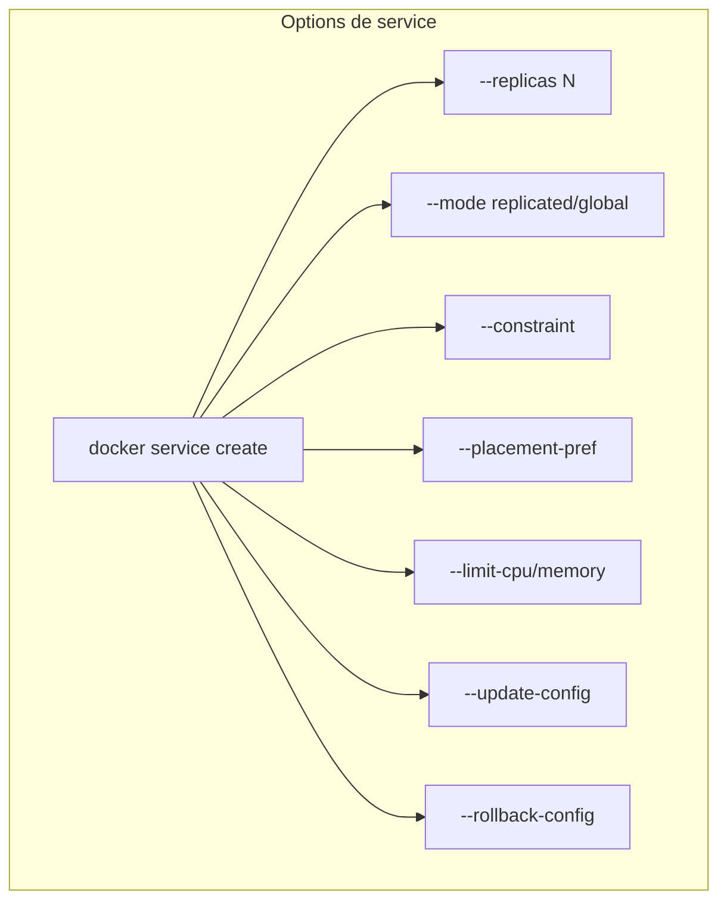
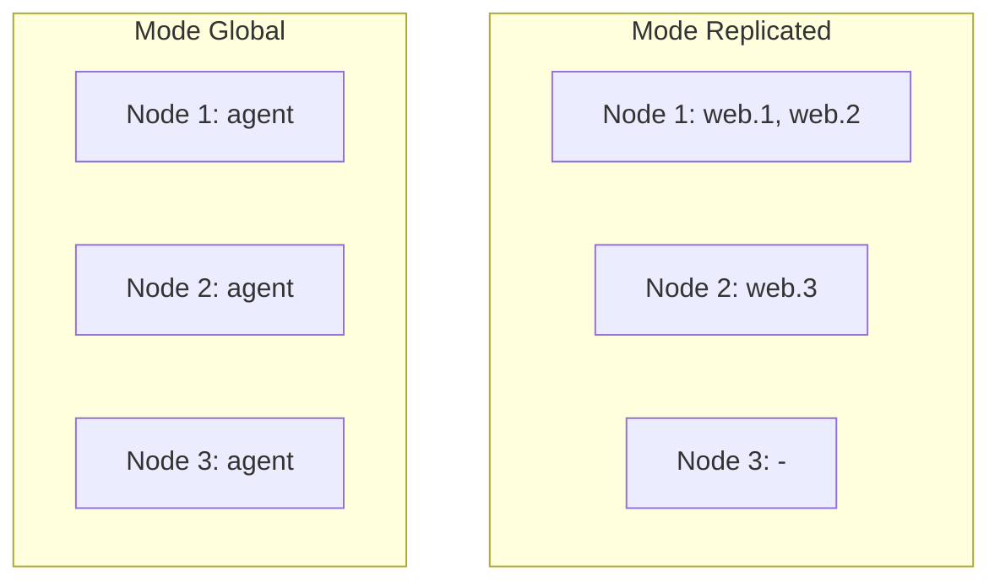
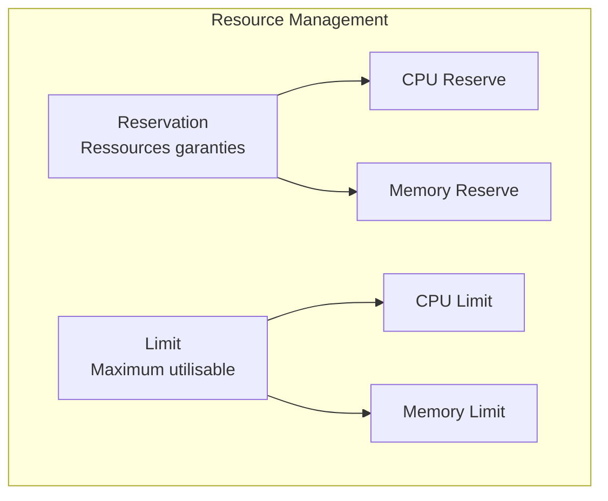
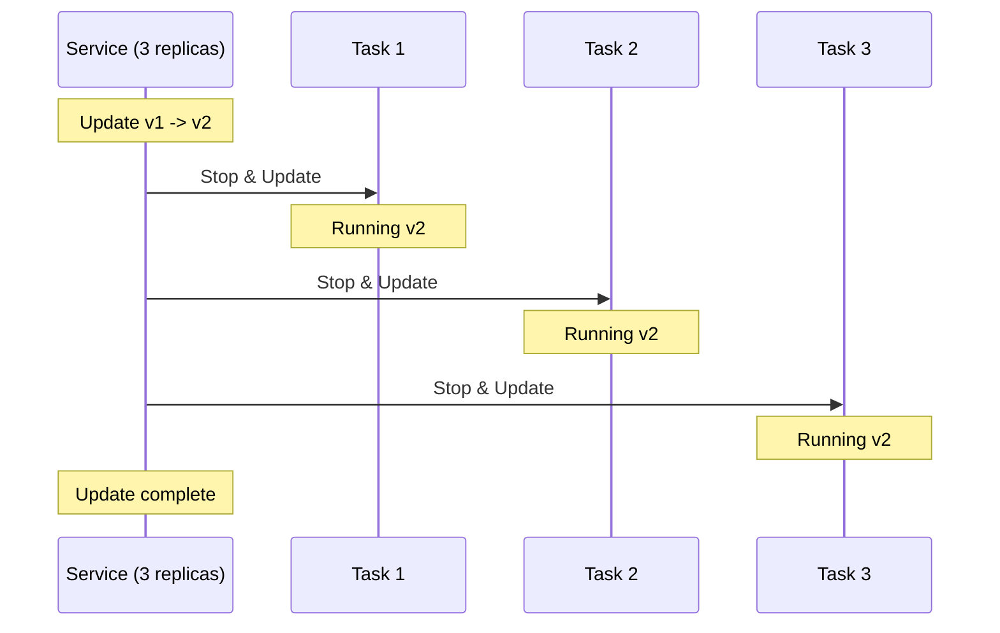
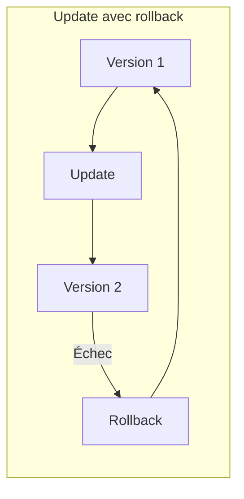
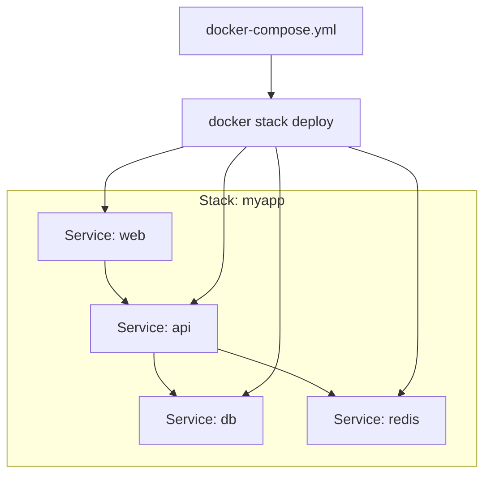
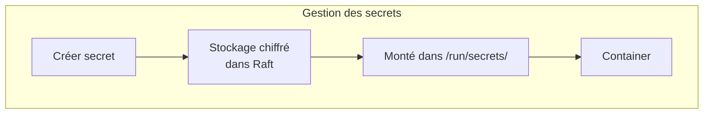
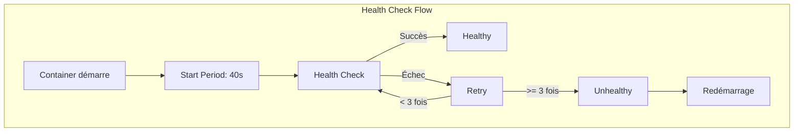
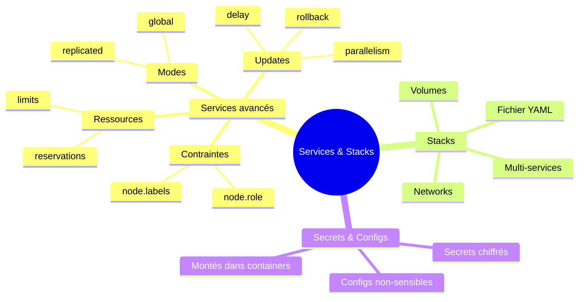

# Module 6 : Services et Stacks dans Docker Swarm

## Objectifs du module

- Maîtriser la configuration avancée des services
- Comprendre et utiliser les stacks
- Déployer des applications multi-services
- Gérer les configurations et secrets

---

## 6.1 Configuration avancée des services

### Rappel : qu'est-ce qu'un service ?

Un **service** dans Swarm est une définition de ce que vous voulez exécuter. Il inclut :
- L'image à utiliser
- Le nombre de replicas (copies)
- Les ressources nécessaires (CPU, mémoire)
- Les réseaux à utiliser
- Les contraintes de placement

Swarm s'assure que l'état réel correspond à l'état désiré. Si un container meurt, Swarm en crée un nouveau automatiquement.

### Options de déploiement



### Mode de déploiement

Swarm propose deux modes de déploiement selon vos besoins :

**Mode Replicated (défaut) :**
- Vous définissez un nombre fixe de replicas
- Swarm les distribue sur les noeuds disponibles
- Idéal pour : applications web, APIs, workers

**Mode Global :**
- Un container sur CHAQUE noeud du cluster
- Utile pour les agents de monitoring, collecteurs de logs
- Idéal pour : prometheus node-exporter, filebeat, agents de sécurité

```bash
# Mode replicated (défaut) - nombre fixe de replicas
docker service create \
    --name web \
    --mode replicated \
    --replicas 3 \
    nginx:alpine

# Mode global - un container par noeud
docker service create \
    --name monitoring-agent \
    --mode global \
    prometheus/node-exporter
```



### Contraintes de placement

Les **contraintes** permettent de contrôler sur quels noeuds un service peut tourner. Utile pour :
- Garder les bases de données sur des noeuds avec SSD
- Isoler certains services sur des noeuds dédiés
- Respecter des exigences de conformité (données dans un pays spécifique)

```bash
# Déployer uniquement sur les workers
docker service create \
    --name api \
    --constraint 'node.role==worker' \
    myapi:latest

# Déployer sur un noeud spécifique
docker service create \
    --name db \
    --constraint 'node.hostname==db-server' \
    postgres:15

# Déployer selon un label
docker node update --label-add type=compute node1
docker service create \
    --name compute-job \
    --constraint 'node.labels.type==compute' \
    compute-image
```

---

## 6.2 Limites de ressources

### Pourquoi limiter les ressources ?

Sans limites, un container peut consommer toutes les ressources de la machine et affecter les autres applications. Les limites permettent de :
- **Protéger** le système contre les fuites de mémoire
- **Garantir** des ressources minimales à chaque service
- **Planifier** le placement des containers (Swarm sait combien de ressources sont disponibles)



```bash
# Limiter les ressources
docker service create \
    --name api \
    --replicas 3 \
    --limit-cpu 0.5 \
    --limit-memory 256M \
    --reserve-cpu 0.25 \
    --reserve-memory 128M \
    myapi:latest
```

---

## Exercice 1 (15 minutes)

### Services avec contraintes et ressources

1. Ajoutez un label à votre noeud :
   ```bash
   docker node update --label-add env=production $(docker node ls -q)
   ```

2. Créez un service avec contraintes et limites :
   ```bash
   docker service create \
       --name limited-web \
       --replicas 2 \
       --constraint 'node.labels.env==production' \
       --limit-cpu 0.25 \
       --limit-memory 128M \
       --reserve-memory 64M \
       nginx:alpine
   ```

3. Vérifiez le déploiement :
   ```bash
   docker service ps limited-web
   docker service inspect limited-web --pretty
   ```

4. Testez une contrainte impossible :
   ```bash
   docker service create \
       --name impossible \
       --constraint 'node.labels.env==staging' \
       nginx:alpine
   
   # Vérifiez que le service ne démarre pas
   docker service ps impossible
   ```

5. Nettoyez :
   ```bash
   docker service rm limited-web impossible
   ```

---

## 6.3 Mises à jour et rollback

### Le défi des mises à jour en production

Comment mettre à jour une application sans interruption de service ? C'est un défi majeur en production.

**Sans orchestrateur :**
1. Arrêter l'ancienne version → Downtime !
2. Démarrer la nouvelle version
3. Si problème → Panique, rollback manuel

**Avec Swarm (Rolling Update) :**
1. Mettre à jour progressivement container par container
2. Vérifier que chaque nouveau container fonctionne
3. Si problème → Rollback automatique
4. **Zéro downtime !**

### Stratégie de mise à jour



```bash
# Configurer la stratégie de mise à jour
docker service create \
    --name web \
    --replicas 6 \
    --update-parallelism 2 \
    --update-delay 10s \
    --update-failure-action rollback \
    --update-max-failure-ratio 0.25 \
    nginx:1.24

# Effectuer une mise à jour
docker service update \
    --image nginx:1.25 \
    web

# Suivre la mise à jour
docker service ps web
```

### Rollback

```bash
# Configuration du rollback
docker service create \
    --name api \
    --rollback-parallelism 1 \
    --rollback-delay 5s \
    --rollback-max-failure-ratio 0.2 \
    myapi:1.0

# Rollback manuel
docker service rollback api

# Rollback automatique (si update échoue)
# Configuré avec --update-failure-action rollback
```



---

## 6.4 Introduction aux Stacks

### Pourquoi les Stacks ?

Jusqu'ici, nous avons créé des services un par un avec `docker service create`. Mais une vraie application comprend souvent :
- Un frontend
- Une API backend
- Une base de données
- Un cache Redis
- etc.

Créer et gérer tout cela à la main est fastidieux et source d'erreurs.

### Qu'est-ce qu'une Stack ?

Une **stack** est un groupe de services interconnectés définis dans un fichier YAML (format docker-compose). Elle permet de :
- **Déclarer** toute l'infrastructure dans un fichier versionnable
- **Déployer** tous les services en une seule commande
- **Gérer** l'ensemble comme une unité (supprimer, mettre à jour)



### Structure du fichier

```yaml
version: '3.8'

services:
  web:
    image: nginx:alpine
    ports:
      - "80:80"
    deploy:
      replicas: 3
      
  api:
    image: myapi:latest
    deploy:
      replicas: 2
      
  db:
    image: postgres:15
    volumes:
      - db-data:/var/lib/postgresql/data

volumes:
  db-data:

networks:
  default:
    driver: overlay
```

---

## 6.5 Déploiement de Stacks

### Commandes de base

```bash
# Déployer une stack
docker stack deploy -c docker-compose.yml myapp

# Lister les stacks
docker stack ls

# Services d'une stack
docker stack services myapp

# Tâches d'une stack
docker stack ps myapp

# Supprimer une stack
docker stack rm myapp
```

### Exemple complet

```yaml
# docker-compose.yml
version: '3.8'

services:
  frontend:
    image: nginx:alpine
    ports:
      - "80:80"
    volumes:
      - ./nginx.conf:/etc/nginx/nginx.conf:ro
    networks:
      - frontend-net
    deploy:
      replicas: 2
      update_config:
        parallelism: 1
        delay: 10s
      restart_policy:
        condition: on-failure

  api:
    image: node:20-alpine
    command: node server.js
    networks:
      - frontend-net
      - backend-net
    deploy:
      replicas: 3
      resources:
        limits:
          cpus: '0.5'
          memory: 256M
        reservations:
          cpus: '0.25'
          memory: 128M

  db:
    image: postgres:15-alpine
    environment:
      POSTGRES_PASSWORD_FILE: /run/secrets/db_password
    volumes:
      - db-data:/var/lib/postgresql/data
    networks:
      - backend-net
    secrets:
      - db_password
    deploy:
      replicas: 1
      placement:
        constraints:
          - node.role == manager

volumes:
  db-data:

networks:
  frontend-net:
  backend-net:

secrets:
  db_password:
    external: true
```

---

## Exercice 2 (15 minutes)

### Déployer une stack complète

1. Créez un fichier `stack-demo.yml` :
   ```yaml
   version: '3.8'
   
   services:
     web:
       image: nginx:alpine
       ports:
         - "8080:80"
       deploy:
         replicas: 2
         update_config:
           parallelism: 1
           delay: 5s
   
     redis:
       image: redis:alpine
       deploy:
         replicas: 1
   
   networks:
     default:
       driver: overlay
   ```

2. Déployez la stack :
   ```bash
   docker stack deploy -c stack-demo.yml demo
   ```

3. Vérifiez le déploiement :
   ```bash
   docker stack ls
   docker stack services demo
   docker stack ps demo
   ```

4. Testez le service :
   ```bash
   curl http://localhost:8080
   ```

5. Mettez à jour le nombre de replicas :
   ```bash
   docker service scale demo_web=4
   docker stack ps demo
   ```

6. Nettoyez :
   ```bash
   docker stack rm demo
   ```

---

## 6.6 Secrets et Configs

### Le problème : où mettre les mots de passe ?

Comment passer des informations sensibles (mots de passe, clés API, certificats) à vos containers ?

**Mauvaises pratiques :**
- Hardcoder dans le code source (exposé si le code est public)
- Variables d'environnement dans docker-compose (visibles avec `docker inspect`)
- Fichiers de config versionnés (exposés dans Git)

**Bonne pratique : les Secrets Swarm**

### Secrets

Les **secrets** sont des données sensibles stockées de manière chiffrée dans le cluster Swarm.

**Fonctionnement :**
1. Vous créez un secret (mot de passe, certificat, etc.)
2. Swarm le stocke chiffré dans la base Raft
3. Seuls les services autorisés peuvent y accéder
4. Le secret apparaît comme un fichier dans `/run/secrets/` dans le container



```bash
# Créer un secret depuis un fichier
echo "monsupersecret" | docker secret create db_password -

# Créer depuis un fichier
docker secret create ssl_cert ./certificate.pem

# Lister les secrets
docker secret ls

# Utiliser dans un service
docker service create \
    --name db \
    --secret db_password \
    -e POSTGRES_PASSWORD_FILE=/run/secrets/db_password \
    postgres:15
```

### Configs

Les **configs** sont similaires aux secrets, mais pour des données non-sensibles (fichiers de configuration). La différence :

| Secrets | Configs |
|---------|---------|
| Données sensibles | Fichiers de configuration |
| Chiffrés au repos | Non chiffrés |
| `/run/secrets/` | Montés où vous voulez |

```bash
# Créer une config
docker config create nginx_conf ./nginx.conf

# Utiliser dans un service
docker service create \
    --name web \
    --config source=nginx_conf,target=/etc/nginx/nginx.conf \
    nginx:alpine
```

### Dans une stack

```yaml
version: '3.8'

services:
  db:
    image: postgres:15
    secrets:
      - db_password
    environment:
      POSTGRES_PASSWORD_FILE: /run/secrets/db_password
      
  web:
    image: nginx:alpine
    configs:
      - source: nginx_conf
        target: /etc/nginx/nginx.conf

secrets:
  db_password:
    file: ./secrets/db_password.txt

configs:
  nginx_conf:
    file: ./config/nginx.conf
```

---

## Exercice 3 (15 minutes)

### Utilisation des secrets et configs

1. Créez un secret :
   ```bash
   echo "SuperSecretPassword123" | docker secret create mysql_root_password -
   ```

2. Créez un fichier de configuration nginx :
   ```bash
   cat > /tmp/custom-nginx.conf << 'EOF'
   events {
       worker_connections 1024;
   }
   http {
       server {
           listen 80;
           location / {
               return 200 'Config loaded from Docker config!\n';
               add_header Content-Type text/plain;
           }
       }
   }
   EOF
   ```

3. Créez une config :
   ```bash
   docker config create custom_nginx /tmp/custom-nginx.conf
   ```

4. Déployez les services :
   ```bash
   docker service create \
       --name mysql-secure \
       --secret mysql_root_password \
       -e MYSQL_ROOT_PASSWORD_FILE=/run/secrets/mysql_root_password \
       mysql:8.0
   
   docker service create \
       --name nginx-configured \
       --config source=custom_nginx,target=/etc/nginx/nginx.conf \
       -p 8080:80 \
       nginx:alpine
   ```

5. Testez :
   ```bash
   curl http://localhost:8080
   ```

6. Nettoyez :
   ```bash
   docker service rm mysql-secure nginx-configured
   docker secret rm mysql_root_password
   docker config rm custom_nginx
   ```

---

## 6.7 Healthchecks dans les services

```yaml
version: '3.8'

services:
  api:
    image: myapi:latest
    deploy:
      replicas: 3
    healthcheck:
      test: ["CMD", "curl", "-f", "http://localhost:3000/health"]
      interval: 30s
      timeout: 10s
      retries: 3
      start_period: 40s
```



---

## Résumé du module



---

## Quiz de validation

1. Quelle est la différence entre le mode `replicated` et `global` ?
2. Comment limiter la mémoire d'un service à 256MB ?
3. Qu'est-ce qu'une stack Docker et comment la déployer ?
4. Quelle est la différence entre un secret et une config ?
5. Comment configurer un rollback automatique en cas d'échec de mise à jour ?
