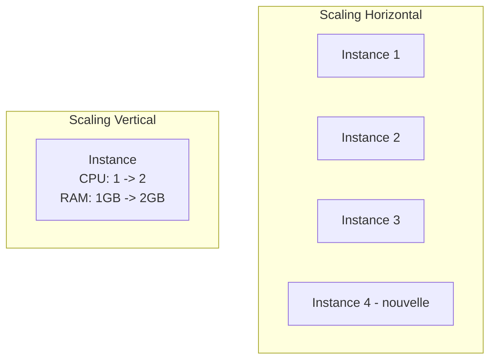
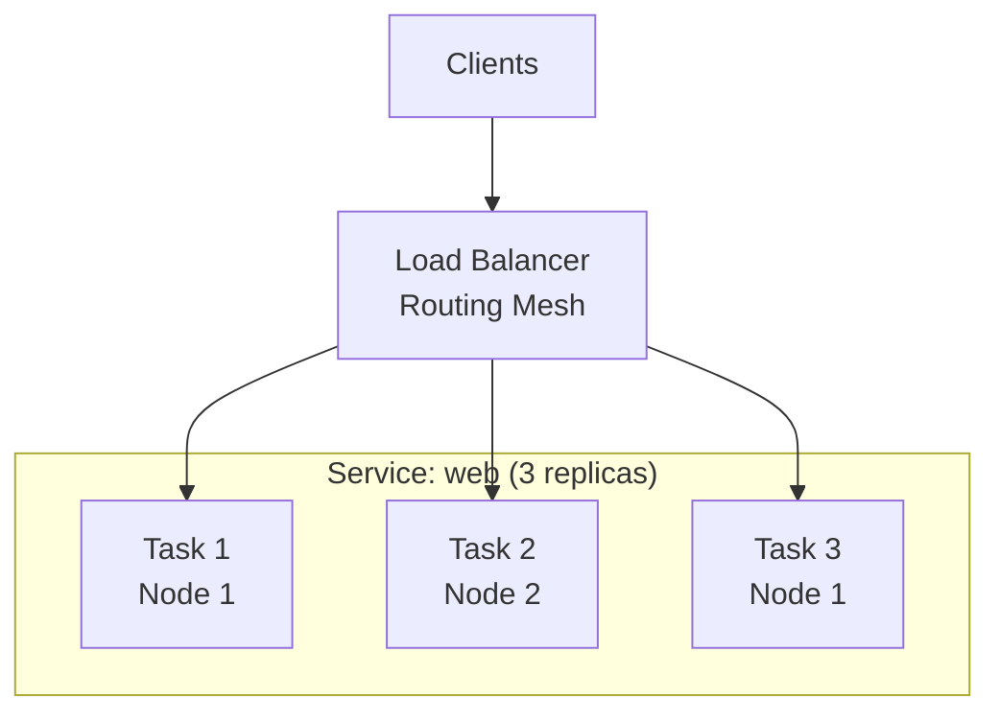
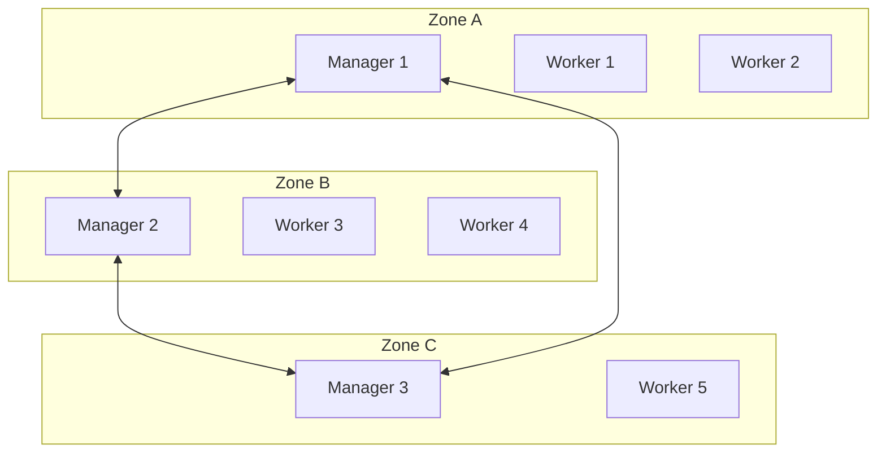
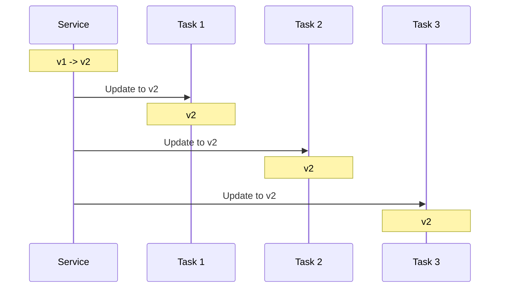
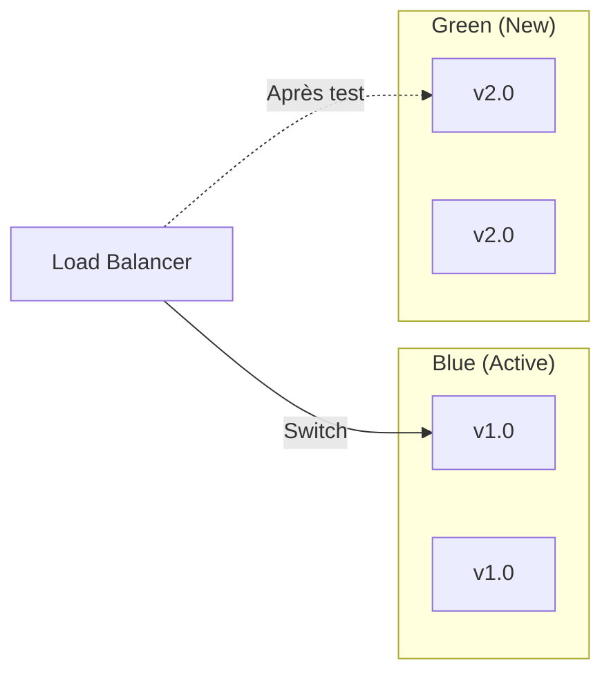
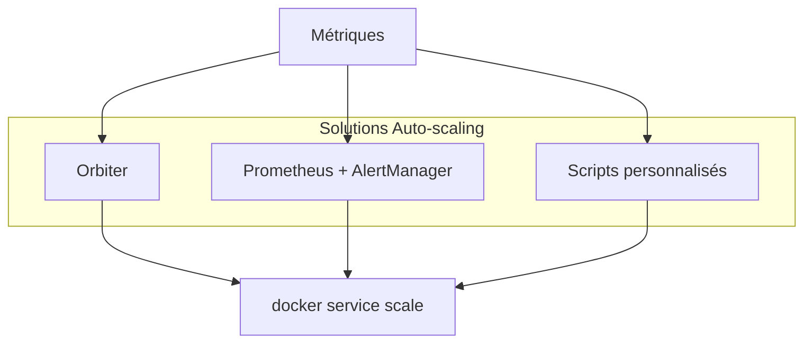
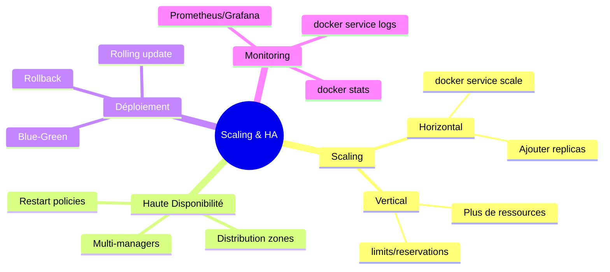

# Module 7 : Scaling et Haute Disponibilité

## Objectifs du module

- Maîtriser le scaling horizontal et vertical
- Comprendre les stratégies de haute disponibilité
- Gérer la distribution de charge
- Monitorer les performances du cluster

---

## 7.1 Scaling des services

### Scaling horizontal vs vertical



| Type | Description | Avantages | Inconvénients |
|------|-------------|-----------|---------------|
| Horizontal | Ajouter des instances | Résilience, pas de downtime | Complexité réseau |
| Vertical | Augmenter ressources | Simple | Limite matérielle, downtime |

### Commandes de scaling

```bash
# Scaler un service
docker service scale web=5

# Scaler plusieurs services
docker service scale web=5 api=3 worker=10

# Via update
docker service update --replicas 5 web
```

---

## Exercice 1 (15 minutes)

### Scaling dynamique

1. Créez un service avec 2 replicas :
   ```bash
   docker service create \
       --name scalable-app \
       --replicas 2 \
       --publish 8080:80 \
       nginx:alpine
   ```

2. Vérifiez l'état initial :
   ```bash
   docker service ps scalable-app
   ```

3. Scalez à 5 replicas :
   ```bash
   docker service scale scalable-app=5
   watch docker service ps scalable-app
   ```

4. Testez la distribution (plusieurs requêtes) :
   ```bash
   for i in {1..10}; do curl -s http://localhost:8080 > /dev/null && echo "Request $i OK"; done
   ```

5. Réduisez à 1 replica :
   ```bash
   docker service scale scalable-app=1
   docker service ps scalable-app
   ```

6. Nettoyez :
   ```bash
   docker service rm scalable-app
   ```

---

## 7.2 Distribution de charge

Le routing mesh de Swarm distribue automatiquement les requêtes.



### Algorithmes de distribution

```bash
# Round-robin par défaut
# VIP (Virtual IP) mode
docker service create \
    --name web \
    --endpoint-mode vip \
    --replicas 3 \
    nginx:alpine

# DNS Round-robin mode
docker service create \
    --name web \
    --endpoint-mode dnsrr \
    --replicas 3 \
    nginx:alpine
```

---

## 7.3 Haute disponibilité

### Architecture HA



### Contraintes de placement pour HA

```yaml
version: '3.8'

services:
  web:
    image: nginx:alpine
    deploy:
      replicas: 6
      placement:
        constraints:
          - node.role == worker
        preferences:
          - spread: node.labels.zone
```

```bash
# Ajouter des labels de zone
docker node update --label-add zone=a worker1
docker node update --label-add zone=b worker2
docker node update --label-add zone=c worker3

# Service avec préférence de distribution
docker service create \
    --name ha-web \
    --replicas 6 \
    --placement-pref 'spread=node.labels.zone' \
    nginx:alpine
```

---

## Exercice 2 (15 minutes)

### Configuration haute disponibilité

1. Configurez votre noeud avec un label :
   ```bash
   docker node update --label-add zone=primary $(docker node ls -q)
   ```

2. Créez un service avec politique de restart :
   ```bash
   docker service create \
       --name ha-service \
       --replicas 3 \
       --restart-condition on-failure \
       --restart-delay 5s \
       --restart-max-attempts 3 \
       nginx:alpine
   ```

3. Simulez une panne (tuez un container) :
   ```bash
   # Trouver un container
   docker ps --filter "name=ha-service"
   
   # Le tuer
   docker kill <CONTAINER_ID>
   
   # Observer le redémarrage
   docker service ps ha-service
   ```

4. Vérifiez que le service se rétablit :
   ```bash
   watch docker service ps ha-service
   ```

5. Nettoyez :
   ```bash
   docker service rm ha-service
   ```

---

## 7.4 Stratégies de déploiement

### Rolling Update



```bash
docker service create \
    --name rolling-app \
    --replicas 6 \
    --update-parallelism 2 \
    --update-delay 10s \
    --update-order start-first \
    nginx:1.24

# Mise à jour
docker service update --image nginx:1.25 rolling-app
```

### Blue-Green Deployment



```bash
# Déployer la nouvelle version (green)
docker service create --name app-green --replicas 2 myapp:v2

# Tester app-green
# Si OK, basculer le trafic

# Supprimer l'ancienne version (blue)
docker service rm app-blue
docker service update --name app-blue app-green
```

---

## 7.5 Monitoring et métriques

### Commandes de monitoring

```bash
# Statistiques en temps réel
docker stats

# Événements du cluster
docker events

# État des services
docker service ls
docker service ps <service>

# Logs agrégés
docker service logs -f <service>
```

### Métriques avec une stack de monitoring

```yaml
version: '3.8'

services:
  prometheus:
    image: prom/prometheus:latest
    ports:
      - "9090:9090"
    volumes:
      - ./prometheus.yml:/etc/prometheus/prometheus.yml
    deploy:
      placement:
        constraints:
          - node.role == manager

  grafana:
    image: grafana/grafana:latest
    ports:
      - "3000:3000"
    volumes:
      - grafana-data:/var/lib/grafana
    deploy:
      replicas: 1

  node-exporter:
    image: prom/node-exporter:latest
    deploy:
      mode: global

volumes:
  grafana-data:
```

---

## Exercice 3 (15 minutes)

### Monitoring basique

1. Créez un service à monitorer :
   ```bash
   docker service create \
       --name monitored-app \
       --replicas 3 \
       --publish 8080:80 \
       nginx:alpine
   ```

2. Surveillez les statistiques :
   ```bash
   docker stats --no-stream
   ```

3. Générez de la charge :
   ```bash
   # Dans un autre terminal
   for i in {1..100}; do curl -s http://localhost:8080 > /dev/null; done
   ```

4. Observez les logs :
   ```bash
   docker service logs -f monitored-app
   ```

5. Vérifiez l'état des tâches :
   ```bash
   docker service ps monitored-app --format "table {{.Name}}\t{{.CurrentState}}\t{{.Node}}"
   ```

6. Nettoyez :
   ```bash
   docker service rm monitored-app
   ```

---

## 7.6 Auto-scaling (concept)

Docker Swarm n'a pas d'auto-scaling natif. Solutions :



### Script simple d'auto-scaling

```bash
#!/bin/bash
SERVICE="web"
MAX_REPLICAS=10
MIN_REPLICAS=2
CPU_THRESHOLD=70

while true; do
    CPU=$(docker stats --no-stream --format "{{.CPUPerc}}" | sed 's/%//' | awk '{sum+=$1} END {print sum/NR}')
    CURRENT=$(docker service ls --filter name=$SERVICE --format "{{.Replicas}}" | cut -d'/' -f1)
    
    if (( $(echo "$CPU > $CPU_THRESHOLD" | bc -l) )) && [ $CURRENT -lt $MAX_REPLICAS ]; then
        docker service scale $SERVICE=$((CURRENT + 1))
    elif (( $(echo "$CPU < 30" | bc -l) )) && [ $CURRENT -gt $MIN_REPLICAS ]; then
        docker service scale $SERVICE=$((CURRENT - 1))
    fi
    
    sleep 30
done
```

---

## Résumé du module



---

## Quiz de validation

1. Quelle est la différence entre scaling horizontal et vertical ?
2. Comment scaler un service à 10 replicas ?
3. Pourquoi utiliser une préférence de placement `spread` ?
4. Quelle est la différence entre `start-first` et `stop-first` pour les updates ?
5. Comment surveiller les logs de tous les replicas d'un service ?
