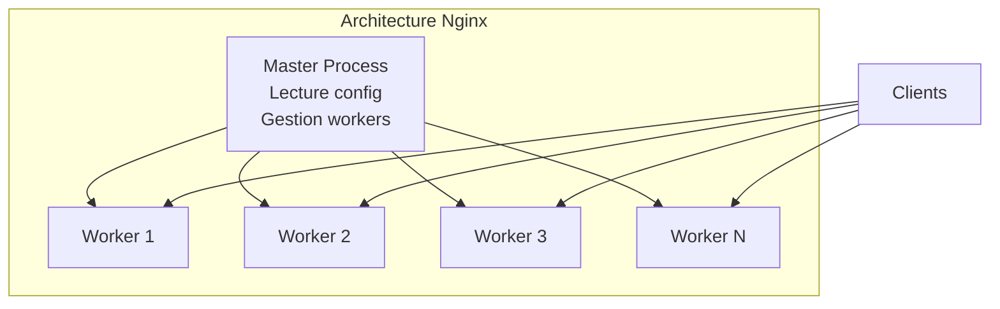
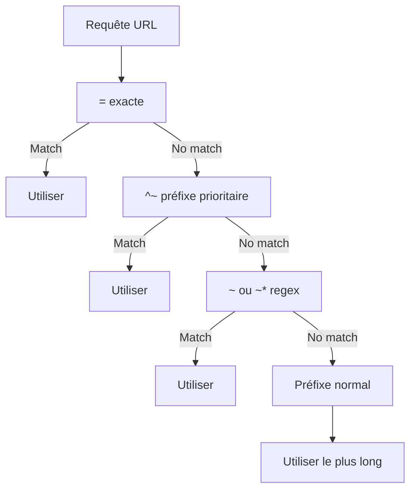

# Module 8 : Nginx - Introduction et Configuration de Base

## Objectifs du module

- Comprendre le rôle et l'architecture de Nginx
- Maîtriser la structure du fichier de configuration
- Configurer des serveurs virtuels
- Servir du contenu statique

---

## 8.1 Qu'est-ce que Nginx ?

Nginx est un serveur web haute performance, reverse proxy, load balancer et cache HTTP.


### Avantages

| Caractéristique | Description |
|-----------------|-------------|
| Performance | Architecture événementielle, non-bloquante |
| Mémoire | Faible empreinte mémoire |
| Concurrence | Milliers de connexions simultanées |
| Flexibilité | Nombreux modules et configurations |
| Stabilité | Très stable en production |

---

## 8.2 Architecture de Nginx



### Processus

- **Master** : Lit la configuration, gère les workers
- **Workers** : Traitent les requêtes (1 par CPU recommandé)

---

## 8.3 Structure de configuration

### Fichiers principaux

```
/etc/nginx/
    nginx.conf              # Configuration principale
    conf.d/                 # Configurations additionnelles
        default.conf
        mysite.conf
    sites-available/        # Sites disponibles (Debian/Ubuntu)
    sites-enabled/          # Sites activés (liens symboliques)
    mime.types              # Types MIME
```

### Structure de nginx.conf

```nginx
# Contexte global (main)
user nginx;
worker_processes auto;
error_log /var/log/nginx/error.log warn;
pid /var/run/nginx.pid;

# Contexte events
events {
    worker_connections 1024;
    multi_accept on;
}

# Contexte http
http {
    include /etc/nginx/mime.types;
    default_type application/octet-stream;
    
    # Logging
    log_format main '$remote_addr - $remote_user [$time_local] "$request" '
                    '$status $body_bytes_sent "$http_referer" '
                    '"$http_user_agent"';
    access_log /var/log/nginx/access.log main;
    
    # Performance
    sendfile on;
    tcp_nopush on;
    keepalive_timeout 65;
    gzip on;
    
    # Inclusion des configurations de sites
    include /etc/nginx/conf.d/*.conf;
}
```


---

## Exercice 1 (15 minutes)

### Explorer la configuration par défaut

1. Lancez un container Nginx :
   ```bash
   docker run -d --name nginx-explore -p 8080:80 nginx:alpine
   ```

2. Explorez la configuration :
   ```bash
   # Configuration principale
   docker exec nginx-explore cat /etc/nginx/nginx.conf
   
   # Configuration du site par défaut
   docker exec nginx-explore cat /etc/nginx/conf.d/default.conf
   
   # Types MIME
   docker exec nginx-explore head -50 /etc/nginx/mime.types
   ```

3. Testez le serveur :
   ```bash
   curl http://localhost:8080
   ```

4. Consultez les logs :
   ```bash
   docker logs nginx-explore
   ```

5. Nettoyez :
   ```bash
   docker rm -f nginx-explore
   ```

---

## 8.4 Configuration d'un serveur virtuel

### Server block basique

```nginx
server {
    listen 80;
    server_name example.com www.example.com;
    
    root /var/www/html;
    index index.html index.htm;
    
    location / {
        try_files $uri $uri/ =404;
    }
}
```

### Directives importantes

```nginx
server {
    # Port d'écoute
    listen 80;
    listen 443 ssl;
    listen [::]:80;  # IPv6
    
    # Noms de domaine
    server_name example.com *.example.com;
    
    # Racine du site
    root /var/www/html;
    
    # Fichiers index
    index index.html index.php;
    
    # Logs spécifiques
    access_log /var/log/nginx/example.access.log;
    error_log /var/log/nginx/example.error.log;
}
```

---

## 8.5 Directives location

```nginx
# Correspondance exacte
location = /favicon.ico {
    log_not_found off;
}

# Préfixe
location /images/ {
    root /var/www/static;
}

# Expression régulière (case sensitive)
location ~ \.php$ {
    fastcgi_pass php:9000;
}

# Expression régulière (case insensitive)
location ~* \.(jpg|jpeg|png|gif)$ {
    expires 30d;
}

# Préfixe prioritaire
location ^~ /static/ {
    root /var/www;
}
```

### Ordre de priorité



---

## Exercice 2 (15 minutes)

### Configurer un site personnalisé

1. Créez un dossier de travail :
   ```bash
   mkdir -p ~/nginx-demo/html
   cd ~/nginx-demo
   ```

2. Créez du contenu HTML :
   ```bash
   cat > html/index.html << 'EOF'
   <!DOCTYPE html>
   <html>
   <head><title>Mon Site</title></head>
   <body>
   <h1>Bienvenue sur mon site Nginx</h1>
   <p>Configuration personnalisée</p>
   </body>
   </html>
   EOF
   
   mkdir html/images
   echo "Image placeholder" > html/images/test.txt
   ```

3. Créez la configuration :
   ```bash
   cat > nginx.conf << 'EOF'
   events {
       worker_connections 1024;
   }
   
   http {
       include /etc/nginx/mime.types;
       
       server {
           listen 80;
           server_name localhost;
           
           root /usr/share/nginx/html;
           index index.html;
           
           location / {
               try_files $uri $uri/ =404;
           }
           
           location /images/ {
               autoindex on;
           }
       }
   }
   EOF
   ```

4. Lancez le container :
   ```bash
   docker run -d --name custom-nginx \
       -p 8080:80 \
       -v $(pwd)/nginx.conf:/etc/nginx/nginx.conf:ro \
       -v $(pwd)/html:/usr/share/nginx/html:ro \
       nginx:alpine
   ```

5. Testez :
   ```bash
   curl http://localhost:8080
   curl http://localhost:8080/images/
   ```

6. Nettoyez :
   ```bash
   docker rm -f custom-nginx
   cd ~
   rm -rf ~/nginx-demo
   ```

---

## 8.6 Variables Nginx

### Variables intégrées

```nginx
server {
    # Variables de requête
    # $request_uri    - URI complète avec query string
    # $uri            - URI normalisé
    # $args           - Query string
    # $request_method - GET, POST, etc.
    
    # Variables client
    # $remote_addr    - IP du client
    # $http_user_agent - User-Agent
    # $http_referer   - Referer
    
    # Variables serveur
    # $host           - Nom d'hôte demandé
    # $server_name    - Nom du serveur
    # $server_port    - Port du serveur
    
    location /debug {
        return 200 "IP: $remote_addr\nHost: $host\nURI: $uri\n";
        add_header Content-Type text/plain;
    }
}
```

### Variables personnalisées

```nginx
http {
    # Définition de variable
    map $http_user_agent $is_mobile {
        default 0;
        ~*mobile 1;
    }
    
    server {
        location / {
            if ($is_mobile) {
                return 302 /mobile/;
            }
        }
    }
}
```

---

## 8.7 Gestion des erreurs

```nginx
server {
    listen 80;
    server_name example.com;
    
    # Pages d'erreur personnalisées
    error_page 404 /404.html;
    error_page 500 502 503 504 /50x.html;
    
    location = /404.html {
        root /var/www/errors;
        internal;
    }
    
    location = /50x.html {
        root /var/www/errors;
        internal;
    }
}
```

---

## Exercice 3 (15 minutes)

### Pages d'erreur personnalisées

1. Créez la structure :
   ```bash
   mkdir -p ~/nginx-errors/{html,errors}
   cd ~/nginx-errors
   ```

2. Créez les pages :
   ```bash
   cat > html/index.html << 'EOF'
   <!DOCTYPE html>
   <html><body><h1>Page principale</h1></body></html>
   EOF
   
   cat > errors/404.html << 'EOF'
   <!DOCTYPE html>
   <html><body><h1>404 - Page non trouvée</h1><p>Désolé!</p></body></html>
   EOF
   
   cat > errors/50x.html << 'EOF'
   <!DOCTYPE html>
   <html><body><h1>Erreur serveur</h1><p>Veuillez réessayer.</p></body></html>
   EOF
   ```

3. Configuration :
   ```bash
   cat > nginx.conf << 'EOF'
   events { worker_connections 1024; }
   
   http {
       server {
           listen 80;
           root /usr/share/nginx/html;
           
           error_page 404 /404.html;
           error_page 500 502 503 504 /50x.html;
           
           location = /404.html {
               root /var/www/errors;
               internal;
           }
           
           location = /50x.html {
               root /var/www/errors;
               internal;
           }
       }
   }
   EOF
   ```

4. Lancez et testez :
   ```bash
   docker run -d --name error-nginx \
       -p 8080:80 \
       -v $(pwd)/nginx.conf:/etc/nginx/nginx.conf:ro \
       -v $(pwd)/html:/usr/share/nginx/html:ro \
       -v $(pwd)/errors:/var/www/errors:ro \
       nginx:alpine
   
   curl http://localhost:8080
   curl http://localhost:8080/page-inexistante
   ```

5. Nettoyez :
   ```bash
   docker rm -f error-nginx
   cd ~ && rm -rf ~/nginx-errors
   ```

---

## Résumé du module


---

## Quiz de validation

1. Quel est le rôle du processus master de Nginx ?
2. Dans quel ordre sont évaluées les directives location ?
3. Quelle est la différence entre `root` et `alias` ?
4. Comment servir une page d'erreur 404 personnalisée ?
5. Quelle variable contient l'adresse IP du client ?
