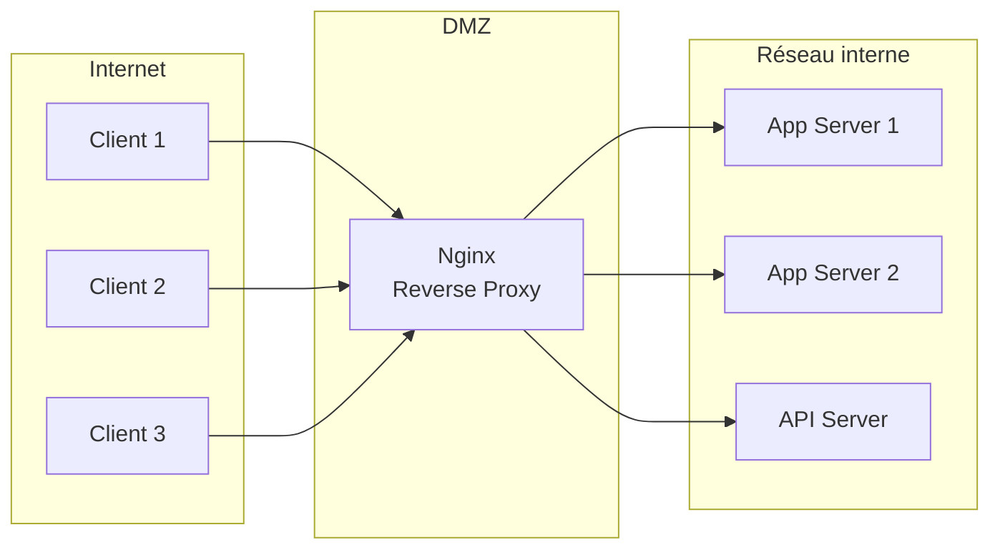
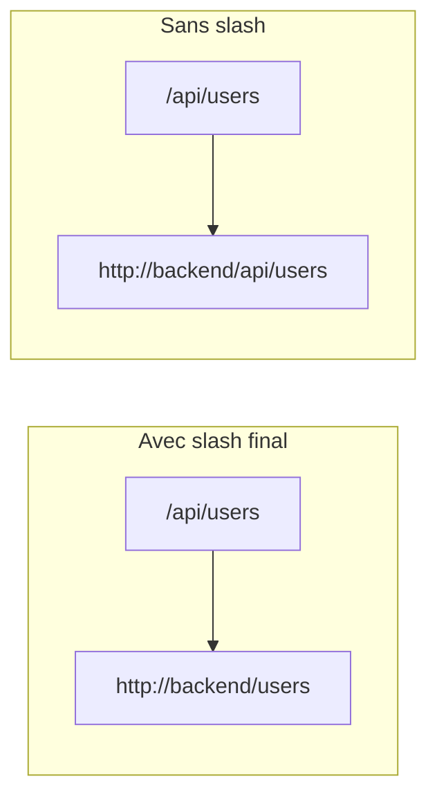
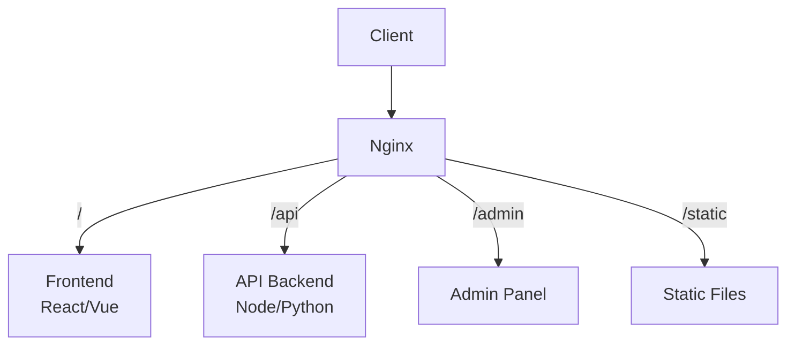
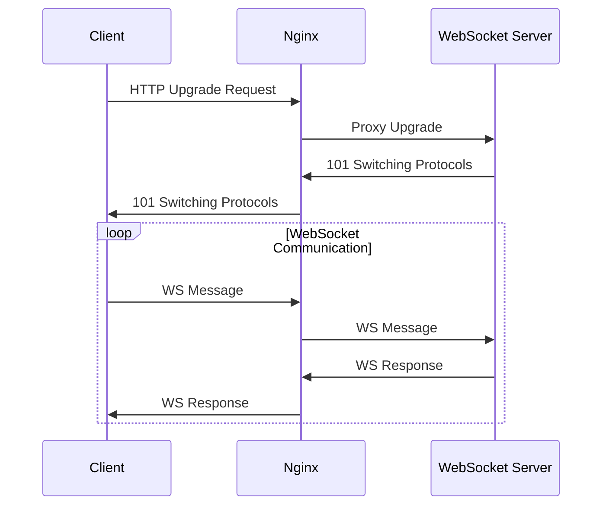
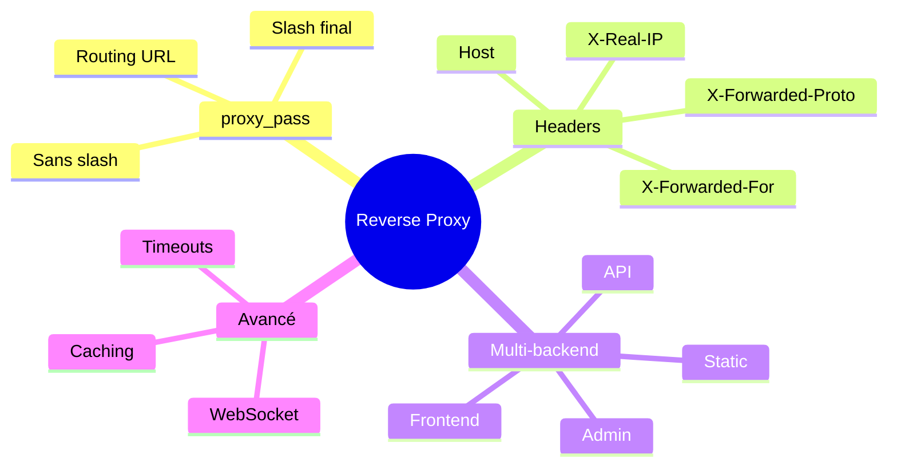

# Module 9 : Nginx comme Reverse Proxy

## Objectifs du module

- Comprendre le concept de reverse proxy
- Configurer Nginx pour router vers des backends
- Gérer les headers HTTP
- Router vers plusieurs services (frontend/backend)

---

## 9.1 Qu'est-ce qu'un Reverse Proxy ?



### Avantages

| Avantage | Description |
|----------|-------------|
| Sécurité | Cache les serveurs backend |
| SSL/TLS | Terminaison centralisée |
| Cache | Mise en cache des réponses |
| Compression | Gzip des réponses |
| Load balancing | Distribution de charge |

---

## 9.2 Configuration proxy_pass

### Syntaxe de base

```nginx
server {
    listen 80;
    server_name example.com;
    
    location / {
        proxy_pass http://backend:3000;
    }
}
```

### Comportement de l'URI

```nginx
# Avec slash final - remplace le chemin
location /api/ {
    proxy_pass http://backend:3000/;
    # /api/users -> http://backend:3000/users
}

# Sans slash - préserve le chemin
location /api/ {
    proxy_pass http://backend:3000;
    # /api/users -> http://backend:3000/api/users
}
```



---

## 9.3 Headers du proxy

### Headers essentiels

```nginx
location / {
    proxy_pass http://backend:3000;
    
    # Passer l'IP réelle du client
    proxy_set_header X-Real-IP $remote_addr;
    proxy_set_header X-Forwarded-For $proxy_add_x_forwarded_for;
    
    # Passer le host original
    proxy_set_header Host $host;
    
    # Protocole original
    proxy_set_header X-Forwarded-Proto $scheme;
    
    # Port original
    proxy_set_header X-Forwarded-Port $server_port;
}
```

### Timeouts

```nginx
location / {
    proxy_pass http://backend:3000;
    
    # Timeout de connexion
    proxy_connect_timeout 60s;
    
    # Timeout d'envoi
    proxy_send_timeout 60s;
    
    # Timeout de lecture
    proxy_read_timeout 60s;
    
    # Taille du buffer
    proxy_buffer_size 4k;
    proxy_buffers 8 4k;
}
```

---

## Exercice 1 (15 minutes)

### Configurer un reverse proxy simple

1. Créez un réseau Docker :
   ```bash
   docker network create proxy-net
   ```

2. Lancez une application backend :
   ```bash
   docker run -d --name backend \
       --network proxy-net \
       hashicorp/http-echo -text="Hello from backend"
   ```

3. Créez la configuration Nginx :
   ```bash
   mkdir ~/proxy-demo && cd ~/proxy-demo
   
   cat > nginx.conf << 'EOF'
   events { worker_connections 1024; }
   
   http {
       server {
           listen 80;
           
           location / {
               proxy_pass http://backend:5678;
               proxy_set_header Host $host;
               proxy_set_header X-Real-IP $remote_addr;
               proxy_set_header X-Forwarded-For $proxy_add_x_forwarded_for;
           }
       }
   }
   EOF
   ```

4. Lancez Nginx :
   ```bash
   docker run -d --name proxy \
       --network proxy-net \
       -p 8080:80 \
       -v $(pwd)/nginx.conf:/etc/nginx/nginx.conf:ro \
       nginx:alpine
   ```

5. Testez :
   ```bash
   curl http://localhost:8080
   curl -v http://localhost:8080
   ```

6. Nettoyez :
   ```bash
   docker rm -f proxy backend
   docker network rm proxy-net
   cd ~ && rm -rf ~/proxy-demo
   ```

---

## 9.4 Routage vers plusieurs backends

### Architecture typique



### Configuration

```nginx
http {
    upstream frontend {
        server frontend:3000;
    }
    
    upstream api {
        server api:8000;
    }
    
    upstream admin {
        server admin:4000;
    }
    
    server {
        listen 80;
        
        # Frontend (SPA)
        location / {
            proxy_pass http://frontend;
            proxy_set_header Host $host;
            proxy_set_header X-Real-IP $remote_addr;
        }
        
        # API Backend
        location /api/ {
            proxy_pass http://api/;
            proxy_set_header Host $host;
            proxy_set_header X-Real-IP $remote_addr;
            proxy_set_header X-Forwarded-For $proxy_add_x_forwarded_for;
            proxy_set_header X-Forwarded-Proto $scheme;
        }
        
        # Admin Panel
        location /admin/ {
            proxy_pass http://admin/;
            proxy_set_header Host $host;
        }
        
        # Fichiers statiques (servis directement)
        location /static/ {
            alias /var/www/static/;
            expires 30d;
            add_header Cache-Control "public, immutable";
        }
    }
}
```

---

## Exercice 2 (15 minutes)

### Multi-backend avec frontend et API

1. Préparez l'environnement :
   ```bash
   mkdir ~/multi-backend && cd ~/multi-backend
   docker network create app-net
   ```

2. Lancez le "frontend" :
   ```bash
   docker run -d --name frontend \
       --network app-net \
       hashicorp/http-echo -text="Frontend Response"
   ```

3. Lancez l'"API" :
   ```bash
   docker run -d --name api \
       --network app-net \
       hashicorp/http-echo -text="API Response" -listen=:5679
   ```

4. Configuration Nginx :
   ```bash
   cat > nginx.conf << 'EOF'
   events { worker_connections 1024; }
   
   http {
       upstream frontend {
           server frontend:5678;
       }
       
       upstream api {
           server api:5679;
       }
       
       server {
           listen 80;
           
           location / {
               proxy_pass http://frontend;
               proxy_set_header Host $host;
           }
           
           location /api/ {
               proxy_pass http://api/;
               proxy_set_header Host $host;
               proxy_set_header X-Real-IP $remote_addr;
           }
       }
   }
   EOF
   ```

5. Lancez le proxy :
   ```bash
   docker run -d --name nginx-proxy \
       --network app-net \
       -p 8080:80 \
       -v $(pwd)/nginx.conf:/etc/nginx/nginx.conf:ro \
       nginx:alpine
   ```

6. Testez les routes :
   ```bash
   echo "Frontend:" && curl http://localhost:8080/
   echo "API:" && curl http://localhost:8080/api/
   echo "API endpoint:" && curl http://localhost:8080/api/users
   ```

7. Nettoyez :
   ```bash
   docker rm -f nginx-proxy frontend api
   docker network rm app-net
   cd ~ && rm -rf ~/multi-backend
   ```

---

## 9.5 WebSocket Proxy

```nginx
http {
    map $http_upgrade $connection_upgrade {
        default upgrade;
        '' close;
    }
    
    server {
        listen 80;
        
        # WebSocket endpoint
        location /ws/ {
            proxy_pass http://websocket-server:8080;
            proxy_http_version 1.1;
            proxy_set_header Upgrade $http_upgrade;
            proxy_set_header Connection $connection_upgrade;
            proxy_set_header Host $host;
            proxy_read_timeout 86400;
        }
    }
}
```



---

## 9.6 Caching

```nginx
http {
    # Zone de cache
    proxy_cache_path /var/cache/nginx levels=1:2 
                     keys_zone=my_cache:10m 
                     max_size=1g 
                     inactive=60m;
    
    server {
        listen 80;
        
        location / {
            proxy_pass http://backend;
            
            # Activer le cache
            proxy_cache my_cache;
            proxy_cache_valid 200 302 10m;
            proxy_cache_valid 404 1m;
            
            # Header pour debug
            add_header X-Cache-Status $upstream_cache_status;
        }
        
        # Pas de cache pour l'API
        location /api/ {
            proxy_pass http://api;
            proxy_cache off;
        }
    }
}
```

---

## Exercice 3 (15 minutes)

### Proxy avec headers personnalisés

1. Préparez :
   ```bash
   mkdir ~/header-demo && cd ~/header-demo
   docker network create header-net
   ```

2. Backend qui affiche les headers :
   ```bash
   docker run -d --name header-backend \
       --network header-net \
       nginx:alpine
   
   # Configurer pour afficher les headers
   docker exec header-backend sh -c 'cat > /etc/nginx/conf.d/default.conf << EOF
   server {
       listen 80;
       location / {
           return 200 "Headers reçus:\nHost: \$host\nX-Real-IP: \$http_x_real_ip\nX-Forwarded-For: \$http_x_forwarded_for\nX-Forwarded-Proto: \$http_x_forwarded_proto\n";
           add_header Content-Type text/plain;
       }
   }
   EOF'
   docker exec header-backend nginx -s reload
   ```

3. Configuration du proxy :
   ```bash
   cat > nginx.conf << 'EOF'
   events { worker_connections 1024; }
   
   http {
       server {
           listen 80;
           
           location / {
               proxy_pass http://header-backend;
               
               # Headers importants
               proxy_set_header Host $host;
               proxy_set_header X-Real-IP $remote_addr;
               proxy_set_header X-Forwarded-For $proxy_add_x_forwarded_for;
               proxy_set_header X-Forwarded-Proto $scheme;
               
               # Headers personnalisés
               proxy_set_header X-Custom-Header "ValeurCustom";
           }
       }
   }
   EOF
   ```

4. Lancez et testez :
   ```bash
   docker run -d --name header-proxy \
       --network header-net \
       -p 8080:80 \
       -v $(pwd)/nginx.conf:/etc/nginx/nginx.conf:ro \
       nginx:alpine
   
   curl http://localhost:8080
   ```

5. Nettoyez :
   ```bash
   docker rm -f header-proxy header-backend
   docker network rm header-net
   cd ~ && rm -rf ~/header-demo
   ```

---

## Résumé du module



---

## Quiz de validation

1. Quelle est la différence entre proxy avec et sans slash final dans l'URL ?
2. Pourquoi est-il important de transmettre le header X-Real-IP ?
3. Comment configurer Nginx pour router /api vers un serveur et / vers un autre ?
4. Quels headers sont nécessaires pour proxyfier les WebSockets ?
5. Comment désactiver le cache pour certaines routes ?
