# Cours 1 : C'est quoi Kubernetes ?

## Objectifs

- Comprendre ce qu'est Kubernetes (sans jargon technique)
- Savoir pourquoi on l'utilise
- Connaître le vocabulaire de base

---

## 1.1 Le problème que Kubernetes résout

### Imaginez cette situation

Vous avez une application qui tourne dans des containers Docker. Tout va bien jusqu'à ce que :

- L'application devient populaire → il faut **plus de containers**
- Un serveur tombe en panne → il faut **redémarrer ailleurs**
- Vous faites une mise à jour → il faut **déployer sans coupure**
- Vous avez 50 containers → il faut **savoir où ils sont**

**Gérer tout ça à la main, c'est impossible.**

### La solution : un orchestrateur

Un **orchestrateur** est un logiciel qui gère automatiquement vos containers :
- Il les démarre
- Il les surveille
- Il les redémarre s'ils plantent
- Il les répartit sur plusieurs machines


---

## 1.2 Kubernetes en une phrase

> **Kubernetes** (K8s) est un système qui automatise le déploiement, la mise à l'échelle et la gestion des applications conteneurisées.

### Pourquoi "K8s" ?

- K**ubernete**s = K + 8 lettres + s = K8s
- C'est plus court à écrire !

### D'où ça vient ?

- Créé par **Google** (basé sur leur système interne "Borg")
- Open source depuis 2014
- Maintenant géré par la **CNCF** (Cloud Native Computing Foundation)
- Utilisé par : Google, Amazon, Microsoft, Netflix, Spotify...

---

## 1.3 Kubernetes vs Docker Swarm

Vous connaissez déjà Docker Swarm. Voici la comparaison :

| Aspect | Docker Swarm | Kubernetes |
|--------|-------------|------------|
| **Difficulté** | Facile | Plus complexe |
| **Installation** | Intégré à Docker | Séparé |
| **Fonctionnalités** | Basiques | Très riches |
| **Communauté** | Petite | Énorme |
| **Adoption entreprise** | Faible | Très forte |
| **Auto-scaling** | Manuel | Automatique possible |

### Quand choisir quoi ?


**Règle simple :**
- Projet simple, équipe petite → Docker Swarm
- Projet complexe, besoin de scaler → Kubernetes

---

## 1.4 L'architecture de Kubernetes (simplifié)

### Les deux types de machines


### Control Plane (Master)

C'est le **cerveau** du cluster. Il décide :
- Où placer les containers
- Combien en lancer
- Que faire si un container plante

**Vous ne touchez jamais directement au Control Plane.**

### Workers (Nodes)

Ce sont les **machines** qui exécutent vos containers.
- Chaque worker peut exécuter plusieurs containers
- Si un worker tombe, Kubernetes déplace les containers ailleurs

---

## 1.5 Le vocabulaire de base

Apprenons les 4 termes essentiels :

### 1. Cluster

Un **cluster** = un ensemble de machines gérées par Kubernetes.

```
Cluster = Control Plane + Workers
```

### 2. Node

Un **node** = une machine dans le cluster (physique ou virtuelle).

```
Node = Un serveur (Master ou Worker)
```

### 3. Pod

Un **Pod** = l'unité de base de Kubernetes.

```
Pod = Un ou plusieurs containers qui tournent ensemble
```

**C'est le concept le plus important !** On en reparlera en détail.

### 4. kubectl

**kubectl** (prononcé "cube-control" ou "cube-c-t-l") = l'outil en ligne de commande pour parler à Kubernetes.

```bash
kubectl = votre télécommande pour Kubernetes
```

---

## 1.6 Comment on interagit avec Kubernetes ?

### Le principe : état désiré

Avec Kubernetes, vous ne dites pas **quoi faire**, vous dites **ce que vous voulez**.


**Exemple :**
- Vous dites : "Je veux 3 instances de mon application"
- Kubernetes crée 3 pods
- Si un pod plante, Kubernetes en recrée un automatiquement
- Vous n'avez rien à faire !

### Les fichiers YAML

On décrit ce qu'on veut dans des fichiers YAML :

```yaml
# Ce fichier dit : "Je veux 3 copies de nginx"
apiVersion: apps/v1
kind: Deployment
metadata:
  name: mon-app
spec:
  replicas: 3          # 3 copies
  selector:
    matchLabels:
      app: nginx
  template:
    spec:
      containers:
      - name: nginx
        image: nginx    # Image Docker
```

**Ne vous inquiétez pas !** On apprendra à écrire ces fichiers progressivement.

---

## 1.7 Résumé visuel

```mermaid
mindmap
  root((Kubernetes))
    C'est quoi?
      Orchestrateur de containers
      Automatise le déploiement
      Gère la haute disponibilité
    Architecture
      Control Plane
        Le cerveau
        Prend les décisions
      Workers
        Les bras
        Exécutent les containers
    Vocabulaire
      Cluster
      Node
      Pod
      kubectl
    Principe
      État désiré
      Fichiers YAML
      Automatisation
```



---

## 1.8 Quiz de validation

Répondez à ces questions :

1. En une phrase, c'est quoi Kubernetes ?

2. Quelle est la différence entre le Control Plane et les Workers ?

3. C'est quoi un Pod ?

4. Comment s'appelle l'outil en ligne de commande pour Kubernetes ?

5. Avec Kubernetes, on décrit quoi dans les fichiers YAML ?

---

## Prochaine étape

Dans le prochain cours, nous allons **installer Kubernetes** sur votre machine avec Minikube, puis lancer notre premier pod !

