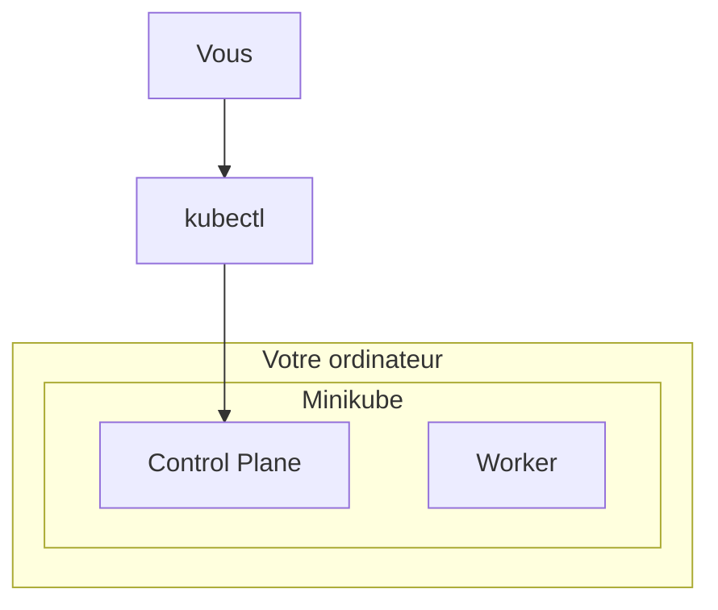
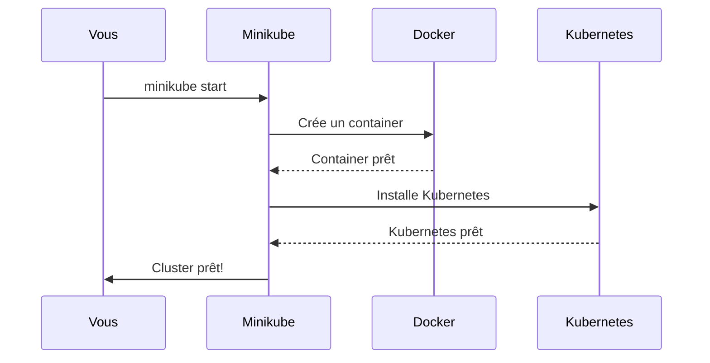
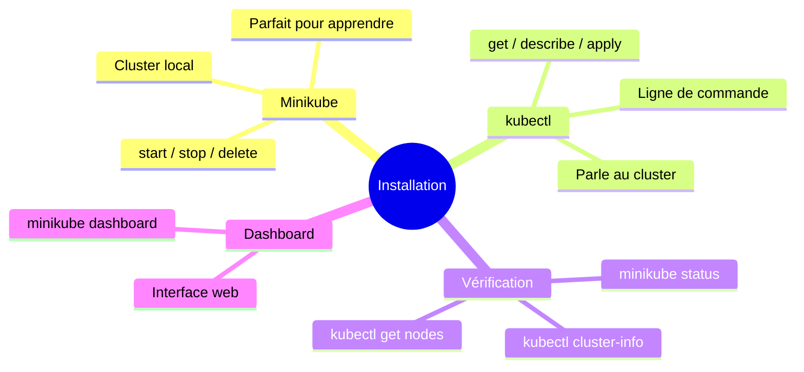

# Cours 2 : Installation avec Minikube

## Objectifs

- Installer Minikube sur votre machine
- Installer kubectl
- Lancer votre premier cluster Kubernetes
- Vérifier que tout fonctionne

---

## 2.1 C'est quoi Minikube ?

### Le problème

Un vrai cluster Kubernetes nécessite plusieurs machines. C'est compliqué (et cher) pour apprendre.

### La solution : Minikube

**Minikube** crée un cluster Kubernetes **sur votre ordinateur** dans une machine virtuelle ou un container.



**Avantages :**
- Gratuit
- Fonctionne sur Windows, Mac, Linux
- Parfait pour apprendre
- Identique à un vrai cluster (en plus petit)

---

## 2.2 Prérequis

### Ce dont vous avez besoin

| Élément | Minimum | Recommandé |
|---------|---------|------------|
| RAM | 2 Go libres | 4 Go libres |
| CPU | 2 coeurs | 4 coeurs |
| Disque | 20 Go libres | 40 Go libres |
| Docker | Installé et fonctionnel | - |

### Vérifier Docker

```bash
docker --version
docker info
```

Si Docker fonctionne, vous êtes prêt !

---

## 2.3 Installation de kubectl

**kubectl** est l'outil en ligne de commande pour Kubernetes. Il faut l'installer d'abord.

### Windows (avec Chocolatey)

```powershell
choco install kubernetes-cli
```

### Windows (manuel)

```powershell
# Télécharger kubectl
curl.exe -LO "https://dl.k8s.io/release/v1.29.0/bin/windows/amd64/kubectl.exe"

# Déplacer dans un dossier du PATH
# Exemple : C:\kubectl\kubectl.exe
# Ajouter C:\kubectl au PATH système
```

### Linux (Ubuntu/Debian)

```bash
# Télécharger la clé
curl -fsSL https://pkgs.k8s.io/core:/stable:/v1.29/deb/Release.key | sudo gpg --dearmor -o /etc/apt/keyrings/kubernetes-apt-keyring.gpg

# Ajouter le dépôt
echo 'deb [signed-by=/etc/apt/keyrings/kubernetes-apt-keyring.gpg] https://pkgs.k8s.io/core:/stable:/v1.29/deb/ /' | sudo tee /etc/apt/sources.list.d/kubernetes.list

# Installer
sudo apt update
sudo apt install -y kubectl
```

### Mac (avec Homebrew)

```bash
brew install kubectl
```

### Vérifier l'installation

```bash
kubectl version --client
```

Vous devez voir quelque chose comme :
```
Client Version: v1.29.0
```

---

## 2.4 Installation de Minikube

### Windows (avec Chocolatey)

```powershell
choco install minikube
```

### Windows (manuel)

```powershell
# Télécharger
curl.exe -Lo minikube.exe https://github.com/kubernetes/minikube/releases/latest/download/minikube-windows-amd64.exe

# Créer le dossier et déplacer
New-Item -Path 'C:\minikube' -ItemType Directory -Force
Move-Item .\minikube.exe C:\minikube\minikube.exe

# Ajouter au PATH (PowerShell admin)
$oldPath = [Environment]::GetEnvironmentVariable('Path', 'Machine')
[Environment]::SetEnvironmentVariable('Path', "$oldPath;C:\minikube", 'Machine')
```

### Linux

```bash
curl -LO https://storage.googleapis.com/minikube/releases/latest/minikube-linux-amd64
sudo install minikube-linux-amd64 /usr/local/bin/minikube
rm minikube-linux-amd64
```

### Mac (avec Homebrew)

```bash
brew install minikube
```

### Vérifier l'installation

```bash
minikube version
```

---

## 2.5 Démarrer votre premier cluster

### Lancer Minikube

```bash
minikube start
```

C'est tout ! Minikube va :
1. Télécharger l'image nécessaire
2. Créer une VM ou un container
3. Installer Kubernetes dedans
4. Configurer kubectl automatiquement

**Première fois :** Ça peut prendre 5-10 minutes.

### Que se passe-t-il ?



---

## 2.6 Vérifier que tout fonctionne

### 1. Statut de Minikube

```bash
minikube status
```

Résultat attendu :
```
minikube
type: Control Plane
host: Running
kubelet: Running
apiserver: Running
kubeconfig: Configured
```

### 2. Infos du cluster

```bash
kubectl cluster-info
```

Résultat :
```
Kubernetes control plane is running at https://127.0.0.1:XXXXX
CoreDNS is running at https://127.0.0.1:XXXXX/api/v1/...
```

### 3. Lister les nodes

```bash
kubectl get nodes
```

Résultat :
```
NAME       STATUS   ROLES           AGE   VERSION
minikube   Ready    control-plane   5m    v1.28.3
```

**Félicitations !** Votre cluster Kubernetes fonctionne !

---

## 2.7 Exercice pratique (15 minutes)

### Explorez votre cluster

1. **Voir les pods système :**
   ```bash
   kubectl get pods -n kube-system
   ```
   Ces pods font tourner Kubernetes lui-même.

2. **Voir tous les namespaces :**
   ```bash
   kubectl get namespaces
   ```

3. **Infos détaillées sur le node :**
   ```bash
   kubectl describe node minikube
   ```

4. **Ouvrir le dashboard (interface web) :**
   ```bash
   minikube dashboard
   ```
   Un navigateur s'ouvre avec une interface graphique !

5. **Voir les ressources disponibles :**
   ```bash
   kubectl api-resources | head -20
   ```

---

## 2.8 Commandes Minikube essentielles

| Commande | Description |
|----------|-------------|
| `minikube start` | Démarrer le cluster |
| `minikube stop` | Arrêter le cluster (garde les données) |
| `minikube delete` | Supprimer complètement le cluster |
| `minikube status` | Voir l'état du cluster |
| `minikube dashboard` | Ouvrir l'interface web |
| `minikube ssh` | Se connecter au node |
| `minikube ip` | Voir l'IP du cluster |

---

## 2.9 Commandes kubectl essentielles

| Commande | Description |
|----------|-------------|
| `kubectl get <ressource>` | Lister des ressources |
| `kubectl describe <ressource>` | Détails d'une ressource |
| `kubectl create` | Créer une ressource |
| `kubectl delete` | Supprimer une ressource |
| `kubectl apply -f <fichier>` | Appliquer un fichier YAML |
| `kubectl logs <pod>` | Voir les logs d'un pod |
| `kubectl exec -it <pod> -- sh` | Entrer dans un pod |

---

## 2.10 Problèmes courants

### "minikube start" est très lent

- Vérifiez que vous avez assez de RAM libre
- Première exécution = téléchargement, c'est normal

### "kubectl: command not found"

- kubectl n'est pas dans le PATH
- Réinstallez ou ajoutez au PATH

### "Unable to connect to the server"

- Minikube n'est pas démarré
- Exécutez `minikube start`

### Le dashboard ne s'ouvre pas

- Vérifiez que minikube tourne : `minikube status`
- Essayez : `minikube dashboard --url` (donne juste l'URL)

---

## 2.11 Résumé



---

## 2.12 Quiz de validation

**1. C'est quoi Minikube ?**

<details>
<summary>Voir la réponse</summary>

Minikube est un outil qui permet de créer un cluster Kubernetes local sur votre ordinateur (dans une VM ou un container). C'est parfait pour apprendre et tester.

</details>

**2. Quelle commande pour démarrer le cluster ?**

<details>
<summary>Voir la réponse</summary>

```bash
minikube start
```

</details>

**3. Comment vérifier que le cluster fonctionne ?**

<details>
<summary>Voir la réponse</summary>

```bash
minikube status
kubectl cluster-info
```

</details>

**4. Quelle commande pour voir les nodes ?**

<details>
<summary>Voir la réponse</summary>

```bash
kubectl get nodes
```

</details>

**5. Comment ouvrir l'interface web ?**

<details>
<summary>Voir la réponse</summary>

```bash
minikube dashboard
```

</details>

---

## Prochaine étape

Dans le prochain cours, nous allons créer notre **premier Pod** !

