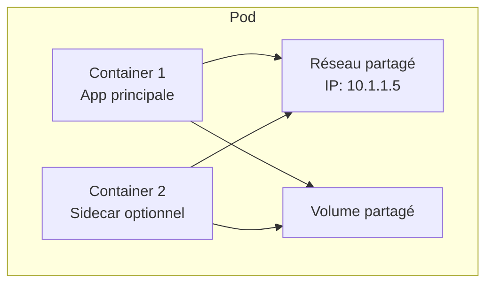
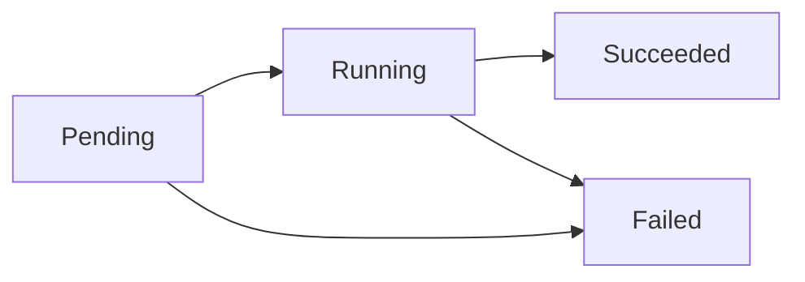
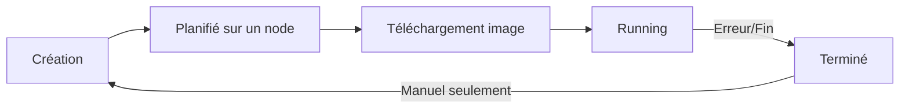
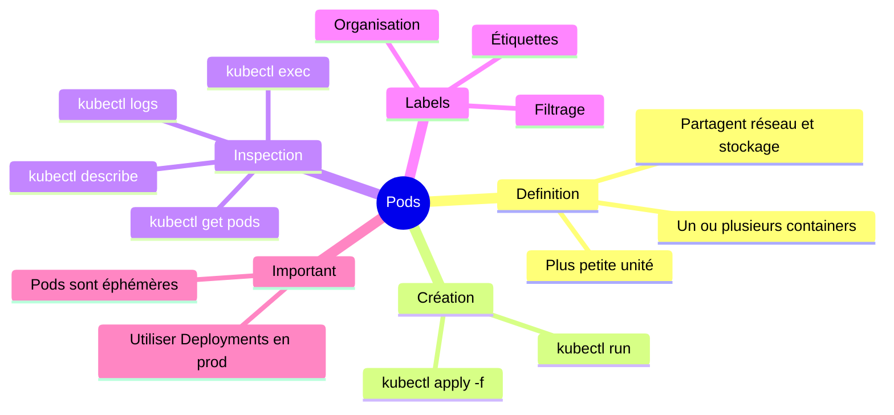

# Cours 3 : Les Pods

## Objectifs

- Comprendre ce qu'est un Pod
- Créer des Pods de différentes façons
- Inspecter et débugger des Pods
- Comprendre le cycle de vie d'un Pod

---

## 3.1 C'est quoi un Pod ?

### Définition simple

Un **Pod** est la plus petite unité dans Kubernetes. C'est un groupe d'un ou plusieurs containers qui :
- Partagent le même réseau (même IP)
- Partagent le même stockage
- Sont toujours sur la même machine

### Analogie

Pensez à un Pod comme un **appartement** :
- L'appartement = le Pod
- Les pièces = les containers
- Les colocataires partagent la cuisine et la salle de bain = réseau et stockage partagés



### Dans 90% des cas

**Un Pod = Un Container**

C'est la configuration la plus courante. Ne vous compliquez pas la vie !

---

## 3.2 Créer un Pod - Méthode rapide

### Avec une commande

```bash
# Créer un pod nginx
kubectl run mon-premier-pod --image=nginx

# Vérifier qu'il existe
kubectl get pods
```

Résultat :
```
NAME              READY   STATUS    RESTARTS   AGE
mon-premier-pod   1/1     Running   0          30s
```

### Comprendre le résultat

| Colonne | Signification |
|---------|---------------|
| NAME | Nom du pod |
| READY | Containers prêts / total |
| STATUS | État actuel |
| RESTARTS | Nombre de redémarrages |
| AGE | Depuis combien de temps |

### Les états possibles



| État | Signification |
|------|---------------|
| **Pending** | En attente (téléchargement image, etc.) |
| **Running** | Le container tourne |
| **Succeeded** | Terminé avec succès (pour les jobs) |
| **Failed** | Erreur |
| **CrashLoopBackOff** | Plante en boucle |

---

## 3.3 Créer un Pod - Méthode YAML

### Pourquoi YAML ?

La commande `kubectl run` est pratique pour tester, mais en vrai on utilise des fichiers YAML :
- Versionnable dans Git
- Reproductible
- Documenté

### Fichier pod.yaml

```yaml
apiVersion: v1
kind: Pod
metadata:
  name: mon-pod-nginx
  labels:
    app: web
spec:
  containers:
  - name: nginx
    image: nginx:alpine
    ports:
    - containerPort: 80
```

### Explication ligne par ligne

```yaml
apiVersion: v1          # Version de l'API Kubernetes
kind: Pod               # Type de ressource
metadata:               # Informations sur le pod
  name: mon-pod-nginx   # Nom unique du pod
  labels:               # Étiquettes (pour organiser)
    app: web
spec:                   # Spécification (ce qu'on veut)
  containers:           # Liste des containers
  - name: nginx         # Nom du container
    image: nginx:alpine # Image Docker à utiliser
    ports:
    - containerPort: 80 # Port exposé
```

### Créer le pod

```bash
# Créer à partir du fichier
kubectl apply -f pod.yaml

# Vérifier
kubectl get pods
```

---

## 3.4 Exercice pratique 1 (15 minutes)

### Créer et explorer des pods

1. **Créer un fichier `mon-pod.yaml` :**

```yaml
apiVersion: v1
kind: Pod
metadata:
  name: hello-pod
  labels:
    app: hello
spec:
  containers:
  - name: hello
    image: hashicorp/http-echo
    args:
    - "-text=Bonjour depuis Kubernetes!"
    ports:
    - containerPort: 5678
```

2. **Appliquer le fichier :**
```bash
kubectl apply -f mon-pod.yaml
```

3. **Vérifier le statut :**
```bash
kubectl get pods
kubectl get pods -o wide    # Plus de détails
```

4. **Voir les détails du pod :**
```bash
kubectl describe pod hello-pod
```

5. **Voir les logs :**
```bash
kubectl logs hello-pod
```

6. **Tester l'accès (depuis minikube) :**
```bash
# Obtenir l'IP du pod
kubectl get pod hello-pod -o wide

# Tester (remplacer IP)
kubectl run test --rm -it --image=busybox -- wget -qO- http://<IP-DU-POD>:5678
```

7. **Supprimer le pod :**
```bash
kubectl delete pod hello-pod
# ou
kubectl delete -f mon-pod.yaml
```

---

## 3.5 Inspecter un Pod

### Commandes utiles

```bash
# Liste simple
kubectl get pods

# Liste avec plus d'infos
kubectl get pods -o wide

# Détails complets
kubectl describe pod <nom-du-pod>

# Format YAML
kubectl get pod <nom-du-pod> -o yaml

# Format JSON
kubectl get pod <nom-du-pod> -o json
```

### Voir les logs

```bash
# Logs du container principal
kubectl logs <nom-du-pod>

# Suivre les logs en temps réel
kubectl logs -f <nom-du-pod>

# Dernières 50 lignes
kubectl logs --tail=50 <nom-du-pod>

# Si plusieurs containers dans le pod
kubectl logs <nom-du-pod> -c <nom-container>
```

### Entrer dans un Pod

```bash
# Ouvrir un shell
kubectl exec -it <nom-du-pod> -- /bin/sh

# Exécuter une commande
kubectl exec <nom-du-pod> -- ls -la

# Si plusieurs containers
kubectl exec -it <nom-du-pod> -c <nom-container> -- /bin/sh
```

---

## 3.6 Cycle de vie d'un Pod

### Ce qu'il faut comprendre

**Un Pod est éphémère.** Si un Pod meurt, Kubernetes n'en crée PAS un nouveau automatiquement (sauf si vous utilisez un Deployment).



### Pourquoi c'est important ?

- Ne créez **jamais** des Pods directement en production
- Utilisez des **Deployments** (prochain cours !)
- Les Pods seuls sont utiles pour tester

---

## 3.7 Les Labels

### C'est quoi ?

Les **labels** sont des étiquettes que vous collez sur vos ressources pour les organiser.

```yaml
metadata:
  name: mon-pod
  labels:
    app: frontend
    env: production
    version: v1.2.0
```

### Pourquoi c'est utile ?

```bash
# Voir tous les pods avec l'app "frontend"
kubectl get pods -l app=frontend

# Voir tous les pods en production
kubectl get pods -l env=production

# Supprimer tous les pods de test
kubectl delete pods -l env=test
```

---

## 3.8 Exercice pratique 2 (15 minutes)

### Jouer avec les labels

1. **Créer plusieurs pods :**

```yaml
# fichier: pods-labels.yaml
---
apiVersion: v1
kind: Pod
metadata:
  name: frontend-1
  labels:
    app: frontend
    env: dev
spec:
  containers:
  - name: nginx
    image: nginx:alpine
---
apiVersion: v1
kind: Pod
metadata:
  name: frontend-2
  labels:
    app: frontend
    env: prod
spec:
  containers:
  - name: nginx
    image: nginx:alpine
---
apiVersion: v1
kind: Pod
metadata:
  name: backend-1
  labels:
    app: backend
    env: dev
spec:
  containers:
  - name: echo
    image: hashicorp/http-echo
    args: ["-text=Backend"]
```

2. **Appliquer :**
```bash
kubectl apply -f pods-labels.yaml
```

3. **Filtrer par labels :**
```bash
# Tous les pods
kubectl get pods --show-labels

# Seulement frontend
kubectl get pods -l app=frontend

# Seulement dev
kubectl get pods -l env=dev

# Frontend ET prod
kubectl get pods -l app=frontend,env=prod
```

4. **Supprimer par label :**
```bash
# Supprimer tous les pods dev
kubectl delete pods -l env=dev

# Vérifier
kubectl get pods
```

5. **Nettoyer :**
```bash
kubectl delete pods --all
```

---

## 3.9 Résumé



---

## 3.10 Aide-mémoire

```bash
# Créer un pod rapidement
kubectl run <nom> --image=<image>

# Créer depuis un fichier
kubectl apply -f <fichier.yaml>

# Lister les pods
kubectl get pods
kubectl get pods -o wide
kubectl get pods -l <label>=<valeur>

# Détails d'un pod
kubectl describe pod <nom>

# Logs
kubectl logs <nom>
kubectl logs -f <nom>

# Entrer dans un pod
kubectl exec -it <nom> -- /bin/sh

# Supprimer
kubectl delete pod <nom>
kubectl delete -f <fichier.yaml>
```

---

## 3.11 Quiz de validation

**1. C'est quoi un Pod en une phrase ?**

<details>
<summary>Voir la réponse</summary>

Un Pod est la plus petite unité de Kubernetes, contenant un ou plusieurs containers qui partagent le même réseau et stockage.

</details>

**2. Quelle commande pour créer un pod nginx rapidement ?**

<details>
<summary>Voir la réponse</summary>

```bash
kubectl run mon-pod --image=nginx
```

</details>

**3. Comment voir les logs d'un pod ?**

<details>
<summary>Voir la réponse</summary>

```bash
kubectl logs <nom-du-pod>

# Ou en temps réel
kubectl logs -f <nom-du-pod>
```

</details>

**4. Comment entrer dans un pod avec un shell ?**

<details>
<summary>Voir la réponse</summary>

```bash
kubectl exec -it <nom-du-pod> -- /bin/sh
```

</details>

**5. Pourquoi les Pods seuls ne sont pas recommandés en production ?**

<details>
<summary>Voir la réponse</summary>

Parce que les Pods sont éphémères : si un Pod meurt, il n'est pas recréé automatiquement. Il faut utiliser des **Deployments** qui gèrent les Pods et les recréent automatiquement en cas de problème.

</details>

---

## Prochaine étape

Dans le prochain cours, nous allons découvrir les **Deployments** - la bonne façon de déployer des applications !

