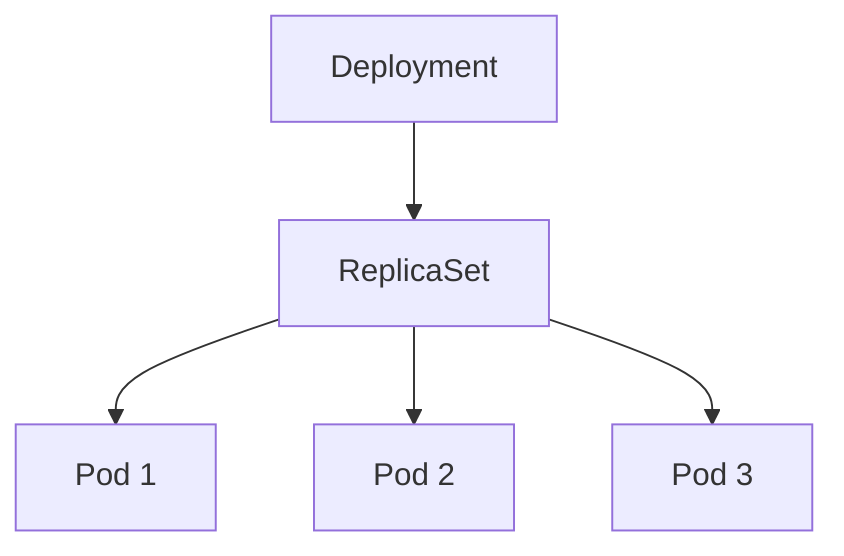
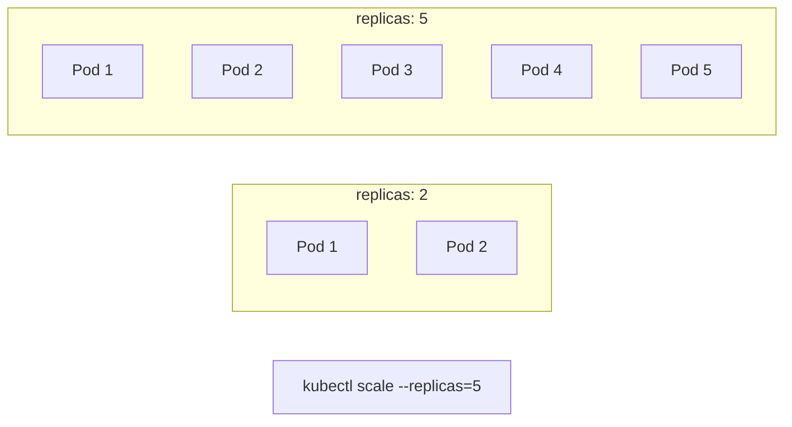
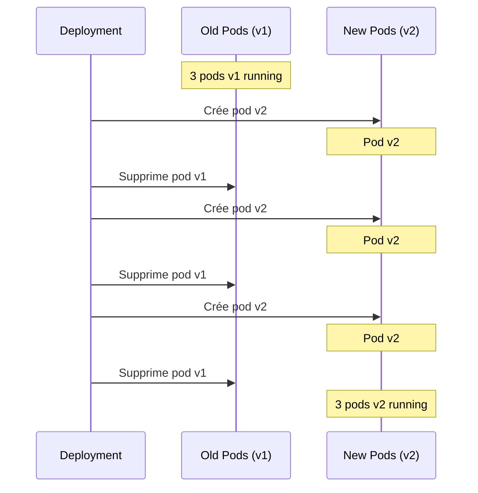
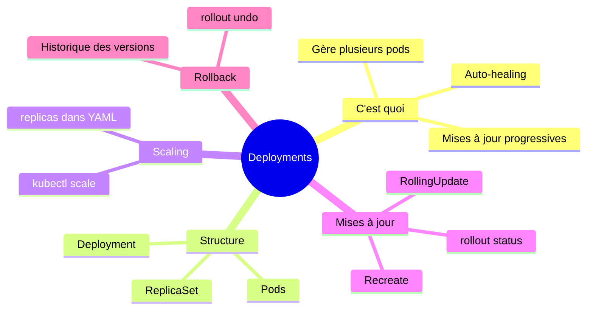

# Cours 4 : Les Deployments

## Objectifs

- Comprendre ce qu'est un Deployment
- Créer des Deployments
- Scaler une application
- Faire des mises à jour sans interruption

---

## 4.1 Le problème avec les Pods seuls

### Ce qui ne va pas

Dans le cours précédent, nous avons créé des Pods directement. Mais :

- Si un Pod plante → **il ne redémarre pas**
- Si on veut 5 copies → **il faut créer 5 fichiers**
- Pour une mise à jour → **il faut tout supprimer et recréer**

**Ce n'est pas gérable en production !**

### La solution : les Deployments

Un **Deployment** est une ressource qui :
- Gère plusieurs Pods identiques (replicas)
- Les redémarre automatiquement s'ils plantent
- Permet des mises à jour progressives
- Garde l'historique des versions



---

## 4.2 Créer un Deployment

### Fichier deployment.yaml

```yaml
apiVersion: apps/v1
kind: Deployment
metadata:
  name: mon-app
spec:
  replicas: 3
  selector:
    matchLabels:
      app: mon-app
  template:
    metadata:
      labels:
        app: mon-app
    spec:
      containers:
      - name: nginx
        image: nginx:alpine
        ports:
        - containerPort: 80
```

### Explication simple

```yaml
apiVersion: apps/v1       # API pour les Deployments
kind: Deployment          # C'est un Deployment

metadata:
  name: mon-app           # Nom du Deployment

spec:
  replicas: 3             # Je veux 3 copies de mon app
  
  selector:
    matchLabels:
      app: mon-app        # Gère les pods avec ce label
  
  template:               # Modèle pour créer les pods
    metadata:
      labels:
        app: mon-app      # Les pods auront ce label
    spec:
      containers:
      - name: nginx
        image: nginx:alpine
        ports:
        - containerPort: 80
```

### Créer le Deployment

```bash
kubectl apply -f deployment.yaml
```

### Vérifier

```bash
# Voir le deployment
kubectl get deployments

# Voir les pods créés
kubectl get pods

# Détails
kubectl describe deployment mon-app
```

---

## 4.3 Exercice pratique 1 (15 minutes)

### Mon premier Deployment

1. **Créer `deployment.yaml` :**

```yaml
apiVersion: apps/v1
kind: Deployment
metadata:
  name: hello-deploy
spec:
  replicas: 3
  selector:
    matchLabels:
      app: hello
  template:
    metadata:
      labels:
        app: hello
    spec:
      containers:
      - name: hello
        image: hashicorp/http-echo
        args:
        - "-text=Bonjour depuis le Deployment!"
        ports:
        - containerPort: 5678
```

2. **Appliquer :**
```bash
kubectl apply -f deployment.yaml
```

3. **Observer les ressources créées :**
```bash
kubectl get deployments
kubectl get replicasets
kubectl get pods
```

4. **Tester la résilience - supprimer un pod :**
```bash
# Lister les pods
kubectl get pods

# Supprimer un pod (copier un nom)
kubectl delete pod <nom-du-pod>

# Regarder ce qui se passe (un nouveau pod est créé!)
kubectl get pods
```

5. **Observer en temps réel :**
```bash
# Dans un autre terminal
watch kubectl get pods
```

---

## 4.4 Scaler une application

### Augmenter le nombre de replicas

```bash
# Méthode 1 : commande
kubectl scale deployment mon-app --replicas=5

# Vérifier
kubectl get pods
```

```bash
# Méthode 2 : modifier le fichier YAML
# Changer replicas: 5 puis :
kubectl apply -f deployment.yaml
```

### Réduire le nombre de replicas

```bash
kubectl scale deployment mon-app --replicas=2
```

### Visualisation



---

## 4.5 Mises à jour (Rolling Updates)

### Le problème

Comment mettre à jour une application sans interruption de service ?

### La solution : Rolling Update

Kubernetes met à jour les pods **progressivement** :
1. Crée un nouveau pod avec la nouvelle version
2. Attend qu'il soit prêt
3. Supprime un ancien pod
4. Répète jusqu'à ce que tout soit à jour



### Faire une mise à jour

```bash
# Méthode 1 : changer l'image
kubectl set image deployment/mon-app nginx=nginx:1.25

# Méthode 2 : modifier le YAML et apply
kubectl apply -f deployment.yaml
```

### Observer la mise à jour

```bash
# Statut de la mise à jour
kubectl rollout status deployment/mon-app

# Historique des versions
kubectl rollout history deployment/mon-app
```

---

## 4.6 Exercice pratique 2 (15 minutes)

### Mise à jour et rollback

1. **Créer un deployment avec une version :**

```yaml
# version-app.yaml
apiVersion: apps/v1
kind: Deployment
metadata:
  name: version-app
spec:
  replicas: 3
  selector:
    matchLabels:
      app: version-app
  template:
    metadata:
      labels:
        app: version-app
    spec:
      containers:
      - name: app
        image: nginx:1.24
        ports:
        - containerPort: 80
```

```bash
kubectl apply -f version-app.yaml
```

2. **Vérifier la version :**
```bash
kubectl get pods -o wide
kubectl describe deployment version-app | grep Image
```

3. **Mettre à jour vers nginx:1.25 :**
```bash
kubectl set image deployment/version-app app=nginx:1.25
```

4. **Observer la mise à jour :**
```bash
kubectl rollout status deployment/version-app
kubectl get pods
```

5. **Voir l'historique :**
```bash
kubectl rollout history deployment/version-app
```

6. **Revenir en arrière (rollback) :**
```bash
kubectl rollout undo deployment/version-app
```

7. **Vérifier :**
```bash
kubectl describe deployment version-app | grep Image
# Doit afficher nginx:1.24
```

8. **Nettoyer :**
```bash
kubectl delete deployment version-app
```

---

## 4.7 Stratégies de déploiement

### RollingUpdate (défaut)

Mise à jour progressive, aucune interruption.

```yaml
spec:
  strategy:
    type: RollingUpdate
    rollingUpdate:
      maxUnavailable: 1    # Max 1 pod indisponible
      maxSurge: 1          # Max 1 pod en plus
```

### Recreate

Supprime tout, puis recrée. Interruption de service.

```yaml
spec:
  strategy:
    type: Recreate
```

**Quand utiliser Recreate ?**
- Base de données (un seul instance)
- Applications qui ne supportent pas plusieurs versions

---

## 4.8 Commandes essentielles

```bash
# Créer/Mettre à jour un deployment
kubectl apply -f deployment.yaml

# Lister les deployments
kubectl get deployments
kubectl get deploy      # raccourci

# Scaler
kubectl scale deployment <nom> --replicas=<nombre>

# Mettre à jour l'image
kubectl set image deployment/<nom> <container>=<image>

# Statut d'un rollout
kubectl rollout status deployment/<nom>

# Historique
kubectl rollout history deployment/<nom>

# Rollback
kubectl rollout undo deployment/<nom>

# Rollback vers une version spécifique
kubectl rollout undo deployment/<nom> --to-revision=2

# Supprimer
kubectl delete deployment <nom>
```

---

## 4.9 Résumé



---

## 4.10 Quiz de validation

**1. Quelle est la différence entre un Pod et un Deployment ?**

<details>
<summary>Voir la réponse</summary>

- **Pod** : Unité de base, éphémère, ne se recrée pas si supprimé
- **Deployment** : Gère plusieurs Pods, les recrée automatiquement, permet le scaling et les mises à jour progressives

</details>

**2. Comment créer 5 copies d'une application ?**

<details>
<summary>Voir la réponse</summary>

```bash
# Méthode 1 : dans le YAML
spec:
  replicas: 5

# Méthode 2 : commande
kubectl scale deployment mon-app --replicas=5
```

</details>

**3. Que se passe-t-il si un pod géré par un Deployment plante ?**

<details>
<summary>Voir la réponse</summary>

Kubernetes détecte que le nombre de pods est inférieur au nombre désiré (replicas) et crée automatiquement un nouveau pod pour le remplacer.

</details>

**4. Comment mettre à jour l'image d'un Deployment ?**

<details>
<summary>Voir la réponse</summary>

```bash
kubectl set image deployment/mon-app container-name=nouvelle-image:tag
```

</details>

**5. Comment revenir à la version précédente ?**

<details>
<summary>Voir la réponse</summary>

```bash
kubectl rollout undo deployment/mon-app
```

</details>

---

## Prochaine étape

Super, vous savez déployer des applications ! Mais comment les utilisateurs y accèdent-ils ? C'est le rôle des **Services** - prochain cours !

