# Cours 5 : Les Services

## Objectifs

- Comprendre le problème que les Services résolvent
- Créer différents types de Services
- Exposer une application au monde extérieur
- Faire communiquer des applications entre elles

---

## 5.1 Le problème

### Les Pods ont des IPs... qui changent !

Chaque Pod a une adresse IP. Mais :
- Cette IP est **interne** au cluster
- Elle change si le Pod est recréé
- Elle est différente pour chaque replica

**Comment accéder à une application si l'IP change tout le temps ?**

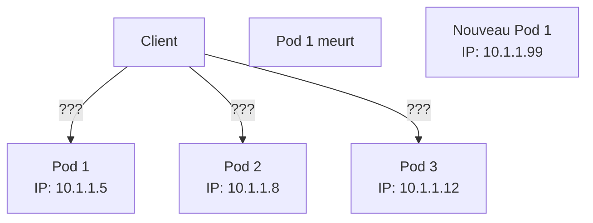

### La solution : les Services

Un **Service** fournit :
- Une **IP stable** qui ne change jamais
- Un **nom DNS** pour accéder facilement
- Du **load balancing** entre les pods

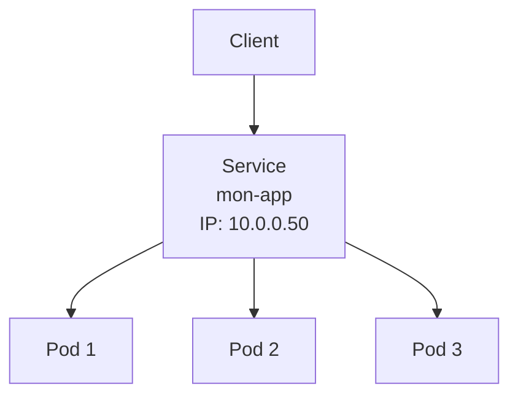

---

## 5.2 Types de Services

Il existe 4 types de Services. On va voir les 3 plus importants :

| Type | Accès | Cas d'usage |
|------|-------|-------------|
| **ClusterIP** | Interne seulement | Communication entre apps |
| **NodePort** | Depuis l'extérieur (port fixe) | Tests, développement |
| **LoadBalancer** | Depuis l'extérieur (cloud) | Production dans le cloud |

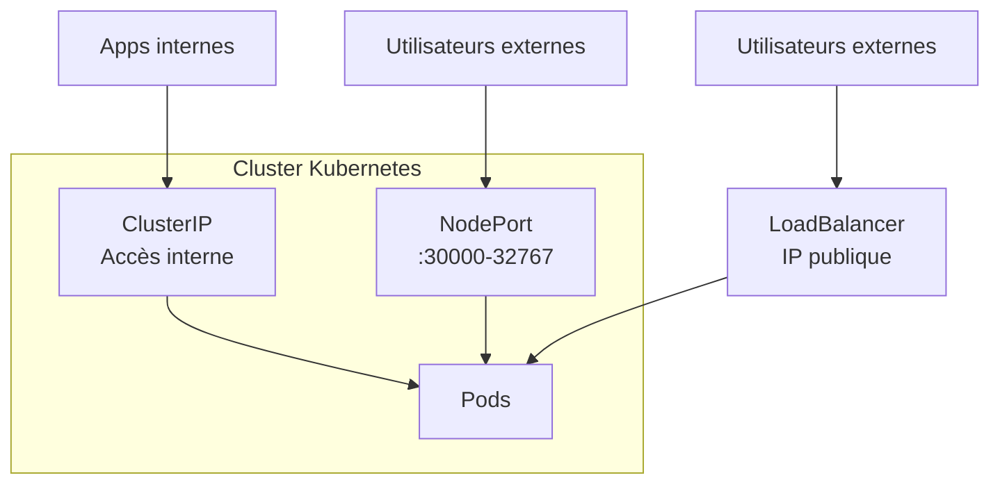

---

## 5.3 Service ClusterIP (défaut)

### C'est quoi ?

- Accessible **uniquement depuis le cluster**
- Parfait pour la communication entre applications
- Type par défaut

### Exemple

```yaml
# service-clusterip.yaml
apiVersion: v1
kind: Service
metadata:
  name: mon-service
spec:
  type: ClusterIP           # Optionnel (c'est le défaut)
  selector:
    app: mon-app            # Cible les pods avec ce label
  ports:
  - port: 80                # Port du service
    targetPort: 80          # Port du container
```

### Créer et tester

```bash
# Créer le service
kubectl apply -f service-clusterip.yaml

# Voir le service
kubectl get services

# Tester depuis un pod
kubectl run test --rm -it --image=busybox -- wget -qO- http://mon-service
```

---

## 5.4 Service NodePort

### C'est quoi ?

- Accessible depuis **l'extérieur du cluster**
- Ouvre un port sur **chaque node** (30000-32767)
- Simple pour les tests

### Exemple

```yaml
# service-nodeport.yaml
apiVersion: v1
kind: Service
metadata:
  name: mon-service-externe
spec:
  type: NodePort
  selector:
    app: mon-app
  ports:
  - port: 80                # Port du service (interne)
    targetPort: 80          # Port du container
    nodePort: 30080         # Port sur le node (optionnel, sinon auto)
```

### Accéder

```bash
# Avec Minikube
minikube service mon-service-externe --url

# Ou manuellement
minikube ip   # Donne l'IP du node
# Puis accéder à http://<IP>:30080
```

---

## 5.5 Exercice pratique 1 (15 minutes)

### Exposer une application

1. **Créer un Deployment :**

```yaml
# app-deployment.yaml
apiVersion: apps/v1
kind: Deployment
metadata:
  name: web-app
spec:
  replicas: 3
  selector:
    matchLabels:
      app: web-app
  template:
    metadata:
      labels:
        app: web-app
    spec:
      containers:
      - name: nginx
        image: nginx:alpine
        ports:
        - containerPort: 80
```

```bash
kubectl apply -f app-deployment.yaml
```

2. **Créer un Service NodePort :**

```yaml
# app-service.yaml
apiVersion: v1
kind: Service
metadata:
  name: web-service
spec:
  type: NodePort
  selector:
    app: web-app
  ports:
  - port: 80
    targetPort: 80
    nodePort: 30080
```

```bash
kubectl apply -f app-service.yaml
```

3. **Vérifier :**
```bash
kubectl get services
kubectl get endpoints web-service    # Voir les pods ciblés
```

4. **Accéder à l'application :**
```bash
# Avec Minikube
minikube service web-service --url

# Ouvrir l'URL dans le navigateur
```

5. **Tester le load balancing :**
```bash
# Modifier nginx pour afficher le hostname
kubectl exec -it <pod-1> -- sh -c "echo Pod-1 > /usr/share/nginx/html/index.html"
kubectl exec -it <pod-2> -- sh -c "echo Pod-2 > /usr/share/nginx/html/index.html"
kubectl exec -it <pod-3> -- sh -c "echo Pod-3 > /usr/share/nginx/html/index.html"

# Faire plusieurs requêtes (observer l'alternance)
for i in 1 2 3 4 5 6; do curl -s $(minikube service web-service --url); done
```

---

## 5.6 Service LoadBalancer

### C'est quoi ?

- Crée un **load balancer externe** (dans le cloud)
- Obtient une **IP publique** automatiquement
- Utilisé en production (AWS, GCP, Azure)

### Exemple

```yaml
apiVersion: v1
kind: Service
metadata:
  name: mon-service-public
spec:
  type: LoadBalancer
  selector:
    app: mon-app
  ports:
  - port: 80
    targetPort: 80
```

### Avec Minikube

Minikube n'a pas de vrais load balancers, mais peut les simuler :

```bash
# Dans un terminal séparé
minikube tunnel

# Le service obtient une IP externe
kubectl get services
```

---

## 5.7 DNS interne

### Comment ça marche ?

Kubernetes crée automatiquement des entrées DNS pour chaque Service.

**Format :** `<nom-service>.<namespace>.svc.cluster.local`

**Version courte :** `<nom-service>` (dans le même namespace)

### Exemple

```bash
# Depuis un pod, vous pouvez appeler :
curl http://web-service           # Dans le même namespace
curl http://web-service.default   # Namespace spécifié
```

---

## 5.8 Exercice pratique 2 (15 minutes)

### Communication entre applications

1. **Créer un backend :**

```yaml
# backend.yaml
apiVersion: apps/v1
kind: Deployment
metadata:
  name: backend
spec:
  replicas: 2
  selector:
    matchLabels:
      app: backend
  template:
    metadata:
      labels:
        app: backend
    spec:
      containers:
      - name: backend
        image: hashicorp/http-echo
        args: ["-text=Reponse du Backend!"]
        ports:
        - containerPort: 5678
---
apiVersion: v1
kind: Service
metadata:
  name: backend-service
spec:
  selector:
    app: backend
  ports:
  - port: 80
    targetPort: 5678
```

2. **Créer un frontend qui appelle le backend :**

```yaml
# frontend.yaml
apiVersion: apps/v1
kind: Deployment
metadata:
  name: frontend
spec:
  replicas: 1
  selector:
    matchLabels:
      app: frontend
  template:
    metadata:
      labels:
        app: frontend
    spec:
      containers:
      - name: frontend
        image: busybox
        command: ['sh', '-c', 'while true; do wget -qO- http://backend-service; sleep 5; done']
---
apiVersion: v1
kind: Service
metadata:
  name: frontend-service
spec:
  type: NodePort
  selector:
    app: frontend
  ports:
  - port: 80
    targetPort: 80
    nodePort: 30081
```

3. **Déployer :**
```bash
kubectl apply -f backend.yaml
kubectl apply -f frontend.yaml
```

4. **Vérifier la communication :**
```bash
# Voir les logs du frontend
kubectl logs -f deployment/frontend

# Doit afficher "Reponse du Backend!" toutes les 5 secondes
```

5. **Nettoyer :**
```bash
kubectl delete -f backend.yaml -f frontend.yaml
```

---

## 5.9 Résumé des types

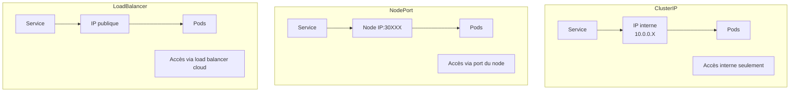

---

## 5.10 Commandes essentielles

```bash
# Créer un service
kubectl apply -f service.yaml

# Lister les services
kubectl get services
kubectl get svc        # raccourci

# Voir les détails
kubectl describe service <nom>

# Voir les endpoints (pods ciblés)
kubectl get endpoints <nom>

# Exposer rapidement un deployment
kubectl expose deployment <nom> --type=NodePort --port=80

# Supprimer
kubectl delete service <nom>

# Avec Minikube - obtenir l'URL
minikube service <nom> --url
```

---

## 5.11 Résumé

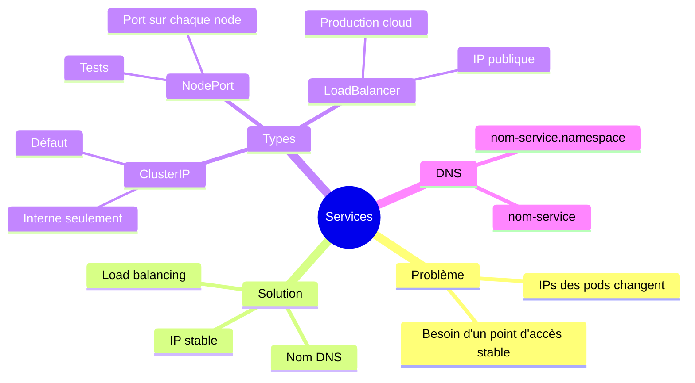

---

## 5.12 Quiz de validation

**1. Pourquoi a-t-on besoin de Services ?**

<details>
<summary>Voir la réponse</summary>

Parce que les IPs des Pods changent à chaque fois qu'ils sont recréés. Un Service fournit une IP stable et un nom DNS pour accéder aux Pods, plus du load balancing automatique.

</details>

**2. Quelle est la différence entre ClusterIP et NodePort ?**

<details>
<summary>Voir la réponse</summary>

- **ClusterIP** : Accessible uniquement depuis l'intérieur du cluster (pour communication entre apps)
- **NodePort** : Accessible depuis l'extérieur via un port sur chaque node (30000-32767)

</details>

**3. Comment un pod peut-il appeler un service par son nom ?**

<details>
<summary>Voir la réponse</summary>

Kubernetes crée automatiquement une entrée DNS. Un pod peut simplement faire :
```bash
curl http://nom-du-service
# ou
curl http://nom-du-service.namespace
```

</details>

**4. Quelle commande pour exposer rapidement un Deployment ?**

<details>
<summary>Voir la réponse</summary>

```bash
kubectl expose deployment mon-app --type=NodePort --port=80
```

</details>

**5. Comment accéder à un service NodePort avec Minikube ?**

<details>
<summary>Voir la réponse</summary>

```bash
minikube service nom-du-service --url
```
Cela affiche l'URL complète pour accéder au service.

</details>

---

# Annexe 1


---
title: "Schéma complet - Types de Services Kubernetes"
description: "Diagramme Mermaid détaillé présentant tous les types de Services Kubernetes, leur architecture, flux réseau et cas d'usage."
---

# Schéma complet des Types de Services Kubernetes

---

## 1. Vue d'ensemble : Architecture et flux réseau de chaque type de service

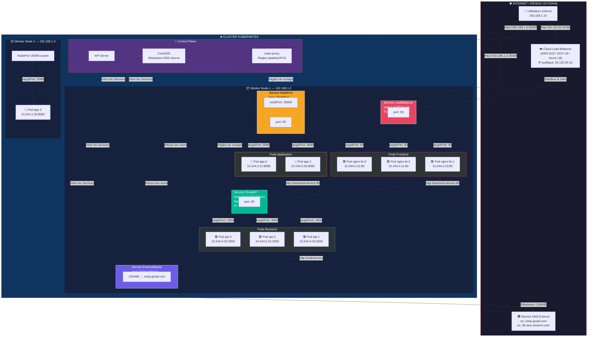

---

## 2. Hiérarchie et héritage des types de services

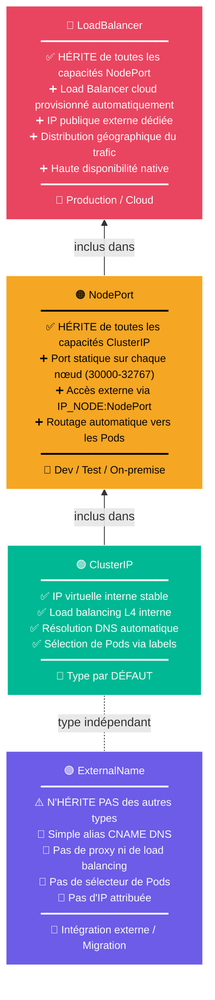

---

## 3. Les 3 ports d'un Service (NodePort en détail)

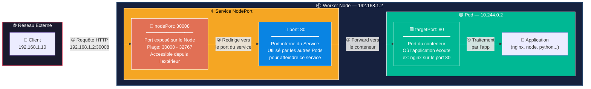

---

## 4. Arbre de décision : Quel type de service choisir ?

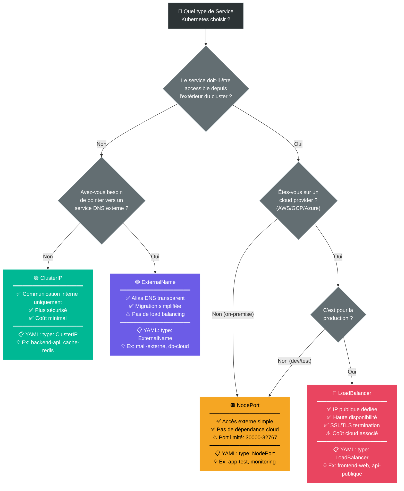

---

## 5. Comparaison visuelle des flux réseau par type

```mermaid
flowchart LR
    subgraph FLUX_CIP["🟢 FLUX ClusterIP"]
        direction LR
        C_POD_A["Pod A"] -->|"http://svc-name:80"| C_SVC["ClusterIP<br/>10.96.0.1:80"]
        C_SVC --> C_POD_B1["Pod B1"]
        C_SVC --> C_POD_B2["Pod B2"]
        C_WALL["🚫 Pas d'accès<br/>externe"]
    end

    subgraph FLUX_NP["🟠 FLUX NodePort"]
        direction LR
        N_EXT["Client externe"] -->|"NodeIP:30008"| N_NODE["Node<br/>Port 30008"]
        N_NODE --> N_SVC["Service<br/>Port 80"]
        N_SVC --> N_POD1["Pod 1"]
        N_SVC --> N_POD2["Pod 2"]
    end

    subgraph FLUX_LB["🔴 FLUX LoadBalancer"]
        direction LR
        L_EXT["Client externe"] -->|"IP publique:80"| L_LB["Cloud LB<br/>34.120.50.10"]
        L_LB --> L_N1["Node 1<br/>Port 30XXX"]
        L_LB --> L_N2["Node 2<br/>Port 30XXX"]
        L_N1 --> L_POD1["Pod 1"]
        L_N2 --> L_POD2["Pod 2"]
    end

    subgraph FLUX_EN["🟣 FLUX ExternalName"]
        direction LR
        E_POD["Pod interne"] -->|"http://mail-svc"| E_SVC["ExternalName<br/>Service"]
        E_SVC -->|"CNAME"| E_DNS["smtp.gmail.com"]
    end

    style FLUX_CIP fill:#00b89422,stroke:#00b894,color:#fff
    style FLUX_NP fill:#f5a62322,stroke:#f5a623,color:#fff
    style FLUX_LB fill:#e9456022,stroke:#e94560,color:#fff
    style FLUX_EN fill:#6c5ce722,stroke:#6c5ce7,color:#fff
```

---

## 6. Tableau récapitulatif visuel

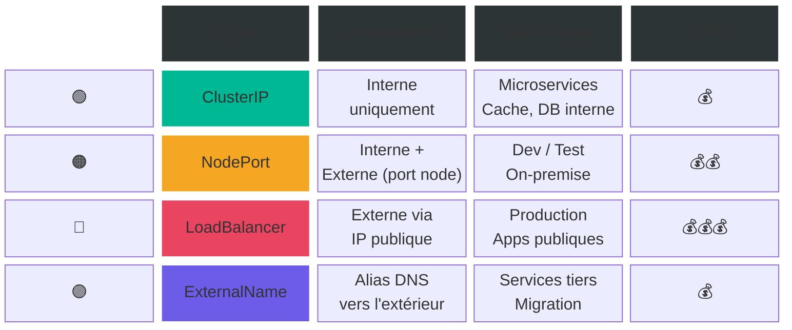

---

## Légende des couleurs

| Couleur | Type de Service | Description |
|---------|----------------|-------------|
| 🟢 Vert | **ClusterIP** | Communication interne au cluster |
| 🟠 Orange | **NodePort** | Exposition contrôlée via port du nœud |
| 🔴 Rouge | **LoadBalancer** | Distribution cloud avec IP publique |
| 🟣 Violet | **ExternalName** | Alias DNS vers services externes |

---

> **Référence** : Ce schéma accompagne les chapitres [10 - Introduction aux Services](./10-introduction-aux-services.md) et [13 - Types de Services](./13-types-de-services.md).


## Prochaine étape

Vous connaissez maintenant les bases : Pods, Deployments, Services. Dans le prochain cours, on met tout ensemble dans un **projet pratique** !


