# Cours 5 : Les Services

## Objectifs

- Comprendre le problème que les Services résolvent
- Créer différents types de Services
- Exposer une application au monde extérieur
- Faire communiquer des applications entre elles

---

## 5.1 Le problème

### Les Pods ont des IPs... qui changent !

Chaque Pod a une adresse IP. Mais :
- Cette IP est **interne** au cluster
- Elle change si le Pod est recréé
- Elle est différente pour chaque replica

**Comment accéder à une application si l'IP change tout le temps ?**


### La solution : les Services

Un **Service** fournit :
- Une **IP stable** qui ne change jamais
- Un **nom DNS** pour accéder facilement
- Du **load balancing** entre les pods


---

## 5.2 Types de Services

Il existe 4 types de Services. On va voir les 3 plus importants :

| Type | Accès | Cas d'usage |
|------|-------|-------------|
| **ClusterIP** | Interne seulement | Communication entre apps |
| **NodePort** | Depuis l'extérieur (port fixe) | Tests, développement |
| **LoadBalancer** | Depuis l'extérieur (cloud) | Production dans le cloud |

```mermaid
graph TB
    subgraph "Cluster Kubernetes"
        CIP[ClusterIP<br/>Accès interne]
        NP[NodePort<br/>:30000-32767]
        APP[Pods]
    end
    
    LB[LoadBalancer<br/>IP publique]
    
    INTERNAL[Apps internes] --> CIP
    CIP --> APP
    
    EXT[Utilisateurs externes] --> NP
    NP --> APP
    
    EXT2[Utilisateurs externes] --> LB
    LB --> APP
```



---

## 5.3 Service ClusterIP (défaut)

### C'est quoi ?

- Accessible **uniquement depuis le cluster**
- Parfait pour la communication entre applications
- Type par défaut

### Exemple

```yaml
# service-clusterip.yaml
apiVersion: v1
kind: Service
metadata:
  name: mon-service
spec:
  type: ClusterIP           # Optionnel (c'est le défaut)
  selector:
    app: mon-app            # Cible les pods avec ce label
  ports:
  - port: 80                # Port du service
    targetPort: 80          # Port du container
```

### Créer et tester

```bash
# Créer le service
kubectl apply -f service-clusterip.yaml

# Voir le service
kubectl get services

# Tester depuis un pod
kubectl run test --rm -it --image=busybox -- wget -qO- http://mon-service
```

---

## 5.4 Service NodePort

### C'est quoi ?

- Accessible depuis **l'extérieur du cluster**
- Ouvre un port sur **chaque node** (30000-32767)
- Simple pour les tests

### Exemple

```yaml
# service-nodeport.yaml
apiVersion: v1
kind: Service
metadata:
  name: mon-service-externe
spec:
  type: NodePort
  selector:
    app: mon-app
  ports:
  - port: 80                # Port du service (interne)
    targetPort: 80          # Port du container
    nodePort: 30080         # Port sur le node (optionnel, sinon auto)
```

### Accéder

```bash
# Avec Minikube
minikube service mon-service-externe --url

# Ou manuellement
minikube ip   # Donne l'IP du node
# Puis accéder à http://<IP>:30080
```

---

## 5.5 Exercice pratique 1 (15 minutes)

### Exposer une application

1. **Créer un Deployment :**

```yaml
# app-deployment.yaml
apiVersion: apps/v1
kind: Deployment
metadata:
  name: web-app
spec:
  replicas: 3
  selector:
    matchLabels:
      app: web-app
  template:
    metadata:
      labels:
        app: web-app
    spec:
      containers:
      - name: nginx
        image: nginx:alpine
        ports:
        - containerPort: 80
```

```bash
kubectl apply -f app-deployment.yaml
```

2. **Créer un Service NodePort :**

```yaml
# app-service.yaml
apiVersion: v1
kind: Service
metadata:
  name: web-service
spec:
  type: NodePort
  selector:
    app: web-app
  ports:
  - port: 80
    targetPort: 80
    nodePort: 30080
```

```bash
kubectl apply -f app-service.yaml
```

3. **Vérifier :**
```bash
kubectl get services
kubectl get endpoints web-service    # Voir les pods ciblés
```

4. **Accéder à l'application :**
```bash
# Avec Minikube
minikube service web-service --url

# Ouvrir l'URL dans le navigateur
```

5. **Tester le load balancing :**
```bash
# Modifier nginx pour afficher le hostname
kubectl exec -it <pod-1> -- sh -c "echo Pod-1 > /usr/share/nginx/html/index.html"
kubectl exec -it <pod-2> -- sh -c "echo Pod-2 > /usr/share/nginx/html/index.html"
kubectl exec -it <pod-3> -- sh -c "echo Pod-3 > /usr/share/nginx/html/index.html"

# Faire plusieurs requêtes (observer l'alternance)
for i in 1 2 3 4 5 6; do curl -s $(minikube service web-service --url); done
```

---

## 5.6 Service LoadBalancer

### C'est quoi ?

- Crée un **load balancer externe** (dans le cloud)
- Obtient une **IP publique** automatiquement
- Utilisé en production (AWS, GCP, Azure)

### Exemple

```yaml
apiVersion: v1
kind: Service
metadata:
  name: mon-service-public
spec:
  type: LoadBalancer
  selector:
    app: mon-app
  ports:
  - port: 80
    targetPort: 80
```

### Avec Minikube

Minikube n'a pas de vrais load balancers, mais peut les simuler :

```bash
# Dans un terminal séparé
minikube tunnel

# Le service obtient une IP externe
kubectl get services
```

---

## 5.7 DNS interne

### Comment ça marche ?

Kubernetes crée automatiquement des entrées DNS pour chaque Service.

**Format :** `<nom-service>.<namespace>.svc.cluster.local`

**Version courte :** `<nom-service>` (dans le même namespace)

### Exemple

```bash
# Depuis un pod, vous pouvez appeler :
curl http://web-service           # Dans le même namespace
curl http://web-service.default   # Namespace spécifié
```

---

## 5.8 Exercice pratique 2 (15 minutes)

### Communication entre applications

1. **Créer un backend :**

```yaml
# backend.yaml
apiVersion: apps/v1
kind: Deployment
metadata:
  name: backend
spec:
  replicas: 2
  selector:
    matchLabels:
      app: backend
  template:
    metadata:
      labels:
        app: backend
    spec:
      containers:
      - name: backend
        image: hashicorp/http-echo
        args: ["-text=Reponse du Backend!"]
        ports:
        - containerPort: 5678
---
apiVersion: v1
kind: Service
metadata:
  name: backend-service
spec:
  selector:
    app: backend
  ports:
  - port: 80
    targetPort: 5678
```

2. **Créer un frontend qui appelle le backend :**

```yaml
# frontend.yaml
apiVersion: apps/v1
kind: Deployment
metadata:
  name: frontend
spec:
  replicas: 1
  selector:
    matchLabels:
      app: frontend
  template:
    metadata:
      labels:
        app: frontend
    spec:
      containers:
      - name: frontend
        image: busybox
        command: ['sh', '-c', 'while true; do wget -qO- http://backend-service; sleep 5; done']
---
apiVersion: v1
kind: Service
metadata:
  name: frontend-service
spec:
  type: NodePort
  selector:
    app: frontend
  ports:
  - port: 80
    targetPort: 80
    nodePort: 30081
```

3. **Déployer :**
```bash
kubectl apply -f backend.yaml
kubectl apply -f frontend.yaml
```

4. **Vérifier la communication :**
```bash
# Voir les logs du frontend
kubectl logs -f deployment/frontend

# Doit afficher "Reponse du Backend!" toutes les 5 secondes
```

5. **Nettoyer :**
```bash
kubectl delete -f backend.yaml -f frontend.yaml
```

---

## 5.9 Résumé des types

```mermaid
graph TB
    subgraph "ClusterIP"
        CI[Service] --> CIP[IP interne<br/>10.0.0.X]
        CIP --> CIPODS[Pods]
        NOTE1[Accès interne seulement]
    end
    
    subgraph "NodePort"
        NP[Service] --> NPP[Node IP:30XXX]
        NPP --> NPPODS[Pods]
        NOTE2[Accès via port du node]
    end
    
    subgraph "LoadBalancer"
        LB[Service] --> LBP[IP publique]
        LBP --> LBPODS[Pods]
        NOTE3[Accès via load balancer cloud]
    end
```



---

## 5.10 Commandes essentielles

```bash
# Créer un service
kubectl apply -f service.yaml

# Lister les services
kubectl get services
kubectl get svc        # raccourci

# Voir les détails
kubectl describe service <nom>

# Voir les endpoints (pods ciblés)
kubectl get endpoints <nom>

# Exposer rapidement un deployment
kubectl expose deployment <nom> --type=NodePort --port=80

# Supprimer
kubectl delete service <nom>

# Avec Minikube - obtenir l'URL
minikube service <nom> --url
```

---

## 5.11 Résumé

```mermaid
mindmap
  root((Services))
    Problème
      IPs des pods changent
      Besoin d'un point d'accès stable
    Solution
      IP stable
      Nom DNS
      Load balancing
    Types
      ClusterIP
        Interne seulement
        Défaut
      NodePort
        Port sur chaque node
        Tests
      LoadBalancer
        IP publique
        Production cloud
    DNS
      nom-service
      nom-service.namespace
```



---

## 5.12 Quiz de validation

**1. Pourquoi a-t-on besoin de Services ?**

<details>
<summary>Voir la réponse</summary>

Parce que les IPs des Pods changent à chaque fois qu'ils sont recréés. Un Service fournit une IP stable et un nom DNS pour accéder aux Pods, plus du load balancing automatique.

</details>

**2. Quelle est la différence entre ClusterIP et NodePort ?**

<details>
<summary>Voir la réponse</summary>

- **ClusterIP** : Accessible uniquement depuis l'intérieur du cluster (pour communication entre apps)
- **NodePort** : Accessible depuis l'extérieur via un port sur chaque node (30000-32767)

</details>

**3. Comment un pod peut-il appeler un service par son nom ?**

<details>
<summary>Voir la réponse</summary>

Kubernetes crée automatiquement une entrée DNS. Un pod peut simplement faire :
```bash
curl http://nom-du-service
# ou
curl http://nom-du-service.namespace
```

</details>

**4. Quelle commande pour exposer rapidement un Deployment ?**

<details>
<summary>Voir la réponse</summary>

```bash
kubectl expose deployment mon-app --type=NodePort --port=80
```

</details>

**5. Comment accéder à un service NodePort avec Minikube ?**

<details>
<summary>Voir la réponse</summary>

```bash
minikube service nom-du-service --url
```
Cela affiche l'URL complète pour accéder au service.

</details>

---

# Annexe 1


---
title: "Schéma complet - Types de Services Kubernetes"
description: "Diagramme Mermaid détaillé présentant tous les types de Services Kubernetes, leur architecture, flux réseau et cas d'usage."
---

# Schéma complet des Types de Services Kubernetes

---

## 1. Vue d'ensemble : Architecture et flux réseau de chaque type de service

```mermaid
flowchart TB
    subgraph INTERNET["🌐 INTERNET / RÉSEAU EXTERNE"]
        USER["👤 Utilisateur externe<br/>192.168.1.10"]
        CLOUD_LB["☁️ Cloud Load Balancer<br/>(AWS ELB / GCP LB / Azure LB)<br/>IP publique: 34.120.50.10"]
        DNS_EXT["🌍 Service DNS Externe<br/>ex: smtp.gmail.com<br/>ex: db.aws.amazon.com"]
    end

    subgraph CLUSTER["⎈ CLUSTER KUBERNETES"]

        subgraph MASTER["🧠 Control Plane"]
            API["API Server"]
            COREDNS["CoreDNS<br/>Résolution DNS interne"]
            KUBE_PROXY["kube-proxy<br/>Règles iptables/IPVS"]
        end

        subgraph NODE1["📦 Worker Node 1 — 192.168.1.2"]
            subgraph SVC_LB["Service LoadBalancer<br/>type: LoadBalancer<br/>frontend-service"]
                LB_PORT["port: 80"]
            end

            subgraph SVC_NP["Service NodePort<br/>type: NodePort<br/>app-service"]
                NP_NODEPORT["nodePort: 30008"]
                NP_PORT["port: 80"]
            end

            subgraph SVC_CIP["Service ClusterIP<br/>type: ClusterIP (défaut)<br/>backend-service<br/>IP: 10.96.0.1"]
                CIP_PORT["port: 80"]
            end

            subgraph SVC_EN["Service ExternalName<br/>type: ExternalName<br/>mail-service"]
                EN_CNAME["CNAME → smtp.gmail.com"]
            end

            subgraph PODS_FE["Pods Frontend"]
                POD_FE1["🟢 Pod nginx-fe-1<br/>10.244.0.10:80"]
                POD_FE2["🟢 Pod nginx-fe-2<br/>10.244.0.11:80"]
                POD_FE3["🟢 Pod nginx-fe-3<br/>10.244.0.12:80"]
            end

            subgraph PODS_APP["Pods Application"]
                POD_APP1["🔵 Pod app-1<br/>10.244.0.20:8080"]
                POD_APP2["🔵 Pod app-2<br/>10.244.0.21:8080"]
            end

            subgraph PODS_BE["Pods Backend"]
                POD_BE1["🟣 Pod api-1<br/>10.244.0.30:3000"]
                POD_BE2["🟣 Pod api-2<br/>10.244.0.31:3000"]
                POD_BE3["🟣 Pod api-3<br/>10.244.0.32:3000"]
            end
        end

        subgraph NODE2["📦 Worker Node 2 — 192.168.1.3"]
            NP2["NodePort 30008 ouvert"]
            PODS_N2["🔵 Pod app-3<br/>10.244.1.20:8080"]
        end
    end

    USER -->|"http://34.120.50.10:80"| CLOUD_LB
    CLOUD_LB -->|"Distribue le trafic"| SVC_LB
    SVC_LB -->|"targetPort: 80"| POD_FE1
    SVC_LB -->|"targetPort: 80"| POD_FE2
    SVC_LB -->|"targetPort: 80"| POD_FE3

    USER -->|"http://192.168.1.2:30008"| SVC_NP
    USER -->|"http://192.168.1.3:30008"| NP2
    SVC_NP -->|"targetPort: 8080"| POD_APP1
    SVC_NP -->|"targetPort: 8080"| POD_APP2
    NP2 -->|"targetPort: 8080"| PODS_N2

    POD_FE1 -->|"http://backend-service:80"| SVC_CIP
    POD_APP1 -->|"http://backend-service:80"| SVC_CIP
    SVC_CIP -->|"targetPort: 3000"| POD_BE1
    SVC_CIP -->|"targetPort: 3000"| POD_BE2
    SVC_CIP -->|"targetPort: 3000"| POD_BE3

    POD_BE1 -->|"http://mail-service"| SVC_EN
    SVC_EN -->|"Résolution CNAME"| DNS_EXT

    API -.->|"Gère les Services"| SVC_LB
    API -.->|"Gère les Services"| SVC_NP
    API -.->|"Gère les Services"| SVC_CIP
    API -.->|"Gère les Services"| SVC_EN
    COREDNS -.->|"Résout les noms"| SVC_CIP
    COREDNS -.->|"Résout les noms"| SVC_EN
    KUBE_PROXY -.->|"Règles de routage"| SVC_NP
    KUBE_PROXY -.->|"Règles de routage"| SVC_CIP

    style INTERNET fill:#1a1a2e,stroke:#e94560,color:#fff
    style CLUSTER fill:#0f3460,stroke:#16213e,color:#fff
    style MASTER fill:#533483,stroke:#e94560,color:#fff
    style NODE1 fill:#16213e,stroke:#0f3460,color:#fff
    style NODE2 fill:#16213e,stroke:#0f3460,color:#fff
    style SVC_LB fill:#e94560,stroke:#fff,color:#fff
    style SVC_NP fill:#f5a623,stroke:#fff,color:#000
    style SVC_CIP fill:#00b894,stroke:#fff,color:#fff
    style SVC_EN fill:#6c5ce7,stroke:#fff,color:#fff
    style PODS_FE fill:#2d3436,stroke:#e94560,color:#fff
    style PODS_APP fill:#2d3436,stroke:#f5a623,color:#fff
    style PODS_BE fill:#2d3436,stroke:#00b894,color:#fff
```



---

## 2. Hiérarchie et héritage des types de services

```mermaid
flowchart BT
    CIP["🟢 ClusterIP<br/>━━━━━━━━━━━━━━━━━━━━━<br/>✅ IP virtuelle interne stable<br/>✅ Load balancing L4 interne<br/>✅ Résolution DNS automatique<br/>✅ Sélection de Pods via labels<br/>━━━━━━━━━━━━━━━━━━━━━<br/>📌 Type par DÉFAUT"]

    NP["🟠 NodePort<br/>━━━━━━━━━━━━━━━━━━━━━<br/>✅ HÉRITE de toutes les capacités ClusterIP<br/>➕ Port statique sur chaque nœud (30000-32767)<br/>➕ Accès externe via IP_NODE:NodePort<br/>➕ Routage automatique vers les Pods<br/>━━━━━━━━━━━━━━━━━━━━━<br/>📌 Dev / Test / On-premise"]

    LB["🔴 LoadBalancer<br/>━━━━━━━━━━━━━━━━━━━━━<br/>✅ HÉRITE de toutes les capacités NodePort<br/>➕ Load Balancer cloud provisionné automatiquement<br/>➕ IP publique externe dédiée<br/>➕ Distribution géographique du trafic<br/>➕ Haute disponibilité native<br/>━━━━━━━━━━━━━━━━━━━━━<br/>📌 Production / Cloud"]

    EN["🟣 ExternalName<br/>━━━━━━━━━━━━━━━━━━━━━<br/>⚠️ N'HÉRITE PAS des autres types<br/>🔄 Simple alias CNAME DNS<br/>🔄 Pas de proxy ni de load balancing<br/>🔄 Pas de sélecteur de Pods<br/>🔄 Pas d'IP attribuée<br/>━━━━━━━━━━━━━━━━━━━━━<br/>📌 Intégration externe / Migration"]

    CIP -->|"inclus dans"| NP
    NP -->|"inclus dans"| LB
    EN -.-|"type indépendant"| CIP

    style CIP fill:#00b894,stroke:#fff,color:#fff,font-size:14px
    style NP fill:#f5a623,stroke:#fff,color:#000,font-size:14px
    style LB fill:#e94560,stroke:#fff,color:#fff,font-size:14px
    style EN fill:#6c5ce7,stroke:#fff,color:#fff,font-size:14px
```



---

## 3. Les 3 ports d'un Service (NodePort en détail)

```mermaid
flowchart LR
    subgraph EXTERNE["🌐 Réseau Externe"]
        CLIENT["👤 Client<br/>192.168.1.10"]
    end

    subgraph NODE["📦 Worker Node — 192.168.1.2"]
        subgraph SERVICE["⎈ Service NodePort"]
            NODEPORT["🔶 nodePort: 30008<br/>━━━━━━━━━━━━━━━━<br/>Port exposé sur le Node<br/>Plage: 30000 - 32767<br/>Accessible depuis l'extérieur"]
            PORT["🔷 port: 80<br/>━━━━━━━━━━━━━━━━<br/>Port interne du Service<br/>Utilisé par les autres Pods<br/>pour atteindre ce service"]
        end

        subgraph POD["🟢 Pod — 10.244.0.2"]
            TARGETPORT["🟩 targetPort: 80<br/>━━━━━━━━━━━━━━━━<br/>Port du conteneur<br/>Où l'application écoute<br/>ex: nginx sur le port 80"]
            APP["📱 Application<br/>(nginx, node, python...)"]
        end
    end

    CLIENT -->|"① Requête HTTP<br/>192.168.1.2:30008"| NODEPORT
    NODEPORT -->|"② Redirige vers<br/>le port du service"| PORT
    PORT -->|"③ Forward vers<br/>le conteneur"| TARGETPORT
    TARGETPORT -->|"④ Traitement<br/>par l'app"| APP

    style EXTERNE fill:#1a1a2e,stroke:#e94560,color:#fff
    style NODE fill:#16213e,stroke:#0f3460,color:#fff
    style SERVICE fill:#f5a623,stroke:#fff,color:#000
    style POD fill:#00b894,stroke:#fff,color:#fff
    style NODEPORT fill:#e17055,stroke:#fff,color:#fff
    style PORT fill:#0984e3,stroke:#fff,color:#fff
    style TARGETPORT fill:#00b894,stroke:#fff,color:#fff
```



---

## 4. Arbre de décision : Quel type de service choisir ?

```mermaid
flowchart TD
    START["🤔 Quel type de Service<br/>Kubernetes choisir ?"]

    Q1{"Le service doit-il être<br/>accessible depuis<br/>l'extérieur du cluster ?"}
    Q2{"Êtes-vous sur un<br/>cloud provider ?<br/>(AWS/GCP/Azure)"}
    Q3{"C'est pour la<br/>production ?"}
    Q4{"Avez-vous besoin<br/>de pointer vers un<br/>service DNS externe ?"}

    CIP_RESULT["🟢 ClusterIP<br/>━━━━━━━━━━━━━━━━━━━━━<br/>✅ Communication interne uniquement<br/>✅ Plus sécurisé<br/>✅ Coût minimal<br/>━━━━━━━━━━━━━━━━━━━━━<br/>📋 YAML: type: ClusterIP<br/>💡 Ex: backend-api, cache-redis"]

    NP_RESULT["🟠 NodePort<br/>━━━━━━━━━━━━━━━━━━━━━<br/>✅ Accès externe simple<br/>✅ Pas de dépendance cloud<br/>⚠️ Port limité: 30000-32767<br/>━━━━━━━━━━━━━━━━━━━━━<br/>📋 YAML: type: NodePort<br/>💡 Ex: app-test, monitoring"]

    LB_RESULT["🔴 LoadBalancer<br/>━━━━━━━━━━━━━━━━━━━━━<br/>✅ IP publique dédiée<br/>✅ Haute disponibilité<br/>✅ SSL/TLS termination<br/>⚠️ Coût cloud associé<br/>━━━━━━━━━━━━━━━━━━━━━<br/>📋 YAML: type: LoadBalancer<br/>💡 Ex: frontend-web, api-publique"]

    EN_RESULT["🟣 ExternalName<br/>━━━━━━━━━━━━━━━━━━━━━<br/>✅ Alias DNS transparent<br/>✅ Migration simplifiée<br/>⚠️ Pas de load balancing<br/>━━━━━━━━━━━━━━━━━━━━━<br/>📋 YAML: type: ExternalName<br/>💡 Ex: mail-externe, db-cloud"]

    START --> Q1
    Q1 -->|"Non"| Q4
    Q4 -->|"Non"| CIP_RESULT
    Q4 -->|"Oui"| EN_RESULT
    Q1 -->|"Oui"| Q2
    Q2 -->|"Non (on-premise)"| NP_RESULT
    Q2 -->|"Oui"| Q3
    Q3 -->|"Non (dev/test)"| NP_RESULT
    Q3 -->|"Oui"| LB_RESULT

    style START fill:#2d3436,stroke:#dfe6e9,color:#fff
    style Q1 fill:#636e72,stroke:#dfe6e9,color:#fff
    style Q2 fill:#636e72,stroke:#dfe6e9,color:#fff
    style Q3 fill:#636e72,stroke:#dfe6e9,color:#fff
    style Q4 fill:#636e72,stroke:#dfe6e9,color:#fff
    style CIP_RESULT fill:#00b894,stroke:#fff,color:#fff
    style NP_RESULT fill:#f5a623,stroke:#fff,color:#000
    style LB_RESULT fill:#e94560,stroke:#fff,color:#fff
    style EN_RESULT fill:#6c5ce7,stroke:#fff,color:#fff
```



---

## 5. Comparaison visuelle des flux réseau par type

```mermaid
flowchart LR
    subgraph FLUX_CIP["🟢 FLUX ClusterIP"]
        direction LR
        C_POD_A["Pod A"] -->|"http://svc-name:80"| C_SVC["ClusterIP<br/>10.96.0.1:80"]
        C_SVC --> C_POD_B1["Pod B1"]
        C_SVC --> C_POD_B2["Pod B2"]
        C_WALL["🚫 Pas d'accès<br/>externe"]
    end

    subgraph FLUX_NP["🟠 FLUX NodePort"]
        direction LR
        N_EXT["Client externe"] -->|"NodeIP:30008"| N_NODE["Node<br/>Port 30008"]
        N_NODE --> N_SVC["Service<br/>Port 80"]
        N_SVC --> N_POD1["Pod 1"]
        N_SVC --> N_POD2["Pod 2"]
    end

    subgraph FLUX_LB["🔴 FLUX LoadBalancer"]
        direction LR
        L_EXT["Client externe"] -->|"IP publique:80"| L_LB["Cloud LB<br/>34.120.50.10"]
        L_LB --> L_N1["Node 1<br/>Port 30XXX"]
        L_LB --> L_N2["Node 2<br/>Port 30XXX"]
        L_N1 --> L_POD1["Pod 1"]
        L_N2 --> L_POD2["Pod 2"]
    end

    subgraph FLUX_EN["🟣 FLUX ExternalName"]
        direction LR
        E_POD["Pod interne"] -->|"http://mail-svc"| E_SVC["ExternalName<br/>Service"]
        E_SVC -->|"CNAME"| E_DNS["smtp.gmail.com"]
    end

    style FLUX_CIP fill:#00b89422,stroke:#00b894,color:#fff
    style FLUX_NP fill:#f5a62322,stroke:#f5a623,color:#fff
    style FLUX_LB fill:#e9456022,stroke:#e94560,color:#fff
    style FLUX_EN fill:#6c5ce722,stroke:#6c5ce7,color:#fff
```



---

## 6. Tableau récapitulatif visuel

```mermaid
block-beta
    columns 5

    space HEADER_TYPE["Type"] HEADER_ACCESS["Accessibilité"] HEADER_USAGE["Cas d'usage"] HEADER_COST["Coût"]

    ICON1["🟢"] TYPE1["ClusterIP"] ACCESS1["Interne<br/>uniquement"] USAGE1["Microservices<br/>Cache, DB interne"] COST1["💰"]

    ICON2["🟠"] TYPE2["NodePort"] ACCESS2["Interne +<br/>Externe (port node)"] USAGE2["Dev / Test<br/>On-premise"] COST2["💰💰"]

    ICON3["🔴"] TYPE3["LoadBalancer"] ACCESS3["Externe via<br/>IP publique"] USAGE3["Production<br/>Apps publiques"] COST3["💰💰💰"]

    ICON4["🟣"] TYPE4["ExternalName"] ACCESS4["Alias DNS<br/>vers l'extérieur"] USAGE4["Services tiers<br/>Migration"] COST4["💰"]

    style HEADER_TYPE fill:#2d3436,stroke:#fff,color:#fff
    style HEADER_ACCESS fill:#2d3436,stroke:#fff,color:#fff
    style HEADER_USAGE fill:#2d3436,stroke:#fff,color:#fff
    style HEADER_COST fill:#2d3436,stroke:#fff,color:#fff
    style TYPE1 fill:#00b894,stroke:#fff,color:#fff
    style TYPE2 fill:#f5a623,stroke:#fff,color:#000
    style TYPE3 fill:#e94560,stroke:#fff,color:#fff
    style TYPE4 fill:#6c5ce7,stroke:#fff,color:#fff
```



---

## Légende des couleurs

| Couleur | Type de Service | Description |
|---------|----------------|-------------|
| 🟢 Vert | **ClusterIP** | Communication interne au cluster |
| 🟠 Orange | **NodePort** | Exposition contrôlée via port du nœud |
| 🔴 Rouge | **LoadBalancer** | Distribution cloud avec IP publique |
| 🟣 Violet | **ExternalName** | Alias DNS vers services externes |

---

> **Référence** : Ce schéma accompagne les chapitres [10 - Introduction aux Services](./10-introduction-aux-services.md) et [13 - Types de Services](./13-types-de-services.md).


## Prochaine étape

Vous connaissez maintenant les bases : Pods, Deployments, Services. Dans le prochain cours, on met tout ensemble dans un **projet pratique** !


