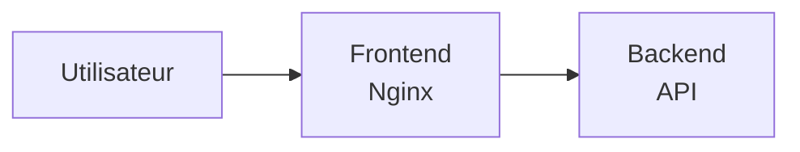
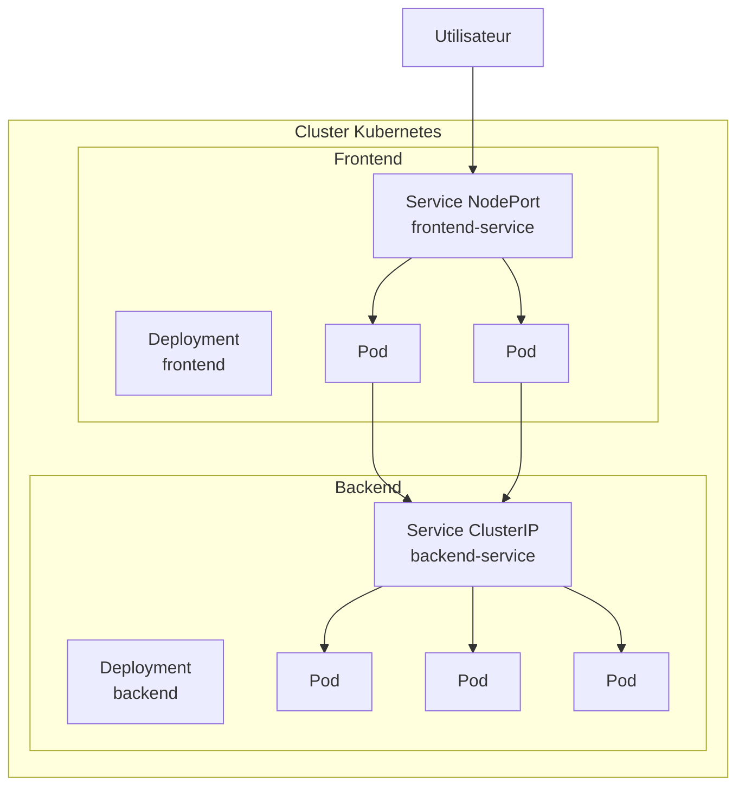
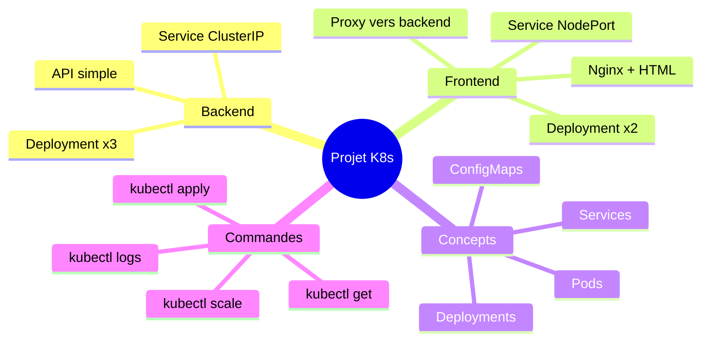

# Cours 6 : Projet Pratique

## Objectif

Déployer une application web complète sur Kubernetes en utilisant tout ce qu'on a appris :
- Deployments
- Services
- Communication entre applications

---

## 6.1 L'application

Nous allons déployer une application simple avec :

- **Frontend** : Nginx servant une page HTML
- **Backend** : API simple qui répond avec un message



---

## 6.2 Architecture Kubernetes



---

## 6.3 Étape 1 : Préparer l'environnement

### Vérifier que Minikube tourne

```bash
minikube status

# Si arrêté
minikube start
```

### Créer un dossier de travail

```bash
mkdir ~/k8s-projet
cd ~/k8s-projet
```

---

## 6.4 Étape 2 : Créer le Backend

### Fichier backend.yaml

```yaml
# backend.yaml
apiVersion: apps/v1
kind: Deployment
metadata:
  name: backend
  labels:
    app: backend
spec:
  replicas: 3
  selector:
    matchLabels:
      app: backend
  template:
    metadata:
      labels:
        app: backend
    spec:
      containers:
      - name: backend
        image: hashicorp/http-echo
        args:
        - "-text={\"message\": \"Bonjour depuis le Backend Kubernetes!\", \"version\": \"1.0\"}"
        - "-listen=:5678"
        ports:
        - containerPort: 5678
        resources:
          limits:
            memory: "64Mi"
            cpu: "100m"
---
apiVersion: v1
kind: Service
metadata:
  name: backend-service
spec:
  type: ClusterIP
  selector:
    app: backend
  ports:
  - port: 80
    targetPort: 5678
```

### Déployer

```bash
kubectl apply -f backend.yaml
```

### Vérifier

```bash
kubectl get deployments
kubectl get pods -l app=backend
kubectl get services
```

### Tester le backend

```bash
# Créer un pod temporaire pour tester
kubectl run test-backend --rm -it --image=busybox -- wget -qO- http://backend-service
```

---

## 6.5 Étape 3 : Créer le Frontend

### Fichier frontend.yaml

```yaml
# frontend.yaml
apiVersion: v1
kind: ConfigMap
metadata:
  name: frontend-config
data:
  index.html: |
    <!DOCTYPE html>
    <html lang="fr">
    <head>
        <meta charset="UTF-8">
        <meta name="viewport" content="width=device-width, initial-scale=1.0">
        <title>Mon App Kubernetes</title>
        <style>
            * { margin: 0; padding: 0; box-sizing: border-box; }
            body {
                font-family: 'Segoe UI', sans-serif;
                background: linear-gradient(135deg, #1e3c72 0%, #2a5298 100%);
                min-height: 100vh;
                display: flex;
                justify-content: center;
                align-items: center;
            }
            .container {
                background: white;
                padding: 40px;
                border-radius: 15px;
                box-shadow: 0 10px 30px rgba(0,0,0,0.3);
                text-align: center;
                max-width: 500px;
            }
            h1 { color: #1e3c72; margin-bottom: 20px; }
            .status { 
                padding: 15px;
                border-radius: 8px;
                margin: 15px 0;
            }
            .success { background: #d4edda; color: #155724; }
            .info { background: #e7f1ff; color: #004085; }
            button {
                background: #1e3c72;
                color: white;
                border: none;
                padding: 12px 30px;
                border-radius: 8px;
                cursor: pointer;
                font-size: 16px;
                margin-top: 15px;
            }
            button:hover { background: #2a5298; }
            #response {
                margin-top: 20px;
                padding: 15px;
                background: #f8f9fa;
                border-radius: 8px;
                text-align: left;
            }
            .pod-info { font-size: 12px; color: #666; margin-top: 10px; }
        </style>
    </head>
    <body>
        <div class="container">
            <h1>Kubernetes Demo</h1>
            <div class="status success">Frontend deploye avec succes!</div>
            <div class="status info">Cliquez pour appeler le Backend</div>
            <button onclick="callBackend()">Appeler le Backend</button>
            <div id="response"></div>
            <div class="pod-info">Frontend servi par Nginx</div>
        </div>
        <script>
            async function callBackend() {
                const responseDiv = document.getElementById('response');
                responseDiv.innerHTML = 'Chargement...';
                try {
                    const response = await fetch('/api');
                    const text = await response.text();
                    responseDiv.innerHTML = '<strong>Reponse Backend:</strong><br><pre>' + text + '</pre>';
                } catch (error) {
                    responseDiv.innerHTML = '<span style="color:red">Erreur: ' + error.message + '</span>';
                }
            }
        </script>
    </body>
    </html>
  nginx.conf: |
    server {
        listen 80;
        
        location / {
            root /usr/share/nginx/html;
            index index.html;
        }
        
        location /api {
            proxy_pass http://backend-service;
            proxy_set_header Host $host;
        }
        
        location /health {
            return 200 'OK';
            add_header Content-Type text/plain;
        }
    }
---
apiVersion: apps/v1
kind: Deployment
metadata:
  name: frontend
  labels:
    app: frontend
spec:
  replicas: 2
  selector:
    matchLabels:
      app: frontend
  template:
    metadata:
      labels:
        app: frontend
    spec:
      containers:
      - name: nginx
        image: nginx:alpine
        ports:
        - containerPort: 80
        volumeMounts:
        - name: html
          mountPath: /usr/share/nginx/html
        - name: config
          mountPath: /etc/nginx/conf.d
        resources:
          limits:
            memory: "64Mi"
            cpu: "100m"
      volumes:
      - name: html
        configMap:
          name: frontend-config
          items:
          - key: index.html
            path: index.html
      - name: config
        configMap:
          name: frontend-config
          items:
          - key: nginx.conf
            path: default.conf
---
apiVersion: v1
kind: Service
metadata:
  name: frontend-service
spec:
  type: NodePort
  selector:
    app: frontend
  ports:
  - port: 80
    targetPort: 80
    nodePort: 30080
```

### Déployer

```bash
kubectl apply -f frontend.yaml
```

### Vérifier

```bash
kubectl get deployments
kubectl get pods
kubectl get services
kubectl get configmaps
```

---

## 6.6 Étape 4 : Tester l'application

### Obtenir l'URL

```bash
minikube service frontend-service --url
```

### Ouvrir dans le navigateur

1. Copiez l'URL affichée
2. Ouvrez-la dans votre navigateur
3. Cliquez sur "Appeler le Backend"
4. Vous devriez voir la réponse du backend !

### Test en ligne de commande

```bash
# Tester le frontend
curl $(minikube service frontend-service --url)

# Tester l'API (via le frontend)
curl $(minikube service frontend-service --url)/api
```

---

## 6.7 Étape 5 : Explorer et expérimenter

### Voir les ressources

```bash
# Tout voir
kubectl get all

# Pods avec détails
kubectl get pods -o wide

# Endpoints des services
kubectl get endpoints
```

### Tester la résilience

```bash
# Supprimer un pod backend
kubectl delete pod -l app=backend --wait=false

# Observer la recréation
kubectl get pods -w
```

### Scaler

```bash
# Plus de backends
kubectl scale deployment backend --replicas=5

# Vérifier
kubectl get pods -l app=backend
```

### Voir les logs

```bash
# Logs frontend
kubectl logs -l app=frontend

# Logs backend
kubectl logs -l app=backend
```

---

## 6.8 Étape 6 : Mettre à jour l'application

### Changer le message du backend

```bash
kubectl set image deployment/backend backend=hashicorp/http-echo
kubectl patch deployment backend --type='json' -p='[{"op": "replace", "path": "/spec/template/spec/containers/0/args", "value": ["-text={\"message\": \"Backend v2.0 - Mise a jour reussie!\"}", "-listen=:5678"]}]'
```

### Observer le rolling update

```bash
kubectl rollout status deployment/backend
```

### Rafraîchir le navigateur

Le message du backend devrait avoir changé !

---

## 6.9 Étape 7 : Nettoyage

```bash
# Supprimer toutes les ressources
kubectl delete -f frontend.yaml
kubectl delete -f backend.yaml

# Vérifier
kubectl get all

# (Optionnel) Arrêter Minikube
minikube stop
```

---

## 6.10 Récapitulatif

### Ce qu'on a fait

| Ressource | Nom | Type | Rôle |
|-----------|-----|------|------|
| Deployment | backend | 3 replicas | API qui répond |
| Service | backend-service | ClusterIP | Accès interne au backend |
| ConfigMap | frontend-config | - | HTML et config Nginx |
| Deployment | frontend | 2 replicas | Sert le HTML, proxy vers backend |
| Service | frontend-service | NodePort | Accès externe au frontend |

### Ce qu'on a appris

1. **Deployments** gèrent les pods et permettent le scaling
2. **Services** fournissent un accès stable aux pods
3. **ClusterIP** pour communication interne
4. **NodePort** pour accès externe
5. **ConfigMaps** pour stocker la configuration

---

## 6.11 Schéma récapitulatif



---

## 6.12 Pour aller plus loin

Ce projet peut être étendu avec :

- **Ingress** : Pour un vrai routage HTTP avec nom de domaine
- **Volumes persistants** : Pour stocker des données
- **Secrets** : Pour les mots de passe
- **Health checks** : Pour une meilleure fiabilité
- **HPA** : Pour le scaling automatique

Ces sujets sont couverts dans les modules avancés !

---

## Quiz final

**1. Combien de pods tournent au total dans ce projet (backend + frontend) ?**

<details>
<summary>Voir la réponse</summary>

**5 pods** : 3 pods backend + 2 pods frontend

</details>

**2. Pourquoi le backend utilise ClusterIP et pas NodePort ?**

<details>
<summary>Voir la réponse</summary>

Parce que le backend n'a pas besoin d'être accessible depuis l'extérieur. Seul le frontend doit être exposé aux utilisateurs. Le backend est appelé uniquement par le frontend, donc un accès interne (ClusterIP) suffit.

</details>

**3. Comment le frontend communique-t-il avec le backend ?**

<details>
<summary>Voir la réponse</summary>

Le frontend (Nginx) utilise le DNS interne de Kubernetes. Il fait un proxy_pass vers `http://backend-service` qui est résolu automatiquement par le DNS du cluster.

</details>

**4. Que se passe-t-il si on supprime tous les pods backend ?**

<details>
<summary>Voir la réponse</summary>

Le Deployment backend détecte que le nombre de pods (0) est inférieur au nombre désiré (3) et recrée automatiquement 3 nouveaux pods. L'application sera temporairement indisponible pendant quelques secondes.

</details>

**5. Comment accéder à l'application depuis votre navigateur ?**

<details>
<summary>Voir la réponse</summary>

```bash
minikube service frontend-service --url
```
Puis ouvrir l'URL affichée dans le navigateur (exemple : http://192.168.49.2:30080)

</details>

---

## Félicitations !

Vous avez terminé le module Kubernetes de base. Vous savez maintenant :

- Ce qu'est Kubernetes et pourquoi l'utiliser
- Installer un environnement local avec Minikube
- Créer et gérer des Pods
- Déployer des applications avec des Deployments
- Exposer des applications avec des Services
- Faire communiquer des applications entre elles

**Prochaine étape :** Les modules Kubernetes avancés !

