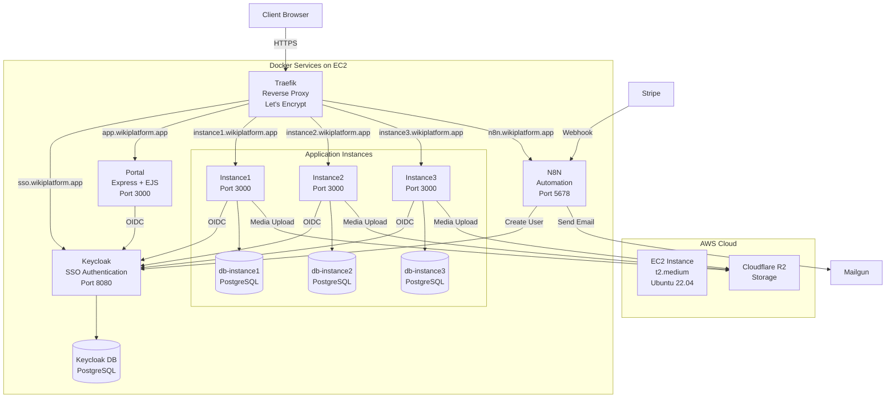
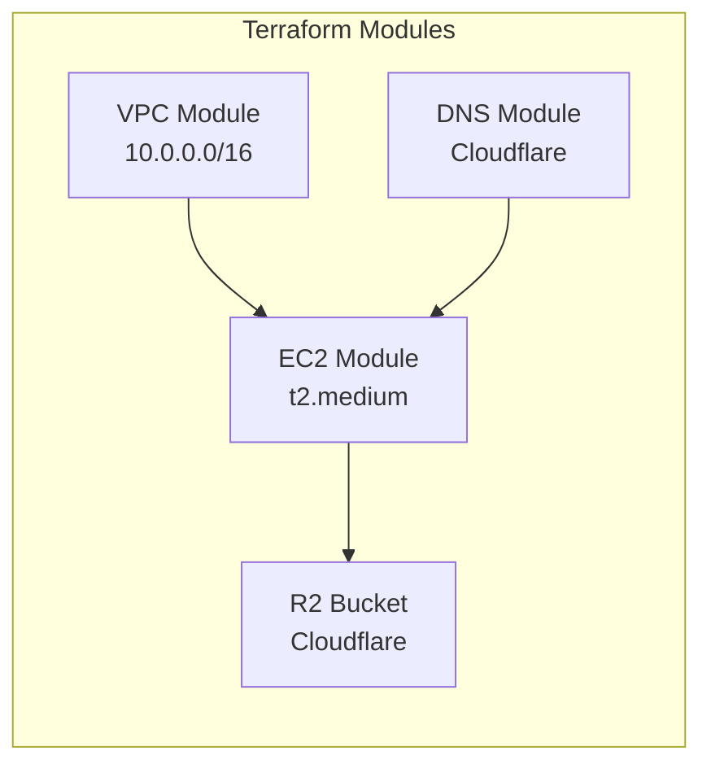
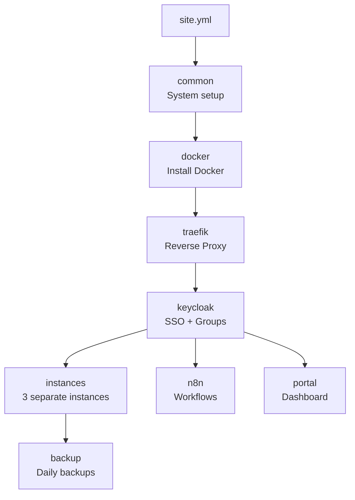
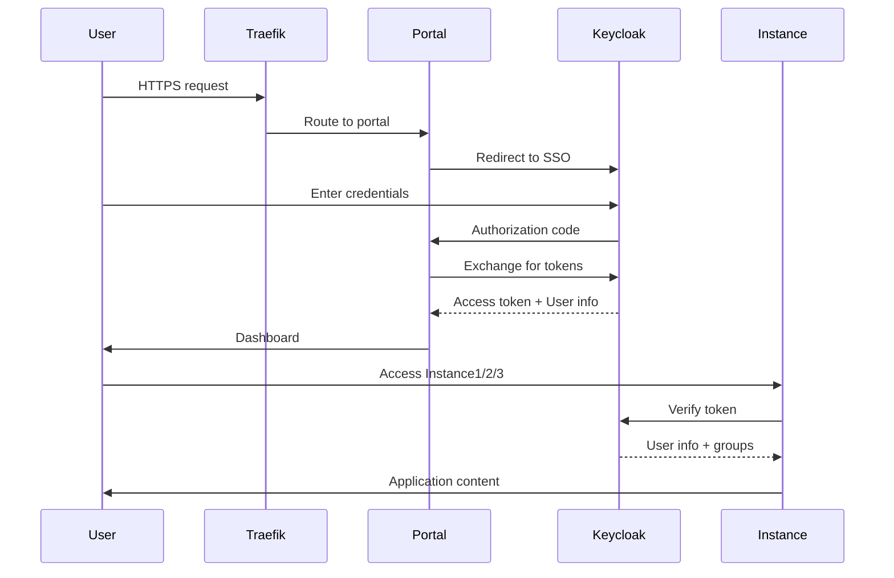
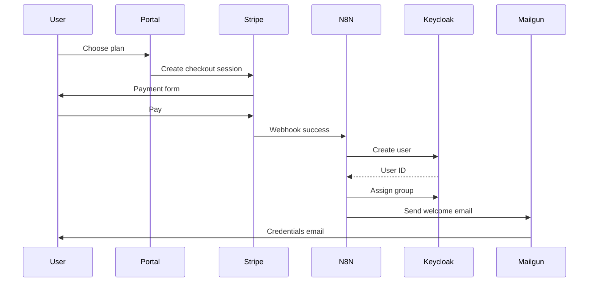
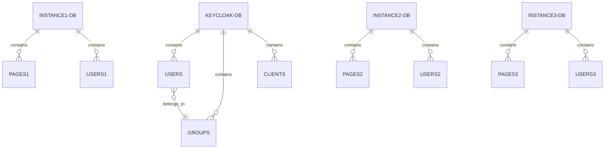
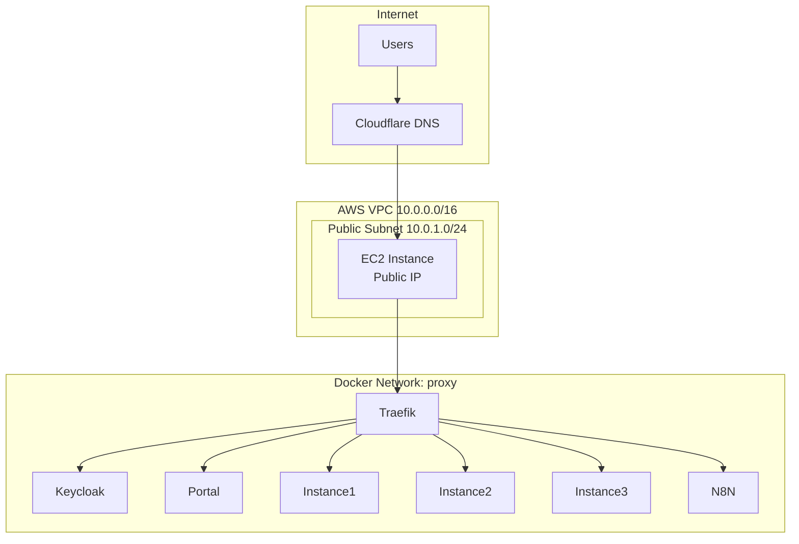

# Project 1: **wikiplatform.app – Target Architecture**

## Introduction:

Une plateforme multi-instances permet de regrouper plusieurs espaces de travail bien distincts (instance1, instance2, instance3) au sein d’une même infrastructure centralisée. Chaque instance conserve son propre contenu, ses paramètres et ses utilisateurs, ce qui évite les confusions et assure une organisation propre. L’authentification centralisée offre à l’utilisateur une seule connexion pour accéder uniquement aux instances qui lui sont destinées. Sur le plan opérationnel, cette structure simplifie la maintenance, puisqu’on peut intervenir sur une instance sans perturber les autres. Enfin, l’architecture reste évolutive : il suffit d’ajouter une nouvelle instance lorsque les besoins augmentent, sans modifier l’ensemble du système.

## Objectif :

Chaque instance conserve son propre jeu de données, ses paramètres et ses utilisateurs, ce qui reflète la gestion professionnelle de flux hétérogènes — une réalité incontournable dès que l’on manipule des sources multiples ou des volumes importants. L’authentification centralisée offre une cohérence d’accès tout en préservant la sécurité, un aspect essentiel lorsque plusieurs pipelines ou espaces analytiques coexistent. Sur le plan opérationnel, ce type d’architecture facilite grandement l’administration : on peut intervenir sur une instance, l’optimiser ou la restaurer sans interrompre les autres, ce qui correspond aux bonnes pratiques observées dans les environnements Big Data matures. Enfin, la plateforme demeure naturellement extensible, permettant d’ajouter de nouveaux espaces de traitement au fur et à mesure que les besoins en données et en analyse se développent.

## **Infrastructure Overview**

Architecture cible comprenant **3 instances indépendantes** de la même application (instance1, instance2, instance3), toutes regroupées dans une seule infrastructure centralisée.

# **Architecture Diagram**

---

# **Infrastructure Components**

## **Terraform Resources**

### Files

* `providers.tf` – AWS + Cloudflare
* `variables.tf` – input variables
* `vm.tf` – EC2 + VPC + Security Groups
* `dns.tf` – DNS records
* `r2.tf` – Object storage
* `outputs.tf` – Outputs

**Removed:** `postgres.tf` (RDS supprimé)

---

# **Ansible Deployment**

### Roles

1. **common** – mise à jour système, firewall
2. **docker** – installation Docker & Compose
3. **traefik** – reverse proxy + SSL
4. **keycloak** – SSO, realm, groupes
5. **instances** – déploiement de 3 instances
6. **n8n** – automatisations
7. **portal** – tableau de bord utilisateurs
8. **backup** – backups PostgreSQL

---

# **Authentication Flow**

---

# **Payment Workflow**

*(Stripe → N8N → Keycloak)*

---

# **Database Structure**

### Databases

* `keycloak_db`
* `instance1_db`
* `instance2_db`
* `instance3_db`

Toutes en Docker PostgreSQL.

---

# **Network Architecture**

---

# **Access Control Matrix**

| User Group | Instance1 | Instance2 | Instance3 |
| ---------- | --------- | --------- | --------- |
| STARTER    | Yes       | No        | No        |
| PRO        | Yes       | Yes       | No        |
| ENTERPRISE | Yes       | Yes       | Yes       |

Gestion via Keycloak (groupes + rôles).

---

# **Deployment Steps**

1. `terraform apply` – provision VPC, EC2, DNS, R2
2. Exécuter **Ansible**
3. Initialiser **Keycloak**
4. Déployer **les 3 instances** avec OIDC
5. Importer les workflows **N8N**
6. Déployer le **Portal**
7. Configurer **backups** automatiques

**Durée totale : ~45 minutes**

---

# **Cost Structure**

| Ressource     | Coût mensuel     |
| ------------- | ---------------- |
| EC2 t2.medium | ~33$             |
| Cloudflare R2 | 1–2$             |
| **Total**     | **≈ 35$ / mois** |

RDS retiré → économie ~30$.

---

# **Technical Stack**

* Terraform
* Ansible
* Docker & Docker Compose
* Traefik
* Keycloak
* N8N
* Express + EJS
* PostgreSQL
* Cloudflare R2
* Let's Encrypt (Traefik)
* Stripe
* Mailgun

# Annexe 1 - **Résumé – Architecture cible**

**Projet : wikiplatform.app**

## **Annexe 1.1. Objectif général**

Mettre en place une plateforme centralisée capable d’héberger **plusieurs instances indépendantes** de la même application (instance1, instance2, instance3), avec connexion unique pour les utilisateurs, gestion centralisée des accès, automatisation et stockage partagé.

## **Annexe 1.2. Vue d’ensemble de l’infrastructure**

* Une seule machine **EC2 (t2.medium, Ubuntu 22.04)** héberge tous les services en conteneurs Docker.
* **Traefik** sert de reverse proxy HTTPS avec certificats automatiques.
* **Keycloak** gère l’authentification unique (SSO) et les droits d’accès.
* **Trois instances applicatives** (instance1/2/3), chacune avec sa propre base PostgreSQL.
* **Cloudflare R2** stocke les fichiers envoyés par les utilisateurs.
* **N8N** gère les automatisations (paiement, création d’utilisateur, e-mails).
* **Portal** centralise les liens et redirections selon le profil de l’utilisateur.

## **Annexe 1.3. Fonctionnement global**

1. L’utilisateur se connecte via **Keycloak** (SSO).
2. Il accède au **Portal**, qui lui présente uniquement les instances auxquelles il a droit.
3. Chaque instance fonctionne de manière isolée (base, configuration, contenu).
4. Les automatisations (ex. paiement Stripe) créent automatiquement les comptes et groupes via **N8N**.
5. Les fichiers (images, documents) sont envoyés directement dans **Cloudflare R2**.

## **Annexe 1.4. Déploiement automatisé**

* **Terraform** : création de l’infrastructure (EC2, DNS, stockage).
* **Ansible** : installation Docker, Traefik, Keycloak, Portal, N8N, les 3 instances, et la routine backups.
* Déploiement complet automatisé en **~45 minutes**.

## **Annexe 1.5. Sécurité et organisation**

* Accès HTTPS obligatoire via Traefik.
* Authentification centralisée Keycloak (OIDC).
* Instances totalement isolées entre elles.
* Sauvegardes PostgreSQL quotidiennes.
* Gestion des accès par groupes (ex. Starter, Pro, Enterprise).

## **Annexe 1.6. Coûts mensuels**

* EC2 t2.medium : **~33$**
* Cloudflare R2 : **1–2$**
* **Total ~35$/mois**
  *(RDS supprimé → économie d’environ 30$/mois)*

## **Annexe 1.7. Avantages clés**

* Architecture simple, robuste et entièrement centralisée.
* Possibilité d’ajouter facilement de nouvelles instances.
* Maintenabilité élevée : une instance peut être modifiée sans impacter les autres.
* Expérience utilisateur fluide grâce au SSO et au portail.
* Automatisations intégrées pour paiement, création d’utilisateur et notifications.

