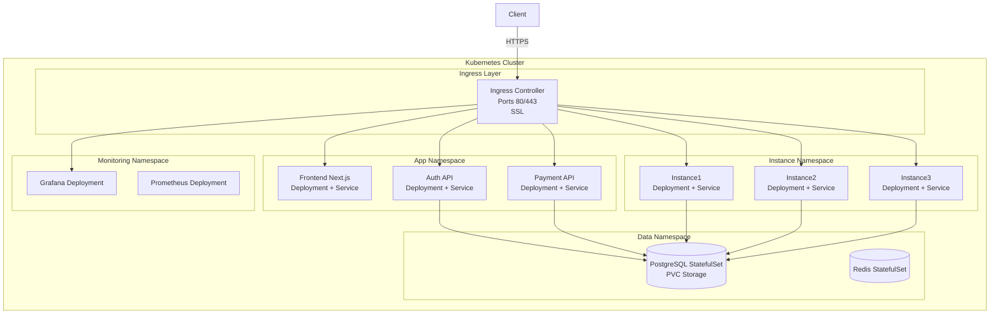
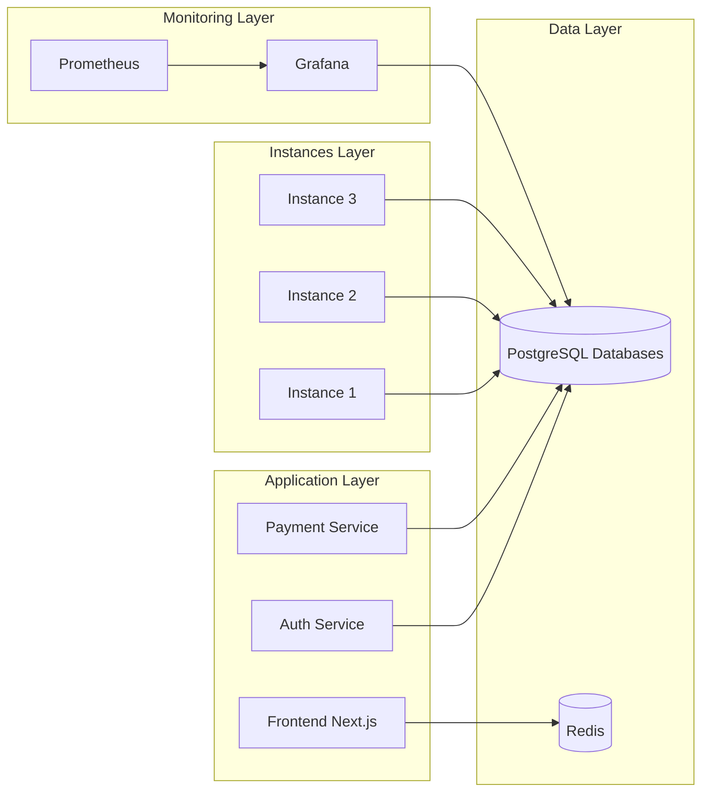
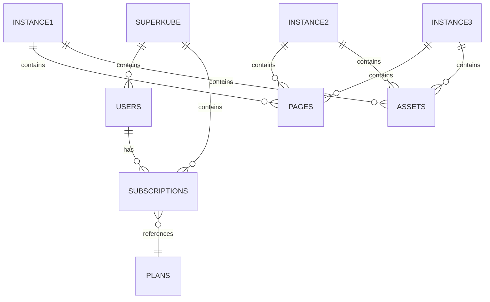
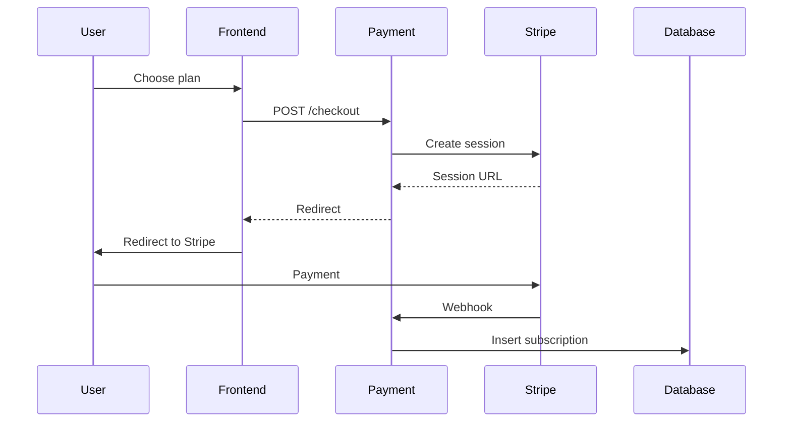
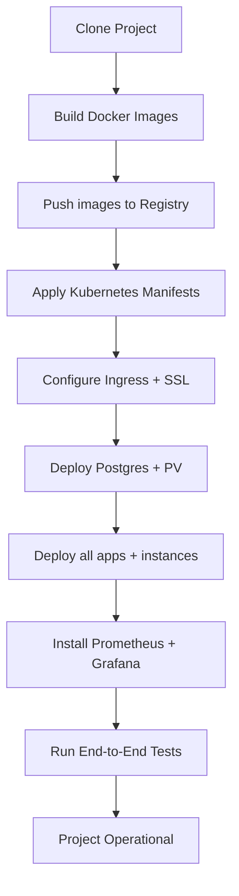

# **Project 2 — SuperKuberneteX**

## **Target Architecture & Deployment Mission (Big Data Team)**


## **1. Contexte du projet**

Le client vous fournit une application complète composée d’un **frontend Next.js**, d’un service d’authentification, d’un module de paiement et de **trois instances applicatives indépendantes** appelées *instance1*, *instance2* et *instance3*.
Ces instances représentent trois environnements isolés ayant chacun leur propre base de données, leurs propres fichiers et leur propre logique, mais partageant le même socle technologique.

Votre équipe est **l’équipe Big Data**, responsable de toute la **mise en production**, de la **scalabilité**, de la **résilience**, du **monitoring**, et de la **gestion des flux de données**.
Le code applicatif (frontend + backend) vous est fourni :
**votre mission n'est pas de coder, mais de bâtir l’infrastructure Kubernetes destinée à exécuter et opérer l’ensemble.**

Ce projet s’appelle **SuperKuberneteX**, car l’objectif est précisément de migrer une architecture Docker Compose vers une architecture **Kubernetes professionnelle**, capable de supporter la croissance, le monitoring avancé et la séparation stricte entre plusieurs instances.


# **2. Objectif de votre mission (Big Data Team)**

Votre mission consiste à :

### **1. Déployer toute l’architecture sur Kubernetes**

* Un cluster K8s (local, VM, ou cloud)
* Un Ingress Controller (Nginx Ingress ou Traefik)
* Un namespace par environnement ou par composant
* Un déploiement par service (frontend, auth, payment, instances)

### **2. Assurer une isolation stricte des données**

* Une base PostgreSQL par instance (instance1_db, instance2_db, instance3_db)
* Des credentials Kubernetes Secrets
* Des volumes persistants (PVC / PV)

### **3. Concevoir le monitoring complet**

* Grafana + Prometheus
* Dashboards par instance
* Alerting (email/Slack)

### **4. Gérer la sécurité et l’observabilité**

* Secrets Kubernetes pour Stripe
* Tokens JWT protégés
* Logs centralisés

### **5. Automatiser la mise à jour et la montée en charge**

* Horizontal Pod Autoscaler (HPA)
* Rolling updates contrôlés
* Probes (liveness/readiness)

Le but final :
**livrer une plateforme multi-instances totalement scalable, stable et industrialisée sur Kubernetes.**


## Résumé:


✔ *le frontend vous est fourni,*
✔ *vous êtes l’équipe Big Data*,
✔ *votre mission est de déployer la solution en utilisant Kubernetes*,
✔ *le projet s’appelle SuperKuberneteX.*

# **3. Infrastructure Overview**

L’architecture Docker initiale fournie doit être répliquée en Kubernetes :

* **Frontend** (Next.js)
* **Auth Service** (Node.js)
* **Payment Service** (Node.js + Stripe)
* **Instance1**
* **Instance2**
* **Instance3**
* **PostgreSQL multi-DB**
* **Redis**
* **Grafana + Prometheus**

Le reverse proxy système (Nginx) doit être remplacé par un **Ingress Controller Kubernetes**.

---

# **4. Architecture Diagram — Version Kubernetes**



---

# **5. Architecture applicative**



---

# **6. Structure des bases PostgreSQL**

Chaque instance fonctionnera avec sa propre base :



PostgreSQL sera déployé en **StatefulSet**, gérant les volumes persistants (PVC).

---

# **7. Payment Flow (Stripe + Kubernetes)**



Le secret Stripe sera stocké dans :

```
kubectl create secret generic stripe-secret --from-literal=STRIPE_KEY=xxxx
```

---

# **8. Déploiement Kubernetes — Pipeline**



---

# **9. Noms de domaines (à adapter)**

| Service    | Exemple de domaine             |
| ---------- | ------------------------------ |
| Frontend   | superkubernetex.com            |
| Auth       | auth.superkubernetex.com       |
| Payment    | pay.superkubernetex.com        |
| Instance 1 | inst1.superkubernetex.com      |
| Instance 2 | inst2.superkubernetex.com      |
| Instance 3 | inst3.superkubernetex.com      |
| Monitoring | monitoring.superkubernetex.com |

---

# **10. Monitoring**

Monitoring namespace :

* Prometheus : collecteur de métriques
* Grafana : dashboards
* Alertmanager : alerting

Dashboards à produire :

1. Charge CPU par instance
2. Requêtes HTTP par service
3. Temps de réponse par instance
4. État des pods et redémarrages
5. Taille bases PostgreSQL

---

# **11. Sauvegardes Kubernetes**

* **Snapshot PVC PostgreSQL**
* `pg_dump` journalier via CronJob
* Sauvegarde Redis via CronJob
* Rétention 7 jours
* Export vers un bucket S3 ou MinIO (optionnel)

---

# **12. Livrables de votre équipe**

À la fin du projet, l’équipe Big Data doit fournir :

### **1. Tous les manifests Kubernetes**

* `deployment.yaml`
* `service.yaml`
* `ingress.yaml`
* `secret.yaml`
* `configmap.yaml`
* `statefulset.yaml`
* `persistentvolumeclaim.yaml`

### **2. Script d'installation**

* `install.sh` automatisé

### **3. Diagrammes d’architecture**

* Réseau
* Monitoring
* Système d’authentification

### **4. Documentation utilisateur**

* Comment accéder aux instances
* Comment administrer les bases

### **5. Guide de maintenance**

* Scaling horizontal
* Rotation des secrets
* Mises à jour des images

---

# **13. Conclusion**

Le projet **SuperKuberneteX** représente une mise en production complète d’un système multi-instances, transformé depuis Docker Compose vers une architecture **entièrement Kubernetes**. 
Vous recevez le code, et votre rôle est de concevoir une **infrastructure Big Data professionnelle**, sécurisée, scalable, monitorée et automatisable.


