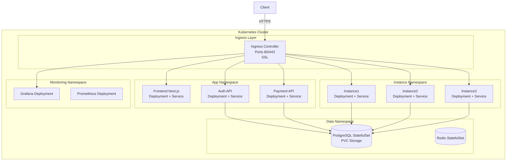
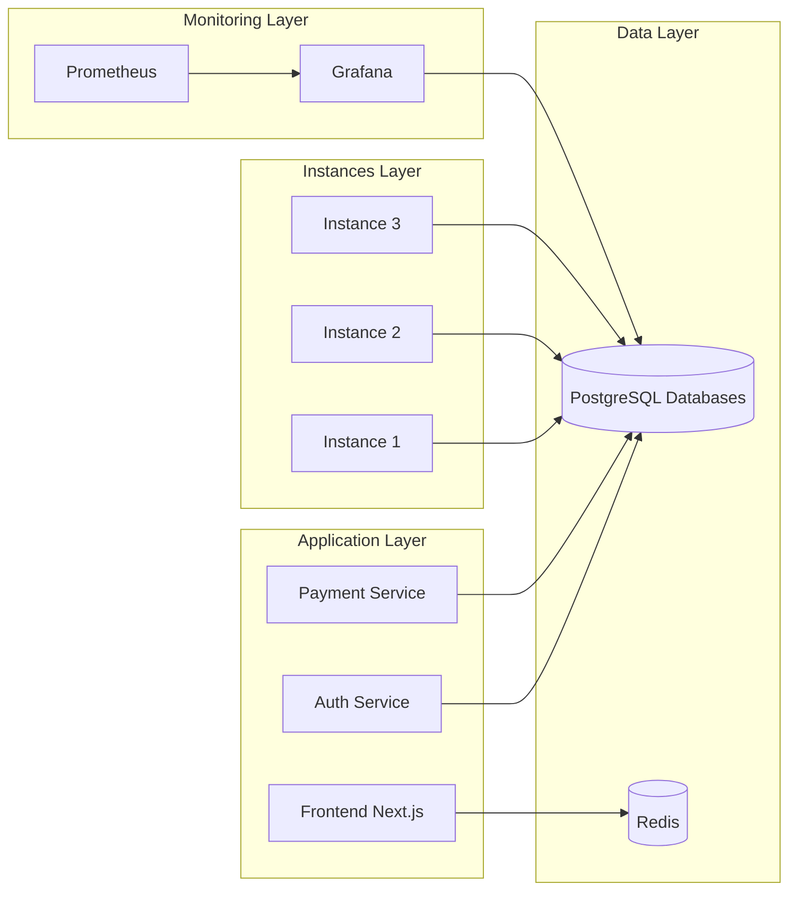
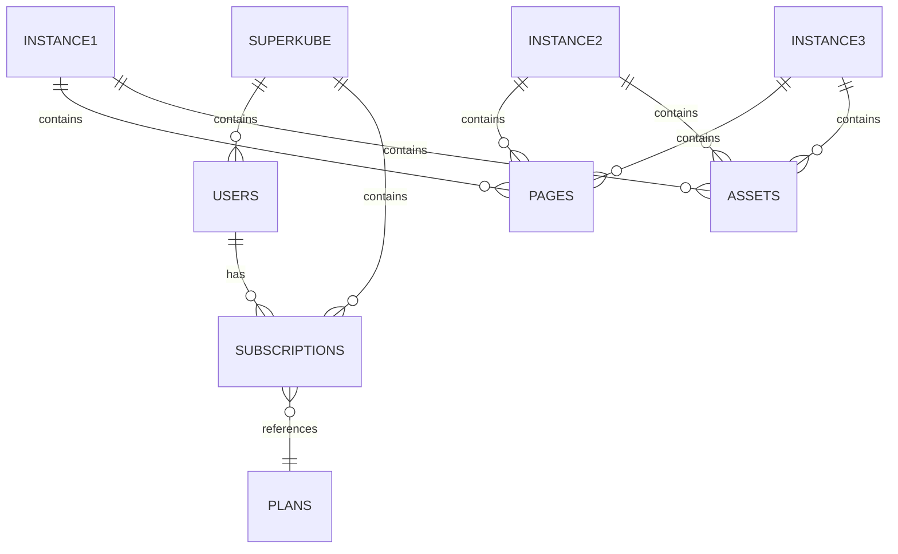
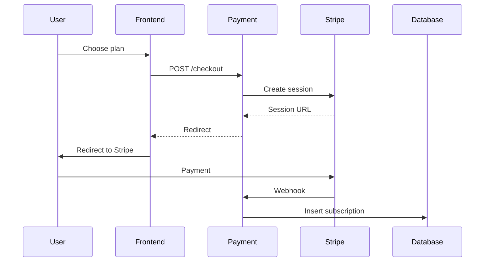
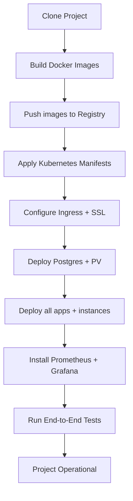

# **Project 2 — SuperKuberneteX**

## **Target Architecture & Deployment Mission (Big Data Team)**


## **1. Contexte du projet**

Le client vous fournit une application complète composée d’un **frontend**, d’un service d’authentification, d’un module de paiement et de **trois instances applicatives indépendantes** appelées *instance1*, *instance2* et *instance3*. Ces instances représentent trois environnements isolés ayant chacun leur propre base de données, leurs propres fichiers et leur propre logique, mais partageant le même socle technologique. Votre équipe est **l’équipe Big Data**, responsable de toute la **mise en production**, de la **scalabilité**, de la **résilience**, du **monitoring**, et de la **gestion des flux de données**. Le code applicatif (frontend + backend) vous est fourni :
**votre mission n'est pas de coder, mais de bâtir l’infrastructure Kubernetes destinée à exécuter et opérer l’ensemble.** Ce projet s’appelle **SuperKuberneteX**, car l’objectif est précisément de migrer une architecture Docker Compose vers une architecture **Kubernetes professionnelle**, capable de supporter la croissance, le monitoring avancé et la séparation stricte entre plusieurs instances.


# **2. Objectif de votre mission (Big Data Team)**


Votre mission consiste à mettre en place l’ensemble de l’architecture sur Kubernetes en construisant un cluster capable d’héberger tous les services du projet dans un environnement isolé, scalable et reproductible. Vous devrez installer un Ingress Controller, définir la structure des namespaces et déployer chaque service – frontend, authentification, paiement et les différentes instances – sous forme de déploiements Kubernetes indépendants. L’isolation des données doit être assurée en attribuant une base PostgreSQL distincte à chaque instance tout en sécurisant les accès via des Secrets Kubernetes et en garantissant la persistance grâce aux volumes PVC. Vous serez également responsables de la mise en place d’un monitoring complet à l’aide de Prometheus et Grafana, incluant des tableaux de bord par instance et un système d’alertes efficace. À cela s’ajoute la configuration de la sécurité opérationnelle avec la gestion des clés Stripe, la protection des jetons JWT et la centralisation des logs. Vous devrez aussi automatiser la montée en charge à l’aide du Horizontal Pod Autoscaler, configurer les probes de santé et assurer la réalisation de mises à jour progressives sans interruption. L’ensemble de ces responsabilités requiert une vision claire de l’orchestration, de la résilience et de l’observabilité d’une architecture distribuée. Vous devrez garantir que chaque composant communique correctement, que la charge se répartisse efficacement et que les données demeurent cohérentes entre les services. Ce travail inclut également la documentation, les tests de bout en bout, la gestion des erreurs et la mise en place de bonnes pratiques DevOps. Au final, votre mandat consiste à livrer une plateforme multi-instances robuste, stable, sécurisée et prête pour une exploitation réelle dans un environnement Kubernetes pleinement industrialisé.


## Points importants dans votre mission :

### **1. Déployer toute l’architecture sur Kubernetes**

* Un cluster K8s (local, VM, ou cloud)
* Un Ingress Controller (Nginx Ingress ou Traefik)
* Un namespace par environnement ou par composant
* Un déploiement par service (frontend, auth, payment, instances)

### **2. Assurer une isolation stricte des données**

* Une base PostgreSQL par instance (instance1_db, instance2_db, instance3_db)
* Des credentials Kubernetes Secrets
* Des volumes persistants (PVC / PV)

### **3. Concevoir le monitoring complet**

* Grafana + Prometheus
* Dashboards par instance
* Alerting (email/Slack)

### **4. Gérer la sécurité et l’observabilité**

* Secrets Kubernetes pour Stripe
* Tokens JWT protégés
* Logs centralisés

### **5. Automatiser la mise à jour et la montée en charge**

* Horizontal Pod Autoscaler (HPA)
* Rolling updates contrôlés
* Probes (liveness/readiness)

Le but final :
**livrer une plateforme multi-instances totalement scalable, stable et industrialisée sur Kubernetes.**


## Résumé:


✔ *le frontend vous est fourni,* 

✔ *vous êtes l’équipe Big Data*, 

✔ *votre mission est de déployer la solution en utilisant Kubernetes*, 

✔ *le projet s’appelle SuperKuberneteX.* 

# **3. Infrastructure Overview**

L’architecture Docker initiale fournie doit être répliquée en Kubernetes :

* **Frontend** (Next.js)
* **Auth Service** (Node.js)
* **Payment Service** (Node.js + Stripe)
* **Instance1**
* **Instance2**
* **Instance3**
* **PostgreSQL multi-DB**
* **Redis**
* **Grafana + Prometheus**

Le reverse proxy système (Nginx) doit être remplacé par un **Ingress Controller Kubernetes**.

<br/>

# **4. Architecture Diagram — Version Kubernetes**


L’architecture repose sur un cluster Kubernetes structuré en plusieurs namespaces, chacun regroupant un ensemble précis de services afin d’assurer une séparation logique claire et une gestion opérationnelle plus simple. Le trafic provenant des utilisateurs transite d’abord par un Ingress Controller configuré en HTTPS, qui redirige chaque requête vers le bon service interne selon le domaine ou le chemin demandé. Le namespace applicatif héberge les services principaux comme le frontend, l’API d’authentification et le service de paiement, chacun déployé sous forme de Deployment avec son Service associé, offrant un découplage propre entre logique applicative et routage interne. Un second namespace contient les instances indépendantes de l’application, telles que instance1, instance2 et instance3, isolées dans leurs propres pods et prêtes à être mises à l’échelle de manière autonome. La couche de données est prise en charge par un StatefulSet PostgreSQL avec stockage persistant, combiné à Redis pour la gestion des sessions et du cache, offrant ainsi une base fiable, durable et performante pour l’ensemble des microservices. Le namespace de monitoring regroupe Prometheus, responsable de la collecte des métriques, et Grafana, qui permet de visualiser en temps réel l’état du cluster, les performances des services et la santé des bases de données. Toutes les communications entre services suivent un schéma clair : le frontend échange avec Redis, les API interagissent avec PostgreSQL, et les instances consultent leurs propres schémas de données. Dans cette architecture, chaque instance possède sa base dédiée, ce qui évite les conflits, simplifie les restaurations et renforce l’isolation opérationnelle. Le flux de paiement Stripe s’intègre naturellement via le service payment, qui reçoit les demandes du frontend, crée les sessions Stripe, écoute les webhooks et met ensuite à jour la base adéquate. Les secrets sensibles, comme la clé Stripe, sont sécurisés dans les Secrets Kubernetes et montés uniquement dans les pods concernés. L’ensemble du pipeline de déploiement suit un processus clair : construction des images Docker, publication au registre, application des manifests Kubernetes, configuration de l’Ingress, déploiement des bases, installation du monitoring, puis tests finaux. Les noms de domaine associés aux services permettent une organisation nette et une navigation fluide, chaque composant disposant de son propre sous-domaine. Le monitoring produit ensuite des tableaux offrant une visibilité constante sur l’utilisation du CPU, la latence réseau, les requêtes des API et l’évolution des volumes des bases de données. Enfin, les sauvegardes sont automatisées via des CronJobs exécutant des snapshots PVC ou des pg_dump réguliers, garantissant la récupération rapide en cas de défaillance. L’ensemble forme une plateforme multi-instances entièrement scalable, supervisée, sécurisée et industrialisée, conforme aux standards modernes de déploiement cloud-native.




---

# **5. Architecture applicative**



---

# **6. Structure des bases PostgreSQL**

Chaque instance fonctionnera avec sa propre base :



PostgreSQL sera déployé en **StatefulSet**, gérant les volumes persistants (PVC).

---

# **7. Payment Flow (Stripe + Kubernetes)**



Le secret Stripe sera stocké dans :

```
kubectl create secret generic stripe-secret --from-literal=STRIPE_KEY=xxxx
```

---

# **8. Déploiement Kubernetes — Pipeline**



---

# **9. Noms de domaines (à adapter)**

| Service    | Exemple de domaine             |
| ---------- | ------------------------------ |
| Frontend   | superkubernetex.com            |
| Auth       | auth.superkubernetex.com       |
| Payment    | pay.superkubernetex.com        |
| Instance 1 | inst1.superkubernetex.com      |
| Instance 2 | inst2.superkubernetex.com      |
| Instance 3 | inst3.superkubernetex.com      |
| Monitoring | monitoring.superkubernetex.com |

---

# **10. Monitoring**

Monitoring namespace :

* Prometheus : collecteur de métriques
* Grafana : dashboards
* Alertmanager : alerting

Dashboards à produire :

1. Charge CPU par instance
2. Requêtes HTTP par service
3. Temps de réponse par instance
4. État des pods et redémarrages
5. Taille bases PostgreSQL

---

# **11. Sauvegardes Kubernetes**

* **Snapshot PVC PostgreSQL**
* `pg_dump` journalier via CronJob
* Sauvegarde Redis via CronJob
* Rétention 7 jours
* Export vers un bucket S3 ou MinIO (optionnel)

---

# **12. Livrables de votre équipe**

À la fin du projet, l’équipe Big Data doit fournir :

### **1. Tous les manifests Kubernetes**

* `deployment.yaml`
* `service.yaml`
* `ingress.yaml`
* `secret.yaml`
* `configmap.yaml`
* `statefulset.yaml`
* `persistentvolumeclaim.yaml`

### **2. Script d'installation**

* `install.sh` automatisé

### **3. Diagrammes d’architecture**

* Réseau
* Monitoring
* Système d’authentification

### **4. Documentation utilisateur**

* Comment accéder aux instances
* Comment administrer les bases

### **5. Guide de maintenance**

* Scaling horizontal
* Rotation des secrets
* Mises à jour des images

---

# **13. Conclusion**

Le projet **SuperKuberneteX** représente une mise en production complète d’un système multi-instances, transformé depuis Docker Compose vers une architecture **entièrement Kubernetes**. 
Vous recevez le code, et votre rôle est de concevoir une **infrastructure Big Data professionnelle**, sécurisée, scalable, monitorée et automatisable.


