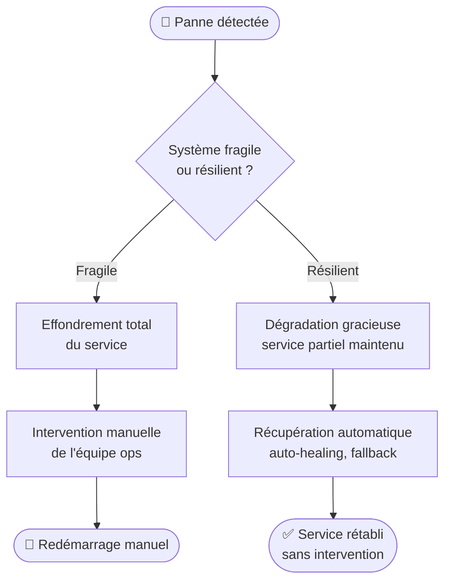
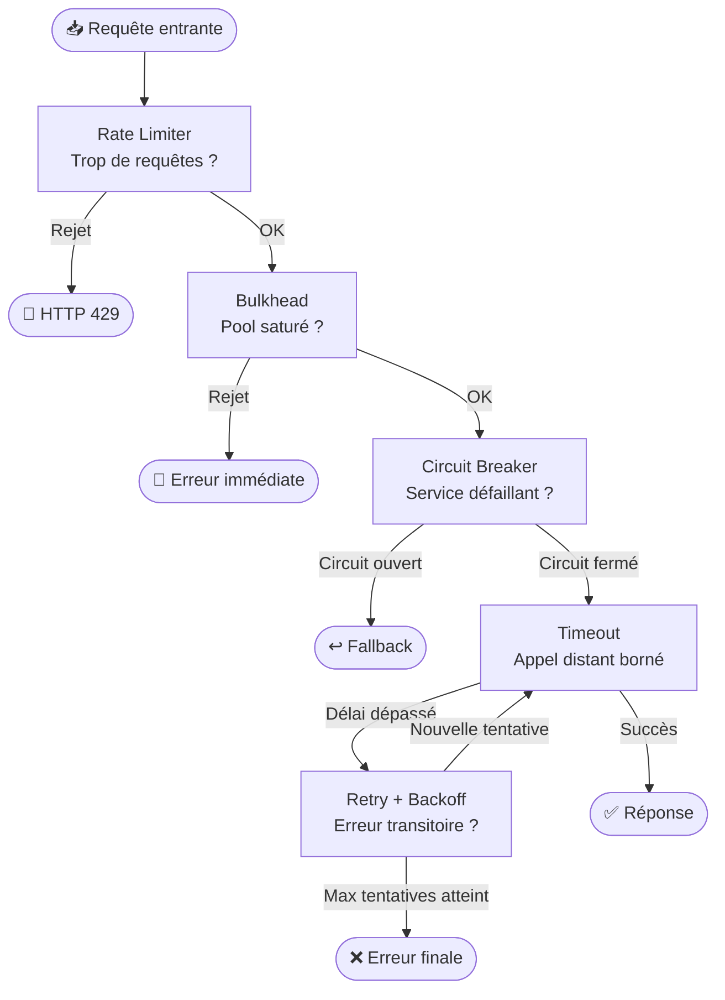
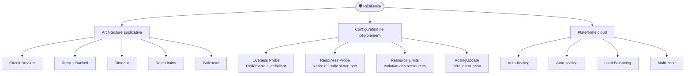

# Introduction à la Résilience dans le Cloud

> **Objectif pédagogique**
> Comprendre ce qu'est la résilience dans un contexte de déploiement cloud, identifier les types de défaillances courantes dans les systèmes distribués, et connaître les principes fondamentaux qui guident la conception de systèmes résilients.

---

## 1. Pourquoi les systèmes distribués tombent-ils en panne ?

Quand une application tourne sur une seule machine, les défaillances sont simples : la machine s'arrête, l'application s'arrête. Mais dans le cloud, une application est composée de **dizaines ou centaines de services** qui communiquent entre eux sur un réseau. Ce réseau est **peu fiable par nature**.

Les causes de défaillances dans un environnement cloud incluent :

- **Latence réseau imprévisible** : les paquets peuvent arriver en retard ou dans le désordre
- **Défaillances partielles** : un service répond, mais lentement ou avec des erreurs intermittentes
- **Surcharge (overload)** : un service reçoit plus de requêtes qu'il ne peut en traiter
- **Mise à jour en cours** : un pod redémarre pendant qu'une requête lui est envoyée
- **Panne d'une zone de disponibilité** : une région entière devient inaccessible
- **Dépendances en cascade** : le service A dépend de B, qui dépend de C — si C tombe, A tombe aussi

> **Loi de Murphy dans le cloud** : tout ce qui peut tomber en panne finira par tomber en panne. La question n'est pas *si*, mais *quand*.

---

## 2. Les grandes catégories de défaillances

| Type | Description | Exemple concret |
|------|-------------|-----------------|
| **Défaillance franche** | Le service ne répond plus du tout | Pod crashé, connexion refusée |
| **Défaillance silencieuse** | Le service répond mais renvoie des erreurs | HTTP 500, données corrompues |
| **Défaillance de performance** | Le service répond mais très lentement | Timeout après 30 secondes |
| **Défaillance intermittente** | Le service échoue parfois seulement | 1 requête sur 10 échoue |
| **Défaillance en cascade** | Une panne se propage entre services | Service A → B → C tous en panne |

---

## 3. Les principes fondamentaux de la résilience

### 3.1 Accepter l'échec comme inévitable

Un système résilient ne cherche pas à **éviter** les pannes — il cherche à **les contenir** et à **s'en remettre rapidement**.

La différence entre un système fragile et un système résilient :

### 3.2 Concevoir pour la défaillance (Design for Failure)

Chaque composant du système doit être conçu en assumant que ses dépendances **peuvent** échouer à tout moment. Cela implique de répondre à des questions comme :

- Que se passe-t-il si ce service prend 10 secondes à répondre au lieu de 100ms ?
- Que se passe-t-il si 30% des requêtes vers ce service échouent ?
- Que se passe-t-il si ce service ne répond plus du tout ?

### 3.3 La dégradation gracieuse (Graceful Degradation)

Plutôt que d'échouer complètement, un système résilient continue à fonctionner avec des **fonctionnalités réduites** :

- La page de recommandations ne charge pas → on affiche les produits populaires par défaut
- Le service de paiement est lent → on met la commande en file d'attente
- La base de données est inaccessible → on retourne des données en cache

### 3.4 L'isolation des défaillances (Bulkhead)

Inspiré des cloisons étanches d'un navire : si une section est inondée, les autres survivent. En informatique, cela signifie qu'une défaillance dans un service ne doit pas consommer toutes les ressources du système et tuer les autres services.

---

## 4. Les patterns de résilience — Vue d'ensemble

Dans les chapitres suivants, nous allons étudier en détail chacun de ces patterns :

| Pattern | Problème résolu | Mécanisme |
|---------|----------------|-----------|
| **Timeout** | Attente infinie d'une réponse | Limite le temps d'attente maximum |
| **Retry** | Erreurs transitoires | Réessaie automatiquement l'opération |
| **Backoff exponentiel** | Surcharge en cas de retry massif | Augmente progressivement le délai entre les tentatives |
| **Circuit Breaker** | Cascade de défaillances | Coupe le circuit vers un service défaillant |
| **Rate Limiter** | Surcharge d'un service | Limite le nombre de requêtes par unité de temps |
| **Bulkhead** | Propagation des défaillances | Isole les ressources par service |
| **Health Check** | Détection des pannes | Vérifie régulièrement l'état des services |

---

## 5. Résilience et déploiement : le lien fondamental

La résilience n'est pas seulement une question de code — elle est **profondément liée à la façon dont on déploie et orchestre les services**.

Dans un environnement Kubernetes, par exemple :
- Les **Liveness Probes** redémarrent automatiquement les conteneurs défaillants
- Les **Readiness Probes** retirent un pod du load balancer s'il n'est pas prêt
- Les **Deployments** avec stratégie `RollingUpdate` évitent les interruptions de service
- Les **Resource Limits** empêchent un service de consommer toute la mémoire du nœud

La résilience est donc un effort conjoint entre :
1. **L'architecture applicative** (les patterns dans le code)
2. **La configuration de déploiement** (les manifestes, les probes)
3. **La plateforme cloud** (auto-healing, auto-scaling, load balancing)

---

## Résumé

- Les systèmes distribués dans le cloud sont **fondamentalement instables** — les pannes sont inévitables
- La résilience consiste à **contenir** et **récupérer** des défaillances, pas à les éviter
- La **dégradation gracieuse** permet de maintenir un service partiel plutôt qu'une panne totale
- Les patterns de résilience forment une **boîte à outils** pour concevoir des systèmes robustes
- La résilience implique à la fois le **code applicatif** et la **configuration de déploiement**

---

> **Pour aller plus loin** : Chapitre 02 – Circuit Breaker et Rate Limiter
