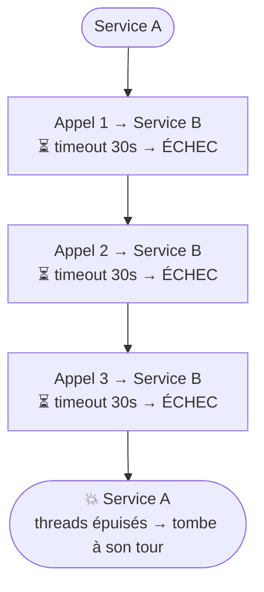
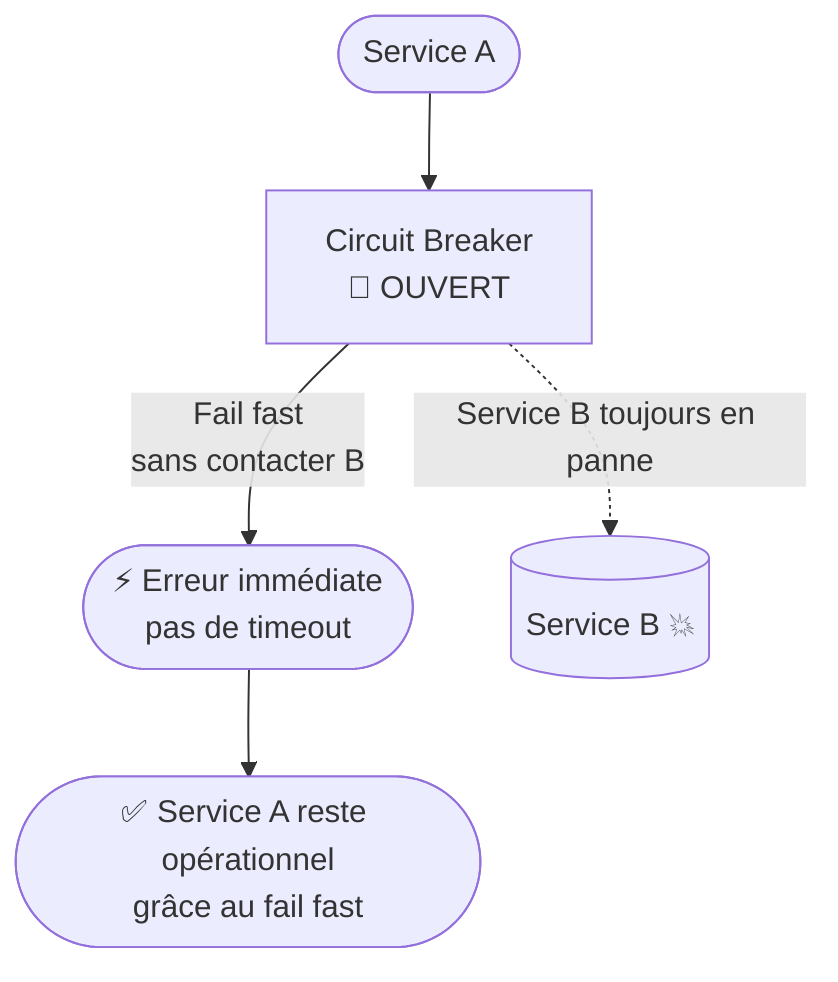
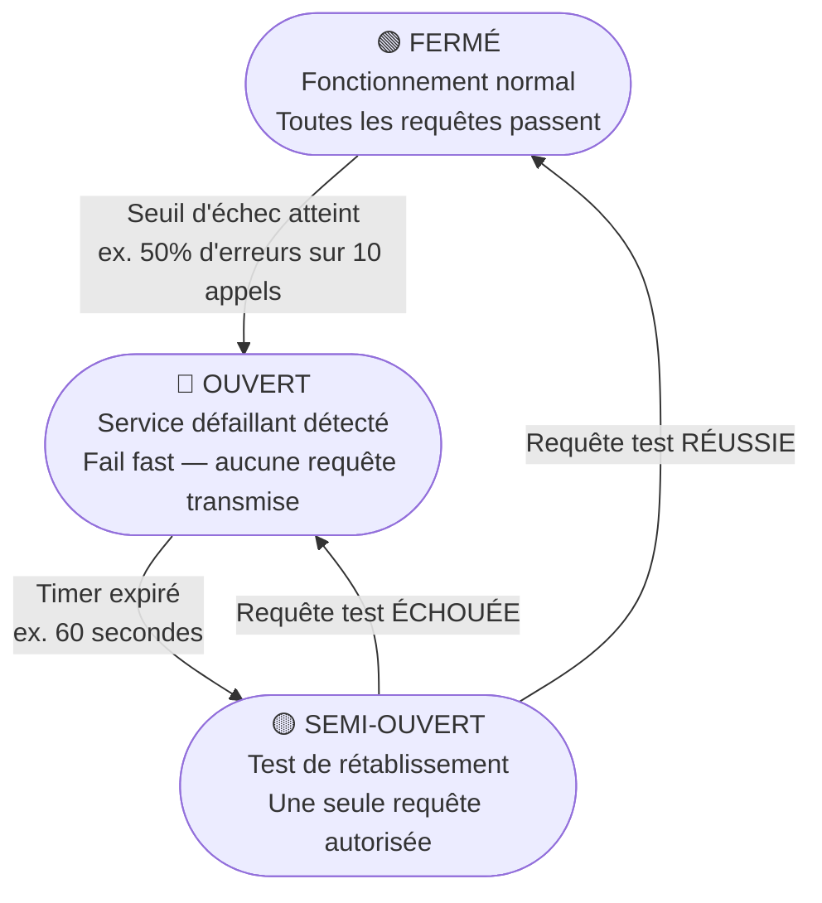
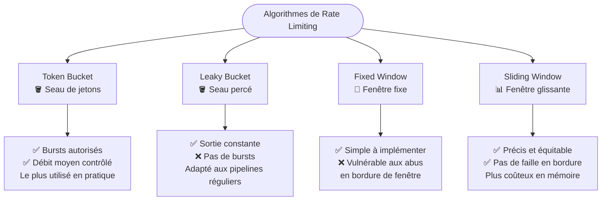
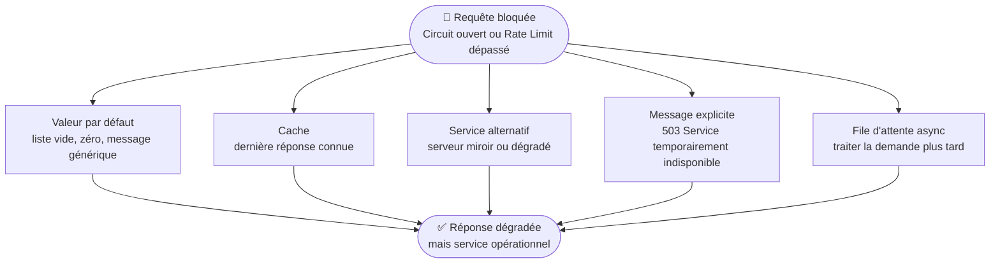

# Circuit Breaker et Rate Limiter

> **Objectif pédagogique**
> Comprendre le fonctionnement du pattern Circuit Breaker et du Rate Limiter, savoir dans quel contexte les utiliser, et les relier aux mécanismes de déploiement cloud.

---

## 1. Le pattern Circuit Breaker

### 1.1 L'analogie électrique

Un disjoncteur électrique (circuit breaker) protège votre maison : quand il détecte un court-circuit, il **coupe le courant** avant que les fils ne fondent. Il ne laisse pas le problème s'aggraver.

En informatique, le Circuit Breaker fait exactement la même chose : quand un service distant devient défaillant, il **coupe les appels vers ce service** avant que tout le système ne soit submergé.

### 1.2 Le problème résolu

Sans Circuit Breaker, voici ce qui se passe quand le service B est en panne :



Avec le Circuit Breaker :



### 1.3 Les trois états du Circuit Breaker



#### État FERMÉ (Closed) — Fonctionnement normal

- Toutes les requêtes passent normalement
- Le Circuit Breaker **surveille** le taux d'échec (ex. : 5 échecs sur 10 dernières requêtes)
- Tant que le taux d'échec est en dessous du seuil → le circuit reste fermé

#### État OUVERT (Open) — Service défaillant détecté

- Les requêtes **ne passent plus du tout** vers le service défaillant
- Une **erreur est retournée immédiatement** (fail fast)
- Le circuit reste ouvert pendant un **délai de récupération** (ex. : 60 secondes)
- Pendant ce temps, le service défaillant peut se rétablir

#### État SEMI-OUVERT (Half-Open) — Test de rétablissement

- Après le délai, le circuit laisse passer **une seule requête de test**
- Si cette requête **réussit** → le circuit repasse en état FERMÉ
- Si cette requête **échoue** → le circuit repasse en état OUVERT (nouveau délai)

### 1.4 Paramètres configurables

| Paramètre | Description | Exemple |
|-----------|-------------|---------|
| `failureThreshold` | Taux d'échec pour ouvrir le circuit | 50% |
| `minimumRequests` | Nombre min. de requêtes avant évaluation | 10 |
| `waitDuration` | Temps en état OUVERT avant test | 60 secondes |
| `slowCallThreshold` | Taux d'appels lents pour ouvrir le circuit | 80% |
| `slowCallDuration` | Durée au-delà de laquelle un appel est "lent" | 2 secondes |

### 1.5 Intégration avec le déploiement

Le Circuit Breaker interagit directement avec les mécanismes de déploiement :

- Lors d'un **Rolling Update**, les nouveaux pods peuvent être instables → le Circuit Breaker protège les autres services pendant la transition
- Un **Readiness Probe** retire un pod défaillant du load balancer, le Circuit Breaker arrête les appels *applicatifs* vers ce pod
- En **Kubernetes**, le Circuit Breaker peut être implémenté dans le code ou via un **Service Mesh** (comme Istio ou Linkerd)

```yaml
# Exemple de configuration dans un Service Mesh (Istio)
# (logique circuit breaker déclarée dans la config de déploiement)
spec:
  trafficPolicy:
    outlierDetection:
      consecutive5xxErrors: 5
      interval: 10s
      baseEjectionTime: 60s
      maxEjectionPercent: 100
```

---

## 2. Le pattern Rate Limiter

### 2.1 Le problème résolu

Sans contrôle du débit, un service peut être victime de sa propre popularité :

- Un client avec un bug envoie **10 000 requêtes/seconde**
- Un événement (lancement d'un produit) génère un pic de trafic **x100**
- Un acteur malveillant tente une attaque par **déni de service (DoS)**

Le Rate Limiter répond à la question : **"Combien de requêtes par unité de temps este-ce qu'on accepte ?"**

### 2.2 Les algorithmes de Rate Limiting



#### Token Bucket (Seau de jetons) — le plus utilisé

```
Seau de jetons (capacité max : 100)
├── Un jeton est ajouté chaque 10ms (= 100 req/sec)
├── Chaque requête consomme 1 jeton
├── Pas de jeton disponible → requête rejetée (HTTP 429)
└── Bursts autorisés : si le seau est plein, on peut absorber 100 requêtes d'un coup
```

**Avantage** : permet des **pics de trafic** (bursts) tout en maintenant un débit moyen contrôlé.

#### Leaky Bucket (Seau percé)

```
Files d'attente → [Seau] → Sortie à débit constant
```

Les requêtes entrent dans une file, et sortent à un **débit constant** (ex. : 10 req/sec). Les requêtes en excès sont soit mises en attente, soit rejetées.

**Avantage** : sortie parfaitement régulière. **Inconvénient** : ne gère pas les bursts.

#### Fixed Window (Fenêtre fixe)

```
Fenêtre : 00:00 → 00:59 → max 1000 requêtes
Si 1000 atteint à 00:30 → toutes les requêtes jusqu'à 01:00 sont rejetées
```

**Problème** : un client peut envoyer 1000 req à 00:58 ET 1000 req à 01:02 → 2000 req en 4 secondes.

#### Sliding Window (Fenêtre glissante)

Calcule le nombre de requêtes sur les **60 dernières secondes**, peu importe l'heure exacte. Résout le problème de la fenêtre fixe.

### 2.3 Granularité du Rate Limiter

Le Rate Limiter peut s'appliquer à différents niveaux :

| Niveau | Description | Utilisation |
|--------|-------------|-------------|
| **Global** | Limite totale pour tout le service | Protection contre les DoS |
| **Par client** | Limite par adresse IP ou par token API | Fairness entre clients |
| **Par endpoint** | Limite différente par route | Protéger les endpoints coûteux |
| **Par utilisateur** | Limite par compte utilisateur authentifié | Plans d'abonnement différenciés |

### 2.4 Réponse standard : HTTP 429

Quand une requête est rejetée, la réponse HTTP standard est **429 Too Many Requests** avec un en-tête informatif :

```http
HTTP/1.1 429 Too Many Requests
Retry-After: 30
X-RateLimit-Limit: 100
X-RateLimit-Remaining: 0
X-RateLimit-Reset: 1679012345
```

### 2.5 Rate Limiter dans le contexte du déploiement

- Dans **Kubernetes**, le Rate Limiter peut être géré par un **Ingress Controller** (ex. : annotations NGINX Ingress)
- Dans un **Service Mesh**, les règles de rate limiting sont déclarées dans la configuration du mesh
- Dans une **API Gateway**, c'est souvent une fonctionnalité native (AWS API Gateway, Kong, etc.)

```yaml
# Exemple annotation NGINX Ingress Kubernetes
metadata:
  annotations:
    nginx.ingress.kubernetes.io/limit-rps: "100"
    nginx.ingress.kubernetes.io/limit-connections: "10"
```

---

## 3. Circuit Breaker vs Rate Limiter — Comparaison

| Critère | Circuit Breaker | Rate Limiter |
|---------|----------------|--------------|
| **Objectif principal** | Protéger le **consommateur** d'un service défaillant | Protéger le **fournisseur** d'une surcharge |
| **Déclencheur** | Taux d'échec ou latence élevée | Nombre de requêtes par unité de temps |
| **Direction** | Côté **appelant** (client) | Côté **serveur** (service appelé) |
| **Comportement** | Fail fast sans contacter le service | Rejet immédiat avec HTTP 429 |
| **Récupération** | Automatique via état half-open | Continue à fonctionner pour les requêtes dans les limites |

---

## 4. Fallback — La réponse de repli

Les deux patterns nécessitent une **stratégie de fallback** : que retourne-t-on quand une requête est bloquée ?



| Stratégie | Description | Exemple |
|-----------|-------------|---------|
| **Valeur par défaut** | Retourner une réponse prédéfinie | `[]` pour une liste vide |
| **Cache** | Retourner la dernière réponse connue | Données de la veille |
| **Service alternatif** | Appeler un autre service de secours | Serveur miroir |
| **Message d'erreur explicite** | Informer l'utilisateur du problème | "Service temporairement indisponible" |
| **Mise en file d'attente** | Traiter la demande plus tard | Queue asynchrone |

---

## Résumé

- Le **Circuit Breaker** protège le système appelant en évitant d'appeler un service défaillant — il passe par 3 états : Fermé, Ouvert, Semi-ouvert
- Le **Rate Limiter** protège le service appelé en limitant le débit d'entrée — plusieurs algorithmes existent (Token Bucket, Sliding Window...)
- Les deux patterns nécessitent une **stratégie de fallback** adaptée au contexte
- Ces patterns peuvent être implémentés au niveau **applicatif** ou au niveau **infrastructure** (Service Mesh, Ingress, API Gateway)

---

> **Pour aller plus loin** : Chapitre 03 – Retry, Backoff Exponentiel et Bulkhead
