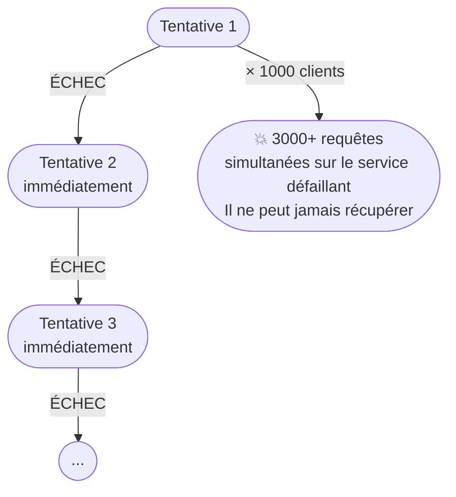
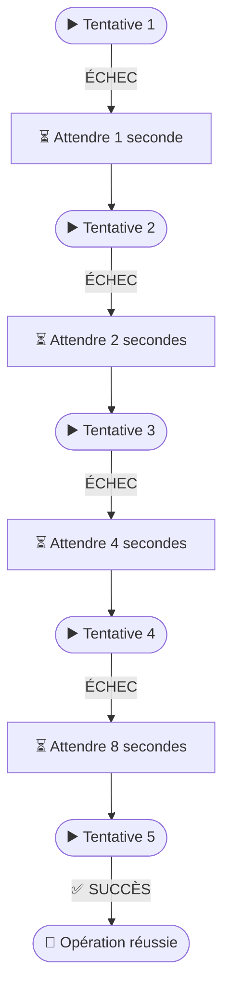
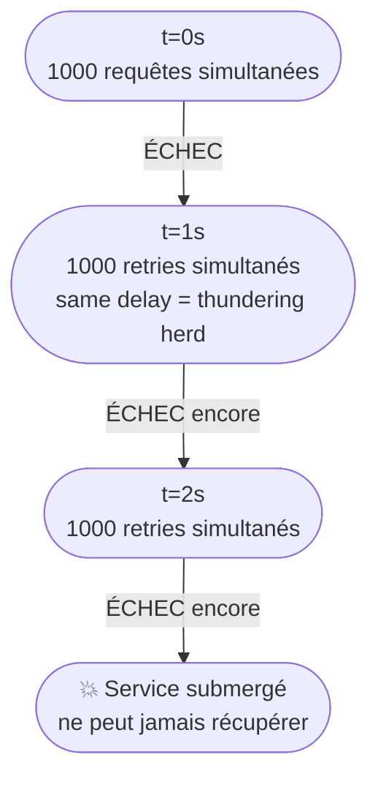
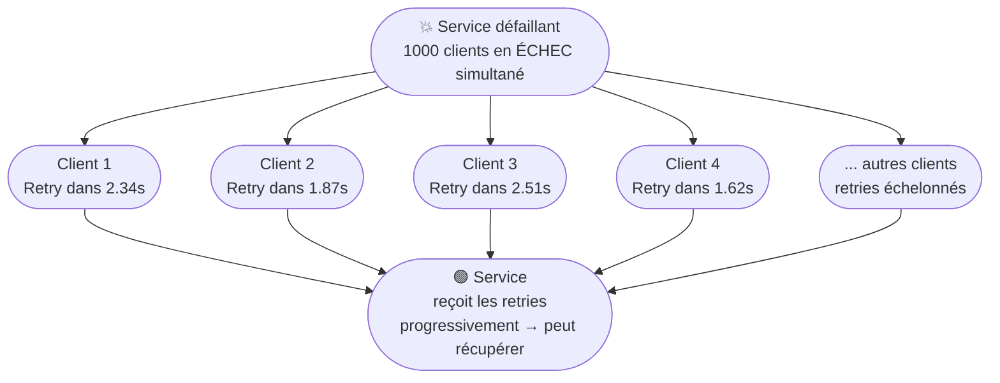
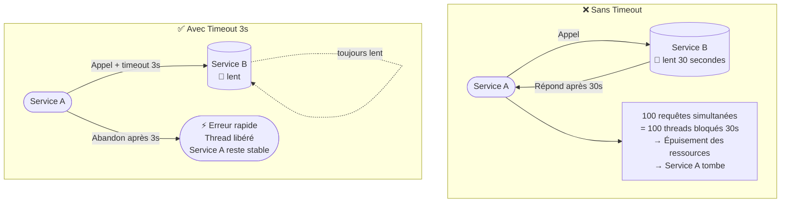
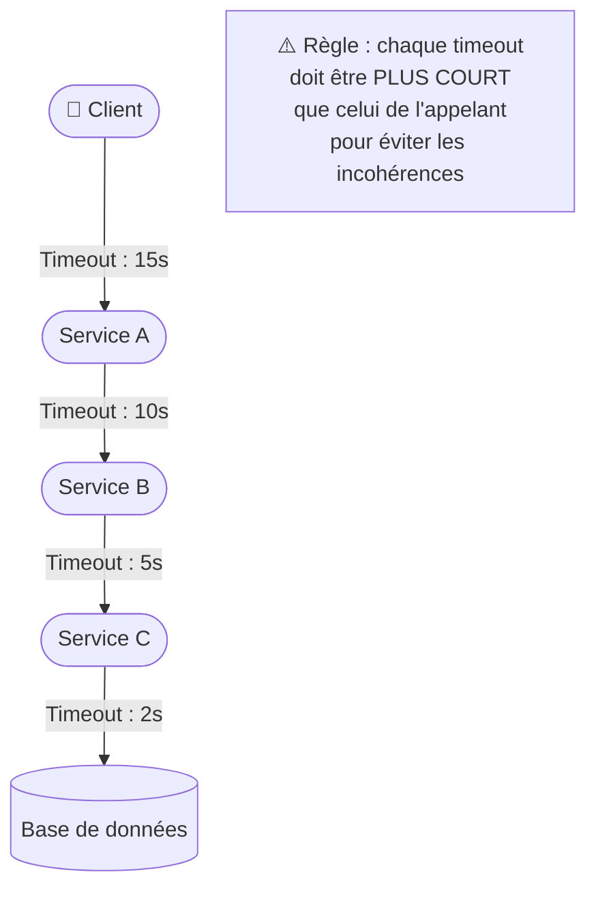
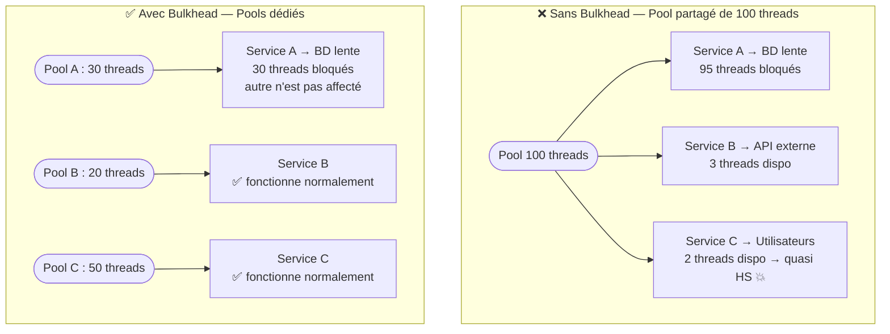
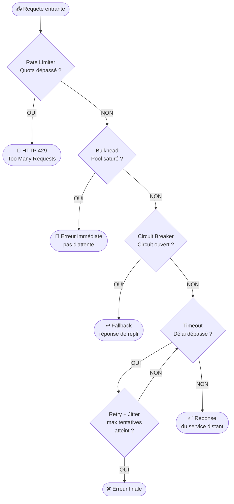
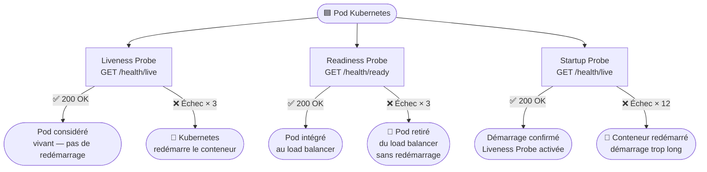

# Retry, Backoff Exponentiel, Timeout et Bulkhead

> **Objectif pédagogique**
> Comprendre comment réessayer intelligemment une opération échouée, comment éviter d'aggraver une surcharge avec un backoff exponentiel, comment définir des timeouts appropriés, et comment isoler les défaillances avec le pattern Bulkhead.

---

## 1. Le pattern Retry (Nouvelle tentative)

### 1.1 Pourquoi réessayer ?

Dans un réseau, certaines erreurs sont **transitoires** : elles durent quelques millisecondes et se résolvent d'elles-mêmes. Réessayer l'opération immédiatement après l'erreur peut suffire à réussir.

Types d'erreurs **réessayables** :
- Perte de paquet réseau temporaire
- Redémarrage d'un pod en cours (503 Service Unavailable temporaire)
- Délai d'attente dépassé (timeout) sur une requête lente
- Base de données temporairement surchargée (connection reset)

Types d'erreurs **NON réessayables** :
- Erreur de validation des données (HTTP 400 Bad Request)
- Ressource non trouvée (HTTP 404 Not Found)
- Erreur d'autorisation (HTTP 401, 403)
- Conflit de données (HTTP 409 Conflict)

> **Règle d'or** : ne réessayer que les erreurs **idempotentes** et **transitoires**.

### 1.2 Une opération idempotente

Une opération est **idempotente** si l'exécuter plusieurs fois produit le **même résultat** qu'une seule exécution.

```
Idempotente  :  GET /produits/42          → Lire un produit : OK à réessayer
               DELETE /commandes/99       → Supprimer (résultat identique si déjà supprimé)

Non idempotente : POST /commandes          → Créer : peut créer 2 fois si réessayé !
                  POST /paiements/101      → Payer : peut débiter 2 fois !
```

Pour les opérations non idempotentes, on utilise souvent un **token d'idempotence** (un identifiant unique envoyé avec la requête) pour que le serveur détecte les doublons.

### 1.3 Retry simple (problématique)



**Problème** : si 1000 clients font la même chose simultanément, ils bombardent le service défaillant de 3000 requêtes supplémentaires → le service ne peut jamais récupérer.

---

## 2. Le Backoff Exponentiel

### 2.1 Principe

Au lieu de réessayer immédiatement, on **attend de plus en plus longtemps** entre chaque tentative :



La formule générale : `délai = délaiBase × 2^(tentative-1)`

| Tentative | Délai (base 1s) | Délai (base 100ms) |
|-----------|----------------|-------------------|
| 1 | 1 s | 100 ms |
| 2 | 2 s | 200 ms |
| 3 | 4 s | 400 ms |
| 4 | 8 s | 800 ms |
| 5 | 16 s | 1.6 s |

On définit généralement un **délai maximum** (ex. : 60 secondes) pour éviter d'attendre indéfiniment.

### 2.2 Le problème du Thundering Herd (effet de troupeau)

Même avec un backoff exponentiel, si tous les clients ont le même délai de base et les mêmes paramètres, ils vont **tous réessayer au même moment** :



Le service est à nouveau submergé à chaque tentative !

### 2.3 Le Jitter — La solution

On ajoute une **valeur aléatoire** (jitter) au délai pour désynchroniser les clients :

```
Délai = délaiBase × 2^(tentative-1) + random(0, jitterMax)
```



**Exemple** (base 1s, jitter max 500ms) :

| Client | Tentative 2 (théorique 2s) | Avec jitter |
|--------|---------------------------|-------------|
| Client 1 | 2s | 2.34s |
| Client 2 | 2s | 1.87s |
| Client 3 | 2s | 2.51s |
| Client 4 | 2s | 1.62s |

Les clients réessaient maintenant à des moments **différents** → le service peut récupérer progressivement.

### 2.4 Paramètres d'un Retry avec Backoff

| Paramètre | Description | Valeur typique |
|-----------|-------------|----------------|
| `maxAttempts` | Nombre max de tentatives | 3 à 5 |
| `initialDelay` | Délai initial | 100ms à 1s |
| `multiplier` | Facteur de multiplication | 2 (exponentiel) |
| `maxDelay` | Délai maximum | 30s à 60s |
| `jitter` | Facteur de randomisation | 0.2 à 0.5 (20-50% du délai) |
| `retryOn` | Codes d'erreur réessayables | 429, 503, 504 |

---

## 3. Le Timeout

### 3.1 Pourquoi les timeouts sont critiques

Un service qui ne définit pas de timeout peut attendre indéfiniment. Dans un système distribué, une attente infinie est une **ressource consommée indéfiniment** (thread, mémoire, connexion).



### 3.2 Les types de timeout

| Type | Description | Exemple |
|------|-------------|---------|
| **Connection timeout** | Temps max pour établir la connexion | 5 secondes |
| **Read timeout** | Temps max pour recevoir la réponse | 30 secondes |
| **Write timeout** | Temps max pour envoyer la requête | 10 secondes |
| **Request timeout** | Temps total pour l'opération complète | 60 secondes |

### 3.3 Cascades de timeouts

Dans un système en couches, les timeouts doivent être **décroissants** :



### 3.4 Timeouts et déploiement Kubernetes

```yaml
# Timeout côté Ingress NGINX
metadata:
  annotations:
    nginx.ingress.kubernetes.io/proxy-connect-timeout: "5"
    nginx.ingress.kubernetes.io/proxy-read-timeout: "30"
    nginx.ingress.kubernetes.io/proxy-send-timeout: "30"
```

---

## 4. Le pattern Bulkhead (Cloison étanche)

### 4.1 L'analogie du navire

Un navire moderne est divisé en **compartiments étanches**. Si la coque est percée dans un compartiment, l'eau n'envahit pas tout le navire — les autres compartiments restent intacts et le navire flotte.

### 4.2 Application en informatique

Sans Bulkhead, toutes les requêtes partagent les mêmes ressources (pool de threads, pool de connexions) :



### 4.3 Types de Bulkhead

#### Isolation par pool de threads

Chaque service/dépendance dispose de son propre pool de threads. La surcharge d'une dépendance ne peut pas consommer les threads des autres.

#### Isolation par sémaphore

Limite le nombre de requêtes **simultanées** vers une ressource sans créer de threads supplémentaires. Plus léger en ressources.

#### Isolation par processus / conteneur

En Kubernetes, chaque service dans son propre conteneur avec ses propres **Resource Limits** est déjà une forme de Bulkhead au niveau infrastructure :

```yaml
resources:
  limits:
    cpu: "500m"       # Ce service ne peut pas consommer plus de 0.5 CPU
    memory: "256Mi"   # Même si une dépendance le sature, il ne déborde pas sur les autres
  requests:
    cpu: "100m"
    memory: "128Mi"
```

---

## 5. Combiner les patterns — La recette complète

Les patterns sont complémentaires et s'utilisent ensemble :



### 5.1 Ordre recommandé (de dehors en dedans)

1. **Rate Limiter** — en premier, au niveau de l'entrée
2. **Bulkhead** — avant d'utiliser une ressource partagée
3. **Circuit Breaker** — avant d'appeler une dépendance externe
4. **Timeout** — autour de l'appel réel
5. **Retry avec Backoff** — wrapping du timeout + circuit breaker

---

## 6. Résilience et health checks dans Kubernetes

Les health checks Kubernetes sont un **mécanisme de résilience au niveau infrastructure** :



### Liveness Probe
**Question posée** : "Ce conteneur est-il encore en vie ?"
- En cas d'échec → Kubernetes **redémarre** le conteneur automatiquement
- Utile pour détecter les deadlocks (processus bloqué mais encore "vivant")

### Readiness Probe
**Question posée** : "Ce conteneur est-il prêt à recevoir du trafic ?"
- En cas d'échec → Kubernetes **retire le pod du load balancer**
- Le pod n'est pas redémarré, juste isolé du trafic
- Utile pendant les démarrages, les mises à jour, ou les surcharges temporaires

### Startup Probe
**Question posée** : "Ce conteneur a-t-il fini de démarrer ?"
- Empêche la Liveness Probe de tuer un conteneur qui met du temps à démarrer
- Important pour les applications avec un long temps d'initialisation

```yaml
livenessProbe:
  httpGet:
    path: /health/live
    port: 8080
  initialDelaySeconds: 10
  periodSeconds: 30
  failureThreshold: 3

readinessProbe:
  httpGet:
    path: /health/ready
    port: 8080
  initialDelaySeconds: 5
  periodSeconds: 10
  failureThreshold: 3
```

---

## Résumé

| Pattern | Problème résolu | Mécanisme clé |
|---------|----------------|---------------|
| **Retry** | Erreurs transitoires | Réessaie l'opération N fois |
| **Backoff Exponentiel** | Retry qui aggrave la surcharge | Délai croissant entre tentatives |
| **Jitter** | Thundering Herd (synchronisation des clients) | Aléatoire dans les délais |
| **Timeout** | Ressources bloquées indéfiniment | Limite le temps d'attente max |
| **Bulkhead** | Propagation des défaillances par ressources partagées | Isolation par pools dédiés |
| **Health Check** | Détection et isolation des instances défaillantes | Liveness / Readiness Probes |

---

> **Pour aller plus loin** : Chapitre 04 – Quiz et exercices pratiques
