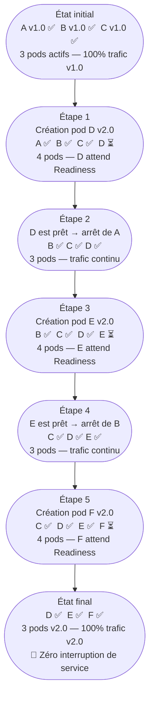
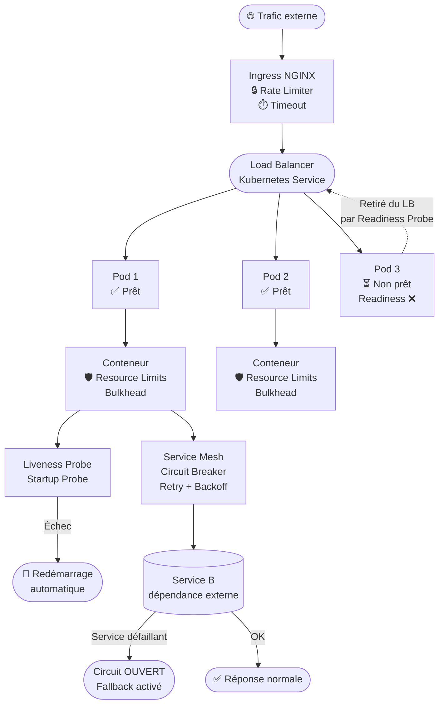

# TP – Configurer la Résilience dans un Déploiement Kubernetes

> **Objectif**
> Mettre en pratique les patterns de résilience étudiés dans les chapitres précédents en les configurant directement dans les manifestes Kubernetes. À la fin de ce TP, vous aurez un déploiement résilient avec des health checks, des resource limits (Bulkhead), et une stratégie de mise à jour sans interruption.

> **Prérequis**
> - Cluster Kubernetes fonctionnel (Minikube, Kind, ou autre)
> - `kubectl` configuré et fonctionnel
> - Notions de base Kubernetes (Deployment, Service, Ingress)

---

## Partie 1 — Analyser un déploiement NON résilient

Voici un déploiement minimal, sans aucun mécanisme de résilience. Lisez-le attentivement et identifiez les problèmes.

```yaml
# deploiement-fragile.yaml
apiVersion: apps/v1
kind: Deployment
metadata:
  name: api-service
spec:
  replicas: 1
  selector:
    matchLabels:
      app: api-service
  template:
    metadata:
      labels:
        app: api-service
    spec:
      containers:
      - name: api
        image: mon-registre/api-service:1.0
        ports:
        - containerPort: 8080
```

### Questions d'analyse (réfléchissez avant de passer à la partie 2) :

<details>
<summary>Q1 — Que se passe-t-il si le conteneur entre dans un état de deadlock (bloqué mais "vivant") ?</summary>

**Problème** : Kubernetes ne sait pas que le conteneur est défaillant. Aucune Liveness Probe n'est configurée → le conteneur reste en état "Running" indéfiniment, recevant du trafic mais ne pouvant pas le traiter.

**Solution** : Ajouter une `livenessProbe` pour détecter ce cas et redémarrer le conteneur.

</details>

<details>
<summary>Q2 — Que se passe-t-il pendant le démarrage de l'application si elle prend 15 secondes à s'initialiser ?</summary>

**Problème** : Kubernetes envoie du trafic dès que le Pod est en état "Running", même si l'application n'a pas encore fini de démarrer → erreurs 503 pendant les 15 premières secondes.

**Solution** : Ajouter une `readinessProbe` pour retenir le trafic jusqu'à ce que l'application soit prête.

</details>

<details>
<summary>Q3 — Que se passe-t-il si ce service consomme toute la mémoire du nœud à cause d'une fuite mémoire ?</summary>

**Problème** : Sans Resource Limits, un service peut consommer toute la RAM du nœud, causant l'expulsion (OOMKill) des autres pods.

**Solution** : Ajouter `resources.limits` et `resources.requests` pour borner la consommation.

</details>

<details>
<summary>Q4 — Que se passe-t-il lors d'une mise à jour (kubectl apply) de ce déploiement ?</summary>

**Problème** : Avec `replicas: 1` et sans stratégie de mise à jour définie, Kubernetes arrête l'ancien pod AVANT de démarrer le nouveau → interruption de service pendant quelques secondes.

**Solution** : Utiliser `strategy: RollingUpdate` et augmenter le nombre de replicas.

</details>

---

## Partie 2 — Ajouter les Liveness et Readiness Probes

Modifiez le déploiement pour ajouter des health checks. L'API expose deux endpoints :
- `GET /health/live` → retourne 200 si le processus est vivant
- `GET /health/ready` → retourne 200 si l'application est prête à traiter les requêtes

```yaml
# Ajoutez cette section dans le conteneur :
        livenessProbe:
          httpGet:
            path: /health/live
            port: 8080
          initialDelaySeconds: 10    # Attendre 10s après le démarrage avant de vérifier
          periodSeconds: 30          # Vérifier toutes les 30 secondes
          timeoutSeconds: 5          # Timeout de 5s pour la vérification
          failureThreshold: 3        # 3 échecs consécutifs → redémarrage

        readinessProbe:
          httpGet:
            path: /health/ready
            port: 8080
          initialDelaySeconds: 5     # Vérifier plus tôt que la liveness
          periodSeconds: 10          # Vérifier toutes les 10 secondes
          timeoutSeconds: 3
          failureThreshold: 3        # 3 échecs → retrait du load balancer
          successThreshold: 1        # 1 succès → réintégration dans le load balancer
```

### Exercice 2.1

Quelle probe faut-il configurer si votre application met **45 secondes** à démarrer (chargement de données en mémoire) et que vous craignez que la Liveness Probe la tue pendant cette phase ?

<details>
<summary>Voir la réponse</summary>

Il faut ajouter une **Startup Probe** :

```yaml
        startupProbe:
          httpGet:
            path: /health/live
            port: 8080
          initialDelaySeconds: 10
          periodSeconds: 5
          failureThreshold: 12    # 12 × 5s = 60s max pour démarrer
```

La Startup Probe désactive temporairement la Liveness Probe jusqu'à ce que le démarrage soit confirmé. Si le démarrage dépasse 60 secondes (12 × 5s), le conteneur est redémarré.

</details>

---

## Partie 3 — Ajouter les Resource Limits (Bulkhead Infrastructure)

```yaml
# Ajoutez cette section dans le conteneur :
        resources:
          requests:
            cpu: "100m"       # Ressources garanties au pod
            memory: "128Mi"
          limits:
            cpu: "500m"       # Maximum que le pod peut consommer
            memory: "256Mi"   # Au-delà → OOMKilled (redémarre)
```

### Exercice 3.1 — Calcul de capacité

Votre nœud Kubernetes dispose de **2 CPU** et **4 Gi de RAM**.

Combien de replicas de ce service pouvez-vous faire tourner sur ce nœud, en ne dépassant pas 80% des ressources du nœud ?

<details>
<summary>Voir la réponse</summary>

Ressources disponibles à 80% :
- CPU : 2 × 0.8 = 1.6 CPU = 1600m
- RAM : 4 × 0.8 = 3.2 Gi = 3276 Mi

Par replica (valeurs `requests` utilisées pour le scheduling) :
- CPU : 100m
- RAM : 128 Mi

Nombre maximum :
- CPU : 1600m / 100m = **16 replicas** (limité par CPU)
- RAM : 3276 Mi / 128 Mi = **25 replicas** (limité par RAM)

→ La contrainte CPU donne **16 replicas maximum** sur ce nœud.

Note : En pratique, on reserve aussi des ressources pour les composants système de Kubernetes lui-même.

</details>

### Exercice 3.2 — Impact des limits vs requests

Expliquez la différence entre `resources.requests` et `resources.limits`. Que se passe-t-il si un pod dépasse ses `limits.memory` ?

<details>
<summary>Voir la réponse</summary>

- **`requests`** : ressources **garanties** réservées pour le pod. Le scheduler utilise ces valeurs pour décider sur quel nœud placer le pod.
- **`limits`** : ressources **maximum** que le pod peut utiliser. Si le pod dépasse :
  - `limits.cpu` → le CPU est **throttlé** (ralenti, pas redémarré)
  - `limits.memory` → le pod est **OOMKilled** (tué et redémarré) car la mémoire ne peut pas être "throttlée"

</details>

---

## Partie 4 — Configurer la stratégie de mise à jour

Pour éviter toute interruption lors des mises à jour, configurez une stratégie Rolling Update :

```yaml
spec:
  replicas: 3                        # Toujours au moins 2 pods disponibles pendant la mise à jour
  strategy:
    type: RollingUpdate
    rollingUpdate:
      maxUnavailable: 1              # Au plus 1 pod peut être indisponible pendant la mise à jour
      maxSurge: 1                    # Au plus 1 pod supplémentaire peut être créé pendant la mise à jour
```

### Exercice 4.1 — Simulation d'une mise à jour

Avec `replicas: 3`, `maxUnavailable: 1`, `maxSurge: 1`, décrivez les étapes d'une mise à jour de la version 1.0 à la version 2.0 :

<details>
<summary>Voir la réponse</summary>



→ À aucun moment il n'y a moins de 2 pods actifs. Zéro interruption de service.

</details>

---

## Partie 5 — Déploiement final résilient complet

Voici le manifeste final intégrant tous les mécanismes de résilience infrastructure :

```yaml
# deploiement-resilient.yaml
apiVersion: apps/v1
kind: Deployment
metadata:
  name: api-service
  labels:
    app: api-service
spec:
  replicas: 3
  strategy:
    type: RollingUpdate
    rollingUpdate:
      maxUnavailable: 1
      maxSurge: 1
  selector:
    matchLabels:
      app: api-service
  template:
    metadata:
      labels:
        app: api-service
    spec:
      containers:
      - name: api
        image: mon-registre/api-service:2.0
        ports:
        - containerPort: 8080

        resources:
          requests:
            cpu: "100m"
            memory: "128Mi"
          limits:
            cpu: "500m"
            memory: "256Mi"

        startupProbe:
          httpGet:
            path: /health/live
            port: 8080
          initialDelaySeconds: 5
          periodSeconds: 5
          failureThreshold: 12      # 60s max pour démarrer

        livenessProbe:
          httpGet:
            path: /health/live
            port: 8080
          initialDelaySeconds: 10
          periodSeconds: 30
          timeoutSeconds: 5
          failureThreshold: 3

        readinessProbe:
          httpGet:
            path: /health/ready
            port: 8080
          initialDelaySeconds: 5
          periodSeconds: 10
          timeoutSeconds: 3
          failureThreshold: 3
          successThreshold: 1
```

---

## Partie 6 — Exercice d'intégration : Rate Limiter via Ingress

Ajoutez une ressource Ingress avec un Rate Limiter pour limiter à 100 requêtes/seconde par IP :

```yaml
# ingress-avec-rate-limit.yaml
apiVersion: networking.k8s.io/v1
kind: Ingress
metadata:
  name: api-ingress
  annotations:
    nginx.ingress.kubernetes.io/limit-rps: "100"
    nginx.ingress.kubernetes.io/limit-connections: "20"
    nginx.ingress.kubernetes.io/proxy-connect-timeout: "5"
    nginx.ingress.kubernetes.io/proxy-read-timeout: "30"
    nginx.ingress.kubernetes.io/proxy-send-timeout: "30"
spec:
  rules:
  - host: api.mondomaine.com
    http:
      paths:
      - path: /
        pathType: Prefix
        backend:
          service:
            name: api-service
            port:
              number: 80
```

### Questions de réflexion finale :

<details>
<summary>Q — Le Rate Limiter est configuré au niveau Ingress. Est-ce suffisant pour protéger le service contre une surcharge interne (ex. : un service interne qui fait trop d'appels) ?</summary>

**Non**. L'Ingress ne filtre que le trafic **entrant de l'extérieur**. Les appels entre services internes au cluster ne passent pas par l'Ingress.

Pour protéger contre les surcharges internes, il faut :
1. Un Rate Limiter au niveau applicatif (dans chaque service)
2. Un Service Mesh (comme Istio) qui applique des politiques de trafic entre tous les services du cluster

</details>

<details>
<summary>Q — Vous avez configuré une Readiness Probe qui vérifie /health/ready. Que doit retourner cet endpoint si la base de données est temporairement inaccessible ?</summary>

**Réponse attendue** : L'endpoint `/health/ready` doit retourner **HTTP 503** (ou tout code non-200) si la base de données est inaccessible. Cela signale à Kubernetes que le pod n'est pas prêt → il est retiré du load balancer.

Cela permet à l'équipe de régler le problème de base de données sans que les utilisateurs reçoivent des erreurs — les requêtes sont redirigées vers les autres pods qui ont accès à la base.

</details>

---

## Récapitulatif — Tableau des patterns implémentés

| Pattern | Mécanisme Kubernetes utilisé | Niveau |
|---------|------------------------------|--------|
| **Bulkhead** | `resources.limits` (CPU/Mémoire) | Conteneur |
| **Health Check** | `livenessProbe` + `readinessProbe` | Pod |
| **Démarrage sécurisé** | `startupProbe` | Pod |
| **Zero Downtime Deployment** | `RollingUpdate` + `maxUnavailable` | Deployment |
| **Rate Limiter** | Annotations NGINX Ingress | Réseau entrant |
| **Timeout** | Annotations Ingress (`proxy-read-timeout`) | Réseau entrant |
| **Circuit Breaker** | Service Mesh (Istio `OutlierDetection`) | Service Mesh |



> **Note** : Le Circuit Breaker et le Retry avec Backoff exponentiel peuvent être implémentés soit dans le code applicatif, soit via un Service Mesh comme Istio ou Linkerd, qui les gère au niveau infrastructure de manière transparente pour les services.
